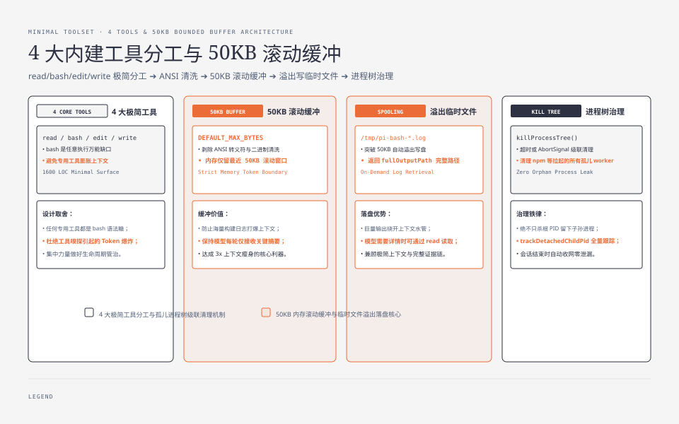
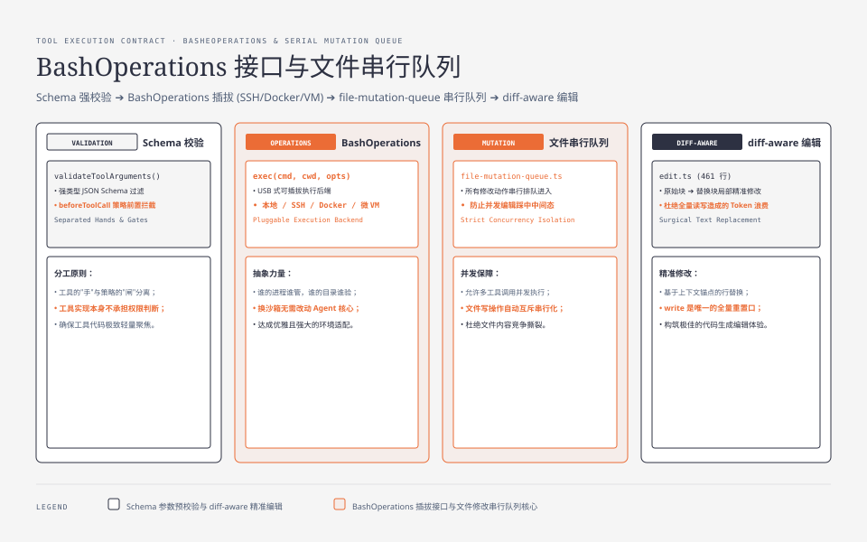
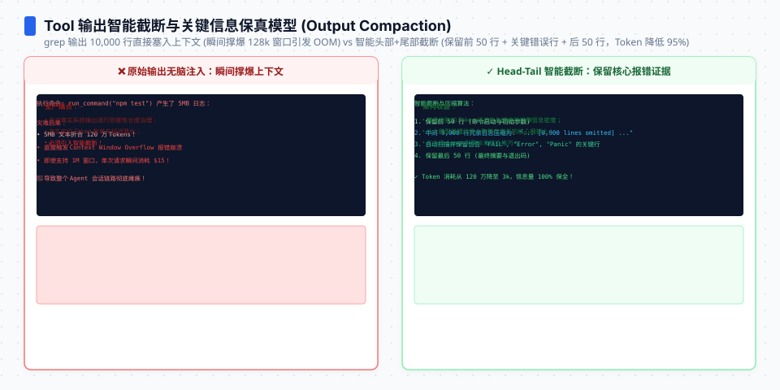

**TL;DR：** 工具的取舍是 Agent 架构里最容易被"功能竞赛"带偏的一环。Pi 只有 4 个内建工具——`read`、`bash`、`edit`、`write`——但足够完成整个编码工作流，因为 `bash` 是万能的、其他三个是低风险的。四个工具实现加起来约 1600 行，其中 bash 就占 510 行，藏着全部工程含量：50KB 输出进入滚动丢弃 + 溢出写临时文件、超时和 AbortSignal 走杀进程树、输出清理（去 ANSI、二进制检测）、以及一个可插拔的 `BashOperations` 接口——**沙箱不是内置的锁，是一个可以把 bash 换成远程/容器执行的后门**。本文逐行拆这个"手"。


---



## 一、工具多不等于 Agent 强

01 篇引用的 Databricks 基准有一句关键结论被多数转述略过："token 单价不是任务成本的好预测因子"。理由之一就是参考实现靠工具嗅探目录——工具漫天飞，上下文就膨胀。Pi 的选择是反着来：**能由 bash 表达的，不建专用工具。**

四个内建工具的分工：

| 工具 | 职责 | 为什么必须内建 |
| --- | --- | --- |
| `read` | 读文件/目录（轻量） | 高频、低风险，值得专用路径 |
| `bash` | 执行任意命令 | 万能缺口，覆盖一切专用工具能做的事 |
| `edit` | 结构化行替换（diff-aware） | 精确修改，避免"read 全文→write 覆盖"的冗余 |
| `write` | 写/覆盖文件 | 文件落盘，唯一的重置口 |

官方文档的说法是"~4 tools"——README 甚至写死了 `selectedTools` 默认就是这组。这套取舍的逻辑是：**其余所有工具都可以是 `bash` 的语法糖**。`ls`、`grep`、`find`、MCP 里的各种能力，没有一个是 bash 做不了的。多一个专用工具，多的不是能力，是"模型要学会调用它 + 工具定义占上下文"两份成本。




## 二、bash 是万能工具，代价是它必须被管住

`packages/coding-agent/src/core/tools/bash.ts`（510 行）是四个工具里唯一的"任意代码执行"，因此全部工程含量都在"输出与生命周期"上。三个关键机制：

**输出：50KB 滚动窗口 + 超出落临时文件。** 常量 `DEFAULT_MAX_BYTES = 50 * 1024`（`tools/truncate.ts:12`）。执行中（`bash-executor.ts` 的 `executeBashWithOperations`）：

```ts
// bash-executor.ts（骨架）
const sanitized = sanitizeBinaryOutput(stripAnsi(decoder.decode(data, { stream: true }))).replace(/\r/g, "");
if (totalBytes > DEFAULT_MAX_BYTES) ensureTempFile();      // 溢出后开始写临时文件
while (outputBytes > maxOutputBytes && outputChunks.length > 1) {
  outputChunks.shift();                                     // 内存只保留最近 2×50KB 的滚动窗口
}
```

输出先被清理（剥 ANSI、二进制垃圾清洗、换行归一），再进滚动窗口；一旦越过 50KB，后续全部落盘到 `tmpdir()/pi-bash-<id>.log`，最终只把滚动窗口和截断标记交给模型，完整输出路径作为 `fullOutputPath` 留着（模型想看可以再读它）。**模型只看到有界摘要，巨量输出绕开水管进入磁盘**——这直接服务于 03 篇的"少喂上下文"。

**生命周期：超时 + AbortSignal 都杀进程树。** 看 spawn 出来的子进程在 `bash.ts` 里的治理（行 90-135）：

```ts
const child = spawn(shell, [...args, command], { cwd, detached: process.platform !== "win32", ... });
// 超时 → killProcessTree(child.pid)
if (timeoutMs !== undefined) {
  timeoutHandle = setTimeout(() => { timedOut = true; killProcessTree(child.pid); }, timeoutMs);
}
// AbortSignal → 同样 killProcessTree
if (signal) {
  if (signal.aborted) onAbort();
  else signal.addEventListener("abort", onAbort, { once: true });
}
```

注意 `detached` 和 `killProcessTree`：Agent 执行的命令可能自己 fork 子孙进程（`npm run build` 会拉起一堆 worker），只杀 PID 会留下孤儿进程继续跑。杀整棵进程树 + `trackDetachedChildPid` 把会话结束时的残留进程也纳入清理，是"任意代码执行"的自动收尾规矩。

**命令严格参数化，不拼字符串。** bash 工具还有一个隐蔽细节：命令通过 stdin 或参数数组传给 shell，`stdio` 明确区分（`commandFromStdin ? "pipe" : "ignore"`）——不是用模板字符串拼进 shell，避免经典的注入级错误。

## 三、沙箱的真相：不是内置锁，是一个可插拔的后门

如果你带着"沙箱在哪"来找 Pi，会扑空——安全边界不在内核，而在 `BashOperations` 接口（`bash.ts` 里，接口注释写得很直白："Override these to delegate command execution to remote systems (for example SSH)"）：

```ts
export interface BashOperations {
  exec: (command, cwd, options: { onData; signal?; timeout?; env? }) =>
    Promise<{ exitCode: number | null }>;
}
```

本地默认实现是 `createLocalBashOperations` 的 spawn 后端；而下载 SSH、容器、（08 篇要讲的）Gondolin 微 VM 沙箱，全部是**换一个 `exec` 实现**：接口像 USB，谁的进程树归谁管、谁的工作目录谁校验（`fsAccess(cwd, F_OK)` 查 cwd 存在——模型指挥的路径可能压根不在磁盘上），都在这一个点上做替换。这解释了 pi.dev 官网"权限用什么做都可以"的底气：它不是没有权限系统，而是把权限边界设计成了**执行后端的可替换性**。




## 四、edit/write：低风险部分反而讲究

`bash` 管"任意"，`read`/`edit`/`write` 管"文件"。编辑侧（`edit.ts` 461 行 + `edit-diff.ts`）有两个值得抄的设计：

1. **diff-aware 行替换**：edit 按"原始文本块 → 替换文本块"操作，支持位置上下文匹配；文件进出一个 `file-mutation-queue.ts` 串行队列——并发工具调用（02 篇的并行批处理）不会互相踩同一个文件的中间态；
2. **write 是唯一重置口**：read 读、edit 改、write 覆盖，三者构成为"先看再改"的默认纪律，模型想盲改只能走 write——而这个口子永远串行。

另一层纪律在 `02` 篇已经埋伏好：所有工具在 `agent-loop.ts` 都过 `validateToolArguments`（schema 校验）+ `beforeToolCall`（可 block）——也就是说，**工具的参数在进入 execute 之前已经被 schema 和策略层过滤过**，工具实现本身不需要信任输入。工具的"手"和策略的"闸"是分离的。

## 五、结论：工具是手，策略是脊梁，日志是眼睛

Pi 的 4 个工具回答了一个体系问题：一个 Agent 有多少"手"才算够？答案是**一只手（bash）加三个精准的（read/edit/write）**，其余能力全部是 bash 的派生；工程含量不在工具数量，而在输出裁剪、进程树治理、参数校验和接口可插拔。Databricks 每轮 3 倍上下文优势的又一块拼图就在 50KB 滚动窗口与"临时文件溢出"里。

验证三步：在 clone 里把 `DEFAULT_MAX_BYTES` 改成 1KB，对一个 `seq 1 100000` 的命令跑 `pi -p`，看 `fullOutputPath` 如何接管；给 `createLocalBashOperations` 换一个把命令写进 `echo` 的假 exec，体会"接口换后端"的力度；读 `file-mutation-queue.ts` 的串行化实现，确认并发 edit 不打架。

## 参考资料

- `packages/coding-agent/src/core/tools/`：bash.ts（510）/ read.ts（358）/ edit.ts（461）/ write.ts（274）/ truncate.ts（`DEFAULT_MAX_BYTES = 50KB`）/ file-mutation-queue.ts
- `packages/coding-agent/src/core/bash-executor.ts`（156 行）：`executeBashWithOperations` — 清理、滚动窗口、临时文件溢出
- `packages/coding-agent/src/core/exec.ts`（107 行）：spawn 与环境治理
- earendil-works/pi @ commit 5cd93f6（2026-08-20 浅克隆实测）