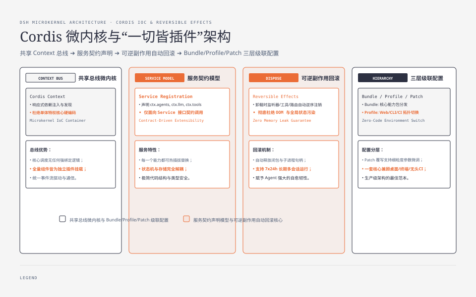
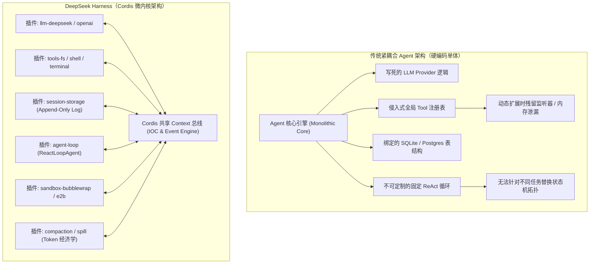
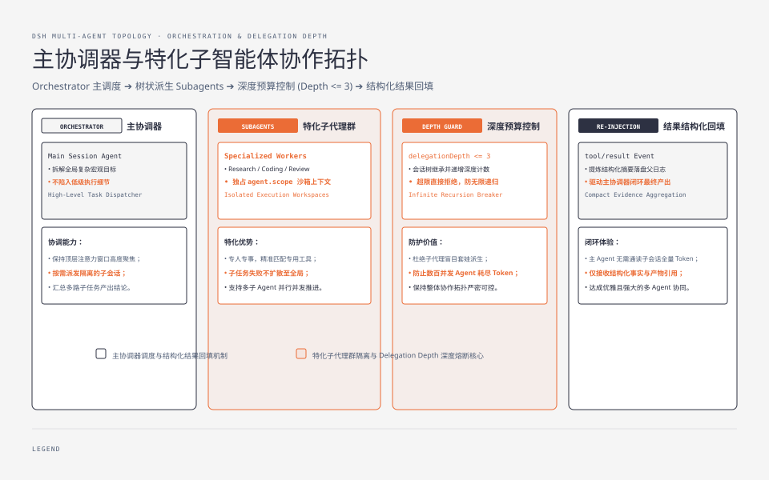
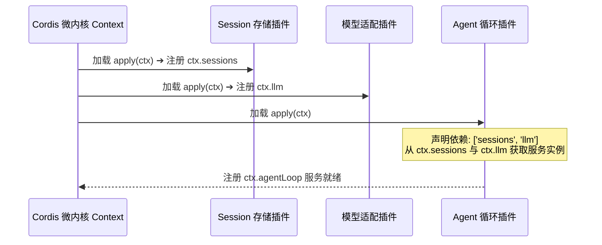

**TL;DR：** DeepSeek Harness（简称 `dsh`）是由 DeepSeek AI 团队开源的工业级 Agent Harness（智能体宿主运行时）。与市面上绝大多数将模型调用、工具执行、会话持久化与状态机强行打包进单一单体进程的传统 Agent 框架不同，`dsh` 确立了**“一切皆插件（Everything is a Plugin）”**的核心架构哲学，底层完全构建在 [Cordis](https://github.com/cordiverse/cordis) 微内核之上。在 `dsh` 中，不存在任何不可替换的特权核心层：从 LLM 模型适配器、工具注册表、Session 日志流、沙箱安全策略，到 Agent 核心调度循环本身，全部作为解耦插件挂载在 Cordis 共享 Context 总线上。这种架构通过“时空可组合性（Spatiotemporal Composability）”实现了副作用的原生可逆回滚（插件卸载时所有工具、路由与监听器自动注销），并通过 Profile、Bundle 与 Patch 的三层级联配置，让开发者在零侵入源码的前提下即可热插拔整个运行时环境。

---


---



## 一、传统 Agent 框架的架构绝境：单体硬编码的致命缺陷

在开发复杂的生产级自主 Agent（如代码重构助理、全自动 DevOps 机器人、长程数据分析系统）时，绝大部分团队初期采用的单体框架都会迅速撞上架构天花板：



### 1.1 传统单体设计的四大顽疾

1. **特权核心导致代码僵化**：在传统框架中，`Agent` 基础类通常封装了调用模型、解析 JSON、执行工具和保存数据库的全量逻辑。一旦业务需要增加“二次确认审批流”、“动态 Token 降级”或“跨集群执行”，开发者不得不去 Hack 核心类代码，造成分支分叉（Fork）与维护灾难；
2. **生命周期污染与资源泄漏**：当用户在运行过程中动态挂载一个临时调试工具或临时拦截插件时，传统框架往往无法干净地反注册全局事件监听器、定时器或子进程句柄。在多会话长期运行（7x24h）下，这种隐式残留必然导致 V8 堆内存暴涨最终触发 OOM；
3. **环境迁移极其痛苦**：当 Agent 需要从本地开发者终端（CLI）搬迁到多租户 Web 平台，或者搬迁到无头评测集群（Headless CI）时，由于文件系统、终端和网络被硬编码在工具内部，不得不编写海量的适配胶水代码；
4. **状态与副作用混杂**：在同一个函数内既发起大模型推理，又直接原地读写数据库快照，导致在发生网络抖动或崩溃时，系统无法确定任务执行到了哪一个确定性状态。

DeepSeek Harness 给出的破局之道，是将操作系统微内核与函数式响应式设计引入 Agent 领域，依托 **Cordis 微内核** 彻底重塑宿主环境。

---




## 二、Cordis 微内核机制：时空可组合性与可逆副作用

Cordis 提出了一种全新的面向插件的编程范式（参见设计论文 *A Programming Paradigm for Spatiotemporal Composability*）。在 `dsh` 中，Cordis 不仅仅是一个依赖注入（DI）容器，更是一套具备**时空可组合性与生命周期管理**的运行时引擎。

### 2.1 共享 Context 与服务契约模型

在 `dsh` 中，每一个插件都是一个标准的导出函数 `apply(ctx: Context, config: Config)`。插件通过上下文 `ctx` 实现服务的声明、发现与消费：

```ts
// packages/core/agent/src/index.ts
import { Context, Service } from 'cordis';
import type { Agent, AgentOptions } from './types.ts';

// 1. 继承 Cordis Service 基类，声明向外暴露的服务名称
export class AgentService extends Service {
  // 构造函数传入 ctx 并指定服务标识 'agents'，第三个参数 true 表示该服务为单例
  constructor(ctx: Context) {
    super(ctx, 'agents', true);
  }

  // 暴露给其他插件调用的公开方法
  createAgent(sessionId: string, options: AgentOptions): Agent {
    this.ctx.emit('agent/before-create', sessionId, options);
    const instance = new ReactLoopAgent(this.ctx, sessionId, options);
    this.ctx.emit('agent/created', instance);
    return instance;
  }
}

// 2. 插件入口：向当前上下文注册服务
export function apply(ctx: Context) {
  ctx.plugin(AgentService);
}
```



### 2.2 可逆副作用（Reversible Effects）底层机制

Cordis 最具革命性的特性在于**副作用的可逆性**。在 Cordis 的世界观中，插件在 `ctx` 上做出的任何操作（调用 API、挂载路由、添加监听器、启动子进程）都会被封装为一个 **Effect（副作用追踪节点）**。

当插件被停用、升级或卸载时，Cordis 会自底向上沿作用域树逆序执行清理（Dispose）：

| 注册操作类型 | 插件执行的代码范式 | 卸载时 Cordis 自动执行的回滚动作 |
|---|---|---|
| **事件监听** | `ctx.on('agent/turn-start', fn)` | 自动执行 `removeListener`，彻底释放闭包引用 |
| **工具注册** | `ctx.tools.registerTool(gitTool)` | 自动从全局及局部工具表中注销该工具及其 JSON Schema |
| **Web 路由** | `ctx.web.get('/api/status', handler)` | 自动从 Fastify / HTTP 路由表中移除该端点 |
| **定时任务** | `ctx.setInterval(heartbeat, 1000)` | 自动调用 `clearInterval`，防止后台幽灵携程/定时器 |
| **子进程与资源** | `ctx.effect(() => () => subproc.kill())` | 自动调用返回的清理函数杀死衍生子进程 |

这种机制从底层彻底杜绝了动态热加载（HMR）与多租户隔离时的状态污染问题。

---

## 三、三层级联配置：Profile、Bundle 与 Patch 的拓扑组合

`dsh` 是如何做到一套核心代码库，无缝兼顾 **桌面 Web 应用**、**终端 CLI 模式** 与 **无头自动化评测（Headless CI）** 的？核心就在于其极其严密的分层配置架构：

```text
 ┏━━━━━━━━━━━━━━━━━━━━━━━━━━━━━━━━━━━━━━━━━━━━━━━━━━━━━━━━━━━━━━━━━━━━━━━━━━━━━┓
 │ 1. Bundle 基础层 (Distribution Bundles)                                     │
 │    - dsh-base: 模型适配器、核心工具、文件存储、沙箱审批策略、遥测计量器        │
 │    - dsh-web-app: 注入 Fastify Web Server、WebSocket/SSE 推流、Web UI 前端    │
 │    - dsh-headless: 注入零交互执行器，专为批处理脚本与评测流水线设计          │
 ┣━━━━━━━━━━━━━━━━━━━━━━━━━━━━━━━━━━━━━━━━━━━━━━━━━━━━━━━━━━━━━━━━━━━━━━━━━━━━━┫
 │ 2. Profile 拓扑层 (User / Environment Profiles)                             │
 │    - ~/.dsh/profiles/web.yml: 声明包含的 Bundles 列表与第三方社区插件        │
 │    - ~/.dsh/profiles/ci.yml: 切换为 Headless 模式并挂载 Mock LLM Provider    │
 ┣━━━━━━━━━━━━━━━━━━━━━━━━━━━━━━━━━━━━━━━━━━━━━━━━━━━━━━━━━━━━━━━━━━━━━━━━━━━━━┫
 │ 3. Patch 覆写层 (Fine-grained Overlays)                                     │
 │    - cordis.patch.yml & CLI 参数 `--patch`: 按组件 ID 精确重写参数或拦截属性 │
 ┗━━━━━━━━━━━━━━━━━━━━━━━━━━━━━━━━━━━━━━━━━━━━━━━━━━━━━━━━━━━━━━━━━━━━━━━━━━━━━┛
```

### 3.1 声明式 Bundle 规范

每个 Bundle 都是一个独立的 npm 包，在其 `package.json` 的 `dsh` 命名空间中明确声明入口：

```json
{
  "name": "@deepseek-ai/dsh-base",
  "version": "0.1.0",
  "dsh": {
    "bundle": "./cordis.yml"
  },
  "dependencies": {
    "@deepseek-ai/dsh-session": "workspace:*",
    "@deepseek-ai/dsh-tools": "workspace:*",
    "@deepseek-ai/dsh-llm": "workspace:*"
  }
}
```

而在 `cordis.yml` 中，清晰列举了当前 Bundle 所装载的插件列表及其默认参数：

```yaml
# packages/bundle/base/cordis.yml
- id: storage-fs
  package: "@deepseek-ai/dsh-session-fs"
  config:
    dataDir: "~/.dsh/sessions"

- id: model-deepseek
  package: "@deepseek-ai/dsh-llm-deepseek"
  config:
    baseUrl: "https://api.deepseek.com/v1"
    defaultModel: "deepseek-chat"

- id: loop-default
  package: "@deepseek-ai/dsh-agent-loop"
  config:
    maxStepsPerTurn: 50
```

### 3.2 毫厘必究的 Patch 机制

如果企业内网环境需要将 `model-deepseek` 的 `baseUrl` 指向私有网关，或者需要把 `maxStepsPerTurn` 调大到 100，完全无需修改源码，只需在 `cordis.patch.yml` 中追加一条针对 `id` 的补丁：

```yaml
# 用户本地配置 ~/.dsh/cordis.patch.yml
- target: model-deepseek
  patch:
    baseUrl: "https://llm-gateway.internal.corp/v1"
    apiKey: "env:CORP_DEEPSEEK_KEY"

- target: loop-default
  patch:
    maxStepsPerTurn: 100
```

通过内置命令可以直接审查最终合并生成的完整运行时拓扑：

```sh
dsh --profile web --dump-config
```

---

## 四、核心模块全景：Context 挂载关键服务一览

在 `dsh` 启动完成后，挂载在根 `Context` 上的核心服务全景如下表所示：

| 服务 Key (`ctx.*`) | 归属核心包 | 核心职责与设计要点 |
|---|---|---|
| `ctx.sessions` | `packages/core/session` | 管理持久化会话流，维护 Append-only 的 `SessionEvent` 日志与索引 |
| `ctx.systemPrompt` | `packages/core/system-prompt` | 负责多层级 Prompt Sections（核心指令、动态工作区、工具声明）的组装 |
| `ctx.tools` | `packages/core/tools` | 工具注册中心，提供带有作用域（Scope）隔离与权限拦截的执行管道 |
| `ctx.agents` | `packages/core/agent` | Agent 生命周期管理器，负责派发、监控与广播 `agent/*` 系列状态事件 |
| `ctx.agentLoop` | `packages/core/agent-loop` | 默认状态机调度驱动器（实现 Turn / Step 循环调度与异常恢复） |
| `ctx.llm` | `packages/llm/llm` | 统一的大模型流式传输抽象 Seam，抹平 OpenAI / DeepSeek / Claude 协议差异 |
| `ctx.fs` | `packages/fs/*` | 文件系统操作 Seam，可无缝在本地磁盘、内存虚拟盘与远程沙箱间切换 |
| `ctx.shell` / `ctx.terminals` | `packages/shell/*` / `terminal` | 单次命令执行与常驻 PTY 终端会话管理 Seam |
| `ctx.sandbox` | `packages/sandbox/*` | 进程级安全防护（Bubblewrap / Docker / E2B 沙箱隔离） |
| `ctx.compaction` | `packages/compaction` | 当上下文接近窗口上限时自动触发语义压缩与关键事实提炼 |
| `ctx.spill` | `packages/spill` | 超大工具输出（如 5MB 日志）自动落盘并以 URI 形式引用的外置存储引擎 |

---

## 五、架构启示与工程收获

1. **不要发明特权核心，把一切降解为插件**：真正的架构弹性不是写更多的抽象基类，而是建立统一的总线契约。当 Agent 调度循环本身也是一个普通插件时，系统的演进空间便不受任何限制；
2. **副作用可逆是动态系统高可用的基石**：在长生命周期的复杂应用中，任何能力的注入必须伴随确定的清理通道。Cordis 提供的自动回滚机制彻底解决了插件热插拔时的悬挂泄露；
3. **配置分层是多环境交付的终极方案**：通过 Bundle（功能基线）+ Profile（应用形态）+ Patch（环境差异）的三层解耦，同一套核心资产可以零成本适配 CLI、Web、桌面端与云端集群。

---

## 六、参考资料与延伸阅读

1. [DeepSeek Harness 开源项目仓库 (GitHub)](https://github.com/deepseek-ai/deepseek-harness)
2. [Cordis 框架官方文档与时空可组合性论文](https://github.com/cordiverse/cordis)
3. [Martin Fowler: Microkernel Architecture Pattern](https://martinfowler.com/articles/patterns-of-distributed-systems/)
