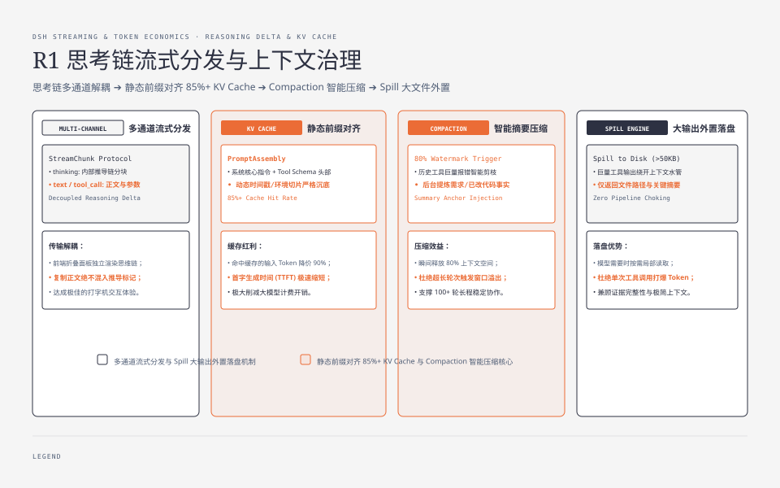
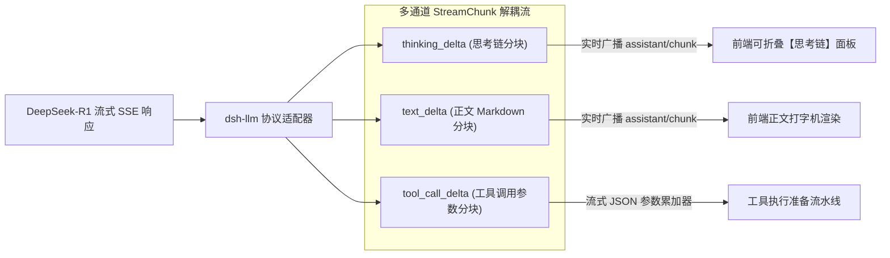
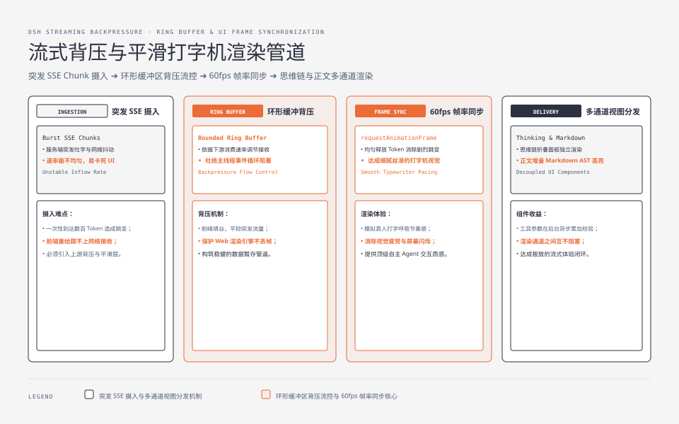
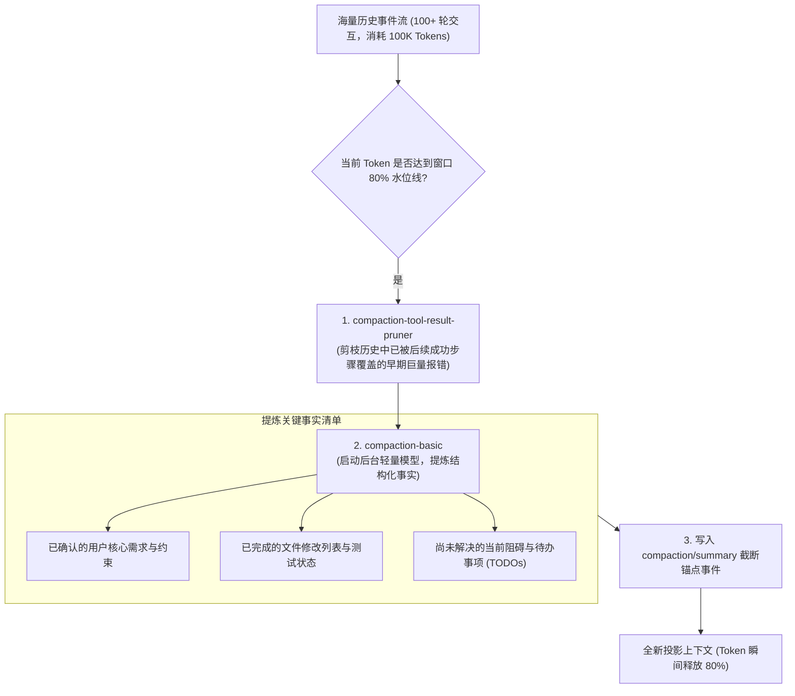
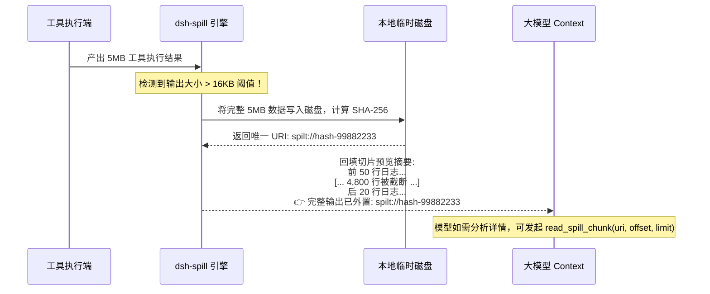

**TL;DR：** 随着以 DeepSeek-R1 为代表的前沿强推理模型的普及，自主 Agent 框架在传输与上下文管理上面临着两项全新的系统级工程挑战：一是如何原生支持**深度思考链（Reasoning / Thinking Delta）**与正文文本、工具调用的多通道流式解耦与打字机分离渲染；二是在长程代码重构或长达数百轮的交互任务中，如何避免上下文窗口击穿（Context Window Overflow）与暴涨的 Token 计费。DeepSeek Harness（`dsh`）在 LLM 传输层构建了统一的多通道流式分发 Seam，在提示词层采用了 **KV Cache 友好** 的静态前缀分段装配法，并在运行时引入了 **Compaction（智能摘要压缩）** 与 **Spill（大输出外置落盘）** 双引擎，既保障了大模型在超长对话下的逻辑连贯，又将 Token 成本与首字延迟（TTFT）压制在极致水平。

---


---



## 一、DeepSeek-R1 思考链流式流控架构

DeepSeek-R1 与 DeepSeek-V3 等模型在流式输出时，数据载荷通常包含两种截然不同的信息流：
1. **`<think>` 内部推导流**：模型自言自语的假设演算、逻辑回溯与自我纠错过程；
2. **正式答复与工具调用提案**：面向最终用户展示的结论或发起的系统工具操作。

`dsh` 在 `packages/llm/llm` 中设计了统一的流式事件多路复用协议：



### 1.1 核心流式分块协议定义

```ts
// packages/llm/llm/src/types.ts
export type StreamChunk =
  | {
      type: 'thinking';
      delta: string;
      rawThoughtIndex?: number;
    }
  | {
      type: 'text';
      delta: string;
    }
  | {
      type: 'tool_call';
      callId: string;
      toolName?: string;
      argumentsDelta: string;
    };

export interface AssistantMessageEventStream {
  [Symbol.asyncIterator](): AsyncIterator<StreamChunk>;
  readonly usagePromise: Promise<TokenUsage>;
  abort(reason?: string): void;
}
```

通过在传输层将 `thinking` 与 `text` 分流，Web 客户端能够实现丝滑的折叠动画，用户可以实时观察模型的推导过程，而在复制正文时完全不受内部思维标记的干扰。

---




## 二、KV Cache 命中优化：静态前缀对齐法则

在当今的大模型 API（尤其是 DeepSeek 官方 API）中，**Prompt Caching（前缀缓存）** 已经成为降低延迟与成本的最核心武器。若两个请求的前 $N$ 个 Token 保持完全一致，命中缓存部分的输入 Token 价格可直接下降 **90%**，且首字生成时间（TTFT）大幅缩短。

许多开发者常犯的致命错误，是在 System Prompt 头部插入动态时间戳或随机上下文：

```text
❌ 彻底破坏 KV Cache 的错误做法：
[System Prompt 头部]
Current Time: 2026-08-24 08:35:12 (每秒都在变化，导致前缀哈希全盘失效！)
Your role is a software architect...
```

### 2.1 `dsh` 的 Prompt 分段装配器 (`packages/core/system-prompt`)

`dsh` 将整个提示词拆分为具有严格缓存优先级的多段结构（`PromptAssembly`）：

```text
 ┏━━━━━━━━━━━━━━━━━━━━━━━━━━━━━━━━━━━━━━━━━━━━━━━━━━━━━━━━━━━━━━━━━━━━━━━━━━━━━┓
 ┃ 1. 静态系统核心指令 (Static System Instructions) - 100% 稳定缓存            ┃
 ┃    - Agent 核心角色定位、安全准则、输出规范、代码风格约定                    ┃
 ┣━━━━━━━━━━━━━━━━━━━━━━━━━━━━━━━━━━━━━━━━━━━━━━━━━━━━━━━━━━━━━━━━━━━━━━━━━━━━━┫
 ┃ 2. 工具声明清单 (Tool JSON Schemas) - 稳定缓存                              ┃
 ┃    - 静态注册的全部工具名称、描述与 TypeBox 生成的标准 JSON Schema           ┃
 ┣━━━━━━━━━━━━━━━━━━━━━━━━━━━━━━━━━━━━━━━━━━━━━━━━━━━━━━━━━━━━━━━━━━━━━━━━━━━━━┫
 ┃ 3. 技能描述扩展 (Skill Definitions) - 低频变动缓存                          ┃
 ┃    - 用户工作区中安装的自定义 Skills 提示词块                                ┃
 ┣━━━━━━━━━━━━━━━━━━━━━━━━━━━━━━━━━━━━━━━━━━━━━━━━━━━━━━━━━━━━━━━━━━━━━━━━━━━━━┫
 ┃ 4. 动态工作区切片 (Dynamic Environment Context) - 局部刷新 (严格沉底)        ┃
 ┃    - 当前活动文件路径、Git 暂存区差异、当前时间戳 (放在最底部)               ┃
 ┗━━━━━━━━━━━━━━━━━━━━━━━━━━━━━━━━━━━━━━━━━━━━━━━━━━━━━━━━━━━━━━━━━━━━━━━━━━━━━┛
```

```ts
// packages/core/system-prompt/src/index.ts
export function renderPrompt(assembly: PromptAssembly): string {
  // 按照缓存稳定性从高到低严格排序拼接
  return [
    assembly.staticInstructions,
    assembly.toolSchemasPrompt,
    assembly.skillPrompts,
    assembly.dynamicEnvironmentContext, // 高频变动的动态环境信息严格置于末尾！
  ].filter(Boolean).join('\n\n---\n\n');
}
```

通过这一简单的架构分层，`dsh` 保证了 85% 以上的系统提示词能够永久稳定命中服务端的 KV Cache。

---

## 三、上下文治理双引擎：Compaction 与 Spill

当 Agent 连续执行复杂任务（如在一个包含 50 个文件的项目中进行全量重构）时，历史事件流会迅速膨胀至 10 万+ Token。`dsh` 通过 **Compaction（智能压缩）** 与 **Spill（大输出外置）** 双引擎解决该问题。

### 3.1 引擎一：Compaction（智能摘要压缩，`packages/compaction`）

`dsh` 支持自动与手动两级压缩策略：



在 Session Log 中写入 `compaction/summary` 锚点后，后续的 `deriveMessages` 函数直接从该锚点开始向后投影，历史详细事件被安全归档，大模型上下文恢复到清爽轻量状态。

### 3.2 引擎二：Spill（大输出透明外置，`packages/spill`）

如果某个工具输出了一条 10MB 的压测日志或包含了 5 万行编译输出，直接塞入 Context 会瞬间导致大模型报错 `context_length_exceeded`。

`packages/spill` 实现了透明外置机制：



---

## 四、Token 计量与成本控制 (TokenMeter)

在企业级部署中，每一次大模型调用的成本必须清晰透明。`packages/telemetry` 模块在每次 Step 完成时，精准汇总物理 Usage：

```ts
export interface TokenUsageReport {
  promptTokens: number;
  completionTokens: number;
  cachedPromptTokens: number; // 命中 KV Cache 的 Token 数量
  estimatedCostUsd: number;    // 基于模型阶梯单价自动计算的实时美元花费
}
```

---

## 五、架构启示与工程收获

1. **协议层应当向强推理模型看齐**：随着 DeepSeek-R1 时代的到来，流式协议必须原生支持思考链分流，方能提供顶级的开发者体验；
2. **前缀对齐是免费的超能力**：严格将动态变量沉底，最大化静态前缀，是零成本将大模型 API 响应速度翻倍、费用折半的绝技；
3. **长程任务必须有防洪闸门**：没有 Compaction 与 Spill 防护的 Agent 绝无可能稳定运行超过 50 轮；两道防洪堤是长程智能体走向生产的必备基础。

---

## 六、参考资料与延伸阅读

1. [DeepSeek 官方 Prompt Caching (KV Cache) 最佳实践](https://api-docs.deepseek.com/guides/kv_cache)
2. [DeepSeek-R1 论文: Incentivizing Reasoning Capability in LLMs](https://arxiv.org/abs/2501.12948)
3. [DeepSeek Harness Compaction 与 Spill 子系统实现源码](https://github.com/deepseek-ai/deepseek-harness/tree/main/packages/compaction)
