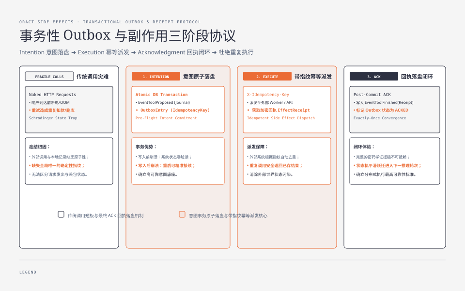
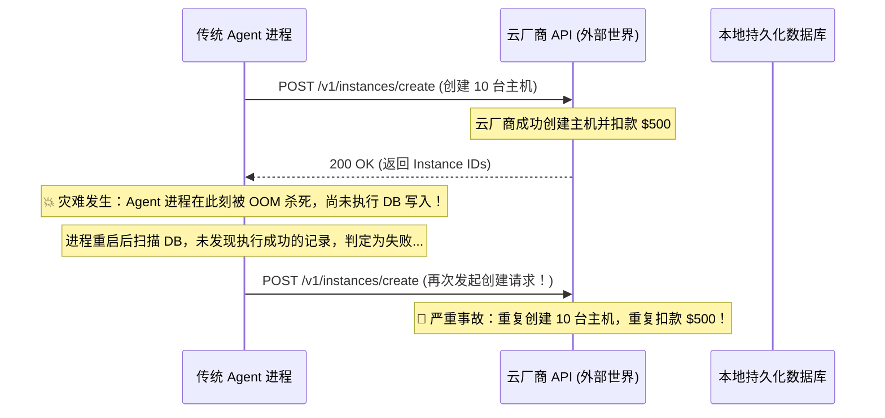
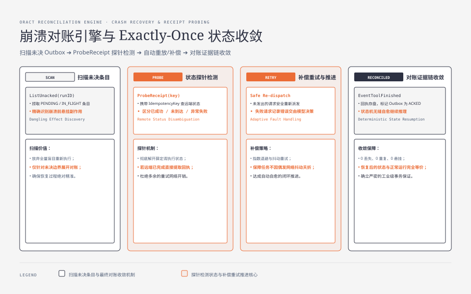
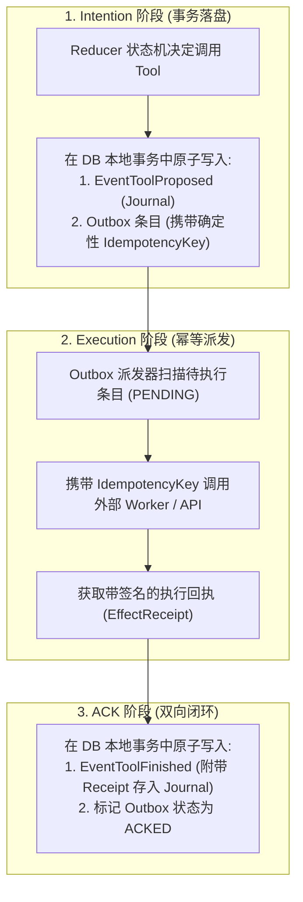
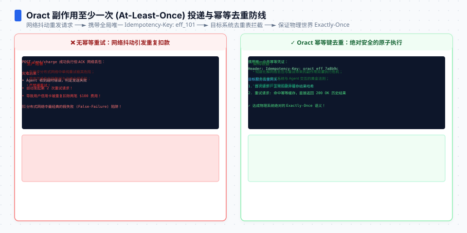

**TL;DR：** 在自主 AI Agent 系统中，大模型的纯文本生成是“无副作用的内部思考”，而调用外部 API、修改文件系统、操作云资源和发起资金操作则是带有物理状态变更的**“副作用（Side Effect）”**。如果 Agent 在向外部发起 HTTP 请求后遭遇网络抖动超时，或者在收到成功响应准备写入数据库的瞬间遭遇服务器断电崩溃，系统就会陷入薛定谔状态：**这个操作到底执行成功了没有？再次执行是否会引发重复操作？** ORACT 借鉴分布式事务的经典范式，在 Agent 工具执行层引入了 **Transactional Outbox（事务性发件箱）** 与 **Receipt（密码学执行回执证据链）** 机制，确保任何外部副作用在系统崩溃重启后均可精确对账，实现 At-least-once 发起与 Exactly-once 状态收敛。

---


---



## 一、副作用风暴：传统 Agent 工具调用的致命痛点

假设 Agent 正在执行一项自动化基础设施扩容任务：“为当前业务集群扩容 10 台云服务器并扣除账户余额”。

在传统 Agent 实现中，流程通常是裸跑的线性调用：



### 1.1 核心症结深度剖析

1. **执行与记录缺乏原子性**：外部系统调用与本地状态持久化分布在两个异构系统中，无法用单机本地事务直接包裹；
2. **缺乏确定性幂等键（Idempotency Key）**：向外部发起的请求没有全局唯一的确定性指纹，导致重试请求被外部系统视为全新操作；
3. **缺乏不可抵赖的执行证据（Receipt）**：系统在重启后无法区分“请求从未发出”、“请求发出但中途丢包”与“请求已成功但响应丢失”三种不同物理状态。

---




## 二、ORACT 的解答：事务性 Outbox 与三阶段执行协议

ORACT 将每一次副作用的执行严格划分为三个阶段：**Intention（意图落盘）➔ Execution（幂等通信）➔ Acknowledgment（回执闭环）**。



### 2.1 阶段一：意图与发件箱原子落盘

当大模型提议调用某个工具时，ORACT 绝不立即发出网络请求，而是在同一个数据库事务中**原子性**地写入两项记录：

```go
// storage/outbox/outbox.go
package outbox

import (
    "crypto/sha256"
    "encoding/hex"
    "fmt"
    "time"
)

type OutboxStatus string

const (
    StatusPending   OutboxStatus = "PENDING"
    StatusInFlight  OutboxStatus = "IN_FLIGHT"
    StatusAcked     OutboxStatus = "ACKED"
    StatusFailed    OutboxStatus = "FAILED"
)

type OutboxEntry struct {
    ID             string       `json:"id"`
    RunID          string       `json:"run_id"`
    TurnIndex      int          `json:"turn_index"`
    ToolName       string       `json:"tool_name"`
    IdempotencyKey string       `json:"idempotency_key"`
    Payload        []byte       `json:"payload"`
    Status         OutboxStatus `json:"status"`
    CreatedAt      time.Time    `json:"created_at"`
    UpdatedAt      time.Time    `json:"updated_at"`
}

// 生成确定性全局唯一的幂等键
func DeriveIdempotencyKey(runID string, turnIndex int, toolName string, payload []byte) string {
    h := sha256.New()
    h.Write([]byte(fmt.Sprintf("%s:%d:%s:", runID, turnIndex, toolName)))
    h.Write(payload)
    return hex.EncodeToString(h.Sum(nil))
}
```

如果在事务写入前崩溃，系统由于什么都没发生，绝对安全；如果在事务写入后立即崩溃，Outbox 中准确记录了“尚未完成的意图”，重启后可精准接续。

### 2.2 阶段二：带指纹的幂等执行

Outbox 派发调度器拉取处于 `PENDING` 的条目，向外部 Worker 或云 API 发起调用。所有发出的请求头部均显式携带 `X-Idempotency-Key`：
- 若外部服务已支持幂等键，重复请求会安全返回上次缓存的执行结果；
- 外部 Worker 在执行完毕后，必须生成一份带有时间戳、哈希指纹和结果载荷的不可变 **Receipt（执行回执）**。

### 2.3 阶段三：Post-Commit ACK 确认落盘

收到 Receipt 后，调度器开启第二个数据库本地事务：
- 将包含 Receipt 的 `EventToolFinished` 写入 Journal；
- 将 Outbox 中的条目标记为已确认（`ACKED`）。

---

## 三、崩溃对账引擎 (Reconciliation on Recovery)

当 ORACT 节点发生崩溃并重启时，`runtime/recovery.go` 引擎会自动启动对账流水线：

```go
// runtime/recovery.go
package runtime

import (
    "context"
    "errors"
    "fmt"
    "time"
)

func (r *RecoverySupervisor) ReconcilePendingOutbox(ctx context.Context, runID string) error {
    // 1. 查询 Outbox 中所有未完成确认的条目
    entries, err := r.outboxStore.ListUnacked(ctx, runID)
    if err != nil {
        return fmt.Errorf("failed to list unacked entries: %w", err)
    }

    for _, entry := range entries {
        // 2. 根据 IdempotencyKey 向远端 Worker / 对账接口发起状态探针
        receipt, err := r.workerClient.ProbeReceipt(ctx, entry.IdempotencyKey)
        if err == nil && receipt != nil {
            // 远端实际上已经执行成功，直接补齐本地 ACK 事务
            if err := r.commitAck(ctx, runID, entry, receipt); err != nil {
                return err
            }
        } else if errors.Is(err, ErrReceiptNotFound) {
            // 远端确认从未收到过该请求，安全重置状态为 PENDING 重新派发
            if err := r.outboxStore.ResetStatus(ctx, entry.ID, StatusPending); err != nil {
                return err
            }
        } else {
            // 网络仍然不通，记录日志并安排退避重试
            r.logger.WarnContext(ctx, "Worker unreachable during recovery, will retry", "key", entry.IdempotencyKey)
        }
    }
    return nil
}
```

---




## 四、Receipt 证据链与审计防篡改

在严肃业务中，简单的 JSON 返回是不具备法律审计效力的。ORACT 的 `Receipt` 结构包含了完整的密码学证据链：

```go
type EffectReceipt struct {
    ReceiptID      string    `json:"receipt_id"`
    IdempotencyKey string    `json:"idempotency_key"`
    ToolName       string    `json:"tool_name"`
    ExecutedAt     time.Time `json:"executed_at"`
    DurationMs     int64     `json:"duration_ms"`
    OutputHash     string    `json:"output_hash"`     // 结果载荷的 SHA-256 哈希
    NodeSignature  string    `json:"node_signature"`   // Worker 执行节点的 Ed25519 私钥签名
    RawOutput      []byte    `json:"raw_output"`
}
```

任何被大模型消费并记录进 Journal 的工具结果，都附带执行节点的数字签名。在出现业务审计调查时，可以完全自证明“该操作确实在何年何月由哪个 Worker 节点真实执行”，彻底杜绝了抵赖与伪造。

---

## 五、架构启示与工程收获

1. **分布式系统没有魔法，只有协议**：不可信网络下的可靠执行，必须依靠 Transactional Outbox 与 Idempotency Key 双重协议保证；
2. **意图必须先于动作落盘**：先在本地确立持久化意图，再去操作外部不可控世界，是所有可靠系统的第一性原理；
3. **证据链是严肃 Agent 系统的护城河**：带有数字签名与哈希指纹的 Receipt 回执，让 Agent 从“玩具演示”真正蜕变为“可进审计的生产系统”。

---

## 六、参考资料与延伸阅读

1. [Pattern: Transactional Outbox (microservices.io)](https://microservices.io/patterns/data/transactional-outbox.html)
2. [ORACT Reliable Effects 设计与实现源码](https://github.com/MoreConsequence/oract/tree/main/storage)
3. [Stripe: Designing robust and idempotent APIs](https://stripe.com/blog/idempotency)
