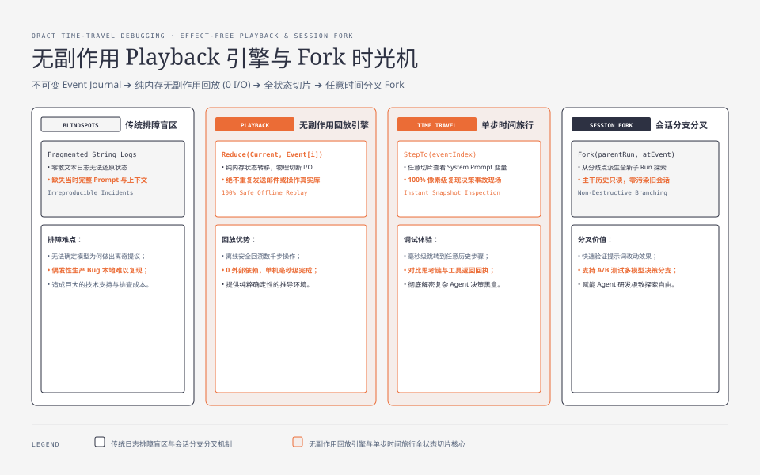
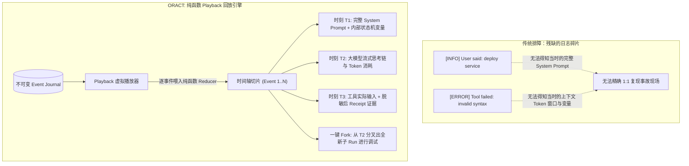
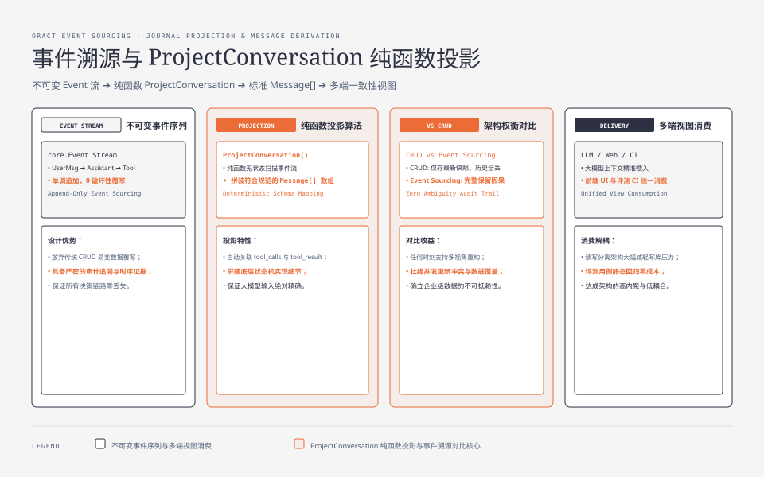
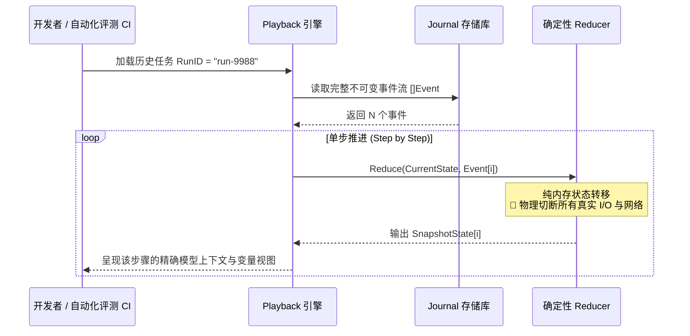

**TL;DR：** 在复杂的 AI Agent 系统中，最让工程师抓狂的莫过于线上用户的“偶发性 Bug 报告”：大模型在第 15 步时给出了异常离奇的回答，或者在第 20 步发起了错误的工具调用。传统系统由于缺乏完整的全状态历史切片，往往难以精准复现问题现场。ORACT 基于不可变 Event Journal，构建了**无副作用 Playback 回放引擎（Effect-Free Playback）**。通过将历史事件流输入纯函数投影器，ORACT 可以在毫秒级时间内重现任意历史时刻的模型 Context 与内部状态，支持单步时间旅行调试（Time-Travel Debugging），并能基于历史任意节点一键创建**会话分叉（Fork）**以探索替代路径。

---


---



## 一、心智模型：可回放性是复杂系统的生命线

在传统 Agent 系统中，所谓的“排障”通常是去日志平台翻看零散的字符串。然而，非结构化日志无法回答以下关键问题：



ORACT 确立了架构设计铁律：**系统中的任何状态变更，都必须是不可变历史事件序列的确定性投影。**

---




## 二、无副作用 Playback 引擎架构

当我们要复现一个线上 Run 时，绝不能把历史上的工具调用（如发送邮件、重启 Pod）真的在物理世界再执行一遍。

ORACT 的 Playback 引擎具有**物理隔离无副作用（Effect-Free）**特性：



### 2.1 核心回放器接口设计

```go
// observe/playback/verifier.go
package playback

import (
    "fmt"
    "github.com/MoreConsequence/oract/runtime/core"
)

type PlaybackSession struct {
    RunID     string
    Events    []core.Event
    Snapshots []core.RunState
    cursor    int
}

func NewPlaybackSession(events []core.Event) (*PlaybackSession, error) {
    session := &PlaybackSession{
        Events: events,
        cursor: 0,
    }
    
    // 初始化时预计算全量确定性状态切片
    var current core.RunState
    for _, event := range events {
        next, err := core.Reduce(current, event)
        if err != nil {
            return nil, fmt.Errorf("reducer integrity check failed at event %s: %w", event.ID(), err)
        }
        session.Snapshots = append(session.Snapshots, next)
        current = next
    }
    
    return session, nil
}

func (p *PlaybackSession) StepTo(eventIndex int) core.RunState {
    if eventIndex < 0 || eventIndex >= len(p.Snapshots) {
        return p.Snapshots[p.cursor]
    }
    p.cursor = eventIndex
    return p.Snapshots[p.cursor]
}
```

---

## 三、Conversation Snapshot 会话投影算法

大模型需要的不是系统底层的状态机数据，而是符合 OpenAI / Anthropic 规范的标准 `[]Message` 结构。

`agent/harness` 模块负责从 Journal 事件流中快速投影出会话快照：

```go
// agent/harness/projection.go
package harness

import "github.com/MoreConsequence/oract/runtime/core"

type ConversationMessage struct {
    Role       string            `json:"role"`
    Content    string            `json:"content"`
    ToolCalls  []core.ToolCall   `json:"tool_calls,omitempty"`
    ToolCallID string            `json:"tool_call_id,omitempty"`
}

func ProjectConversation(events []core.Event) []ConversationMessage {
    var messages []ConversationMessage

    for _, e := range events {
        switch evt := e.(type) {
        case *core.EventUserMessageAdded:
            messages = append(messages, ConversationMessage{
                Role:    "user",
                Content: evt.Content,
            })
        case *core.EventAssistantReplied:
            messages = append(messages, ConversationMessage{
                Role:      "assistant",
                Content:   evt.Text,
                ToolCalls: evt.ToolCalls,
            })
        case *core.EventToolFinished:
            messages = append(messages, ConversationMessage{
                Role:       "tool",
                ToolCallID: evt.InvocationID,
                Content:    string(evt.Receipt.RawOutput),
            })
        }
    }
    return messages
}
```

由于该函数没有任何外部状态依赖，其执行速度在 Go 中达到每秒数十万次投影，内存开销极低。

---

## 四、时间旅行与会话分叉 (Session Fork)

当开发者在 Playback 中发现第 5 步时大模型理解有偏差，可以一键触发 **Session Fork**：

```go
// runtime/fork/service.go
package fork

import (
    "context"
    "time"
    "github.com/MoreConsequence/oract/runtime/core"
)

func (s *ForkService) ForkRunAtEvent(ctx context.Context, sourceRunID string, boundaryEventID string) (string, error) {
    // 1. 截取父 Run 在该边界事件之前的所有不可变 Events
    events, err := s.journalStore.ReadUntil(ctx, sourceRunID, boundaryEventID)
    if err != nil {
        return "", err
    }

    // 2. 生成全新子 RunID 并克隆历史事件切片
    newRunID := core.GenerateRunID()
    if err := s.journalStore.AppendBatch(ctx, newRunID, events); err != nil {
        return "", err
    }

    // 3. 在子 Run 中追加 Fork 溯源元数据事件
    forkEvent := &core.EventForkCreated{
        ParentRunID:       sourceRunID,
        BoundaryEventID:   boundaryEventID,
        ForkedAt:          time.Now(),
    }
    return newRunID, s.journalStore.Append(ctx, newRunID, forkEvent)
}
```

子 Run 继承了父 Run 前期所有宝贵的工作区上下文，同时可以在分叉点输入新的提示词进行替代路径验证，父子会话互不影响。

---

## 五、架构启示与工程收获

1. **不可变数据是时间旅行的前提**：只要数据库中没有 `UPDATE` 和 `DELETE`，任意历史时刻都可以被原汁原味地重构出来；
2. **纯函数 Reducer 极大解放测试生产力**：回放不需要拉起真实的大模型，也不需要拉起真实的外部集群，单元测试可以秒级跑完数万步状态转移；
3. **分叉机制赋能高效 A/B 测试**：在复杂场景下，基于真实用户历史切片分叉出多条不同策略分支进行并行评测，是提升 Agent 决策质量的最强武器。

---

## 六、参考资料与延伸阅读

1. [Redux & Time-Travel Debugging 原理](https://redux.js.org/understanding/thinking-in-redux/glossary#time-travel)
2. [ORACT Observe & Playback 子系统源码](https://github.com/MoreConsequence/oract/tree/main/observe)
3. [Go Performance Optimization: Zero-Allocation Slice Projections](https://go.dev/blog/slices)
