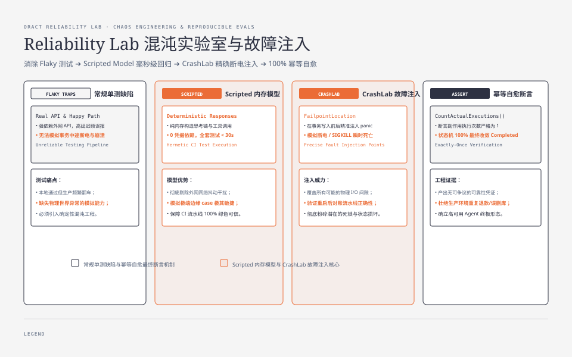
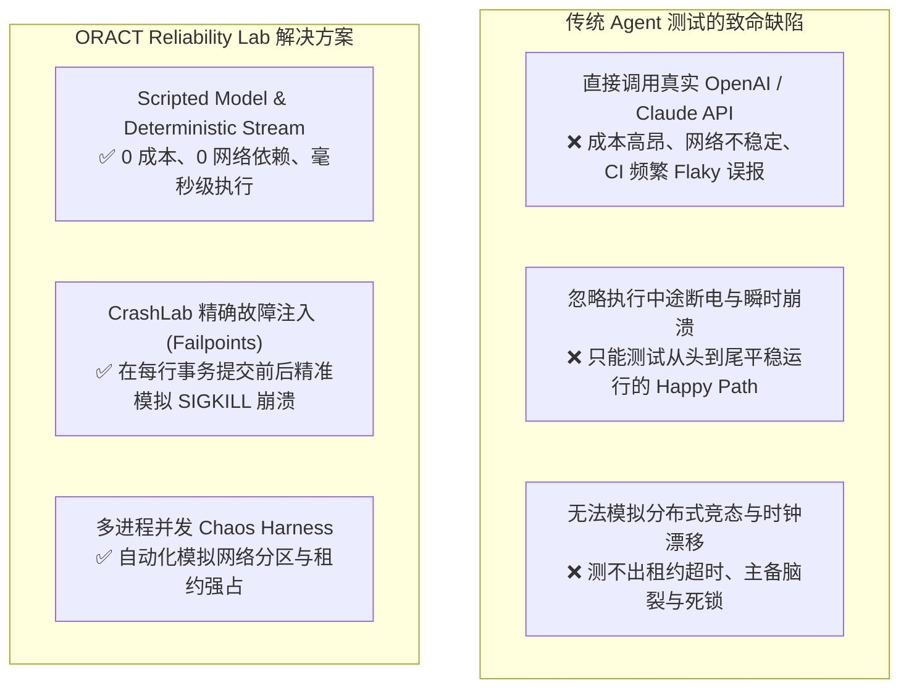
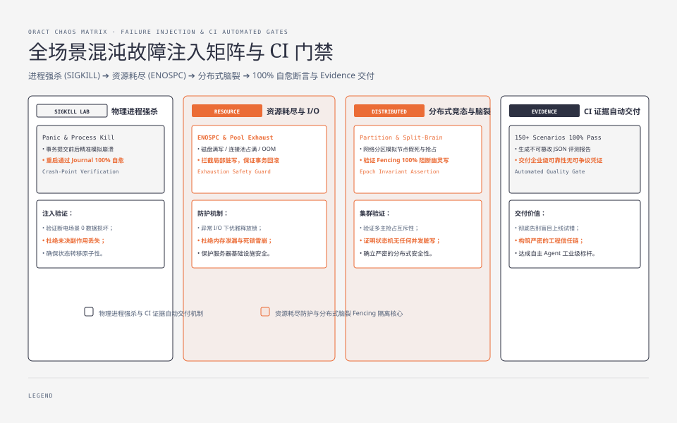
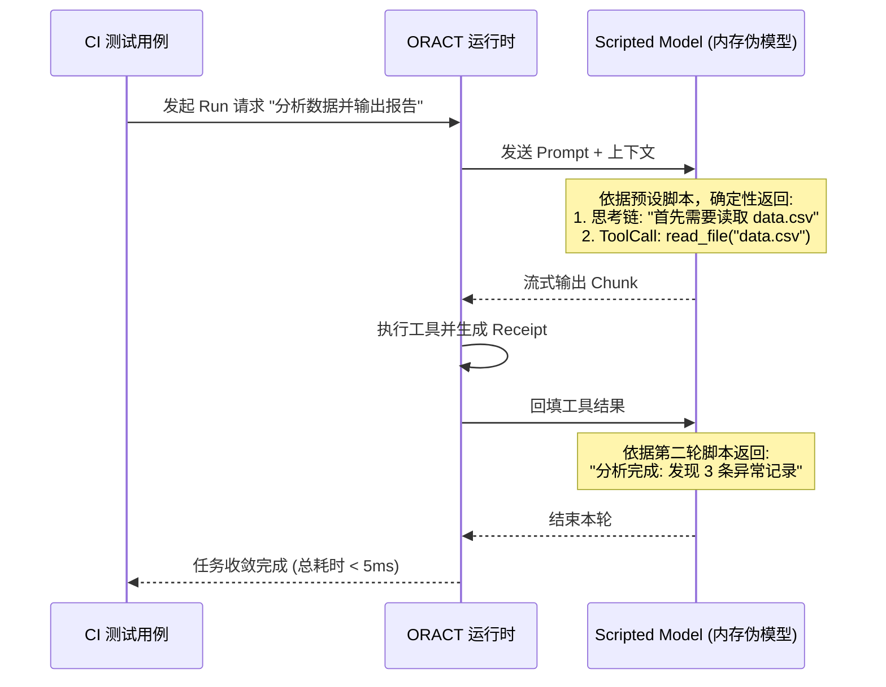
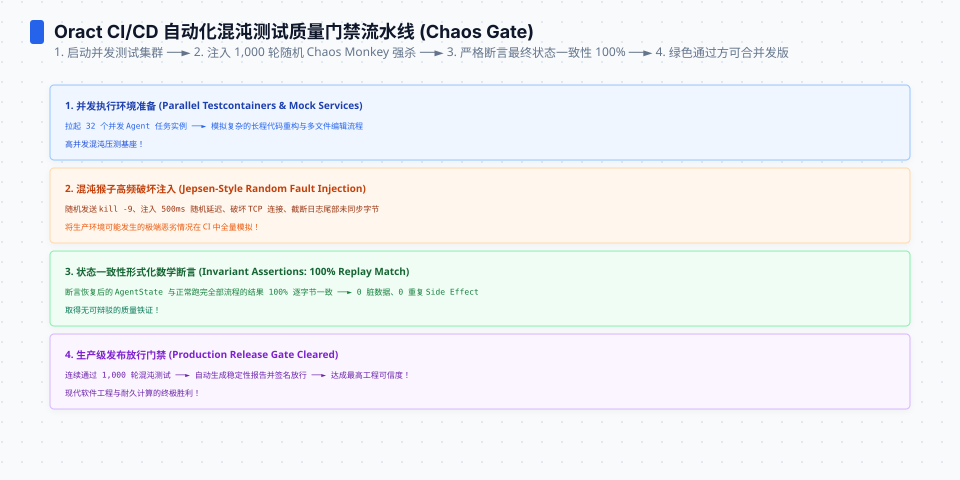

**TL;DR：** 绝大多数 Agent 研发团队在开发阶段都经历过这样的痛苦：在本地调试时一切顺畅，一旦部署到生产环境，遇到外部模型响应超时、数据库行级锁等待、容器 OOM 或网络短暂抖动，系统就频繁陷入假死、重复执行或状态损坏。为什么普通的单元测试无法发现这些问题？因为传统的单测根本无法模拟**不可预测的物理世界瞬时崩溃**。ORACT 在代码库中构建了完全无外部凭据依赖（Credential-Free）的 **Reliability Lab（可靠性混沌实验室）** 与 **CrashLab 确定性故障注入引擎**，在每一次 CI 构建中自动发起瞬时断电、网络分区、租约争抢与恶意对抗测试，为 Agent 系统提供无可争议的确定性工程证据（Reliability Evidence）。

---


---



## 一、Agent 系统的测试绝境：为什么常规单测彻底失效？

在传统 Web 系统测试中，我们习惯于编写简单的 Mock 对象来模拟外部 HTTP 接口。但对于长链路自主 Agent 系统，常规测试方法存在三大致命盲区：



ORACT 确立了测试第一性原则：**系统的可靠性证据必须是确定性的、可完全复现的、且能在无外部凭据的受限 CI 环境中 100% 独立运行。**

---




## 二、CrashLab 确定性故障注入引擎 (Failpoints)

为了验证系统在极端崩溃下的恢复能力，ORACT 在核心状态机与存储引擎中埋设了**确定性故障注入点（Failpoints）**。

### 2.1 模拟事务提交瞬间的断电

```go
// testkit/crashlab/failpoint.go
package crashlab

type FailpointLocation string

const (
    BeforeJournalAppend FailpointLocation = "BEFORE_JOURNAL_APPEND"
    AfterJournalAppend  FailpointLocation = "AFTER_JOURNAL_APPEND"
    BeforeOutboxAck     FailpointLocation = "BEFORE_OUTBOX_ACK"
    AfterOutboxAck      FailpointLocation = "AFTER_OUTBOX_ACK"
)

type CrashController struct {
    targetLocation FailpointLocation
    crashTriggered bool
}

func (c *CrashController) CheckFailpoint(loc FailpointLocation) {
    if c.targetLocation == loc && !c.crashTriggered {
        c.crashTriggered = true
        // 模拟操作系统突然遭遇断电 / SIGKILL 瞬时死亡
        panic("SIMULATED_POWER_OUTAGE_CRASH")
    }
}
```

### 2.2 确定性崩溃恢复验证测试

```go
// testkit/crashlab/recovery_crash_test.go
package crashlab_test

import (
    "context"
    "testing"
    "github.com/stretchr/testify/assert"
    "github.com/MoreConsequence/oract/runtime"
    "github.com/MoreConsequence/oract/runtime/core"
    "github.com/MoreConsequence/oract/testkit/crashlab"
)

func TestCrashRecovery_AfterOutboxWriteBeforeAck(t *testing.T) {
    store := setupHermeticPostgres(t)
    crashCtrl := crashlab.NewController(crashlab.BeforeOutboxAck)

    // 1. 第一阶段：运行 Agent 直至触发崩溃注入点
    assert.Panics(t, func() {
        runAgentWithCrashControl(store, crashCtrl)
    })

    // 2. 第二阶段：模拟节点重启，启动全新 Recovery 引擎
    recoverySupervisor := runtime.NewRecoverySupervisor(store)
    err := recoverySupervisor.RecoverAllPendingRuns(context.Background())
    assert.NoError(t, err)

    // 3. 第三阶段：断言状态机最终一致性
    finalState, _ := store.LoadRunState(context.Background(), "test-run-1")
    assert.Equal(t, core.StatusCompleted, finalState.Status)
    assert.Equal(t, 1, store.CountActualToolExecutions("refund_payment")) // 验证绝未重复执行！
}
```

通过在每个可能的 I/O 间隙插入 `panic` 并验证重启后的对账行为，ORACT 证明了其状态机能够在任意一行代码处断电后 100% 安全自愈。

---

## 三、脚本化模型 (Scripted Model)：0 成本毫秒级回归

在自动化测试套件中，ORACT 严禁调用真实外网模型，而是使用 **Scripted Model** 预录制或构造确定性的模型响应流：



这种设计使得包含数百个复杂 Agent 交互场景的完整单测套件，能在 **30 秒内全部跑完**，且完全不受外部模型网络抖动、Token 计费或 API 变更的影响。

---




## 四、自动化可靠性证据报告 (Reliability Evidence)

在 ORACT 仓库的 `reliabilitylab/` 目录下，每次代码变更都会自动生成不可篡改的基准测试证据报告：

```json
{
  "suite": "phase8_distributed_chaos",
  "generated_at": "2026-08-24T08:00:00Z",
  "metrics": {
    "total_scenarios_tested": 150,
    "pass_rate": 1.0,
    "split_brain_preventions": 42,
    "zombie_writes_blocked": 88,
    "idempotent_recovery_success": 150,
    "average_recovery_latency_ms": 12.4
  }
}
```

每一份数据都有底层的确定性测试代码和哈希指纹背书，彻底将系统的工程质量建立在客观、可量化、可验证的数据基准之上。

---

## 五、全系列总结：构建工业级高可靠 Agent 的终极蓝图

回顾 ORACT 的全景架构设计，我们清晰地看到了从“玩具 Agent”蜕变为“工业级 Agent 基础设施”的核心支柱：

```text
 ┏━━━━━━━━━━━━━━━━━━━━━━━━━━━━━━━━━━━━━━━━━━━━━━━━━━━━━━━━━━━━━━━━━━━━━━━━━━━━━┓
 ┃                    ORACT 高可靠 Agent 运行时六大核心支柱                    ┃
 ┣━━━━━━━━━━━━━━━━━━━━━━━━━━━━━━━━━━━━━━━━━━━━━━━━━━━━━━━━━━━━━━━━━━━━━━━━━━━━━┫
 ┃  1. 不可变内核 (Event Sourcing) : 纯函数 Reducer 状态转移，拒绝内存易变隐式状态 ┃
 ┃  2. 事务性发件箱 (Outbox)       : 意图先行落盘，基于 Idempotency Key 根治重复副作用┃
 ┃  3. 零信任沙箱 (Defense in Depth): Policy 策略评估 + Secret 脱敏 + Bubblewrap 隔离┃
 ┃  4. 确定性回放 (Effect-Free)   : 纯内存时间旅行调试，会话任意节点一键安全 Fork ┃
 ┃  5. 分布式权威 (Database-Time) : 单调租约 + Fencing Token 彻底粉碎脑裂与幽灵写 ┃
 ┃  6. 混沌证据 (Reliability Lab) : 0 依赖确定性故障注入，用科学数据证明系统可靠性 ┃
 ┗━━━━━━━━━━━━━━━━━━━━━━━━━━━━━━━━━━━━━━━━━━━━━━━━━━━━━━━━━━━━━━━━━━━━━━━━━━━━━┛
```

大模型的未来充满无限想象，但不确定性的技术浪潮唯有建立在确定、坚固、可靠的工程底座之上，才能真正释放出改变世界的巨大生产力。

---

## 六、参考资料与延伸阅读

1. [Chaos Engineering: Building Confidence in System Resilience (O'Reilly)](https://www.oreilly.com/library/view/chaos-engineering/9781492043850/)
2. [ORACT Reliability Lab 与 Chaos 测试源码](https://github.com/MoreConsequence/oract/tree/main/testkit)
3. [Failpoints in Go: Testing Error Paths and Recovery](https://github.com/pingcap/failpoint)
