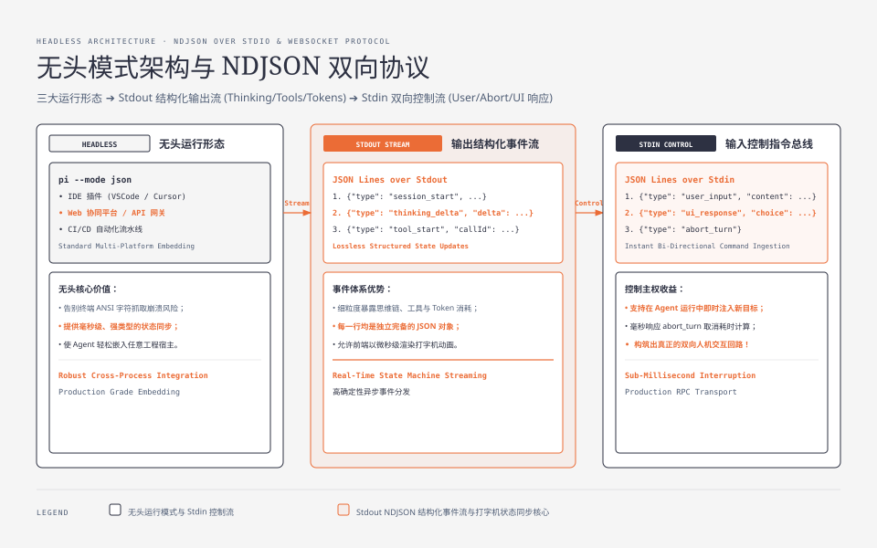
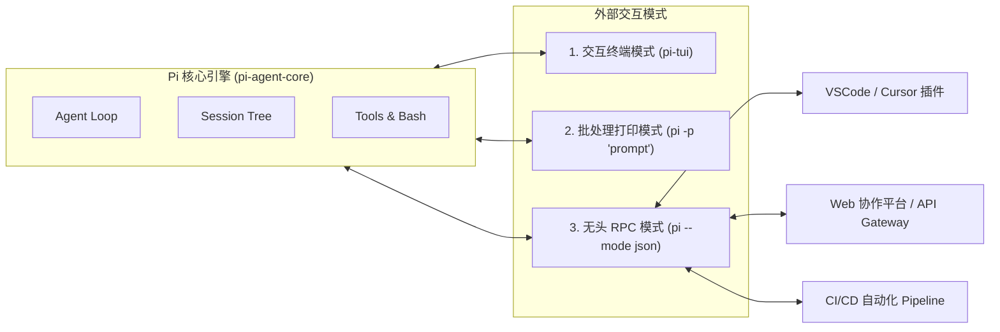
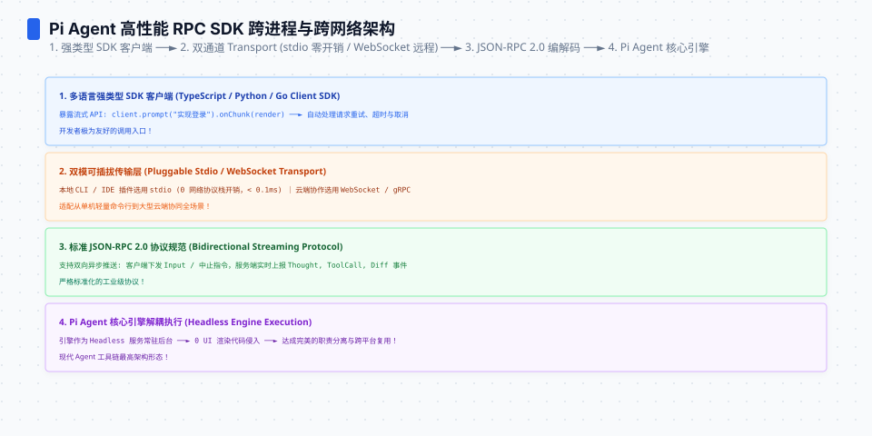
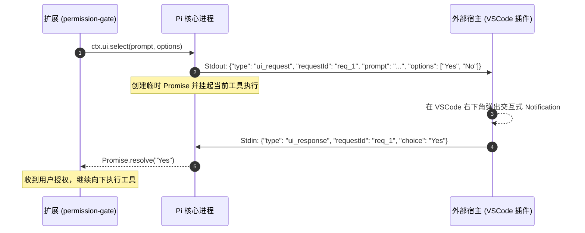
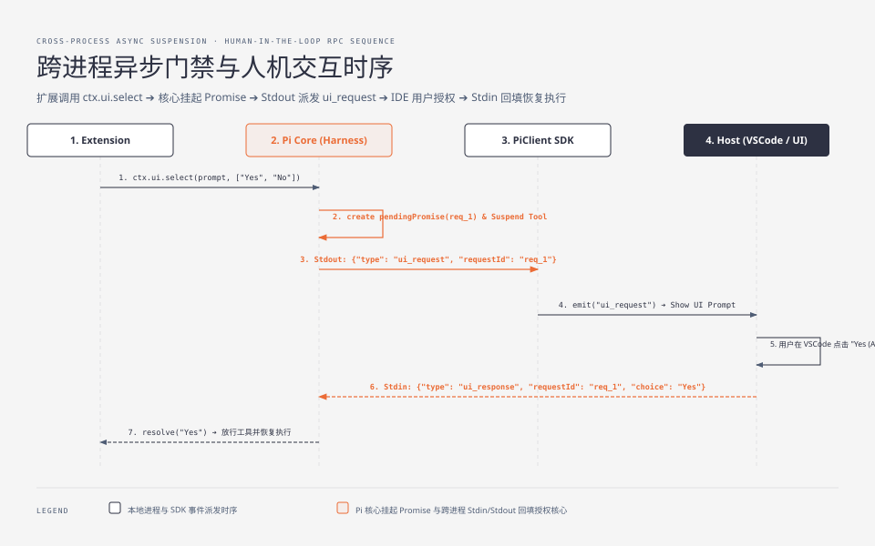

**TL;DR：** 交互式终端（TUI）适合人类开发者单机探索，但在现代工程体系中，Agent 必须能够被嵌入到 **VSCode / JetBrains 插件**、**Web 工作台**、**Slack 机器人** 以及 **GitHub Actions CI/CD 流水线** 中。如果在无头环境中强行解析终端 ANSI 字符，不仅性能低下而且极易崩溃。**Pi 提供了极其优雅的无头解决方案：`--mode json` 标准输入输出（stdio）行协议**。本文作为《Pi Agent 全景通才教程》第十九课（高阶专题第一课），深入拆解 Pi 的双向 JSON-RPC 事件流协议，解决跨进程交互式问询难题，并手写一个生产级 TypeScript SDK。


---



## 一、为什么需要无头模式（Headless Architecture）？

对比三种运行形态的职责分界：



在无头（Headless）场景下，Harness 面临三个核心挑战：
1. **结构化事件流（Structured Event Stream）**：外部系统需要精确感知“当前是正在思考、正在执行第几个工具、还是正在等待模型响应”，必须有无损的 JSON 事件流；
2. **双向人机回路（Bidirectional Human-in-the-loop）**：当 Agent 触发权限门禁（如 `ctx.ui.select` 弹窗询问“是否允许删除数据库”）时，无头进程如何通过标准输入（stdin）安全挂起并等待外部 UI 系统的用户点击回调？
3. **进程生命周期与异常隔离**：宿主应用（如 VSCode）崩溃时，Agent 子进程必须安全退出并持久化当前会话树。




## 二、Pi 的 `--mode json` 行级 RPC 协议规范

Pi 采用 **换行符分隔的 JSON（NDJSON / JSON Lines over stdio）** 作为双向通信总线：

### 1. Agent 输出事件流（Stdout）

```json
{"type": "session_start", "sessionId": "sess_123", "timestamp": 1724400000}
{"type": "message_start", "role": "assistant", "turnIndex": 1}
{"type": "thinking_delta", "delta": "正在分析 package.json..."}
{"type": "tool_start", "toolName": "bash", "callId": "call_1", "args": {"command": "npm test"}}
{"type": "tool_output", "callId": "call_1", "output": "Tests: 45 passed"}
{"type": "message_end", "turnIndex": 1, "tokens": {"input": 1200, "output": 150}}
```

### 2. 外部输入控制流（Stdin）

外部系统向 Agent 发送指令或用户输入：
```json
// 用户追加新指令
{"type": "user_input", "content": "现在帮我把修改提交到 git"}

// 外部系统响应门禁确认 (Human-in-the-loop)
{"type": "ui_response", "requestId": "req_888", "choice": "Yes (Allow)"}

// 强制中断当前 Turn
{"type": "abort_turn"}
```

## 三、跨进程双向门禁：处理 `ui.select` 异步挂起

当扩展调用 `const choice = await ctx.ui.select("确认执行?", ["Yes", "No"])` 时，在 `--mode json` 模式下的底层工作机制如下：






## 四、动手实战：手写 PiClient TypeScript SDK

下面我们手写一个健壮的 SDK，允许任意 Node.js / Electron 应用以子进程方式驱动 Pi：

```ts
// pi-sdk.ts
import { spawn, ChildProcess } from "node:child_process";
import * as readline from "node:readline";
import { EventEmitter } from "node:events";

export interface PiEvent {
  type: string;
  [key: string]: unknown;
}

export class PiAgentClient extends EventEmitter {
  private child: ChildProcess | null = null;
  private pendingUiRequests = new Map<string, (choice: string) => void>();

  constructor(private piExecutablePath = "pi", private cwd = process.cwd()) {
    super();
  }

  /**
   * 启动无头 Agent 进程
   */
  public start(args: string[] = []): void {
    this.child = spawn(this.piExecutablePath, ["--mode", "json", ...args], {
      cwd: this.cwd,
      stdio: ["pipe", "pipe", "pipe"],
      env: { ...process.env, NO_COLOR: "1" },
    });

    const rl = readline.createInterface({
      input: this.child.stdout!,
      crlfDelay: Infinity,
    });

    rl.on("line", (line) => {
      const trimmed = line.trim();
      if (!trimmed) return;

      try {
        const ev: PiEvent = JSON.parse(trimmed);
        this.handleEvent(ev);
      } catch (err) {
        this.emit("raw_log", trimmed);
      }
    });

    this.child.stderr?.on("data", (chunk) => {
      this.emit("stderr", chunk.toString());
    });

    this.child.on("exit", (code) => {
      this.emit("exit", code);
      this.child = null;
    });
  }

  private handleEvent(ev: PiEvent): void {
    // 1. 如果是外部 UI 请求，触发特定事件供宿主响应
    if (ev.type === "ui_request") {
      const { requestId, prompt, options } = ev as any;
      this.emit("ui_prompt", {
        requestId,
        prompt,
        options,
        respond: (choice: string) => this.sendUiResponse(requestId, choice),
      });
    }

    // 2. 向外广播全量结构化事件
    this.emit(ev.type, ev);
    this.emit("event", ev);
  }

  /**
   * 发送用户消息
   */
  public sendUserMessage(content: string): void {
    this.sendJson({ type: "user_input", content });
  }

  /**
   * 响应门禁选择
   */
  public sendUiResponse(requestId: string, choice: string): void {
    this.sendJson({ type: "ui_response", requestId, choice });
  }

  /**
   * 中断当前执行
   */
  public abort(): void {
    this.sendJson({ type: "abort_turn" });
  }

  private sendJson(payload: Record<string, unknown>): void {
    if (!this.child || !this.child.stdin) {
      throw new Error("Pi process is not running.");
    }
    this.child.stdin.write(JSON.stringify(payload) + "\n");
  }

  public stop(): void {
    if (this.child) {
      this.child.kill("SIGTERM");
      this.child = null;
    }
  }
}
```

## 五、小结与课后自检

在第十九课中，我们攻克了 Agent 的无头集成与协议设计：
1. **NDJSON over Stdio**：以标准行协议实现零冗余依赖的结构化事件流；
2. **挂起式人机回路**：基于 Request-Response ID 实现跨进程 `ui.select` 交互回调；
3. **可嵌入 SDK**：让 Agent 能够以标准服务形态接入 VSCode、Web 协作台与自动化流水线。

在下一课 **《20 Subagents 协作模式：用轻量进程编排多 Agent 并行开发》** 中，我们将深入多 Agent 协同的深水区——如何在不污染主上下文的前提下，通过轻量进程编排实现高效的多任务并行。

---

## 参考资料

- `packages/coding-agent/src/cli.ts`：Pi 的 `--mode json` 无头模式与 RPC 派发实现
- JSON-RPC 2.0 Specification & Line-delimited JSON (NDJSON) Standard
- VSCode Language Server Protocol (LSP) Stdio Transport Architecture
