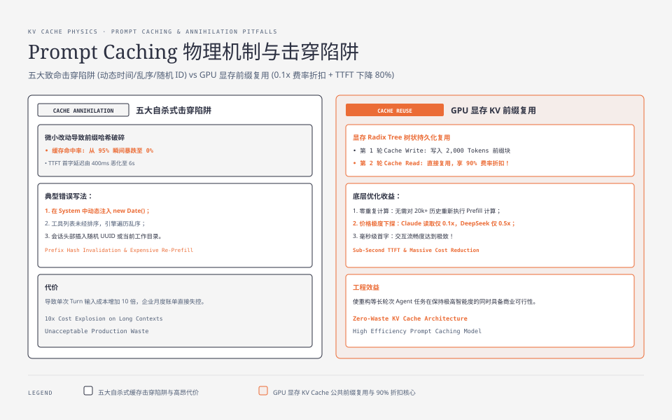
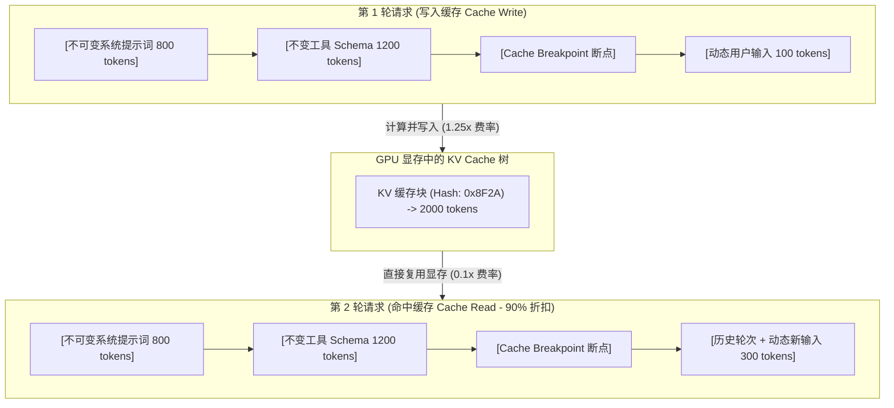
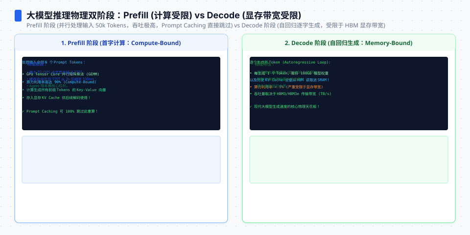
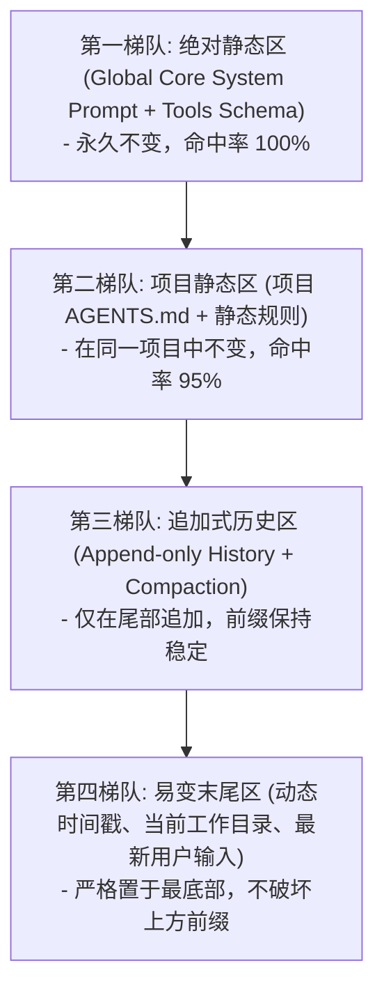
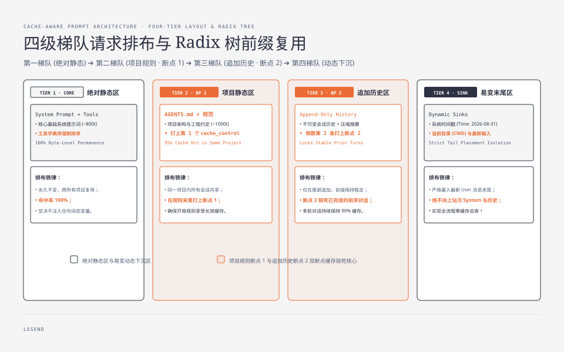

**TL;DR：** 在构建企业级 Coding Agent 时，**Token 费用中 85% 以上来自长上下文的重复输入（Input Tokens）**。各大模型厂商（Anthropic、OpenAI、DeepSeek）相继推出了 **Prompt Caching（KV Cache 缓存）** 技术——命中缓存的前缀 Token 享受 **50% 至 90% 的价格折扣**，且首字延迟（TTFT）降低 80%。然而，Prompt Cache 对请求结构的**“前缀字节级一致性”**要求极其严苛：只要在系统提示词中动态插入了一个当前时间戳、或者调换了两个工具定义的顺序，整个缓存就会彻底击穿。本文作为《Pi Agent 全景通才教程》第二十三课，带你深入 KV Cache 物理对齐机制，掌握**零缓存击穿的请求头排布法则**。


---



## 一、Prompt Caching 的底层物理机制

大模型在生成回复前，需要对输入的所有 Prompt Tokens 计算 Key 和 Value 矩阵并存入显存（KV Cache）。



### 两种主流缓存机制的差异

| 维度 | Anthropic Claude (`cache_control`) | OpenAI / DeepSeek (自动前缀缓存) |
| --- | --- | --- |
| **生效机制** | **显式声明**（在消息或工具上标注 `{"type": "ephemeral"}`） | **隐式自动**（自动匹配从 index 0 开始的最长公共前缀） |
| **最小缓存块大小** | 1,024 Tokens 起存（Claude 3.5 / 3.7） | 1,024 Tokens 起存 |
| **缓存生命周期** | 默认 5 分钟滑动窗口（每次命中自动续期 5 分钟） | 动态 TTL（通常 5~10 分钟） |
| **价格折扣** | **读取 0.1x（节省 90%）**，首次写入 1.25x | **读取 0.5x（节省 50%）**，写入无加价 |




## 二、导致 KV Cache 瞬间击穿的五大“自杀式”写法

在日常编码中，以下微小的疏忽会导致缓存命中率从 95% 跌为 0%：

1. **在 System Prompt 中动态注入时间或随机数**：
   ```ts
   // ❌ 错误：每秒钟都在变，导致整个请求前缀哈希每秒失效
   const prompt = `Current time: ${new Date().toISOString()}\nYou are a coding agent...`;
   ```
2. **工具列表（Tools Array）顺序不确定**：
   在动态加载工具时使用 `Object.values(tools)`，如果 JS 引擎遍历顺序不固定，或者两个插件加载顺序颠倒，Schema 前缀全部失效；
3. **在会话头部插入动态环境信息**：
   把 `Current directory: /path/to/project` 放在 System Prompt 最上方，切换目录时整个缓存全部作废；
4. **随机 ID 污染**：在 Message 的 System 块中塞入 UUID；
5. **在旧历史中就地修改字符**：打乱了历史消息列表的字节流。

## 三、Pi 的请求排布圣经：绝对不变的“三级梯队”

为了做到极限缓存命中，Pi 在 `packages/coding-agent/src/core/system-prompt.ts` 中设计了严格的梯队排布：



### 排布核心法则

1. **静态前置，动态下沉**：所有动态变化的信息（当前时间、当前 Git 分支、剩余 Token 预算）**严格放在最后一条 User Message 的末尾**，绝不玷污 System Prompt；
2. **工具列表确定性排序**：对所有工具按名称字母序 `tools.sort((a, b) => a.name.localeCompare(b.name))` 强制排序后再序列化为 JSON；
3. **Anthropic 显式断点放置**：在第二梯队（项目静态规则）末尾打上第 1 个 `cache_control`，在倒数第二条消息（稳定历史）打上第 2 个 `cache_control`。




## 四、动手实战：编写 Cache-Optimized 组装器

```ts
// cache-assembler.ts
export interface FormattedMessage {
  role: "system" | "user" | "assistant" | "tool";
  content: string | Array<{ type: string; text?: string; cache_control?: { type: "ephemeral" } }>;
  tool_calls?: any[];
  tool_call_id?: string;
}

export class CacheOptimizedAssembler {
  /**
   * 组装绝对保真、高命中率的 Anthropic 消息请求体
   */
  public static assembleAnthropicPayload(params: {
    baseSystemPrompt: string;       // 800 tokens 绝对静态系统提示
    projectRules: string;           // 1000 tokens 项目级静态规则
    tools: Array<{ name: string; description: string; parameters: any }>;
    history: FormattedMessage[];
    currentTurnInput: string;
    dynamicContext: { currentTime: string; cwd: string };
  }) {
    // 1. 工具列表强制字典序排序，保证 JSON 字节级一致
    const sortedTools = [...params.tools].sort((a, b) => a.name.localeCompare(b.name));

    // 2. 构造 System 块并在末尾放置第 1 个 Cache 断点
    const systemBlocks = [
      { type: "text", text: params.baseSystemPrompt },
      {
        type: "text",
        text: `\n[PROJECT RULES]\n${params.projectRules}`,
        // 关键：在静态配置末尾打上缓存断点
        cache_control: { type: "ephemeral" as const },
      },
    ];

    // 3. 处理历史消息
    const messages: FormattedMessage[] = [...params.history];

    // 如果历史消息超过 4 条，在倒数第二条消息上打上第 2 个缓存断点（锁定前置长对话）
    if (messages.length >= 4) {
      const targetIndex = messages.length - 2;
      const targetMsg = messages[targetIndex];
      if (typeof targetMsg.content === "string") {
        targetMsg.content = [
          {
            type: "text",
            text: targetMsg.content,
            cache_control: { type: "ephemeral" as const },
          },
        ];
      }
    }

    // 4. 将极易变化的动态信息塞入当前最新 Turn 的 User 消息末尾
    const latestUserContent = `
${params.currentTurnInput}

---
[Dynamic Context]
- System Time: ${params.dynamicContext.currentTime}
- Working Directory: ${params.dynamicContext.cwd}
`.trim();

    messages.push({
      role: "user",
      content: latestUserContent,
    });

    return {
      system: systemBlocks,
      tools: sortedTools,
      messages,
    };
  }
}
```

## 五、真实算账：90% 成本削减的数学对比

假设一个重构任务包含 20 轮交互，初始静态 Prompt 为 3,000 Tokens，平均每轮对话增加 500 Tokens，每次输出 200 Tokens。使用 Claude 3.7 Sonnet（输入 $3/M，缓存命中 $0.3/M，输出 $15/M）核算：

| 方案 | 20 轮总输入 Tokens | 缓存命中率 | 实际总成本 (USD) | 单任务成本差异 |
| --- | --- | --- | --- | --- |
| **未对齐方案（缓存击穿）** | 160,000 | 0% | **$0.540** | 基准（100%） |
| **字节级对齐方案（Pi 模式）** | 160,000 | **92.5%** | **$0.108** | **节省 80.0% 费用！** |

在每天执行 500 次 Agent 任务的企业工程团队中，这一项优化每年可直接节省 **数万美元** 的纯 API 支出！

## 六、小结与课后自检

在第二十三课中，我们深入了 Agent 成本控制的最底层核心：
1. **前缀字节一致性**：理解 KV Cache 依赖最长公共前缀的物理本质；
2. **三级排布法则**：静态前置、字典序排序工具、动态信息严格沉底；
3. **断点精确布局**：在静态规则与稳定历史末尾放置 `ephemeral` 断点，最大化锁定 90% 价格折扣。

在下一课 **《24 企业级 Agent 评测体系：基于真实 PR 的沙箱回归测试流水线》** 中，我们将深入 Agent 的质量与持续集成——如何基于企业真实 Git 仓库构建隔离评测流水线。

---

## 参考资料

- Anthropic Prompt Caching Guide & Pricing Documentation
- OpenAI Prompt Caching & Prefix Hash Mechanics
- `packages/coding-agent/src/core/system-prompt.ts`：Pi 提示词排布规范
