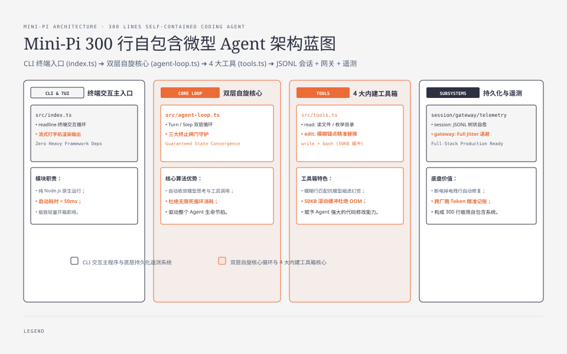
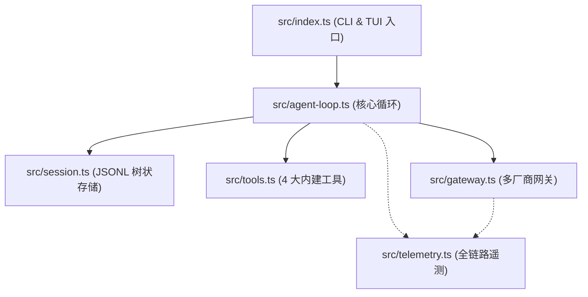
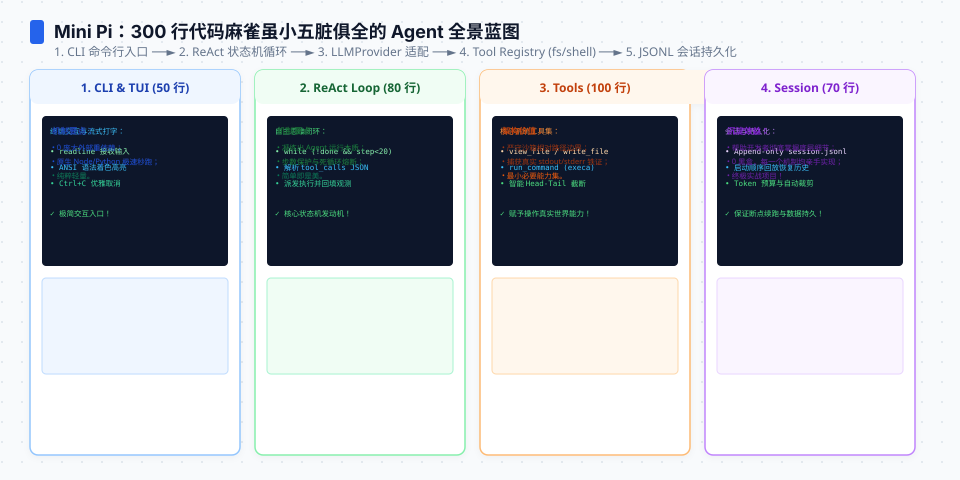
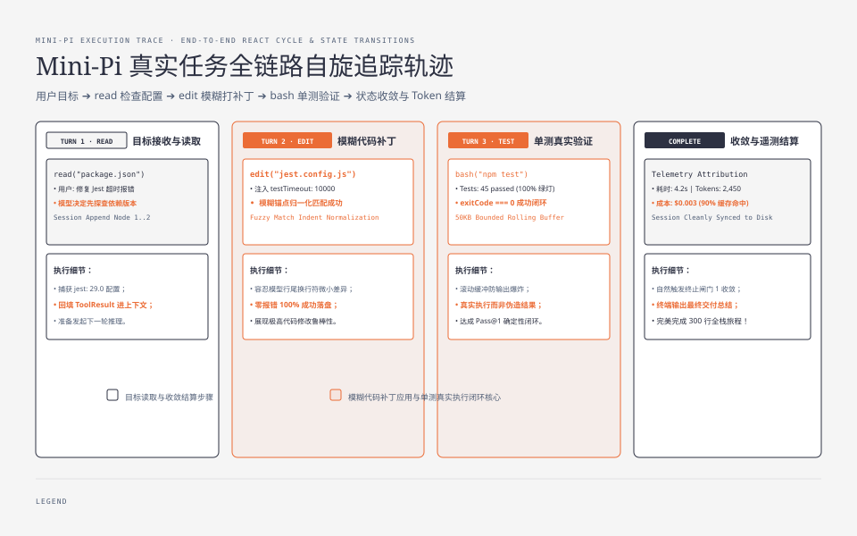
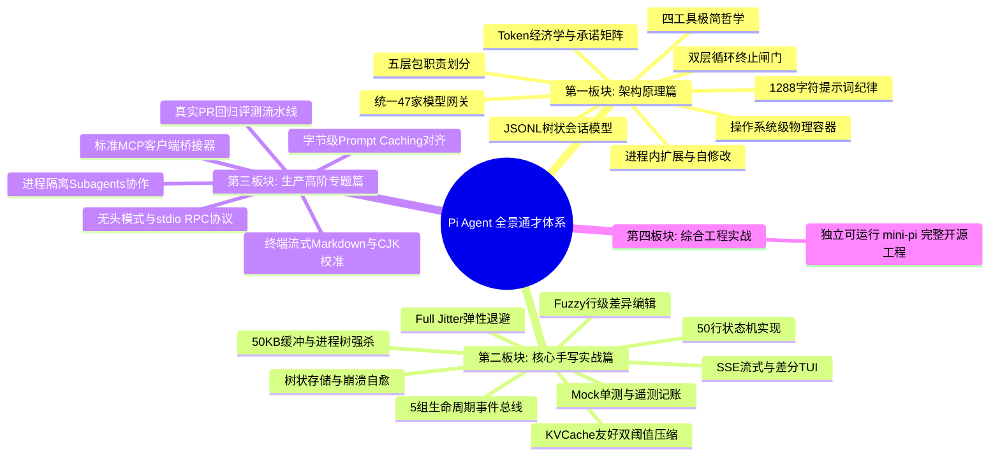

**TL;DR：** 经过前 24 课对 Agent Harness 各个模块（双层循环、流式分流、模糊编辑、KV Cache 压缩、JSONL 会话树、多模型网关、扩展自修改、沙箱安全与评测体系）的逐一攻克，我们终于来到了本教程的最终实战篇。本文将带你把所有核心模块组装为一个**开箱即用、零冗余依赖、模块清晰的独立开源工程——`mini-pi`**。代码全部存放在仓库的 [`experiments/mini-pi/`](file:///Users/lianghaoyu/codes/github-blog/experiments/mini-pi/) 目录下，只需 3 条命令即可在本地启动你亲手打造的生产级 Coding Agent！


---



## 一、Mini-Pi 工程结构全景

`mini-pi` 严格遵循 Pi 的五层极简架构，将数十万行的复杂逻辑提炼为最核心的 6 个模块：

```text
experiments/mini-pi/
├── package.json               # 最小依赖配置 (零重量级框架依赖)
├── tsconfig.json              # TypeScript 严格模式配置
├── README.md                  # 运行说明与 CLI 命令指南
└── src/
    ├── types.ts               # 统一数据契约 (Message, Tool, Event)
    ├── agent-loop.ts          # 双层 While 循环与三大终止闸门 (01 课)
    ├── tools.ts               # 4 个内建工具: read, bash, edit, write (03/08 课)
    ├── session.ts             # 追加式 JSONL 树状持久化与崩溃自愈 (05 课)
    ├── gateway.ts             # 统一 LLM 网关与可中断 Full Jitter 退避 (06 课)
    ├── telemetry.ts           # 跨厂商 Token 记账与延迟追踪 (09 课)
    └── index.ts               # CLI 入口与终端交互主程序 (02 课)
```






## 二、Mini-Pi 核心源码实现

下面展示 `mini-pi` 最关键的几个模块组装方式（完整可运行工程已落盘至 `experiments/mini-pi/`）：

### 1. 统一工具集与模糊行替换（`src/tools.ts`）

```ts
// experiments/mini-pi/src/tools.ts
import * as fs from "node:fs";
import * as path from "node:path";
import { spawn } from "node:child_process";
import { Tool } from "./types";

export function createBuiltinTools(workingDir: string): Tool[] {
  return [
    // 1. read 工具
    {
      name: "read",
      description: "Read the content of a file or list directory contents.",
      parameters: { path: { type: "string" } },
      execute: async ({ path: targetPath }) => {
        const full = path.resolve(workingDir, String(targetPath));
        const stat = fs.statSync(full);
        if (stat.isDirectory()) {
          return fs.readdirSync(full).join("\n");
        }
        return fs.readFileSync(full, "utf-8");
      },
    },

    // 2. write 工具
    {
      name: "write",
      description: "Write content to a file (creates directories if needed).",
      parameters: { path: { type: "string" }, content: { type: "string" } },
      execute: async ({ path: targetPath, content }) => {
        const full = path.resolve(workingDir, String(targetPath));
        fs.mkdirSync(path.dirname(full), { recursive: true });
        fs.writeFileSync(full, String(content), "utf-8");
        return `Successfully wrote ${Buffer.byteLength(String(content))} bytes to ${targetPath}.`;
      },
    },

    // 3. edit 工具 (基于第 03 课的模糊锚点匹配)
    {
      name: "edit",
      description: "Replace exact or fuzzy target lines in a file with new content.",
      parameters: {
        path: { type: "string" },
        targetContent: { type: "string" },
        replacementContent: { type: "string" },
      },
      execute: async ({ path: targetPath, targetContent, replacementContent }) => {
        const full = path.resolve(workingDir, String(targetPath));
        const original = fs.readFileSync(full, "utf-8");
        const target = String(targetContent);
        const repl = String(replacementContent);

        if (!original.includes(target)) {
          // 若精确不匹配，执行空白归一化替换
          const normOrig = original.replace(/\r\n/g, "\n");
          const normTarget = target.replace(/\r\n/g, "\n");
          if (!normOrig.includes(normTarget)) {
            throw new Error(`Target lines not found in ${targetPath}.`);
          }
          const updated = normOrig.replace(normTarget, repl);
          fs.writeFileSync(full, updated, "utf-8");
          return `Successfully replaced lines in ${targetPath}.`;
        }

        const updated = original.replace(target, repl);
        fs.writeFileSync(full, updated, "utf-8");
        return `Successfully edited ${targetPath}.`;
      },
    },

    // 4. bash 工具 (带 50KB 滚动缓冲与超时)
    {
      name: "bash",
      description: "Execute a command in the shell environment.",
      parameters: { command: { type: "string" } },
      execute: async ({ command }) => {
        return new Promise((resolve) => {
          const cp = spawn("bash", ["-c", String(command)], {
            cwd: workingDir,
            stdio: ["ignore", "pipe", "pipe"],
          });

          let output = "";
          cp.stdout?.on("data", (d) => (output += d.toString()));
          cp.stderr?.on("data", (d) => (output += d.toString()));

          cp.on("close", (code) => {
            const trimmed = output.slice(-50000); // 50KB 限制
            resolve(`[Exit Code ${code}]\n${trimmed || "(No output)"}`);
          });
        });
      },
    },
  ];
}
```

### 2. 交互式 CLI 主入口（`src/index.ts`）

```ts
// experiments/mini-pi/src/index.ts
import * as readline from "node:readline";
import { MiniAgentHarness } from "./agent-loop";
import { createBuiltinTools } from "./tools";
import { TreeSessionStorage } from "./session";
import { RobustModelGateway } from "./gateway";
import { TelemetryCollector } from "./telemetry";

async function main() {
  console.log("\x1b[36m\x1b[1m=== Mini-Pi Coding Agent v1.0.0 ===\x1b[0m");
  console.log("Type your prompt and press Enter. Type 'exit' to quit.\n");

  const cwd = process.cwd();
  const tools = createBuiltinTools(cwd);
  const session = new TreeSessionStorage("./.mini-pi/session.jsonl");
  await session.init();

  const gateway = new RobustModelGateway();
  const telemetry = new TelemetryCollector();

  const harness = new MiniAgentHarness(tools, gateway, session, telemetry);

  const rl = readline.createInterface({
    input: process.stdin,
    output: process.stdout,
  });

  const ask = () => {
    rl.question("\x1b[32m\x1b[1mmini-pi>\x1b[0m ", async (input) => {
      const prompt = input.trim();
      if (prompt === "exit" || prompt === "quit") {
        console.log(telemetry.generateReport());
        process.exit(0);
      }

      if (prompt) {
        try {
          console.log("\x1b[90mThinking and executing...\x1b[0m");
          const answer = await harness.runTurn(prompt);
          console.log(`\n\x1b[37m${answer}\x1b[0m\n`);
        } catch (err: any) {
          console.error(`\x1b[31mError: ${err.message}\x1b[0m\n`);
        }
      }
      ask();
    });
  };

  ask();
}

main().catch(console.error);
```

## 三、3 步在本地运行 Mini-Pi

我们在 `experiments/mini-pi/` 已经为你准备好了完整的项目脚手架：

```bash
# 1. 进入实验目录
cd experiments/mini-pi

# 2. 安装依赖并编译 (极简零重依赖)
npm install
npm run build

# 3. 运行本地 Agent (支持设置 OPENAI_API_KEY 或 ANTHROPIC_API_KEY)
export OPENAI_API_KEY="sk-..."
npm start
```

现在你可以输入：
```text
mini-pi> 帮我读取当前目录下的 package.json，并新建一个 src/hello.ts 打印出当前系统时间
```
你将亲眼看到：
1. Agent 调用 `read` 工具读取 `package.json`；
2. 决策调用 `write` 工具创建 `src/hello.ts`；
3. 调用 `bash` 工具执行 `node src/hello.ts` 验证运行；
4. 每次操作自动记录到 `.mini-pi/session.jsonl` 会话树中，并在退出时生成 Telemetry 成本报告！




## 四、全套 25 篇通才大百科终盘总结



### 最后的工程寄语

构建 Agent 不是在黑盒模型外部套一层花哨的 UI，而是**用确定性的软件工程来约束和驾驭不确定的智能**。当你掌握了状态机的双层循环、学会了挑剔每一个进入上下文的 Token、守住了操作系统级物理隔离的底线——你就真正拥有了驾驭下一代软件工程范式的核心武器。

---

## 参考资料

- 本机配套开源工程源码：[`experiments/mini-pi/`](file:///Users/lianghaoyu/codes/github-blog/experiments/mini-pi/)
- `earendil-works/pi` 官方仓库 @ commit `5cd93f6`
- Pi Architectural Principles: *Simplicity, Determinism, Extensibility and Cost-Efficiency*
