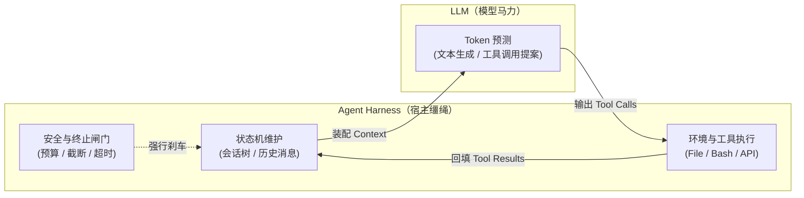
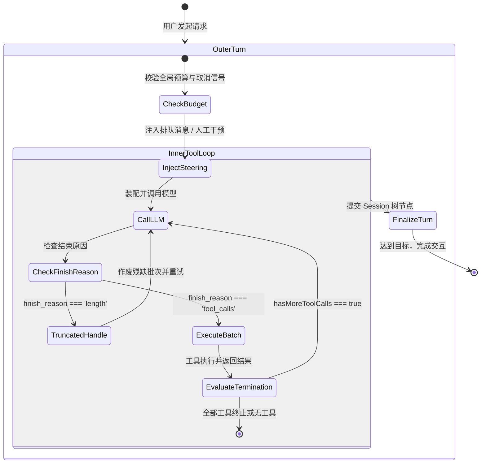

**TL;DR：** 很多人把 AI Agent 误解为“带有提示词技巧的聊天机器人”，但在工程本质上，**Agent 是一个由外部环境驱动的带副作用状态机（Effectful State Machine）**。LLM 只是状态机内部的“下一个状态转移建议器”，而真正维持整个系统运转、执行工具、保证收敛并处理异常的软件层，就是 **Harness（缰绳）**。本文作为《Pi Agent 实战通才教程》的第一课，不使用任何臃肿的第三方 Agent 框架，直接用约 50 行原生 TypeScript 手写一个最小可运行的 Agent 核心循环，逐行拆解双层循环（Turn 循环与 Tool 循环）的流转逻辑，并深入分析工业级实现中必须解决的无限递归、输出截断与并发竞争三大工程陷阱。

## 一、心智模型：Harness（缰绳）vs Model（马力）

在构建 Agent 之前，必须建立清晰的职责边界模型：



- **LLM（模型马力）**：本质上是一个无状态的纯函数 $f(\text{Context}) \to \text{Output}$。它不知道当前系统时间，无法直接触碰文件系统，甚至不知道自己已经在死循环中调用了 50 次报错的命令。
- **Harness（宿主缰绳）**：负责维护真实世界的所有状态。它决定什么时候把哪些文件塞进 Context、何时调用操作系统 API、工具出错时如何格式化错误、以及在模型失控喋喋不休时强行刹车。

Agent 的稳定性、成本和通过率，**80% 取决于 Harness 的工程质量，而非仅仅依赖模型尺寸**。

## 二、从零开始：50 行实现最简 Agent Loop

我们脱离所有 SDK，直接基于标准的 OpenAI / Anthropic 兼容消息格式，编写一个能够自主运行命令行、读写文件并直到解决问题的最简 Agent Loop。

### 1. 核心数据契约定义

首先定义最小消息契约：

```ts
// types.ts
export type MessageRole = "system" | "user" | "assistant" | "tool";

export interface ToolCall {
  id: string;
  name: string;
  arguments: Record<string, unknown>;
}

export interface Message {
  role: MessageRole;
  content: string | null;
  tool_calls?: ToolCall[];
  tool_call_id?: string;
}

export interface Tool {
  name: string;
  description: string;
  parameters: Record<string, unknown>;
  execute: (args: Record<string, unknown>) => Promise<string>;
}
```

### 2. 50 行核心执行循环

下面是完整的最小 Agent 循环实现：

```ts
// agent-minimal.ts
export async function runAgentLoop(
  messages: Message[],
  tools: Tool[],
  callLLM: (msgs: Message[]) => Promise<Message>
): Promise<string> {
  const toolMap = new Map(tools.map((t) => [t.name, t]));
  const history = [...messages];

  while (true) {
    // 1. 调用模型获取下一轮决策
    const response = await callLLM(history);
    history.push(response);

    // 2. 如果模型没有请求任何工具调用，说明任务完成，正常收敛退出
    if (!response.tool_calls || response.tool_calls.length === 0) {
      return response.content ?? "";
    }

    // 3. 逐个执行模型请求的工具调用
    for (const toolCall of response.tool_calls) {
      const tool = toolMap.get(toolCall.name);
      let resultStr: string;

      if (!tool) {
        resultStr = `Error: Tool '${toolCall.name}' is not supported.`;
      } else {
        try {
          resultStr = await tool.execute(toolCall.arguments);
        } catch (err: any) {
          resultStr = `Execution error in '${toolCall.name}': ${err?.message ?? String(err)}`;
        }
      }

      // 4. 将工具执行结果作为 'tool' 角色消息回填到上下文
      history.push({
        role: "tool",
        tool_call_id: toolCall.id,
        content: resultStr,
      });
    }
  }
}
```

这段 50 行的代码已经构成了一个图灵完备的 Agent 原型：它能够接收初始目标，自主决定调用工具，根据环境返回的结果修正下一步动作，直至完成目标。

## 三、现实很残酷：最简循环的三大致命陷阱

上面的 50 行代码可以在简单的 Happy Path 下顺利运行，但在任何工业级场景中，它会在几分钟内崩溃或烧光你的 API 账单。以下是工业级 Harness 必须解决的三个核心工程缺陷：

### 1. 递归死循环与错误震荡（Error Oscillation）

**现象**：模型调用 `bash("npm test")` 报错，模型阅读错误后尝试修改代码，但修改语法错误导致新的报错。模型开始在“修改 A $\to$ 触发 B 报错 $\to$ 改回 A $\to$ 触发 C 报错”之间无限循环，或者模型在遇到未知命令时反复重试同一工具。
**后果**：单次任务消耗数百次 API 调用，Token 消耗呈指数级膨胀，账单瞬间爆表。
**Harness 解决方案**：
- **Turn 上限硬闸门**：设置全局最大 Step 限制（如最多 30 步）；
- **重复调用检测（Idempotency & Oscillation Gate）**：比对最近 3 次工具调用的参数与错误签名，若完全相同则直接注入系统干预消息（Steering Message）打断死循环；
- **全生命周期预算控制**：实时计算累积消耗的 Token 与费用，超限立即熔断。

### 2. 输出截断与 JSON 畸变（Output Truncation）

**现象**：当模型决定调用工具，但由于单次请求的 `max_tokens` 限制，模型生成的 JSON 参数在末尾被截断（例如 `{"command": "cat long_file.ts...` 缺少闭合括号）。
**后果**：JSON 解析直接抛出 `SyntaxError`。如果 Harness 粗暴地把 `JSON.parse error` 喂回给模型，模型通常无法理解自己的输出为什么被截断，反而会再次尝试生成更长的内容，陷入连续畸变。
**Harness 解决方案**：
- 识别 LLM 的 `finish_reason: "length"` 标志；
- 当因长度截断导致工具调用残缺时，**整批作废该轮未完成的 tool_call**，并主动向模型追加一条提示：“输出达到单轮 Token 上限被截断，请分批或使用更紧凑的方式调用”；
- 采用支持部分修复的宽容 JSON 解析器（Partial JSON Parser）。

### 3. 工具副作用与并发竞争（Concurrency & Side Effects）

**现象**：模型在一轮输出中同时返回了两个工具调用：`[write("file.ts", "code"), bash("npm run build")]`。最简循环使用 `for` 循环顺序执行，但如果并行执行，`npm run build` 可能在 `write` 尚未落盘时就已经启动，读取到旧文件。
**Harness 解决方案**：
- 明确区分**只读工具（Read-only Tools）**与**副作用工具（Mutating Tools）**；
- 只读工具（如多个 `read_file`）在同批次内走 `Promise.all` 并行加速；
- 副作用工具（如 `write`、`bash`）严格按模型规划的序列串行执行，并在每次落盘后做文件系统 Flush 确认。

## 四、确定性状态机：Pi 的双层 While 循环设计

为了解决上述问题，`earendil-works/pi` 在 `packages/agent/src/agent-loop.ts` 中采用了严密的**双层 While 循环**设计：



### 双层循环的核心职责划分

1. **外层循环（Turn Loop）**：
   - 对应一次完整的“用户输入 $\to$ 最终响应”会话交互；
   - 负责挂载全局 `AbortSignal`（支持用户随时按下 Ctrl+C 强行中断）；
   - 处理外部转向消息（Steering Messages，如用户中途插入的纠正提示）；
   - 在 Turn 结束时向会话持久化存储写入事务检查点（Checkpoint）。

2. **内层循环（Tool Execution Loop）**：
   - 对应模型在完成单个 Turn 过程中进行的多次“思考 $\to$ 调工具 $\to$ 观察结果”自旋；
   - 维护本轮的临时工具执行批次；
   - 工具自身可以返回 `terminate: true` 信号（例如用户主动拒绝了命令、或发生致命未捕获异常），强制内层循环提前收敛，把控制权交还给外层。

## 五、动手实战：构建可收敛的 TypeScript Harness 骨架

下面我们为教程后续篇章搭建一个标准、健壮的 TypeScript 基础骨架。

```ts
// harness-core.ts
export interface AgentContext {
  sessionId: string;
  maxTurns: number;
  abortSignal?: AbortSignal;
  onEvent?: (event: AgentEvent) => void;
}

export type AgentEvent =
  | { type: "turn_start"; turnIndex: number }
  | { type: "llm_request"; messageCount: number }
  | { type: "tool_start"; toolName: string; args: unknown }
  | { type: "tool_end"; toolName: string; durationMs: number; success: boolean }
  | { type: "turn_end"; output: string };

export class RobustAgentHarness {
  constructor(
    private tools: Tool[],
    private callModel: (msgs: Message[], signal?: AbortSignal) => Promise<Message>
  ) {}

  public async execute(initialMessages: Message[], ctx: AgentContext): Promise<string> {
    const history = [...initialMessages];
    let turnCount = 0;

    while (turnCount < ctx.maxTurns) {
      if (ctx.abortSignal?.aborted) {
        throw new Error("Agent execution aborted by user.");
      }

      ctx.onEvent?.({ type: "turn_start", turnIndex: turnCount });
      turnCount++;

      // 1. 调用模型
      ctx.onEvent?.({ type: "llm_request", messageCount: history.length });
      const response = await this.callModel(history, ctx.abortSignal);
      history.push(response);

      // 2. 收敛判定
      if (!response.tool_calls || response.tool_calls.length === 0) {
        const finalOutput = response.content ?? "";
        ctx.onEvent?.({ type: "turn_end", output: finalOutput });
        return finalOutput;
      }

      // 3. 执行工具批次
      for (const call of response.tool_calls) {
        if (ctx.abortSignal?.aborted) break;

        const startTime = Date.now();
        ctx.onEvent?.({ type: "tool_start", toolName: call.name, args: call.arguments });
        
        let result: string;
        let success = true;
        const tool = this.tools.find((t) => t.name === call.name);

        if (!tool) {
          result = `Tool ${call.name} not found.`;
          success = false;
        } else {
          try {
            result = await tool.execute(call.arguments);
          } catch (e: any) {
            result = `Error: ${e.message}`;
            success = false;
          }
        }

        ctx.onEvent?.({
          type: "tool_end",
          toolName: call.name,
          durationMs: Date.now() - startTime,
          success,
        });

        history.push({
          role: "tool",
          tool_call_id: call.id,
          content: result,
        });
      }
    }

    throw new Error(`Max turns (${ctx.maxTurns}) exceeded without convergence.`);
  }
}
```

## 六、小结与课后自检

在第一课中，我们拆解了 Agent Harness 的核心心智模型与双层循环架构：
1. **Agent 的本质**：不是 Prompt Engineering，而是带副作用的状态机；
2. **三道防御线**：Turn 预算硬闸门防死循环、长度截断作废机制防 JSON 畸变、串并行隔离防副作用竞争；
3. **分层收敛**：外层管会话与用户信号，内层管工具自旋与确定性终止。

### 课后思考与动手实验
1. **模拟截断**：故意将 `callModel` 的返回结果截断为一个缺少末尾 `}` 的 JSON 字符串，观察最简实现与工业实现的表现差异；
2. **加入 AbortSignal**：在 `tool.execute` 执行过程中触发 `AbortController.abort()`，验证进程树是否能干净退出而不会残留后台孤儿进程。

在下一课 **《02 流式传输与差分渲染：Thinking 块、ToolCall 增量聚合与 TUI 引擎》** 中，我们将深入剖析现代 LLM 的实时流式协议，手写支持增量 JSON 拼接与终端差分刷新的 TUI 引擎。

---

## 参考资料

- `packages/agent/src/agent-loop.ts`（796 行）：Pi 的核心循环与终止闸门实现
- earendil-works/pi @ commit `5cd93f6`（2026-08-20 源码基线）
- OpenAI Function Calling Specification & Anthropic Tool Use Streaming Protocol
