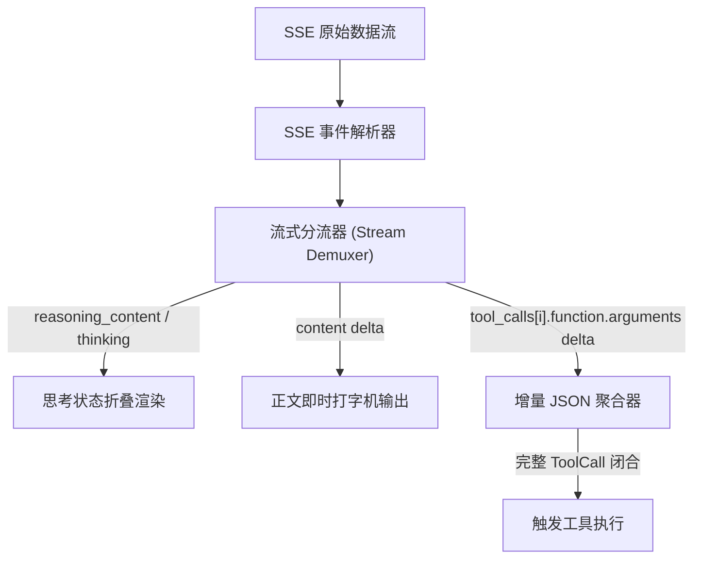

**TL;DR：** 在生产环境中，用户不可能忍受等待 30 秒直到模型把整整 2000 个 Token 和 3 个工具调用全部生成完毕才看到屏幕变化。**生产级 Agent 必须是 100% 流式驱动的（Fully Streaming-Driven）**。然而，流式处理在工程上极具挑战性：模型输出被拆碎成几百个微小的 SSE（Server-Sent Events）数据包，思考过程（Thinking / Reasoning Block）、工具名称与 JSON 参数片段（`{"com`, `mand": `, `"ls"}`）混杂在一起到来。本文作为《Pi Agent 实战通才教程》第二课，手把手教你编写一个**零依赖的流式事件分流器**、**JSON 增量聚合器（Incremental JSON Parser）**，以及基于 ANSI 转义序列的高性能**终端差分渲染引擎（Differential TUI）**。

## 一、流式协议拆解：OpenAI 与 Anthropic 的数据形态

不同大模型厂商的流式协议存在结构差异，但核心都是基于 HTTP SSE（Content-Type: `text/event-stream`）。



### 1. 常见分块格式对比

- **OpenAI 兼容协议**（包括 DeepSeek、Qwen、GLM）：
  ```json
  // Chunk 1: 开始思考 (DeepSeek / Reasoning 模型)
  {"choices": [{"delta": {"reasoning_content": "我们需要检查一下当前目录下的文件..."}}]}
  
  // Chunk 2: 工具调用元数据到达
  {"choices": [{"delta": {"tool_calls": [{"index": 0, "id": "call_123", "type": "function", "function": {"name": "bash"}}]}}]}
  
  // Chunk 3 & 4: 工具参数增量到达
  {"choices": [{"delta": {"tool_calls": [{"index": 0, "function": {"arguments": "{\"command\":"}}]}}]}
  {"choices": [{"delta": {"tool_calls": [{"index": 0, "function": {"arguments": " \"ls -la\"}"}}]}}]}
  ```

- **Anthropic 协议**：
  采用显式事件分块类型（`content_block_start` $\to$ `content_block_delta` $\to$ `content_block_stop`），思维链由 `type: "thinking_delta"` 承载，工具参数由 `type: "input_json_delta"` 承载。

Harness 必须在接入层将这些异构流抹平为统一的**内部增量事件流**。

## 二、核心实现：流式分流器与增量 JSON 聚合器

在收到零碎的字符串片段时，如何在不发生 `SyntaxError` 的前提下，实时向用户展示正在输入的参数，并在参数闭合时立即解析为结构化对象？

### 1. 统一的流式事件模型

```ts
// stream-types.ts
export type StreamDeltaEvent =
  | { type: "thinking_delta"; delta: string }
  | { type: "text_delta"; delta: string }
  | { type: "tool_start"; index: number; id: string; name: string }
  | { type: "tool_args_delta"; index: number; delta: string }
  | { type: "tool_complete"; index: number; id: string; name: string; args: Record<string, unknown> }
  | { type: "stream_end"; finishReason: string };
```

### 2. 增量聚合器实现

```ts
// stream-accumulator.ts
export class StreamAccumulator {
  private thinkingBuffer = "";
  private textBuffer = "";
  private toolCalls: Map<number, { id: string; name: string; argsRaw: string }> = new Map();

  public handleOpenAIChunk(chunk: any, onEvent: (ev: StreamDeltaEvent) => void) {
    const choice = chunk.choices?.[0];
    if (!choice) return;

    const delta = choice.delta;

    // 1. 处理思考流 (Reasoning Content)
    if (delta.reasoning_content) {
      this.thinkingBuffer += delta.reasoning_content;
      onEvent({ type: "thinking_delta", delta: delta.reasoning_content });
    }

    // 2. 处理正文文本流
    if (delta.content) {
      this.textBuffer += delta.content;
      onEvent({ type: "text_delta", delta: delta.content });
    }

    // 3. 处理工具调用流
    if (delta.tool_calls) {
      for (const tc of delta.tool_calls) {
        const idx = tc.index ?? 0;
        let record = this.toolCalls.get(idx);

        if (!record) {
          record = { id: tc.id ?? "", name: tc.function?.name ?? "", argsRaw: "" };
          this.toolCalls.set(idx, record);
          onEvent({ type: "tool_start", index: idx, id: record.id, name: record.name });
        }

        if (tc.id && !record.id) record.id = tc.id;
        if (tc.function?.name && !record.name) record.name = tc.function.name;

        if (tc.function?.arguments) {
          record.argsRaw += tc.function.arguments;
          onEvent({ type: "tool_args_delta", index: idx, delta: tc.function.arguments });
        }
      }
    }

    // 4. 处理完成信号
    if (choice.finish_reason) {
      // 闭合所有处于 buffer 中的工具调用
      for (const [idx, record] of this.toolCalls.entries()) {
        let parsedArgs: Record<string, unknown> = {};
        try {
          parsedArgs = record.argsRaw ? JSON.parse(record.argsRaw) : {};
        } catch {
          // 容错处理：若 JSON 残缺则保留 raw 字符串
          parsedArgs = { _raw: record.argsRaw };
        }

        onEvent({
          type: "tool_complete",
          index: idx,
          id: record.id,
          name: record.name,
          args: parsedArgs,
        });
      }

      onEvent({ type: "stream_end", finishReason: choice.finish_reason });
    }
  }
}
```

## 三、TUI 渲染核心：为什么不能用 `console.log`？

很多开发者在终端做 Agent UI 时习惯用 `console.log`。但在流式多任务场景下，`console.log` 会造成灾难性的体验：
1. **终端疯狂刷屏与闪烁**：每收到 5 个字符就打一行，屏幕像瀑布一样飞滚，完全无法阅读；
2. **状态无法原地覆盖**：一个耗时 10 秒的 Bash 任务，无法原地显示转动的 Spinner 或进度条，只能打出 10 行 `Waiting...`；
3. **思考过程与工具调用交错混乱**。

### 终端差分渲染原理（Differential Rendering）

Pi 的 `pi-tui` 包之所以流畅且不闪屏，核心在于利用 **ANSI Escape Codes** 实现了**行级差分刷新**：

| ANSI 转义序列 | 作用 |
| --- | --- |
| `\x1b[2K` | 清除当前整行内容 |
| `\x1b[0G` | 将光标移动到当前行行首（第 0 列） |
| `\x1b[<N>A` | 将光标向上移动 $N$ 行 |
| `\x1b[<N>B` | 将光标向下移动 $N$ 行 |
| `\x1b[?25l` / `\x1b[?25h` | 隐藏光标 / 显示光标 |

## 四、动手实战：手写轻量终端差分渲染器

下面我们手写一个轻量的终端差分渲染器 `TerminalRenderer`，支持实时思考动画、工具调用卡片与即时更新：

```ts
// tui-renderer.ts
export class TerminalRenderer {
  private lastRenderedLines = 0;
  private isThinking = false;
  private thinkingText = "";
  private currentTool: { name: string; argsRaw: string; status: "running" | "done" } | null = null;

  constructor(private out = process.stdout) {}

  // 原地重画整个动态控制区
  public render() {
    this.out.write("\x1b[?25l"); // 隐藏光标

    // 1. 回退并清除上一次渲染的全部行
    if (this.lastRenderedLines > 0) {
      for (let i = 0; i < this.lastRenderedLines; i++) {
        this.out.write("\x1b[2K"); // 清除整行
        if (i < this.lastRenderedLines - 1) {
          this.out.write("\x1b[1A"); // 向上移一行
        }
      }
      this.out.write("\x1b[0G"); // 回到第一行行首
    }

    // 2. 组装待输出的内容行
    const buffer: string[] = [];

    // 渲染思考块（淡灰色，折叠前三行）
    if (this.thinkingText) {
      buffer.push("\x1b[90m💭 [Thinking]\x1b[0m");
      const lines = this.thinkingText.split("\n").filter(Boolean);
      const tail = lines.slice(-2); // 只展示最近两行思考
      for (const line of tail) {
        buffer.push(`\x1b[90m  ${line.slice(0, 80)}\x1b[0m`);
      }
    }

    // 渲染当前工具卡片
    if (this.currentTool) {
      const icon = this.currentTool.status === "running" ? "⏳" : "✅";
      buffer.push(`\x1b[36m${icon} Tool: \x1b[1m${this.currentTool.name}\x1b[0m`);
      if (this.currentTool.argsRaw) {
        buffer.push(`\x1b[33m  Args: ${this.currentTool.argsRaw.slice(0, 70)}\x1b[0m`);
      }
    }

    // 3. 输出并记录本次渲染的行数
    for (let i = 0; i < buffer.length; i++) {
      this.out.write(buffer[i] + (i < buffer.length - 1 ? "\n" : ""));
    }

    this.lastRenderedLines = buffer.length;
    this.out.write("\x1b[?25h"); // 恢复光标
  }

  public appendThinking(delta: string) {
    this.thinkingText += delta;
    this.render();
  }

  public setToolStart(name: string) {
    this.currentTool = { name, argsRaw: "", status: "running" };
    this.render();
  }

  public appendToolArgs(delta: string) {
    if (this.currentTool) {
      this.currentTool.argsRaw += delta;
      this.render();
    }
  }

  public setToolDone() {
    if (this.currentTool) {
      this.currentTool.status = "done";
      this.render();
      // 提交到固定历史区，重置动态行计数
      this.out.write("\n");
      this.lastRenderedLines = 0;
      this.currentTool = null;
    }
  }
}
```

## 五、小结与课后自检

在第二课中，我们掌握了流式 Agent 交互层的底层架构：
1. **流式分流机制**：将 SSE 原始 Chunk 拆解为思考流、正文流与工具参数流；
2. **增量 JSON 状态机**：跨 Chunk 汇聚残缺字符串，并在 `stream_end` 时安全完成反序列化；
3. **ANSI 差分渲染**：利用光标回退与整行清除，实现丝滑无闪烁的原地状态刷新。

在下一课 **《03 代码怎么改：模糊锚点匹配与 Diff-Aware 行级编辑算法》** 中，我们将深入 Coding Agent 的核心操作工具——为什么不能全量覆写文件？如何编写一个能容忍模型缩进误差的高鲁棒性行级替换算法？

---

## 参考资料

- `packages/tui/`：Pi 的终端差分渲染器与 ANSI 控制实现
- OpenAI Streaming API Reference
- Anthropic Streaming Messages Specification
