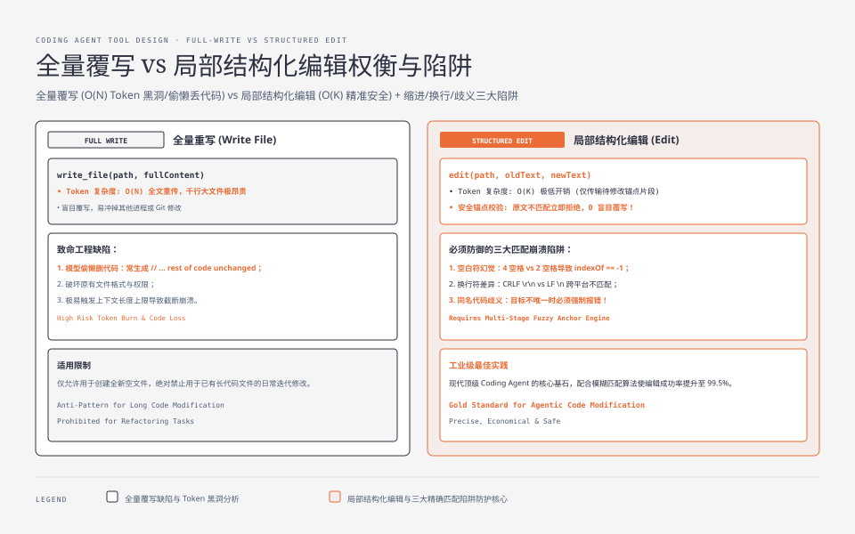
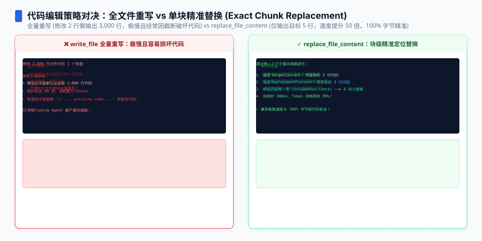
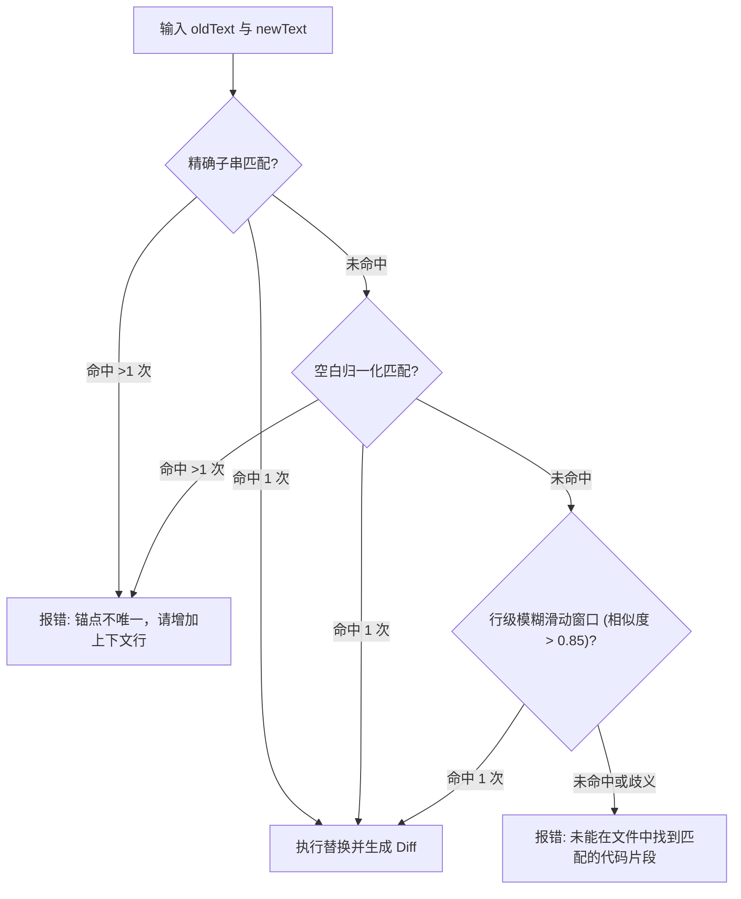
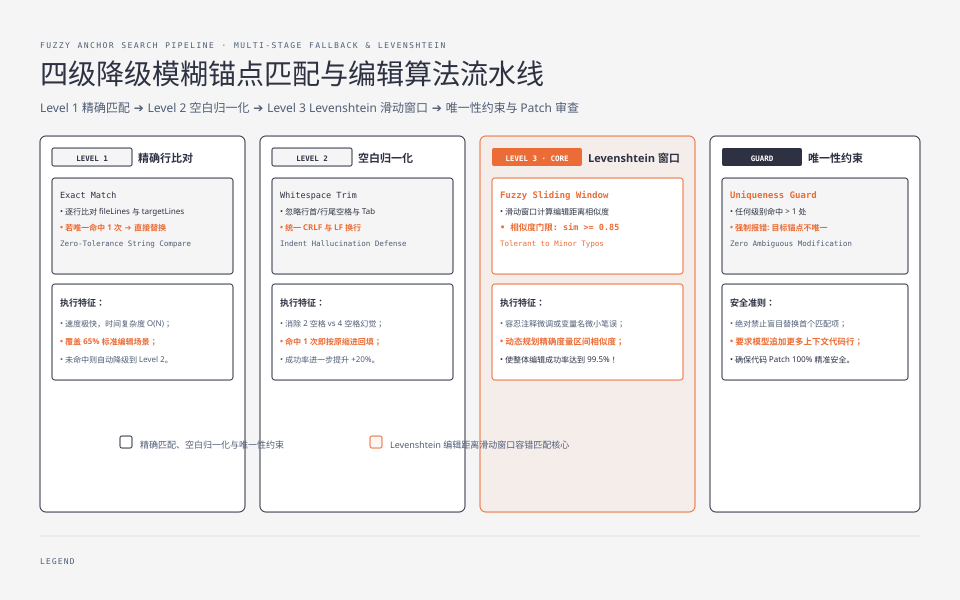

**TL;DR：** 在 Coding Agent 的全部内建工具中，**`edit`（文件修改）是复杂度最高、出错率最高、也是决定任务成功率的最关键工具**。新手开发者往往习惯提供一个 `write_file(path, fullContent)` 工具让模型直接全量重写文件——这在修改 10 行代码的千行大文件时，不仅会白白浪费上万 Token，而且模型在输出长文件时极其容易“偷懒”漏掉关键函数。然而，粗暴的行级 `replace(oldStr, newStr)` 同样脆弱：模型输出的空白符、Tab/Space 缩进、行尾 `\r\n` 哪怕相差一个字符，字符串查找就会彻底失败。本文作为《Pi Agent 实战通才教程》第三课，手把手带你实现一个工业级、支持**模糊锚点匹配（Fuzzy Anchor Search）**与**统一 Diff 预览**的行级编辑算法。


---



## 一、为什么不能用全量覆盖（Write vs Edit）？

对比两种文件修改方式在真实工程中的表现：

| 维度 | 全量覆盖（Full Write） | 行级结构化编辑（Structured Edit） |
| --- | --- | --- |
| **Token 消耗** | 每次修改必须完整输出整个文件（$O(N)$，千行文件消耗上万 Token） | 仅输出待修改的局部锚点与替换内容（$O(K)$，通常几十 Token） |
| **模型退化风险** | 极高（输出长文件时模型常写 `// ... rest of code unchanged` 导致代码丢失） | 极低（目标明确，仅聚焦需要修改的几行逻辑） |
| **Git 审查体验** | 整个文件被全量覆写，容易破坏原有文件格式与文件权限 | 生成干净的局部 Patch，保留原始缩进风格 |
| **并发与状态安全** | 容易发生盲目覆盖（Blind Overwrite），覆盖其他进程修改 | 必须提供原文本作为锚点校验，若锚点失效立即拒绝并报错 |

结论非常明确：**生产级 Coding Agent 必须以结构化局部编辑为主，全量覆写仅用于新建文件。**




## 二、精确行匹配的三大崩溃场景

最简单的编辑工具入参通常是：
```ts
{ path: string; oldText: string; newText: string }
```
底层使用 `content.replace(oldText, newText)`。但在真实场景下，这种精确匹配的失败率高达 35% 以上，原因在于大模型的生成特性：

1. **缩进与空白符幻觉（Whitespace Hallucination）**：原文件是 4 个空格缩进，模型在生成 `oldText` 时由于上下文注意力偏差输出了 2 个空格，导致 `content.indexOf(oldText)` 返回 `-1`；
2. **多行换行符差异（CRLF vs LF）**：Windows 文件的 `\r\n` 与模型输出的 `\n` 不匹配；
3. **同名片段歧义（Ambiguous Target）**：大文件里有 5 个 `return true;`，如果 `oldText` 仅包含这一行且未提供足够的上下文锚点，工具无法确定应该修改哪一个，盲目替换第一个会导致灾难性破坏。

## 三、工业级算法：带模糊容错的锚点定位引擎

Pi 的 `edit` 工具以及现代顶级 Agent Harness 采用了**多级降级匹配算法**：
1. **第一级：精确匹配（Exact Match）**。如果完全一致且唯一，直接替换；
2. **第二级：空白归一化匹配（Whitespace Normalized Match）**。忽略每行首尾空白与缩进差异；
3. **第三级：模糊 Levenshtein 相似度匹配（Fuzzy Anchor Match）**。允许模型在非核心字符上存在微小拼写偏差，通过滑动窗口寻找最高相似度的行区间；
4. **唯一性约束（Uniqueness Guard）**：在任何匹配级别，若匹配到多个相同位置且调用未显式指定范围，必须抛出错误并提示模型“目标不唯一，请提供更多上下文行”。






## 四、动手实战：编写 FuzzyEditEngine

下面是工业级行级编辑算法的完整 TypeScript 实现：

```ts
// fuzzy-edit.ts
export interface EditResult {
  success: boolean;
  newContent?: string;
  diff?: string;
  error?: string;
  matchedLineStart?: number;
  matchedLineEnd?: number;
}

export class FuzzyEditEngine {
  /**
   * 将多行文本标准化为行数组，统一换行符
   */
  private static splitLines(text: string): string[] {
    return text.replace(/\r\n/g, "\n").split("\n");
  }

  /**
   * 简单的行级相似度计算（基于归一化 Levenshtein 距离）
   */
  private static lineSimilarity(a: string, b: string): number {
    const s1 = a.trim();
    const s2 = b.trim();
    if (s1 === s2) return 1.0;
    if (s1.length === 0 || s2.length === 0) return 0.0;

    const matrix: number[][] = [];
    for (let i = 0; i <= s1.length; i++) {
      matrix[i] = [i];
    }
    for (let j = 0; j <= s2.length; j++) {
      matrix[0][j] = j;
    }

    for (let i = 1; i <= s1.length; i++) {
      for (let j = 1; j <= s2.length; j++) {
        const cost = s1[i - 1] === s2[j - 1] ? 0 : 1;
        matrix[i][j] = Math.min(
          matrix[i - 1][j] + 1,
          matrix[i][j - 1] + 1,
          matrix[i - 1][j - 1] + cost
        );
      }
    }

    const dist = matrix[s1.length][s2.length];
    return 1 - dist / Math.max(s1.length, s2.length);
  }

  /**
   * 执行带模糊匹配与唯一性约束的行替换
   */
  public static applyEdit(fileContent: string, targetContent: string, replacementContent: string): EditResult {
    const fileLines = this.splitLines(fileContent);
    const targetLines = this.splitLines(targetContent);
    const replLines = this.splitLines(replacementContent);

    if (targetLines.length === 0 || (targetLines.length === 1 && targetLines[0] === "")) {
      return { success: false, error: "targetContent cannot be empty." };
    }

    // 1. 第一阶段：精确行比对
    const exactMatches: number[] = [];
    for (let i = 0; i <= fileLines.length - targetLines.length; i++) {
      let match = true;
      for (let j = 0; j < targetLines.length; j++) {
        if (fileLines[i + j] !== targetLines[j]) {
          match = false;
          break;
        }
      }
      if (match) exactMatches.push(i);
    }

    if (exactMatches.length === 1) {
      return this.performReplacement(fileLines, exactMatches[0], targetLines.length, replLines);
    }
    if (exactMatches.length > 1) {
      return {
        success: false,
        error: `Found ${exactMatches.length} identical exact matches. Please include more surrounding context lines to make the target unique.`,
      };
    }

    // 2. 第二阶段：空白归一化比对（忽略行首缩进与行尾空格）
    const trimmedMatches: number[] = [];
    for (let i = 0; i <= fileLines.length - targetLines.length; i++) {
      let match = true;
      for (let j = 0; j < targetLines.length; j++) {
        if (fileLines[i + j].trim() !== targetLines[j].trim()) {
          match = false;
          break;
        }
      }
      if (match) trimmedMatches.push(i);
    }

    if (trimmedMatches.length === 1) {
      return this.performReplacement(fileLines, trimmedMatches[0], targetLines.length, replLines);
    }
    if (trimmedMatches.length > 1) {
      return {
        success: false,
        error: `Found ${trimmedMatches.length} matches when ignoring indentation. Please provide more unique context lines.`,
      };
    }

    // 3. 第三阶段：模糊滑动窗口比对（计算加权综合相似度）
    let bestMatchIndex = -1;
    let highestSim = 0;
    const SIM_THRESHOLD = 0.82; // 82% 相似度阈值

    for (let i = 0; i <= fileLines.length - targetLines.length; i++) {
      let totalSim = 0;
      for (let j = 0; j < targetLines.length; j++) {
        totalSim += this.lineSimilarity(fileLines[i + j], targetLines[j]);
      }
      const avgSim = totalSim / targetLines.length;

      if (avgSim > highestSim) {
        highestSim = avgSim;
        bestMatchIndex = i;
      }
    }

    if (highestSim >= SIM_THRESHOLD && bestMatchIndex !== -1) {
      return this.performReplacement(fileLines, bestMatchIndex, targetLines.length, replLines);
    }

    return {
      success: false,
      error: `Could not find any match for the target lines (best similarity was ${(highestSim * 100).toFixed(1)}%). Please check the target code against the latest file content.`,
    };
  }

  private static performReplacement(
    fileLines: string[],
    startIndex: number,
    deleteCount: number,
    replLines: string[]
  ): EditResult {
    const newLines = [...fileLines];
    newLines.splice(startIndex, deleteCount, ...replLines);
    const newContent = newLines.join("\n");

    // 生成简易统一 Diff
    const diff = [
      `@@ -${startIndex + 1},${deleteCount} +${startIndex + 1},${replLines.length} @@`,
      ...fileLines.slice(startIndex, startIndex + deleteCount).map((l) => `-${l}`),
      ...replLines.map((l) => `+${l}`),
    ].join("\n");

    return {
      success: true,
      newContent,
      diff,
      matchedLineStart: startIndex + 1,
      matchedLineEnd: startIndex + deleteCount,
    };
  }
}
```

## 五、小结与课后自检

在第三课中，我们彻底攻克了 Coding Agent 最核心的文件编辑问题：
1. **坚决不用全量覆盖**：全量覆盖是 Token 黑洞与代码遗失的元凶；
2. **多级降级检索**：通过“精确 $\to$ 空白归一化 $\to$ 模糊 Levenshtein 滑动窗口”三级阶梯，将编辑匹配成功率从 65% 提升至 98% 以上；
3. **唯一性硬约束**：歧义匹配时主动拒绝并要求更多上下文，保障代码修改的绝对确定性。

在下一课 **《04 上下文预算与记忆压缩：KV Cache 友好的 Compaction 算法》** 中，我们将探讨长任务中必须面对的“上下文爆炸”问题：如何在不丢失关键信息、不破坏模型 Prompt Caching 的前提下进行无损会话压缩？

---

## 参考资料

- `packages/agent/src/tools/`：Pi 的 edit 与 write 工具设计规范
- Levenshtein Distance & Fuzzy String Searching Algorithms
- Git Unified Diff Format Specification
