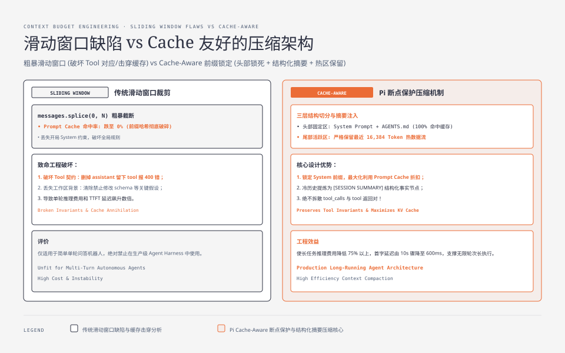
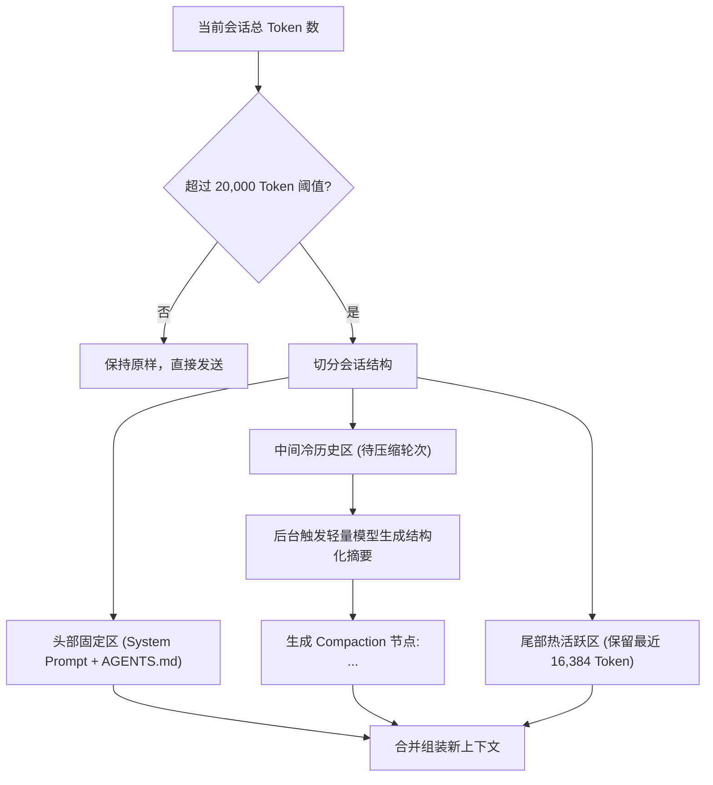
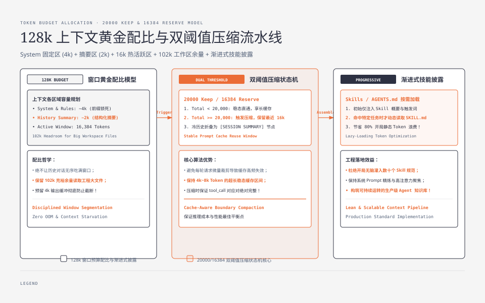

**TL;DR：** 很多人以为大模型拥有 128k 甚至 1M 的上下文窗口，Agent 就可以无所顾忌地堆砌历史对话。然而在现实工程中，**上下文越长，单轮推理费用呈平方级上升、首字延迟（TTFT）急剧恶化、模型的注意力在中间区域（Lost in the Middle）迅速衰减**。更严重的是，粗暴的“直接砍掉前 $N$ 条历史”会破坏系统提示词、丢失关键环境假设，并且**彻底摧毁模型的 KV Cache（Prompt Cache）**，导致每轮请求都要以全额价格重新计算前缀。本文作为《Pi Agent 实战通才教程》第四课，深入拆解 Pi 的 **`16384 reserve / 20000 keep` 双阈值压缩算法**、**Cache-Aware 断点保护策略**，以及 **AGENTS.md / Skills 渐进披露装配机制**。


---



## 一、上下文膨胀的代价：不仅是钱的问题

当一个编码任务持续 15 轮以上时，上下文会迅速从 5k Token 膨胀到 80k Token。这意味着：

1. **成本爆炸**：以 OpenAI / Anthropic 典型价格计算，不触发 Prompt Cache 的情况下，一个 80k Token 上下文的单次 Turn 仅输入成本就高达 $0.24$ 美元，一个小时的复杂重构任务可能烧掉数十美元；
2. **TTFT 延迟雪崩**：从几百毫秒飙升至 8~15 秒，实时交互体验彻底破裂；
3. **指令遵循能力退化**：长上下文中充斥着大量旧的报错日志（如 10 轮前的 `TypeError`），模型会被过时的错误信息持续误导，无法聚焦当前代码状态。

因此，**主动管理上下文生命周期（Context Compaction & Budgeting）是高级 Harness 的硬性门槛**。

---

## 二、为什么传统滑动窗口（Sliding Window）会惨败？

常见的简化压缩算法是：“当消息数超过 20 条，直接删掉最老的 10 条”。这种算法在 Agent 运行时中必然崩溃：

- **破坏工具调用对（Tool Call Invariant）**：如果刚好删掉了 `assistant (tool_calls)` 却留下了 `tool (result)`，OpenAI / Anthropic API 会直接报 `400 Invalid message sequence: tool_call_id not found`；
- **丢失系统规则与工作区背景**：开局确定的“本项目必须使用 pnpm、禁止修改 schema.prisma”等约束被无情抹除；
- **破坏 Prompt Caching 前缀**：大模型服务商（Anthropic Prompt Cache、OpenAI Prefix Cache）依赖请求前缀的字节级一致性来命中缓存（享受 50%~90% 的价格折扣与毫秒级首字延迟）。**如果在消息列表头部随机裁剪，整个前缀哈希全部失效，缓存命中率瞬间跌为 0%**。

## 三、Pi 的 Compaction 架构：两阶段与双阈值闸门

Pi 在 `packages/coding-agent/docs/compaction.md` 中设计了一套兼顾**语义保真**与 **KV Cache 命中率** 的压缩算法：



### 双阈值设计（16384 Reserve / 20000 Trigger）

- **20,000 Tokens 触发线（Keep Limit）**：会话未达到 20k Token 前绝不触发压缩，最大化利用 Prompt Cache 的长稳定窗口；
- **16,384 Tokens 保留区（Reserve Budget）**：触发压缩时，从后向前扫描，严格保留最近 **16,384 Token** 的完整消息流（包含近期的工具调用与输出），只把更早的历史折叠为一条结构化摘要。

### 结构化摘要模板（Structured Summary Schema）

摘要不是随意的一段话，而是要求模型按照特定模板提炼关键事实：

```text
[SESSION COMPACTION SUMMARY]
- 用户最初目标: 实现用户登录限流中间件
- 已修改的文件: src/middleware/rate-limit.ts, tests/rate-limit.test.ts
- 当前发现的阻碍与修复结论: Redis 哨兵模式下的重试机制已由 PR #12 修复
- 环境变量与依赖配置: REDIS_URL=redis://127.0.0.1:6379, 依赖已由 pnpm install 完成
- 待执行的后续步骤: 编写单元测试并运行 npm test 验证
```

通过结构化摘要，后续模型能够清晰知晓“之前做过什么、改过哪些文件”，而不需要在上下文中保留几万行的冗余构建日志。




## 四、动手实战：实现 Cache-Aware 上下文管理器

下面我们手写一个工业级、支持 KV Cache 断点保护的 `ContextCompactor`：

```ts
// context-compactor.ts
export interface ChatMessage {
  role: "system" | "user" | "assistant" | "tool";
  content: string | null;
  tool_calls?: any[];
  tool_call_id?: string;
  estimatedTokens?: number;
}

export class ContextCompactor {
  private static readonly KEEP_THRESHOLD = 20000;
  private static readonly RESERVE_TOKENS = 16384;

  /**
   * 估算消息的 Token 数量（生产中可接入 tiktoken，此处按字符/4粗估）
   */
  public static estimateTokens(msg: ChatMessage): number {
    const text = (msg.content ?? "") + JSON.stringify(msg.tool_calls ?? "");
    return Math.ceil(text.length / 3.5);
  }

  /**
   * 检查并执行上下文压缩
   */
  public static async compactIfNeeded(
    messages: ChatMessage[],
    summarizeFn: (toSummarize: ChatMessage[]) => Promise<string>
  ): Promise<{ messages: ChatMessage[]; compacted: boolean }> {
    let totalTokens = 0;
    for (const m of messages) {
      m.estimatedTokens = m.estimatedTokens ?? this.estimateTokens(m);
      totalTokens += m.estimatedTokens;
    }

    // 1. 未达触发阈值，直接返回
    if (totalTokens < this.KEEP_THRESHOLD) {
      return { messages, compacted: false };
    }

    // 2. 提取头部系统消息（System Prompt 必须绝对保留且保持在最前面）
    const systemMessages = messages.filter((m) => m.role === "system");
    const nonSystemMessages = messages.filter((m) => m.role !== "system");

    // 3. 从后向前累加，计算保留区边界
    let reservedTokens = 0;
    let splitIndex = nonSystemMessages.length;

    for (let i = nonSystemMessages.length - 1; i >= 0; i--) {
      const tokens = nonSystemMessages[i].estimatedTokens!;
      if (reservedTokens + tokens > this.RESERVE_TOKENS) {
        splitIndex = i + 1;
        break;
      }
      reservedTokens += tokens;
    }

    // 保证 splitIndex 不破坏 tool_call 对应关系
    while (
      splitIndex < nonSystemMessages.length &&
      nonSystemMessages[splitIndex].role === "tool"
    ) {
      splitIndex++; // 如果切割点落在 tool 结果上，往后移保证 tool_call 和 tool 不被拆散
    }

    const coldHistory = nonSystemMessages.slice(0, splitIndex);
    const hotHistory = nonSystemMessages.slice(splitIndex);

    // 如果待压缩历史太少，无需压缩
    if (coldHistory.length < 3) {
      return { messages, compacted: false };
    }

    // 4. 调用轻量模型生成摘要
    const summaryText = await summarizeFn(coldHistory);

    const summaryMessage: ChatMessage = {
      role: "user",
      content: `[Previous Context Summary]\n${summaryText}`,
    };

    const ackMessage: ChatMessage = {
      role: "assistant",
      content: "Understood. I will continue the task based on the summary and latest context.",
    };

    // 5. 组装新消息列表：System -> Summary -> Hot Recent History
    const compactedMessages: ChatMessage[] = [
      ...systemMessages,
      summaryMessage,
      ackMessage,
      ...hotHistory,
    ];

    return { messages: compactedMessages, compacted: true };
  }
}
```

## 五、渐进式装配（Progressive Disclosure）：Skills 与 AGENTS.md

除了会话历史的压缩，**系统初始提示词的装配纪律**同样决定了基础 Token 消耗：

1. **AGENTS.md 逐级继承**：
   - 全局配置（`~/.pi/AGENTS.md`） $\to$ 项目根目录（`./AGENTS.md`） $\to$ 子目录配置（`./src/AGENTS.md`）；
   - 只在 Agent 当前工作路径深入子目录时，才动态将子规则附加到上下文，不在根会话无脑载入全项目的所有文档。
2. **Skills 的渐进披露（Two-Stage Skill Loading）**：
   - **第一阶段（启动时）**：系统提示词中只注入 Skills 的**单行名称与摘要**（消耗不足 200 Token）；
   - **第二阶段（按需加载）**：当模型决定使用某个 Skill 时，通过执行 `read_skill("deploy-k8s")` 动态读取完整的说明文件与脚本范例进上下文。

## 六、小结与课后自检

在第四课中，我们掌握了上下文工程与长任务预算治理的核心技术：
1. **拒绝无脑裁剪**：滑动窗口破坏调用对与 KV Cache 前缀；
2. **双阈值压缩机制**：20k Token 触发线保证稳定性，16k Token 保留区确保近景无损；
3. **渐进式技能装配**：单行元数据索引 + 运行时按需读取，把基础 Prompt 控制在 1000 Token 以内。

在下一课 **《05 树状持久化与崩溃自愈：JSONL 存储引擎、分支回退与残行修复》** 中，我们将深入 Agent 的状态持久层——如何用 JSONL 实现类似 Git 分支树的会话回滚，以及如何优雅自愈断电留下的残缺文件。

---

## 参考资料

- `packages/coding-agent/docs/compaction.md`：Pi 会话压缩算法规范
- Anthropic Prompt Caching & OpenAI Prefix Caching Best Practices
- `packages/coding-agent/src/core/system-prompt.ts`：提示词模板与 Skills 装配
