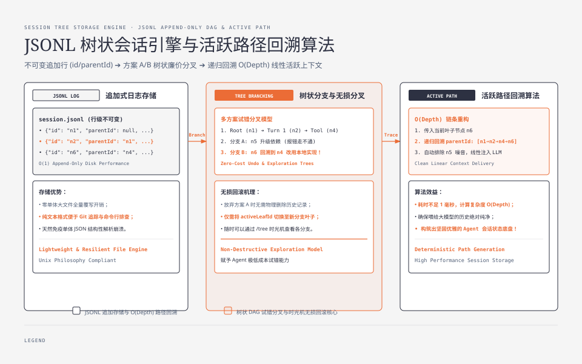
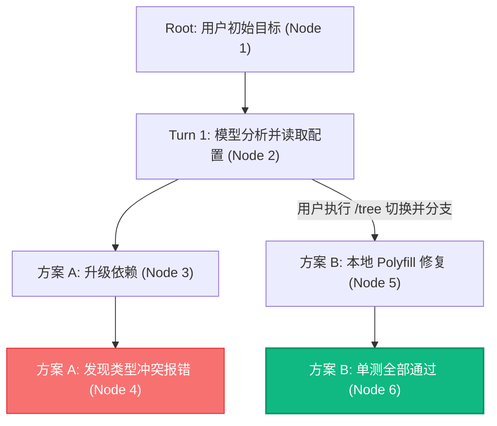
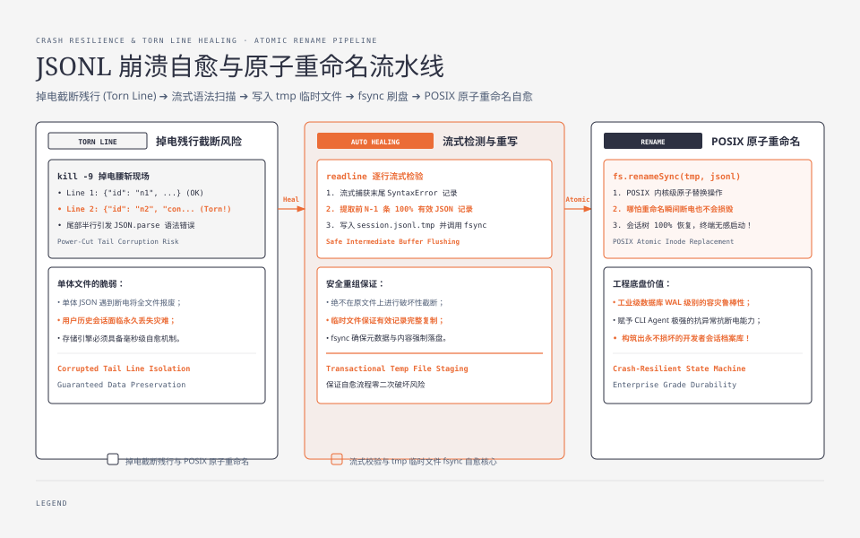
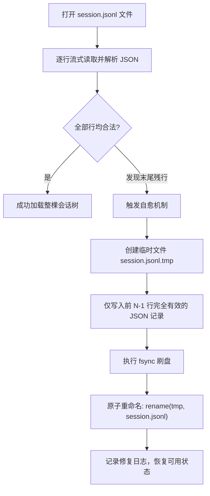

**TL;DR：** 绝大多数简易 Agent 仅把聊天记录保存在一个内存数组或一个单体 `messages.json` 里。一旦进程被杀、网络断开或者 Agent 在探索中走入了死胡同，用户只能被迫把整个会话清空重新开始。**一个生产级 Agent 的会话存储必须具备两项核心能力：支持树状分支探索（Undo / Branching）与崩溃自愈（Crash Resilience）**。Pi 在会话层开创性地采用了“**单 JSONL 文件承载整棵状态树**”的设计，并实现了毫秒级的残缺行检测与原子修复。本文作为《Pi Agent 实战通才教程》第五课，带你从零手写一个基于 JSONL 的树状会话存储引擎。


---



## 一、为什么会话必须是树，而不是线性数组？

在实际软件开发中，Agent 经常需要**试错探索**：
1. Agent 尝试使用方案 A（重构 AST），在第 5 步发现第三方库有 bug 走不通；
2. 用户希望**回到第 2 步**，命令 Agent 尝试方案 B（改用正则或模板字符串）；
3. 如果会话是线性数组，回退意味着必须把方案 A 的历史硬删除——但万一方案 B 之后又需要参考方案 A 期间查到的关键信息呢？



在树状模型下：
- **分支是廉价的**：同一个会话文件可以同时包含方案 A 与方案 B 的完整探索轨迹；
- **回滚是无损的**：通过切换当前“叶子节点指针（Leaf Pointer）”，可以在历史任意时刻分叉出新的探索路径。

---

## 二、为什么选择 JSONL（追加式日志）？

在存储选型上，很多人第一反应是用 SQLite 或单体 JSON。Pi 之所以坚持使用 **JSONL（JSON Lines）**：

| 特性 | 单体 JSON 文件 (`session.json`) | SQLite 数据库 | JSONL 追加文件 (`session.jsonl`) |
| --- | --- | --- | --- |
| **写入性能** | 每次写入必须全量重写整个大文件（$O(N)$） | 需要本地二进制驱动与锁管理 | **仅在文件末尾追加单行（$O(1)$ Append-only）** |
| **Git/网盘同步** | 每次修改全量冲突 | 二进制文件无法方便做文本 diff | **基于行的纯文本，冲突极易排查** |
| **崩溃破坏面** | 写入中断会导致整个 JSON 结构损坏解析失败 | 依赖 WAL 日志恢复 | **即使末尾半行损坏，只需截除残行即可完全恢复** |
| **外部可读性** | 格式固定但文件过大难以流式查看 | 需要专用工具打开 | **可用 `tail -f`、`grep`、`jq` 直接命令行分析** |

## 三、JSONL 树状节点设计与活跃路径回溯

在 JSONL 中，每行记录一个独立的不可变事件节点，节点之间通过 `parentId` 链接：

```json
{"id": "node_1", "parentId": null, "type": "user", "content": "帮我写个限流中间件"}
{"id": "node_2", "parentId": "node_1", "type": "assistant", "content": "好的，我先读取 package.json"}
{"id": "node_3", "parentId": "node_2", "type": "tool_call", "name": "read", "args": {"path": "package.json"}}
{"id": "node_4", "parentId": "node_3", "type": "tool_result", "content": "{\"dependencies\": {}}"}
{"id": "node_5", "parentId": "node_4", "type": "assistant", "content": "尝试升级版本..."}
{"id": "node_6", "parentId": "node_4", "type": "user", "content": "不要升级版本，改用本地实现"}
```

注意：`node_6` 的 `parentId` 指向了 `node_4`，这意味着在 `node_4` 处产生了分叉！

### 活跃路径（Active Path）重建算法

当需要将上下文喂给大模型时，只需传入当前目标叶子节点（例如 `node_6`），算法通过递归回溯 `parentId` 链条，即可在 $O(\text{Depth})$ 时间内还原出该分支的线性历史：

$$\text{Active Path}(\text{node\_6}) = [\text{node\_1} \to \text{node\_2} \to \text{node\_3} \to \text{node\_4} \to \text{node\_6}]$$

`node_5` 自然被排除在当前活跃上下文之外，但其记录依然完好保存在文件中。




## 四、崩溃自愈：处理 Torn Line 与原子重命名

在真实的操作系统环境中，掉电、笔记本合盖、强制终端关闭或 `kill -9` 可能在程序恰好写入一半字节时发生：

```text
{"id": "node_1", "parentId": null, "type": "user", "content": "hello"}
{"id": "node_2", "parentId": "node_1", "type": "assistant", "con
```
最后一行由于写盘被腰斩（Torn Line），不是合法的 JSON。

### 工业级自愈恢复流程



## 五、动手实战：手写 TreeSessionStorage

下面是完整的 TypeScript 树状会话引擎与崩溃自愈实现：

```ts
// session-tree.ts
import * as fs from "node:fs";
import * as path from "node:path";
import * as readline from "node:readline";

export interface SessionNode {
  id: string;
  parentId: string | null;
  type: "user" | "assistant" | "tool" | "compaction" | "meta";
  payload: Record<string, unknown>;
  createdAt: number;
}

export class TreeSessionStorage {
  private nodes = new Map<string, SessionNode>();
  private activeLeafId: string | null = null;

  constructor(private filePath: string) {}

  /**
   * 初始化并从文件加载，内置残行自愈
   */
  public async init(): Promise<void> {
    if (!fs.existsSync(this.filePath)) {
      fs.mkdirSync(path.dirname(this.filePath), { recursive: true });
      fs.writeFileSync(this.filePath, "", "utf-8");
      return;
    }

    const fileStream = fs.createReadStream(this.filePath, { encoding: "utf-8" });
    const rl = readline.createInterface({ input: fileStream, crlfDelay: Infinity });

    const validLines: string[] = [];
    let lineIndex = 0;
    let hasTornTail = false;

    for await (const line of rl) {
      lineIndex++;
      const trimmed = line.trim();
      if (!trimmed) continue;

      try {
        const node: SessionNode = JSON.parse(trimmed);
        this.nodes.set(node.id, node);
        this.activeLeafId = node.id;
        validLines.push(trimmed);
      } catch (err) {
        // 捕获到解析错误，认定末尾存在残行
        console.warn(`[TreeSession] Detected torn line at line ${lineIndex}, initiating auto-healing...`);
        hasTornTail = true;
        break; // 停止读取后续内容
      }
    }

    // 执行原子修复
    if (hasTornTail) {
      const tmpPath = `${this.filePath}.tmp`;
      fs.writeFileSync(tmpPath, validLines.join("\n") + "\n", "utf-8");
      fs.renameSync(tmpPath, this.filePath);
      console.warn(`[TreeSession] Auto-healing complete. Preserved ${validLines.length} valid nodes.`);
    }
  }

  /**
   * 追加新节点并写入文件末尾
   */
  public appendNode(type: SessionNode["type"], payload: Record<string, unknown>, parentId?: string): SessionNode {
    const parent = parentId !== undefined ? parentId : this.activeLeafId;
    const node: SessionNode = {
      id: `node_${Date.now()}_${Math.random().toString(36).slice(2, 7)}`,
      parentId: parent,
      type,
      payload,
      createdAt: Date.now(),
    };

    this.nodes.set(node.id, node);
    this.activeLeafId = node.id;

    // 追加写入一行
    fs.appendFileSync(this.filePath, JSON.stringify(node) + "\n", "utf-8");
    return node;
  }

  /**
   * 切换当前活跃分支指针
   */
  public switchBranch(nodeId: string): void {
    if (!this.nodes.has(nodeId)) {
      throw new Error(`Node ${nodeId} does not exist in session tree.`);
    }
    this.activeLeafId = nodeId;
  }

  /**
   * 回溯获取从 Root 到当前 Leaf 的线性活跃历史
   */
  public getActivePath(): SessionNode[] {
    const path: SessionNode[] = [];
    let currentId = this.activeLeafId;

    while (currentId) {
      const node = this.nodes.get(currentId);
      if (!node) break;
      path.unshift(node);
      currentId = node.parentId;
    }

    return path;
  }
}
```

## 六、小结与课后自检

在第五课中，我们构建了生产级 Agent 必不可少的持久层与分支引擎：
1. **树状优于线性**：`id + parentId` 拓扑为重试、回滚与多分支探索提供零成本支持；
2. **追加式 JSONL**：单文件高性能写入，免除大型数据库的维护包袱；
3. **原子崩溃自愈**：断电残行自动检测 + `.tmp` 原子替换，彻底解决会话文件损坏痛点。

在下一课 **《06 多供应商网关与弹性重试：统一 API、指数退避与可中断睡眠》** 中，我们将深入模型接入层——如何抹平 15+ 供应商的 API 差异，并实现工业级的弹性重试与限流引擎。

---

## 参考资料

- `packages/coding-agent/docs/sessions.md` & `session-format.md`：Pi 会话格式规范
- Linux Atomic `rename(2)` System Call Semantics
- Append-Only Log Architecture Patterns
