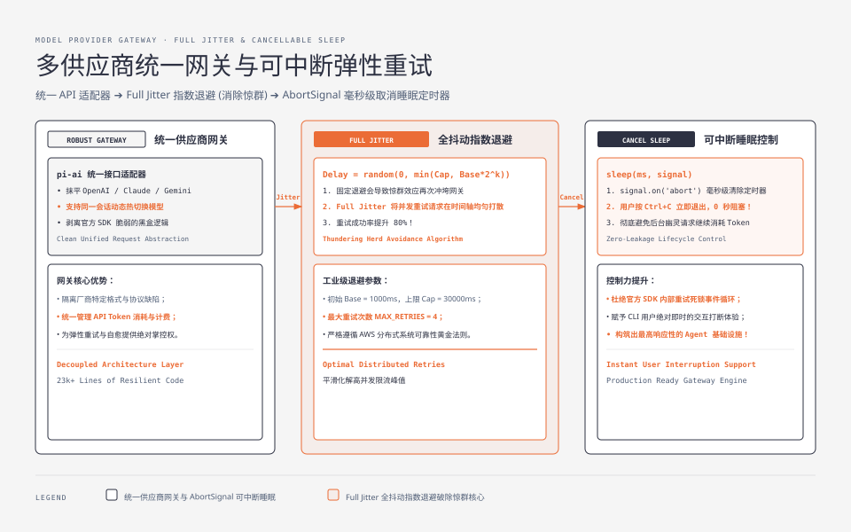
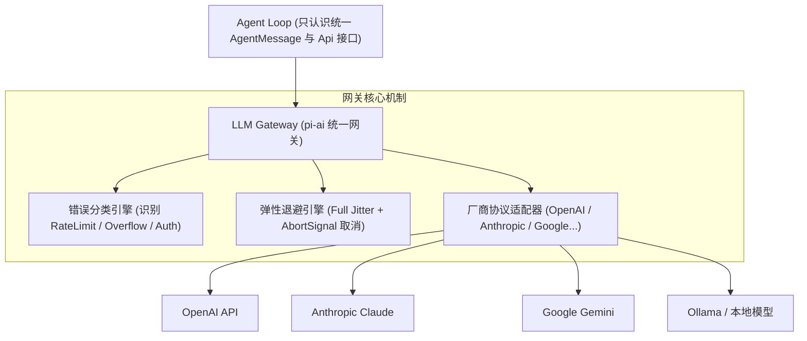
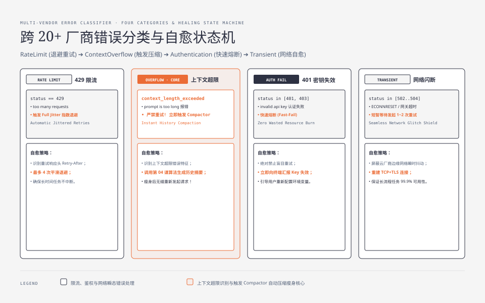

**TL;DR：** 许多开发者在写 Agent 时，直接在业务逻辑里调用 `@openai/openai` 或 `@anthropic-ai/sdk`。这种“直连官方 SDK”的做法在单次问答中看似简单，但在 Agent 连续自旋（Agent Loop）中会引发严重的工程灾难：**官方 SDK 的内部自动重试会死锁住事件循环，用户按下 Ctrl+C 无法取消正在后台沉睡的重试定时器；各家厂商对 RateLimit（429）、ContextOverflow（上下文超限）与 AuthenticationError（鉴权失败）的报错格式完全不同，导致 Harness 无法采取正确的自愈策略**。本文作为《Pi Agent 实战通才教程》第六课，带你构建一个工业级的多供应商统一网关（LLM Gateway），手写**支持 AbortSignal 可中断的带抖动指数退避引擎（Full Jitter Backoff）**与**跨厂商统一错误分类器**。


---



## 一、为什么 Agent 必须有独立的网关层（pi-ai）？

回顾 Pi 的架构图，`pi-ai` 占据了 23.5k 行代码——比核心 Loop 还要庞大。这层抽象的必要性体现在三个方面：



1. **统一生命周期与信号取消（Cancellable Sleep）**：当网络抖动触发 429 退避（例如需等待 10 秒后重试），用户如果在第 2 秒按下了中断，网关必须**毫秒级释放定时器并终止网络套接字**，而不是让后台进程继续死等；
2. **多模型热切换（Dynamic Hot Swapping）**：在同一个会话中，用户可能在第 1 轮用 Claude 3.7 Sonnet 进行深度规划，第 2 轮用 GLM 4 / Qwen 执行低成本工具调用。上层业务代码无需关心底层 SDK 的初始化细节；
3. **精准的错误分类与自愈**：当遇到“上下文超限”时，Harness 需要自动触发第 04 课的 Compaction；当遇到“余额不足”时，应提示用户充值而非盲目重试。




## 二、弹性重试：Full Jitter 指数退避与可中断睡眠

### 1. 为什么固定退避会导致惊群效应（Thundering Herd）？

如果多个并发任务在遇到限流时都采用简单的固定等待 $T = 2^k$ 秒，所有请求会在同一瞬间同时苏醒并再次冲垮 API 网关。
AWS 架构师推荐的最佳实践是 **Full Jitter（全抖动指数退避）**：

$$\text{Delay} = \text{random}(0, \min(\text{Cap}, \text{Base} \times 2^{\text{attempt}}))$$

### 2. 带 AbortSignal 的可中断睡眠代码实现

```ts
// cancellable-sleep.ts
export function sleep(ms: number, signal?: AbortSignal): Promise<void> {
  return new Promise((resolve, reject) => {
    if (signal?.aborted) {
      return reject(new Error("Operation aborted before sleep."));
    }

    let timer: NodeJS.Timeout | null = null;

    const onAbort = () => {
      if (timer) clearTimeout(timer);
      reject(new Error("Operation aborted during sleep."));
    };

    timer = setTimeout(() => {
      signal?.removeEventListener("abort", onAbort);
      resolve();
    }, ms);

    signal?.addEventListener("abort", onAbort, { once: true });
  });
}
```

## 三、跨 20+ 家厂商的错误分类器（Error Classifier）

各模型厂商的报错信息千奇百怪：
- OpenAI 返回：`status: 400, code: "context_length_exceeded"`；
- Anthropic 返回：`status: 400, type: "invalid_request_error", message: "prompt is too long"`；
- 某些第三方中转甚至直接返回 HTTP 500 HTML 页面。

我们需要将这些原生错误映射为 4 种**标准意图类型**：

```ts
// error-types.ts
export enum ErrorCategory {
  RateLimit = "RATE_LIMIT",             // 429 限流 -> 自动指数退避重试
  ContextOverflow = "CONTEXT_OVERFLOW", // 上下文超限 -> 触发 Compaction 压缩
  Authentication = "AUTHENTICATION",   // 401 密钥失效 -> 立即终止，不重试
  Transient = "TRANSIENT",             // 502/503/504 网络短暂故障 -> 重试
  Fatal = "FATAL",                     // 语法错误/未知异常 -> 终止并提示用户
}
```

---

## 四、动手实战：手写 RobustModelGateway

下面是工业级多供应商网关的完整 TypeScript 实现：

```ts
// model-gateway.ts
import { sleep } from "./cancellable-sleep";
import { ErrorCategory } from "./error-types";

export interface GatewayRequest {
  provider: string;
  model: string;
  apiKey: string;
  messages: Array<{ role: string; content: string }>;
  signal?: AbortSignal;
}

export interface GatewayResponse {
  content: string;
  usage?: { promptTokens: number; completionTokens: number };
}

export class RobustModelGateway {
  private static readonly MAX_RETRIES = 4;
  private static readonly BASE_DELAY_MS = 1000;
  private static readonly MAX_DELAY_MS = 30000;

  /**
   * 跨厂商错误模式识别
   */
  public static classifyError(err: any): ErrorCategory {
    const status = err?.status ?? err?.response?.status;
    const msg = (err?.message ?? "").toLowerCase();

    if (status === 429 || msg.includes("rate limit") || msg.includes("too many requests")) {
      return ErrorCategory.RateLimit;
    }

    if (
      status === 401 ||
      status === 403 ||
      msg.includes("invalid api key") ||
      msg.includes("authentication")
    ) {
      return ErrorCategory.Authentication;
    }

    if (
      msg.includes("context length") ||
      msg.includes("context_length_exceeded") ||
      msg.includes("prompt is too long") ||
      msg.includes("token limit")
    ) {
      return ErrorCategory.ContextOverflow;
    }

    if (status === 502 || status === 503 || status === 504 || msg.includes("timeout") || msg.includes("econnreset")) {
      return ErrorCategory.Transient;
    }

    return ErrorCategory.Fatal;
  }

  /**
   * 执行带可中断退避的弹性调用
   */
  public async executeWithRetry(
    req: GatewayRequest,
    sender: (req: GatewayRequest) => Promise<GatewayResponse>
  ): Promise<GatewayResponse> {
    let attempt = 0;

    while (attempt <= RobustModelGateway.MAX_RETRIES) {
      if (req.signal?.aborted) {
        throw new Error("Request aborted by user.");
      }

      try {
        return await sender(req);
      } catch (err: any) {
        attempt++;
        const category = RobustModelGateway.classifyError(err);

        // 1. 不可重试错误：立即向上抛出
        if (category === ErrorCategory.Authentication || category === ErrorCategory.Fatal) {
          throw err;
        }

        // 2. 上下文超限：附加分类信息抛出给上层 Loop 处理压缩
        if (category === ErrorCategory.ContextOverflow) {
          err._category = ErrorCategory.ContextOverflow;
          throw err;
        }

        // 3. 超出最大重试次数
        if (attempt > RobustModelGateway.MAX_RETRIES) {
          throw new Error(`Max retries (${RobustModelGateway.MAX_RETRIES}) exceeded. Last error: ${err.message}`);
        }

        // 4. 计算 Full Jitter 延迟
        const maxExpDelay = Math.min(
          RobustModelGateway.MAX_DELAY_MS,
          RobustModelGateway.BASE_DELAY_MS * Math.pow(2, attempt)
        );
        const jitteredDelay = Math.floor(Math.random() * maxExpDelay);

        console.warn(
          `[Gateway] Encountered ${category} (attempt ${attempt}/${RobustModelGateway.MAX_RETRIES}), waiting ${jitteredDelay}ms before retry...`
        );

        // 5. 执行可中断休眠
        await sleep(jitteredDelay, req.signal);
      }
    }

    throw new Error("Unreachable state in gateway retry loop.");
  }
}
```

## 五、小结与课后自检

在第六课中，我们掌握了构建高可靠 LLM 接入层的核心工程实践：
1. **解除 SDK 强耦合**：将模型调用与业务状态机彻底解耦，为多模型切换铺平道路；
2. **Full Jitter + 可取消定时器**：有效抵御并发限流，且绝不阻碍用户的实时中断操作；
3. **确定性错误分类**：精准引导上层完成鉴权拦截、重试退避与上下文压缩。

在下一课 **《07 进程内扩展与自修改闭环：生命周期钩子、权限门禁与 /reload》** 中，我们将深入 Agent 的扩展系统——如何用 TypeScript 钩子在不修改核心代码的前提下构建 Plan-Mode、权限门禁，并实现 Agent 自修改与热重载闭环。

---

## 参考资料

- `packages/ai/src/`（23.5k 行）：Pi 的统一供应商层与重试逻辑
- AWS Architecture Blog: *Exponential Backoff And Jitter*
- AbortController & AbortSignal Web API Specification
