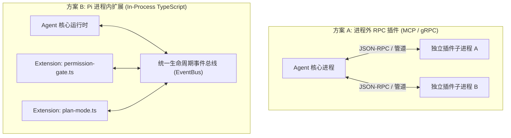
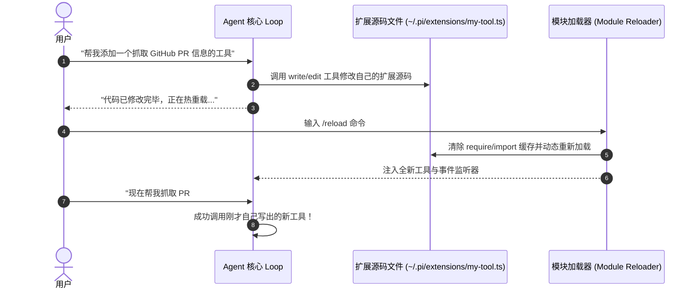

**TL;DR：** 很多 Agent 平台试图通过复杂的外部 RPC 协议（如 gRPC、标准 MCP 进程间通信）来实现扩展。这种设计虽然隔离性好，但带来了极高的进程管理成本、序列化时延，并且扩展无法深度干预 Agent 的内部生命周期。Pi 采取了截然相反的**进程内扩展哲学（In-Process Extension Model）**：扩展就是一个普通的 TypeScript 模块，与 Agent Loop 共享同一进程与内存堆，通过订阅 5 组全生命周期事件（Startup / Session / Agent / Message / Tool）实现极致的干预能力。本文作为《Pi Agent 实战通才教程》第七课，手把手带你实现**生命周期事件总线**、编写 **34 行权限拦截门禁** 与 **Plan-Mode 插件**，并跑通 **Agent 自修改（Self-Modifying）与 `/reload` 热加载闭环**。

## 一、架构选型：进程内扩展 vs 进程外 RPC

对比两种主流扩展架构：



| 维度 | 进程外 RPC 模式 (MCP / IPC) | 进程内 TypeScript 模式 (Pi) |
| --- | --- | --- |
| **通信开销** | 每次调用产生跨进程序列化与 IPC 延迟 | **零开销内存函数调用与事件分发** |
| **生命周期干预** | 只能被动暴露工具（Tool），无法拦截 Turn 循环 | **可直接拦截会话分支、修改 Prompt、重写工具入参** |
| **UI 交互能力** | 难以无缝嵌入 TUI 交互界面 | **可直接调用 `ctx.ui.select` 弹出交互菜单** |
| **代码自修改** | 依赖复杂的外部部署与守护进程重载 | **Agent 自己修改扩展源码后，一条 `/reload` 毫秒级热加载** |

Pi 的核心定论是：**对于单机个人开发者与团队工作流，进程内原生扩展以极低的开发成本提供了最强大的自省与定制能力。**

## 二、5 组全生命周期事件流设计

扩展之所以强大，是因为它与第 01 课中的 Agent Loop 紧密对齐。Pi 定义了 5 组关键事件：

```ts
// extension-types.ts
export interface ExtensionAPI {
  on(event: "session_start", handler: (ctx: SessionContext) => Promise<void> | void): void;
  on(event: "before_turn", handler: (turn: TurnContext) => Promise<void> | void): void;
  on(event: "tool_call", handler: (ev: ToolCallEvent, ctx: ExecutionContext) => Promise<ToolCallDecision | void>): void;
  on(event: "tool_result", handler: (ev: ToolResultEvent) => Promise<void> | void): void;
  on(event: "session_end", handler: () => Promise<void> | void): void;
  
  registerTool(tool: CustomToolDefinition): void;
  sendUserMessage(text: string): Promise<void>;
  ui: {
    select(prompt: string, choices: string[]): Promise<string>;
    confirm(prompt: string): Promise<boolean>;
  };
}

export interface ToolCallDecision {
  block?: boolean;
  reason?: string;
  modifiedArgs?: Record<string, unknown>;
}
```

## 三、动手实战 1：34 行写出权限拦截门禁（Permission Gate）

在第 08 篇架构解析中提到过，应用层门禁虽然不能替代沙箱，但能有效防止开发者手滑误删数据。下面是完整的扩展源码：

```ts
// extensions/permission-gate.ts
import { ExtensionAPI } from "../extension-types";

export default function (pi: ExtensionAPI) {
  // 危险命令正则表达式家族
  const dangerousPatterns = [
    /\brm\s+(-rf?|--recursive)/i,
    /\bsudo\b/i,
    /\b(chmod|chown)\b.*777/i,
    /\bdrop\s+database\b/i,
    /\bgit\s+reset\s+--hard\b/i,
  ];

  pi.on("tool_call", async (event, ctx) => {
    // 仅拦截终端命令执行
    if (event.toolName !== "bash") return undefined;

    const command = String(event.input?.command ?? "");
    const isDangerous = dangerousPatterns.some((pattern) => pattern.test(command));

    if (isDangerous) {
      // 1. 无终端交互环境（如自动化脚本/CI模式）：安全起见直接拒绝
      if (!ctx.hasUI) {
        return {
          block: true,
          reason: `Dangerous command '${command}' was automatically blocked in non-interactive environment.`,
        };
      }

      // 2. 交互式终端环境：弹出确认菜单
      const choice = await ctx.ui.select(
        `⚠️  [Security Alert] The model requested a destructive command:\n\n    \x1b[31m${command}\x1b[0m\n\nAllow execution?`,
        ["No (Block)", "Yes (Allow Once)"]
      );

      if (choice !== "Yes (Allow Once)") {
        return {
          block: true,
          reason: "Command execution was rejected by the user.",
        };
      }
    }

    return undefined; // 放行执行
  });
}
```

## 四、动手实战 2：实现 Plan-Mode（计划模式扩展）

很多商业 Agent 把 Plan Mode 作为核心内置卖点。在 Pi 中，这仅仅是一个轻量扩展：

```ts
// extensions/plan-mode.ts
import { ExtensionAPI } from "../extension-types";

export default function (pi: ExtensionAPI) {
  let isPlanModeActive = false;

  // 1. 注册专用的 /plan 切换工具
  pi.registerTool({
    name: "toggle_plan_mode",
    description: "Toggle Plan Mode on or off.",
    parameters: { enabled: { type: "boolean" } },
    execute: async ({ enabled }) => {
      isPlanModeActive = Boolean(enabled);
      return `Plan mode is now ${isPlanModeActive ? "ENABLED" : "DISABLED"}.`;
    },
  });

  // 2. 在每轮 Turn 开始前注入约束提示词
  pi.on("before_turn", async (turn) => {
    if (isPlanModeActive) {
      turn.appendSystemPrompt(
        "\n[PLAN MODE ACTIVE]\nYou must only analyze and create step-by-step implementation plans in markdown. DO NOT execute destructive edits or mutating bash commands."
      );
    }
  });

  // 3. 在计划模式下强制拦截所有写操作
  pi.on("tool_call", async (event) => {
    if (isPlanModeActive && (event.toolName === "write" || event.toolName === "edit")) {
      return {
        block: true,
        reason: "Modifications are blocked in Plan Mode. Please provide the plan to the user first.",
      };
    }
  });
}
```

## 五、自修改闭环：让 Agent 改自己的代码并 `/reload`

Pi 架构中最震撼的设计在于 **“Self-Modifying Loop（自修改闭环）”**：



### 热重载的实现原理

在 Node.js 中，通过清空模块缓存即可在毫秒级实现热重载：

```ts
// extension-loader.ts
export class ExtensionLoader {
  private loadedModules: string[] = [];

  public async reloadExtensions(extensionPaths: string[], api: ExtensionAPI): Promise<void> {
    // 1. 清理已有事件监听器
    api.resetListeners();

    for (const extPath of extensionPaths) {
      const resolved = require.resolve(extPath);
      // 2. 抹除 Node.js 的模块缓存
      delete require.cache[resolved];

      // 3. 重新导入并执行初始化函数
      const module = await import(`${resolved}?t=${Date.now()}`);
      const initFn = module.default || module;
      if (typeof initFn === "function") {
        await initFn(api);
      }
    }
  }
}
```

## 六、小结与课后自检

在第七课中，我们掌握了 Harness 扩展系统的设计精髓：
1. **进程内事件流**：5 组生命周期钩子让扩展拥有对 Prompt、工具与会话的完全控制权；
2. **功能全部可后装**：无论是 34 行的权限门禁还是复杂的 Plan-Mode，均无需修改核心包代码；
3. **自修改闭环**：通过热重载机制，赋予 Agent 动态扩展自身工具箱与工作流的无限进化能力。

在下一课 **《08 物理沙箱与生产安全：BashOperations、微虚拟机与提示词注入防御》** 中，我们将深入真实生产环境的安全防线——如何结合微虚拟机（Gondolin）与容器打造坚不可摧的执行沙箱。

---

## 参考资料

- `packages/coding-agent/docs/extensions.md`（3001 行）：Pi 官方扩展系统手册
- `packages/coding-agent/examples/extensions/`（79 个官方示例）：包含权限门禁、计划模式与子 Agent 范例
- Node.js Module Caching & Dynamic ESM Import Specifications
