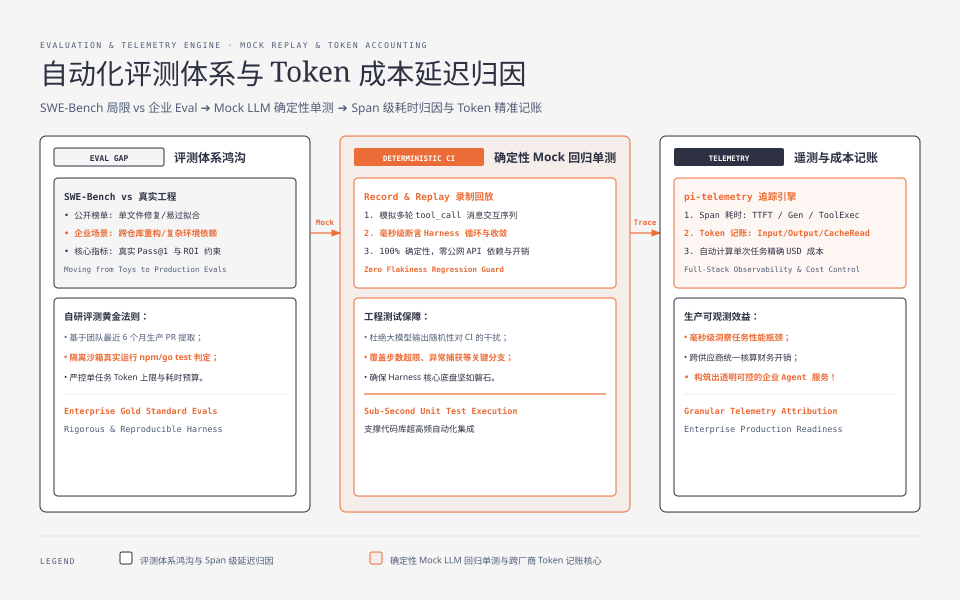
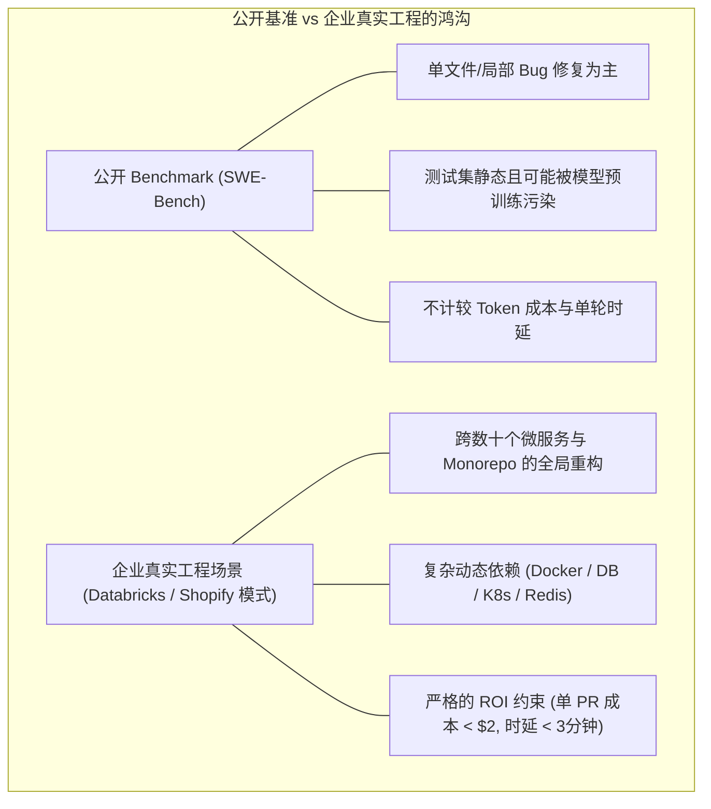
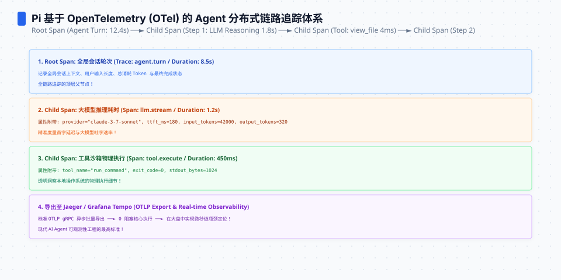
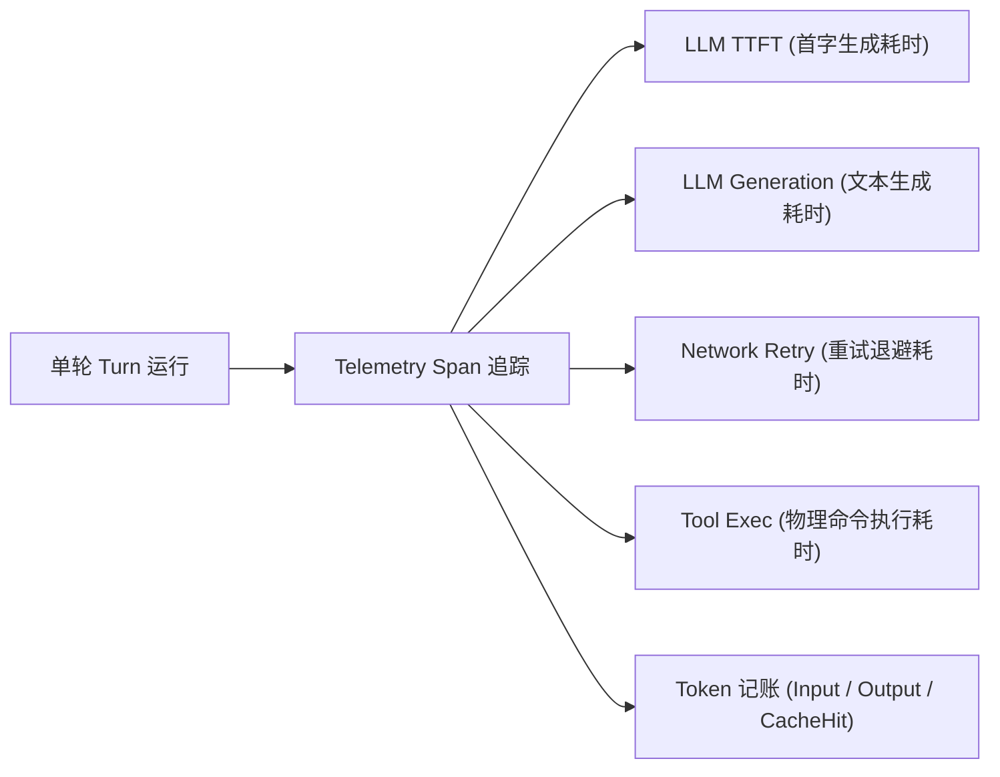
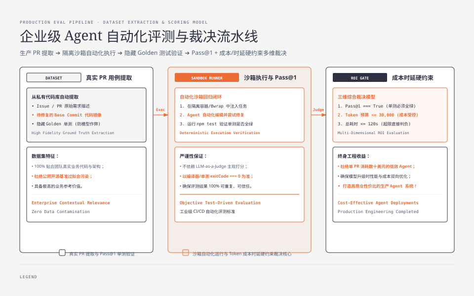
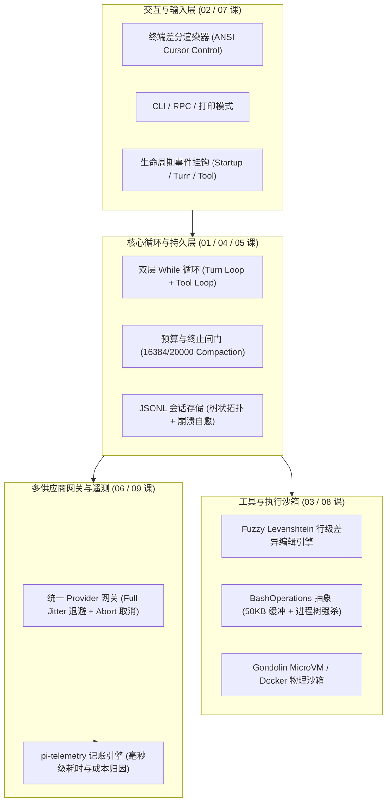

**TL;DR：** 能够写出跑通单个任务的 Agent 原型，和能够在企业级生产环境中持续迭代一个高可靠的 Agent 系统，其间横跨着一条巨大的工程鸿沟——**评测体系（Evaluation Pipeline）与成本遥测（Telemetry）**。依赖公网公开的 SWE-Bench 基准容易陷入“为榜单过拟合”的陷阱；缺乏毫秒级的全链路追踪，你永远不知道为什么某一轮任务突然耗时 40 秒、花了 $2 美元。本文作为《Pi Agent 实战通才教程》的收官终篇，带你构建**确定性 Mock 回归单测套件**、拆解企业级真实任务评测集的设计原则，并手把手实现 `pi-telemetry` **跨厂商 Token 记账与延迟归因引擎**，最后对全套 9 课的架构体系进行通盘复盘。


---



## 一、为什么公开 Benchmark（如 SWE-Bench）无法保证企业落地？

在评估 Coding Agent 时，很多团队过度迷信 SWE-Bench。但在工业级私有代码库中，SWE-Bench 的局限性非常明显：



### 企业自研评测集的黄金法则（Gold Standard Evals）

正如 Databricks 与 Shopify 的实践所揭示，真正有效的 Agent 评测集应该具备以下特征：
1. **真实 PR 提取**：从团队最近 6 个月合并的高质量 PR 中提取真实任务；
2. **全流程测试执行**：不只比对代码文本 Diff，必须在隔离沙箱中真实执行 `npm test` 或 `go test` 并以测试全绿作为 Pass@1 判定标准；
3. **成本与步数硬约束**：设置单任务 Token 消耗上限与耗时阈值，超过预算即使测试通过也标记为失败（Timeout / Cost Budget Exceeded）。




## 二、确定性回归测试：如何给 Agent 写单测？

大模型的输出是不确定的，直接连公网 API 跑 CI 会导致测试极其不稳定（Flaky）且消耗资金。工业级的做法是**基于 Mock Provider 录制与回放（Record & Replay）**。

### 动手实战：编写确定性 Agent 单元测试

```ts
// tests/agent-harness.test.ts
import { describe, it, expect } from "vitest";
import { RobustAgentHarness } from "../harness-core";
import { Message, Tool } from "../types";

describe("Agent Harness Core Execution Loop", () => {
  it("should handle tool execution and successfully converge in 2 turns", async () => {
    // 1. 模拟一个读取配置并给出结论的 Mock LLM 序列
    const mockResponses: Message[] = [
      // Turn 1: 模型决定调用 read 工具
      {
        role: "assistant",
        content: null,
        tool_calls: [
          {
            id: "call_001",
            name: "read_config",
            arguments: { key: "database_port" },
          },
        ],
      },
      // Turn 2: 收到工具结果后，模型给出最终答案，收敛退出
      {
        role: "assistant",
        content: "Database port is configured to 5432.",
      },
    ];

    let callCount = 0;
    const mockCallLLM = async (_msgs: Message[]): Promise<Message> => {
      const resp = mockResponses[callCount];
      callCount++;
      return resp;
    };

    // 2. 注册可执行的测试工具
    const testTools: Tool[] = [
      {
        name: "read_config",
        description: "Read configuration value",
        parameters: { key: { type: "string" } },
        execute: async (args) => {
          if (args.key === "database_port") return "5432";
          return "unknown";
        },
      },
    ];

    // 3. 执行 Harness
    const harness = new RobustAgentHarness(testTools, mockCallLLM);
    const result = await harness.execute(
      [{ role: "user", content: "What is the db port?" }],
      { sessionId: "test_session_1", maxTurns: 5 }
    );

    // 4. 断言结果与执行步数
    expect(result).toBe("Database port is configured to 5432.");
    expect(callCount).toBe(2);
  });
});
```

通过这种确定性 Mock 测试，你可以在秒级完成对 Harness 循环、终止闸门、错误回填与事件派发逻辑的 100% 覆盖测试。

## 三、全链路遥测：pi-telemetry 成本与延迟归因引擎

在生产环境中，每次 Agent 运行都需要对两项核心指标进行毫秒级归因：
1. **时间去哪了（Latency Attribution）**：是模型生成慢、网络重试等待久、还是本地 `npm test` 执行卡住？
2. **钱花在哪里（Cost Ledger）**：计算 Input Token、Output Token 以及 Cache Read / Cache Write 的精确账单。



### 动手实战：手写 TelemetryCollector

```ts
// telemetry.ts
export interface TelemetrySpan {
  id: string;
  name: "llm_call" | "tool_execution" | "compaction" | "network_retry";
  startTimeMs: number;
  durationMs?: number;
  metadata?: Record<string, unknown>;
}

export interface TokenUsageRecord {
  provider: string;
  model: string;
  inputTokens: number;
  outputTokens: number;
  cacheReadTokens: number;
  costUsd: number;
}

export class TelemetryCollector {
  private spans: TelemetrySpan[] = [];
  private totalCostUsd = 0;
  private totalInputTokens = 0;
  private totalOutputTokens = 0;

  // 各模型百万 Token 定价表 (Input / CacheHit / Output)
  private static readonly MODEL_RATES: Record<string, [number, number, number]> = {
    "gpt-4o": [2.5, 1.25, 10.0],
    "claude-3-7-sonnet": [3.0, 0.3, 15.0],
    "glm-4-plus": [1.0, 0.2, 1.0],
    "deepseek-v3": [0.27, 0.07, 1.1],
  };

  public startSpan(name: TelemetrySpan["name"], metadata?: Record<string, unknown>): TelemetrySpan {
    const span: TelemetrySpan = {
      id: `span_${Date.now()}_${Math.random().toString(36).slice(2, 6)}`,
      name,
      startTimeMs: Date.now(),
      metadata,
    };
    this.spans.push(span);
    return span;
  }

  public endSpan(span: TelemetrySpan, extraMetadata?: Record<string, unknown>): void {
    span.durationMs = Date.now() - span.startTimeMs;
    if (extraMetadata) {
      span.metadata = { ...span.metadata, ...extraMetadata };
    }
  }

  public recordTokenUsage(record: {
    provider: string;
    model: string;
    inputTokens: number;
    outputTokens: number;
    cacheReadTokens?: number;
  }): number {
    const rates = TelemetryCollector.MODEL_RATES[record.model] ?? [2.0, 0.5, 8.0];
    const cacheTokens = record.cacheReadTokens ?? 0;
    const nonCacheInput = Math.max(0, record.inputTokens - cacheTokens);

    // 计算实际花费
    const cost =
      (nonCacheInput / 1_000_000) * rates[0] +
      (cacheTokens / 1_000_000) * rates[1] +
      (record.outputTokens / 1_000_000) * rates[2];

    this.totalCostUsd += cost;
    this.totalInputTokens += record.inputTokens;
    this.totalOutputTokens += record.outputTokens;

    return cost;
  }

  public generateReport(): string {
    const toolTime = this.spans
      .filter((s) => s.name === "tool_execution")
      .reduce((acc, s) => acc + (s.durationMs ?? 0), 0);

    const llmTime = this.spans
      .filter((s) => s.name === "llm_call")
      .reduce((acc, s) => acc + (s.durationMs ?? 0), 0);

    return `
=== Session Telemetry Report ===
Total Cost:        $${this.totalCostUsd.toFixed(4)} USD
Total Input:       ${this.totalInputTokens} tokens
Total Output:      ${this.totalOutputTokens} tokens
Total LLM Time:    ${(llmTime / 1000).toFixed(2)}s
Total Tool Time:   ${(toolTime / 1000).toFixed(2)}s
Total Spans:       ${this.spans.length} recorded
================================`;
  }
}
```




## 四、全教程通盘复盘：生产级 Agent Harness 架构全景

恭喜！通过本教程 9 篇的高强度实战，你已经亲手攻克了构建现代生产级 Agent Harness 的全部核心难关。让我们在一张全景图里回顾整个架构体系：



### 生产级 Agent 构建的核心方法论

1. **从状态机出发，而非从 Prompt 出发**：把 Agent 的核心视为严密的确定性状态机，Prompt 只是状态转移的建议输入；
2. **把装配权交给确定性的代码**：严格控制系统提示词大小（<1000 Token），采用 Skills 渐进披露与 Cache-Aware 压缩算法，杜绝 Token 浪费；
3. **采用追加式日志（Append-only JSONL）与树状数据结构**：赋予 Agent 探索、分支与后悔药（Undo）能力，同时用原子修复对抗崩溃；
4. **把功能留给扩展，把安全留给系统**：通过轻量进程内事件钩子实现无限定制，通过物理容器和微虚拟机守住安全底线；
5. **依靠真实评测与全链路遥测驱动迭代**：建立确定性 Mock 回归单测，用精确的 Token 成本与耗时指标指导架构调优。

---

## 参考资料

- `packages/telemetry/`（935 行）：Pi 官方遥测契约与成本跟踪源码
- Databricks Engineering: *Benchmarking Coding Agents on Million-Line Codebases*
- SWE-Bench: *Can Language Models Resolve Real-World GitHub Issues?*
- OpenTelemetry Specification for Tracing & Metrics
