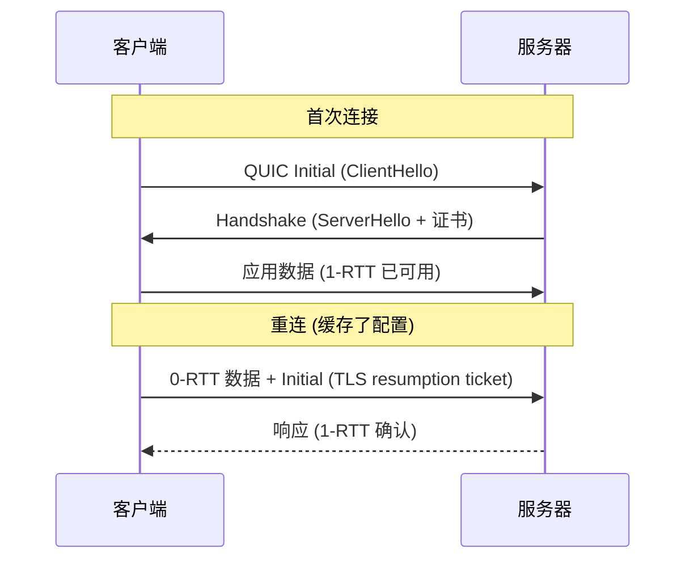

**TL;DR：** QUIC 不是"更快更稳的 TCP"，它是把 TCP+TLS+HTTP 的职责**重新分配到用户态和 UDP 之上**的重构。三笔账：①**队头阻塞被挪走而非消除**——HTTP/2 的队头阻塞没被解决，只是从"TCP 字节流层"上移到了"QUIC 独立流层"，让一条流丢包不堵其他流；②**0-RTT 是拿安全换速度**——首次连接握手 1-RTT（合并了 TLS 1.3），重连时 0-RTT 可发送但面临重放攻击，必须限制幂等请求；③**连接迁移是 Connection ID 的发明**——连接不再绑定四元组，换 Wi-Fi/移动网络不重建握手。本文用 `curl --http3` + `tcpdump` 把三笔账可视化。

## 一、先分清：QUIC 到底重写了什么

HTTP/2 的队头阻塞常常被误讲成"多路复用的请求排队问题"。真实机制是：HTTP/2 把多条请求复用到**一条 TCP 连接**上，每条请求是独立流（stream）；但 TCP 是**有序字节流**——第 3 号流的包丢了，TCP 收不到第 3 号流，**2 号流的后续包也得在接收缓冲区里等着**（虽然它们没丢）。丢包的代价被 TCP 的全局有序性摊给了所有流。

QUIC 把"可靠传输 + 多路复用"搬到 UDP 上重写：**每一条流独立编号、独立确认、独立重传**，流的边界进入传输层：

```
TCP + HTTP/2:      [ TCP 段: 字节流 1,2,3,... ]  ← 丢一个字节, 整条流卡住
QUIC + HTTP/3:     [ 流1 数据 ] [ 流2 数据 ] [ 流3 数据 ]  ← 丢流2的包, 流1/3照常
```

所以准确的说法是：**HTTP/2 的队头阻塞没被解决，它只是被 QUIC 从"连接级"降级成了"流级"**——一条流丢包，其他流不受影响。代价？QUIC 必须在应用层维护乱序重组与确认逻辑（这曾是内核的活），于是：

- QUIC 的逻辑**跑在用户态**（库里，如 quiche/ngtcp2），升级协议版本不升级内核。
- 每包都要带**连接 ID + 流 ID + 偏移 + 确认号**，包头比 TCP 段大，小请求的协议开销占比升高。

## 二、握手账：1-RTT 建立连接，0-RTT 重建连接

TLS 1.3 把"TCP 握手 + TLS 握手"合并，QUIC 在此基础上再合一步：**首次连接 1-RTT**（ClientHello → ServerHello+证书+配置），重连 0-RTT（客户端缓存的服务器配置直接发请求）。



0-RTT 的快是真的，但它是**拿重放风险换的**：0-RTT 数据在服务器确认连接身份**之前**到达，攻击者可以把这段密文原样重放给服务器。所以：

- **RFC 9001 明确要求**：0-RTT 只能用于幂等请求（GET、缓存读取）。
- 服务器侧要对 0-RTT 做去重（服务器收到 ticket 建立 anti-replay cache）。
- **0-RTT 的节省在已建立的连接上不存在**——它只省"重连"这一场景的 RTT。

一句话记：**QUIC 的快不是每时每刻快，是"换网络时不断连"和"重连时不重握"这两个场景快**。

## 三、迁移账：Connection ID 让连接不认识网络

TCP 的连接身份是**四元组**（srcIP:port, dstIP:port）——换 Wi-Fi，IP 变了，连接立刻断裂，应用必须重连重握。QUIC 的连接身份是 **Connection ID**（客户端随机生成，写在每个包里），四元组只是"当前投递地址"：

```
换网瞬间:
旧 IP 上的连接  →  连接 ID 不变  →  新 IP 直接发新包  →  服务器认可, 连接继续
TCP 的换网    →  四元组失效   →  必须重连, 重新握手, 至少一个 RTT
```

这解决了移动场景最痛的"切换网络断连"问题。代价账也在这：**Connection ID 是明文在包的公开头部**，中间设备（NAT、LB）无法再靠五元组做会话关联，负载均衡器必须支持按 Connection ID 路由（或固定服务器），否则迁移直接失效——**QUIC 把"连接保持"从网络设备手里拿回了应用手里**，这对基础设施是重构级别的改变。

## 四、复现：把三笔账抓出来

```bash
# 1. 确认可用性
curl --http3-only https://cloudflare-quic.com/ -o /dev/null -w "%{http_version}\n"

# 2. 抓包看 UDP 与 Connection ID（过滤 UDP 443）
sudo tcpdump -i en0 -n -v udp port 443 -c 50
# 报文里能看到 8 字节 Connection ID、Packet Number、Stream ID
```

`curl --http3-only` 会打印 `HTTP/3`；tcpdump 输出里，**QUIC 报文头的 `dcid`（destination connection id）在换网络前后保持不变**——这就是迁移账的证据。想看 0-RTT，用 `--http3 --tls-max 1.3` 二次连接，配合 `tcpdump` 看第二次握手是否跳过 ServerHello 直接发应用数据。

```bash
# 模拟丢一条流的包，观察其他流（用 h2load/quiche 客户端较麻烦，这里给思路）
# 关键实验：同一连接两条流，故意丢其中一条的包 → 另一条流的吞吐不受影响
# 而 HTTP/2 在同样丢包下，两条流一起掉吞吐（对比实验见 quiche 的 demo）
```

诚实标注：**"流独立"的收益在上行链路丢包率低时几乎不可见**（0.01% 丢包下两种协议差距微小），它主要赢在"高丢包、长肥管道"的移动网络——这也是为什么 2026 年的互联网基础设施大规模铺 QUIC，但内网服务却几乎无人迁移：**它的账是写给公网移动用户的**。

## 五、部署账：谁来接这个新协议

| 维度 | 在 QUIC 侧 | 在 TCP 侧 |
| :--- | :--- | :--- |
| 协议实现 | 用户态库（quiche、ngtcp2、aioquic） | 内核（Linux 发行版自带） |
| 中间设备 | LB/防火墙要认 Connection ID | 五元组即可 |
| 升级路径 | 更新库即升级 | 升级内核才换版本 |
| 调试 | 抓包工具（wireshark）需解析 QUIC | tcpdump 原生支持 |

对普通业务：**如果用户主要走公网 + 移动网络，QUIC/HTTP3 值得接入**（CDN 大多已默认开启）；如果是纯内网服务，收益极低而运维复杂度实打实（连接追踪、超时调参全换了语义）。选型不用跟风——先问一句"我的用户丢包率是多少、会不会常换网"。

## 结论

QUIC 的三笔账：**队头阻塞从连接级降为流级**（不是消除）、**0-RTT 拿重放风险换重连速度**（只限幂等请求）、**Connection ID 让连接不认四元组**（迁移免费但基础设施要改）。它不是 TCP 2.0，是"把传输层的活儿搬到用户态重新分账"的重构——**快是次要的，可重构性才是 QUIC 真正的资产**。

下一步：用上面的命令在手机上开移动网络抓一次包，对比 Wi-Fi 与蜂窝切换前后 `dcid` 是否不变；再在你的服务端 curl 一次 `--http3-only`，看握手是不是一次往返。

## 参考资料

1. RFC 9000：QUIC：A UDP-Based Multiplexed and Secure Transport—— https://www.rfc-editor.org/rfc/rfc9000
2. RFC 9001：QUIC 的 TLS 用法（0-RTT 与重放防护）—— https://www.rfc-editor.org/rfc/rfc9001
3. RFC 9114：HTTP/3—— https://www.rfc-editor.org/rfc/rfc9114
4. Google 官方博客：QUIC 设计与动机（2015 原文）—— https://blog.chromium.org/2015/04/a-quic-update-on-googles-experimental.html
5. curl HTTP/3 使用说明—— https://curl.se/docs/http3.html
6. Cloudflare：HTTP/3 部署实践—— https://blog.cloudflare.com/http3-the-past-present-and-future/

> 延伸阅读：QUIC 脚下的 TCP 邻居们——拥塞控制账本见[TCP 拥塞控制：从慢启动到 BBR](/writing/tcp-congestion-control-bbr)，可靠传输的重传账本见[TCP 超时与重传：丢包后网络在赌什么](/writing/tcp-retransmit-timeout-rto)，连接关闭的账本见[TIME_WAIT 到底在保护谁](/writing/time-wait-connection-reuse)。