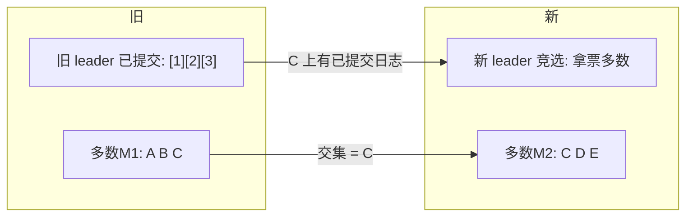
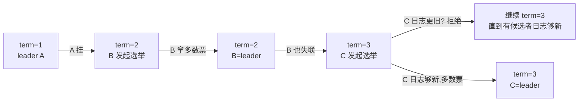
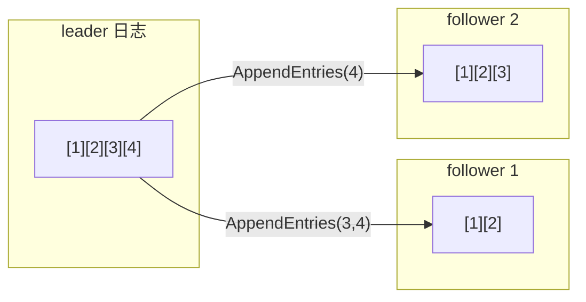

**TL;DR：** 共识协议里"多数派"不是"民主表决"，是一个**数学事实**：任何两个多数集合必有交集——所以"之前 leader 已提交的日志"一定出现在新 leader 的多数里，这是新 leader 能带着全部已提交日志上线的保证。但**多数派本身不防脑裂**，防脑裂的是另外两件精密的齿轮：**任期（term）**把时间切成单调递增的段，任何一次只认一个 term，不同任期用 term 新旧裁决；**日志复制**让日志只有一条线——leader 只能 append，投票只给日志不短于自己的候选人。三样合起来记住：**Leader 唯一、任期唯一、日志只有一条线**。

## 一、多数派：不是"大多数同意"，是"不可能各拿一半"

所有共识协议（Paxos/Raft/Zab）的根基是同一个集合性质：**任何两个多数集合必有交集**。3 节点里多数=2，任意两组多数 {A,B} 与 {B,C} 交于 B；5 节点里多数=3，任意两组都有交集（且 >1）。

这个性质直接推出共识的核心表白：**上一任 leader 已提交的日志，必然出现在新 leader 的多数里**——因为已提交表明它已被某个多数复制；新 leader 要当选，又要从多数拿票。两个多数相交的那几个节点上的日志，就是新旧 leader 的"共同记忆"。



所以多数派买的不是"表态权"，是**可用性的边界**：写要等多数确认而非全部，意味着"最多容忍 (N-1)/2 台挂掉"，也意味着"当分区两边各占一半时，没有一边能达成多数"——这就是"分区时不会出现两个 leader"的决定性机制。**多数派：唯一不变量。**

## 二、任期：把时间切成段，一段只认一个 leader

停机恢复、网络重划之后，旧 leader 与新政选的候选者可能同时存在。谁说了算？答案是**任期（term）**——每个节点持一个单调递增的计数器，任何 request/response 都带 term：



选举安全规则只有两条：

1. **一个任期最多一个 leader**（多数派交集保证 term 内不重复）。
2. **term 顶格的节点打赢**：收到携带更大 term 的消息，自我降级并更新自己的任期（leader 一收到更大 term 就缴枪）；term 更小则拒绝。

脑裂的确不是被"投票"防住的——**是被任期 + 只认当前 term 的票防住的**：旧 leader 的任期已经过期，followers 不再认它，它自己也会在收到更大 term 时退位。任期把"谁有权当 leader"变成一条单调的线。

## 三、日志复制：只有一条从尾往尾长的线

新 leader 上任后，日志如何走？Raft 的原则是**单向追加 + 前缀一致**：



- **数据一致性**：每个 follower 的日志是 leader 的**前缀**（前若干条完全一致）。leader 发送时带索引，follower 用 term 与索引对比，不匹配就拒绝（返回失败），leader 把 `nextIndex` 回退再试，直到接上——这就是**日志匹配**。
- **提交**：只有**复制到多数**的条目，leader 才把 `commitIndex` 前推并通知 followers。
- **完整性（safety）**：已提交条目会出现在之后每一个 leader 的日志里。为什么？因为当选条件**投票只给"日志不短于自己"的候选**——新 leader 从多数交集接过旧日志，已提交条目必然在它日志里。

这条"只有一条线"的设计有序、可检验：日志严格按顺序追加，是**线性化**的，不存在多条并发写线。它让读日志、校对、快照全部只有一个故事，这正是 Raft"能理解"胜过 Paxos 的原因。

## 四、实验：etcd 分区复现

用 etcd 就能自己做分区复现，观察 majority 的边界。在一个 3 节点集群里模拟"把一个节点隔离"：

```bash
# 3 成员 etcd, 把节点 C 的 peer 端口（默认 2380）与外界断开:
sudo iptables -A INPUT -p tcp --dport 2380 -j DROP

# 等 2 个 election timeout（约 1s）:
etcdctl endpoint status --cluster
# 观察: A 与 B 能互相选主吗？C 能当选吗?
```

应该看到的结论：

1. **C 在少数侧永远无法当选**：它要拿 2/3 票，可大多数节点不可达 → 持续选举超时却总是输。**多数派确保"没有人能在少数派当 leader"**。
2. **A/B 在多数侧正常选主**，日志在 A/B 之间正常复制。
3. **恢复网络后**，C 在下个任期会从 leader 处补齐缺失的日志（AppendEntries 回退 + snapshot）。

诚实注明：单机多进程的 etcd 实验里"分区"是隐式的（通过 iptables 断端口），它复现的是"多数派封闭的选主逻辑"，不会复现生产里的网络分区检测（那头另有一套真实硬件网络问题）。本节实验的目的只是让"任期与多数"变成可见的事实，而不是复刻一次生产级 partition。

## 五、生产里 Raft 的四张表

| 事项 | 是什么 | 机制对应 |
| :--- | :--- | :--- |
| 写必须多数成功 | 只有多数回复才 commit，才算成功返回 | 日志复制 + commitIndex |
| 磁盘必须同步 | follower 要把日志写盘才可接受新条目 | AppendEntries + fsync |
| 读也要线性一致 | 避免读到旧数据，leader 需 ReadIndex / lease | leader lease |
| 恢复靠快照 | 日志太长，定期把状态固化成快照 | compact + snapshot |

## 结论：Raft 的安全性来自任期、日志匹配与多数派交集

Raft = 三根脊柱：**多数派的集合交集**（新老 leader 的记忆不断线）、**任期**（同一时刻唯一的 leader）、**日志匹配**（只有一条线，leader 只能追加，选票要求日志不短）。三者合起来给出：**安全（Safety）**——已提交日志绝不被回退；**活性（Liveness）**——多数活着必能选出新 leader。脑裂不是"防不住"，是"被任期 + 日志匹配挡在门外"。

下一步：把 etcd 分区实验做完，看到少数派节点永远当选不了 leader；然后翻一下 etcd 的 `wal` 目录，看一条日志如何被切成 raft terms——你对"共识"会从背概念变成看字段。

## 参考资料

1. Raft 原论文：In Search of an Understandable Consensus Algorithm—— https://raft.github.io/raft.pdf
2. Raft 官方动态可视化—— https://thesecretlivesofdata.com/raft/
3. etcd 官方文档：集群成员与容错—— https://etcd.io/docs/v3.5/op-guide/clustering/
4. etcd 官方文档：故障与读一致性（ReadIndex）—— https://etcd.io/docs/v3.5/op-guide/failures/

> 延伸阅读：多数派选出一个 leader 后，leader 怎么让两个数据库同时提交，见[分布式事务：2PC 为什么没人敢用](/writing/distributed-transactions-2pc-saga)；把日志推给消费端（讲顺序、去重），见[exactly-once 是营销话术：一条消息的一生](/writing/exactly-once-message-delivery)；把 Raft 与 MySQL 主从的对齐和代价对照，见[主从复制延迟 300ms 的账单](/writing/replication-lag-read-paths)。
