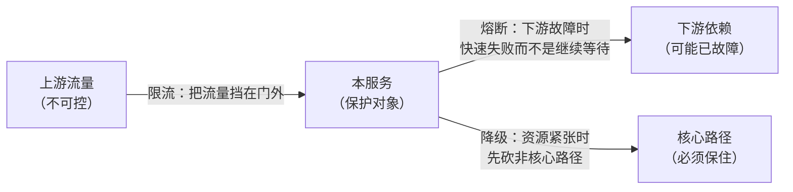
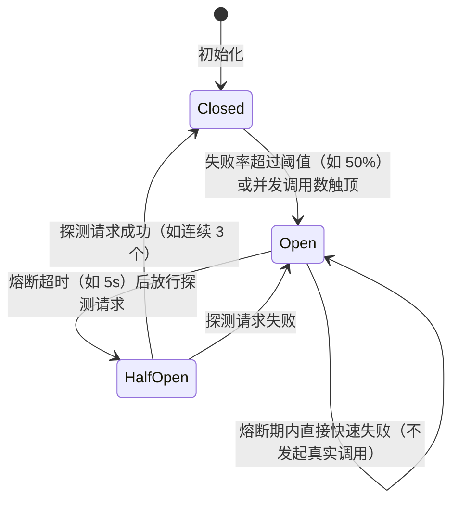

**TL;DR：** 限流、熔断、降级回答三个不同的问题：限流管"上游流量超预期怎么办"，熔断管"下游已经故障怎么办"，降级管"资源不够时先牺牲谁"。三者不是同一件事，混用是事故的开端：限流阈值拍脑袋、熔断粒度太粗、重试和熔断叠加成风暴，是三个最常见的坑。参数的正确来源只有一个——压测出的容量基线，而不是猜测。本文给出三件套的分工、算法选择、参数推导和一次完整的故障推演。

## 一、 三个问题，三种手段

先看一个典型的故障链：大促流量翻十倍 → 网关照单全收 → 订单服务线程池打满 → 依赖的库存服务被拖垮 → 超时重试让故障放大 → 整个交易链路雪崩。这条链上每个环节都可以拆出"高可用三件套"各自该管的那一段：



- **限流（rate limiting）**：上游的流量是我们无法控制的，防护位在本服务的入口。超过容量的请求要么拒绝、要么排队，**目的：别让本服务过载**。
- **熔断（circuit breaker）**：下游已经故障时，继续把请求发过去只会让"请求排队超时"变成"本服务线程池也耗尽"。防护位在出站调用上，**目的：快速失败，切断故障蔓延**。
- **降级（degradation）**：资源（线程、连接、缓存、算力）不够时，决定**牺牲什么保什么**。目的：核心路径可用，非核心路径让位。

三者最常见的混用错误：把"限流阈值调高"当"高可用"，或者"熔断触发后靠重试恢复"——前者是在错误的位置防错流量，后者是把故障放大器的开关打开了。定位是第一步：先分清你要防的是哪一段。

## 二、 限流：算法家族与阈值来源

### 2.1 四种算法的取舍

```text
固定窗口：  按秒/分钟计数，超过阈值拒绝。实现最简单，但窗口边界会突刺：
            59.9 秒和 60.1 秒各放行满额 → 瞬时 2 倍流量穿墙。

滑动窗口：  把窗口切成长度固定的若干小格，逐格滑动统计。精确到格粒度，
            边界问题缓解但没根除，内存开销随格子数增长。

漏桶：      请求进桶排队，底部以恒定速率输出。输出永远平滑，代价是
            突发流量全部被削平——适合保护"承受不了毛刺"的下游。

令牌桶：    桶里以固定速率补令牌，请求取令牌放行。桶容量即允许的
            突发上限，既平滑又允许 burst。最常用，Guava、Redis 版
            实现遍地都是。
```


*图注：令牌桶的"容量"决定突发上限，漏桶的输出速率恒定；前者适合服务入口，后者适合保护数据库等对毛刺敏感的下游。*

"固定窗口会边界突刺"不是背诵的考点，是可以复现的算术。用一个最小程序实测（`experiments/rate-limit/main.go`，limit=100/s，990ms 与 1000ms 窗口边界各均匀来 100 个请求）：

```
seed=42    固定窗口放行 200   滑动窗口放行 100   令牌桶放行 101
seed=7     固定窗口放行 200   滑动窗口放行 100   令牌桶放行 101
seed=2026  固定窗口放行 200   滑动窗口放行 100   令牌桶放行 101
```

三个 seed 结果一致，不是随机抖动，是结构差异：

- **固定窗口放行 200**：990ms 的 100 个归窗口 0（0~999ms），1000ms 的 100 个归窗口 1——两个窗口各自满额，实际上 10ms 内涌入了 200 个请求，限流器形同虚设。这是固定窗口的固有缺陷：窗口边界两侧各放 100%，任何"边界附近的高峰"都 2 倍穿墙。
- **滑动窗口放行 100**：1000ms 时窗口覆盖 [0, 1000]，990ms 的请求还在窗内，配额已被占用，新请求被拒。代价是必须滚动计数，窗口 = 格数组 × 格粒度，格子越细精度越高、内存越大。
- **令牌桶放行 101**：990ms 消耗完 100 个令牌，1000ms 时只补了 ~1 个，几乎全部拒绝——它不是"跨窗口放行"，而是把 burst 严格限制在容量的 100，且 1 秒后自动恢复满额。代价是"瞬时均匀的流量"会被均匀削平，突发尖峰反而能过（这正是它要的）。

选择建议：**入口限流用令牌桶**（允许自然的突发，如秒杀瞬间的集中请求）；**出站保护用漏桶或带缓冲的令牌桶**（数据库连接、消息队列生产者最怕毛刺）；固定窗口只适合"成本敏感、精度无所谓"的粗粒度场景；单机场景 Guava 的 `RateLimiter`、分布式场景 Redis + Lua 是标准答案，后者把"计数 + 判断"放进原子脚本，避免竞态——但在用它之前，先想清楚你要的是滑动窗口的精确还是令牌桶的 burst，这不是实现差异，是语义差异。

### 2.2 阈值不是拍脑袋，是算出来的

限流阈值 = **容量基线 - 安全余量**。正确流程：

1. 压测：用比生产大一倍的流量压本服务，画出"QPS → P99 延迟"曲线。**记录拐点**：P99 开始陡升的那个 QPS，记作 `P`。
2. 留余量：生产阈值 = `P × 0.7` 左右（具体看拐点陡峭程度，拐得越陡余量越大）。
3. 按维度切分：全局限流之外，加"单用户、单 IP"的细化限流——全局限流挡不住单一来源的刷量，维度限流挡得住。
4. 压测回归：每次容量变化（发布、加节点、改配置）后重新压，阈值跟着基线走。

整条流程的关键是第 1 步真的有数据：`P99 从 X 跳到 Y` 必须来自压测机输出，而不是"感觉 2000 差不多"。没有基线就没有阈值——"限流 50% 流量"这种数字本质是跳过了压测。

## 三、 熔断：三态状态机与重试的仇

### 3.1 三态与转移条件

熔断器是典型的状态机：**closed（关闭）→ open（打开）→ half-open（半开）**。



- **Closed**：正常转发，滑动窗口内统计失败率（一般是"最近 10 秒的请求"而非累计计数——累计计数会把几分钟前的故障算进现在的判断）。
- **Open**：所有调用直接抛错，**不发出真实请求**——这是熔断的本质价值：下游在故障，一个请求都不浪费。熔断超时后进入半开。
- **HalfOpen**：放 1~3 个探测请求试试水。成功则关闭熔断器，失败则回到打开。探测量是关键的权衡：放多了等于没熔断，放少了恢复慢。

### 3.2 熔断的三个经典错误

**错误一：熔断和重试叠加成风暴。** 客户端超时 100ms → 重试 3 次 → 熔断器打开后客户端还按"重试 + 退避"继续发——每次重试都在打一个已经打开的熔断器，请求量乘以重试次数，下游被双重打击。正确姿势：熔断打开时重试策略必须停止（快速失败），重试只该发生在熔断器关闭状态，且重试次数×并发数要让下游扛得住。

**错误二：超时设得比熔断还长。** 熔断器统计的是"失败"——但超时未返回的请求，熔断器可能还没把它算进失败窗口，线程池却已经被占满。超时必须在熔断生效之前起作用，否则熔断器看到的是"成功"（因为没等到失败），连接池却已经耗尽。

**错误三：粒度太粗或太细。** 一个熔断器管整个下游集群：库存服务一个节点故障，所有库存调用被熔断——其实另外 9 个节点是好的。正确的粒度是**按下游实例或按操作细分**（`inventory.check` 一个熔断器，`inventory.order` 另一个），让故障面小到一个节点、一个接口。

### 3.3 参数从哪里来

- **失败率阈值**：取"业务可容忍的错误率上限"（如 50%——错误率高于一半还继续发请求，对用户没有任何价值）。
- **统计窗口**：短于下游故障的典型恢复时间（如 10s）。
- **熔断超时**：比下游平均恢复时间略长（如 5s），让半开探测有机会命中恢复窗口。

这三组参数在 Hystrix、resilience4j、Sentinel 里都有默认值，默认值只适合"没压测过"的起步阶段——同限流阈值一样，熔断参数最终要靠故障注入实验来校准：定期杀掉一个下游节点，观察熔断器是否在预期时间内打开并恢复。

## 四、 降级：预案不是故障时才做的决定

降级最容易做成"出事了才开会讨论砍什么"——那时系统已经半瘫，任何决定都带着恐慌。正确的做法是**提前定义降级预案并编码进去**，故障时只是"按下开关"：

1. **分级**：把功能分成核心（交易、登录）、次核心（推荐、个性化）、非核心（消息、统计）。降级顺序永远是"先非核心后核心"。
2. **兜底**：每个可降级的功能都要有降级实现——静态数据、缓存、默认值、上一版本结果。没有降级实现的"降级"只是把功能换成报错。
3. **自动与手动的分工**：熔断触发后自动走降级路径（缓存兜底）；跨功能的降级（砍推荐、砍消息）要手动开关，自动降级到"砍掉核心功能"是运维事故。
4. **降级的反向风险**：降级后缓存成为唯一数据源，缓存过期时间、更新路径都要重新审视——"降级到缓存"最怕的是缓存本身失效。

与熔断的衔接是：熔断器 open 之后，调用方走降级分支（兜底数据 / 默认响应），而不是裸抛异常。这样用户看到的是"推荐位暂时不可用"，而不是整个页面 500。

## 五、 一次完整的故障推演

把三件套串起来推演一次"秒杀大促"：

1. **限流**：网关令牌桶按容量基线 1400 QPS 限流，秒杀流量冲到 5000 QPS → 1400 进系统，3600 返回"繁忙，请稍后重试"（带重试退避提示，而不是让客户端狂刷）。
2. **熔断**：库存服务因个别节点故障失败率飙升 → 订单服务对 `inventory.check` 的熔断器 10 秒内转 open → 后续订单请求 5 秒内快速失败 → 故障没有蔓延到订单服务的线程池。
3. **降级**：订单页的"库存余量数字"是次核心 → 熔断触发的降级分支返回"库存紧张"文案（静态兜底），而不是报错 → 用户还能正常下单（下单走核心的 `inventory.check` 熔断恢复后的真实检查）。
4. **收尾**：库存节点恢复 → 半开探测成功 → 熔断关闭 → 全链路回到正常。全程没有一次 500，只有降级文案和限流提示。

这套组合的每一环都能单独上线、单独压测、单独回滚——高可用的工程价值不在某个组件有多强，而在**每个组件都能被独立验证**。限流器可以压测，熔断器可以故障注入，降级开关可以灰度演练。三者都做到"参数可解释、行为可预测"，才叫真正的高可用[^1]。

[^1]: 延伸阅读：Hystrix 的 wiki 文档虽然项目已停更，但三态状态机和线程隔离的图解依然是最好的入门材料；resilience4j 与 Sentinel 的官方文档对应本文所有参数；《Designing Data-Intensive Applications》第 8 章对故障处理的讨论是更高一层的视角。

## 六、参考资料：算法与熔断器状态合同

- [Resilience4j：CircuitBreaker](https://resilience4j.readme.io/docs/circuitbreaker)：Closed、Open、Half Open 状态与滑动窗口统计。
- [Resilience4j：Getting Started](https://resilience4j.readme.io/docs/getting-started-4)：限流、重试、熔断和降级组合时的配置入口。
- [RFC 9293：TCP](https://www.rfc-editor.org/rfc/rfc9293)：拥塞和传输可靠性背景，避免把应用层限流误认为网络拥塞控制。
- [Google SRE Book：Handling Overload](https://sre.google/sre-book/handling-overload/)：过载保护、负载削减与恢复策略。
