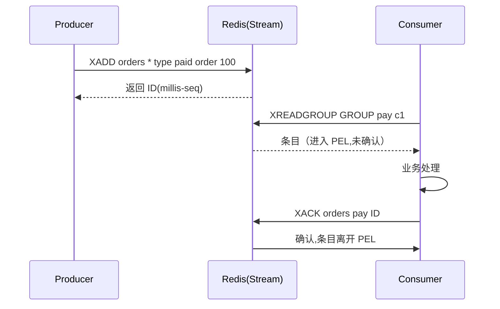

**TL;DR：** Redis 能做消息队列，但"能不能"从来不是问题，"**这消息丢了算谁的**"才是。选它之前先做场景判定：它的适用面是**延迟敏感 + 吞吐中小 + 消息是瞬态事件 + 可容忍 ≤1 秒量级丢失**；审计、对账、支付、必须长回溯——这些是它的禁区，该上 Kafka/Pulsar。三档实现各卖一种语义：**List** 取走即焚（无 ack，根本不是 MQ）、**Pub/Sub** 广播即焚（丢是语义的一部分）、**Streams** 用消费组 + PEL + XACK 把"至少一次"写进协议。判断线只有一句：你关心的是"**没做完的会重投**"，还是"**过去的都留着能回溯**"——前者 Streams，后者 Kafka。

## 一、场景先行：先用三条线砍掉一半的"想用"

最便宜的自检是三连问：**丢一秒钟的消息能忍吗？消息消费失败需要重投吗？未来半年会不会要回放历史？**

### 适用 Redis 的三条线

1. **延迟是刚需，比安全更贵**：亚毫秒级（局域网约 0.1–0.5ms 往返）排队入队，这类组件只有内存能做到。
2. **事件是"瞬态"的**：任务、通知、缓存失效信号、日志扇出——过了业务窗口就没价值，不指望回溯。
3. **不想为低量事件养一座集群**：系统里本来就有 Redis，多一个命令少一篇架构文档。

### 禁区（反例表）

| 场景 | 为什么是禁区 |
| :--- | :--- |
| 支付/账务事件 | 丢 1 秒 = 对不上账；Redis 主从切换还可能丢已 ack 的一条 |
| 审计、合规留痕 | 需要"可呈现的完整链"，不是"尽量不丢" |
| 需要回放重算 | 业务重演旧消息（如补数据）时必须能追溯到历史 |
| 多机房强一致投递 | Redis 复制是异步的，跨机房断链就丢出同步窗口 |
| 高吞吐长期堆积 | Streams 的 MAXLEN 默认裁剪，堆不起来的"历史"是另一个形状 |

**一句话场景判据**：这条消息**消费完之后还需要存在**吗？不需要 → Redis 列进来；需要 → 上专业 MQ。先想清楚这句话，下面四节再谈怎么选实现。

## 二、三副账，各卖一种语义

### 1. List：取走即焚——没有 ack 不是缺陷，是诚实

`LPUSH` 入队、`BRPOP` 阻塞出队，底层是 O(1) 双端链表：

```bash
$ LPUSH queue job:1 job:2 job:3
$ BRPOP queue 0
# 返回队尾一条,它已经离开队列
```

没有 ack：`BRPOP` 一返回消息就弹掉，消费方当场崩 = 这条永久消失。把它当任务队列，等于口头宣布"**不能失败的任务流**"。List 的处境其实诚实：它**本来就不是 MQ**，只是"一个能当队列使的数据结构"。想补至少一次，得在业务里自己写待确认表——那就等于手写 Streams。

### 2. Pub/Sub：广播即焚——丢是语义的一部分

`PUBLISH`/`SUBSCRIBE`，消息只发给**那一刻在线且在订阅**的连接；无落盘、无订阅者时直接蒸发，Redis 官方文档明示不保证可靠投递。注意：**它和 List 的"丢"不是同一件事**——List 是"你没做完就弹走了"，Pub/Sub 是"没人看就不存在"。前者是责任问题，后者是广播固有的语义。它只适合：实时房间/即时通知这类"错过就算了"，以及"扇出一条缓存失效信号清多端"。

### 3. Streams：把记账权做进协议

Redis 5.0 的 Streams 是 Redis 团队对"MQ 语义"的正面回应。四个命令是一组完整模型：

- `XADD`：追加，返回全局唯一 ID（毫秒-序号）。
- `XGROUP CREATE`：建消费组（一条流可被多组独立消费）。
- `XREADGROUP`：取走后**进入本组 PEL（pending entries list）**，此时还不算消费完。
- `XACK`：做完才确认，未确认的留在 PEL——同组另一成员可 `XAUTOCLAIM` 认领重试。



**这个演进最好地印证了"MQ 卖的不是吞吐是记账"**：吞吐 Redis 一直都是 MVP（几十万 ops/s 量级），但 List/Pub/Sub 不给你 ack、重放、组的概念；Streams 是 Redis 自己说服改用它能"扛至少一次"的证据——**用户被威胁的不是性能，是"消息丢了算谁的"**。Streams 给的承诺：**至少一次 + 可重放**，依然不是恰好一次（要恰好，得消费方幂等，或学 Kafka 用消费者自己的 offset 去重）。

## 三、把能力列成一张可勾选的表

| 能力 | List | Pub/Sub | Streams | Kafka |
| :--- | :---: | :---: | :---: | :---: |
| 消息确认（ack） | 无 | 无 | ✅（PEL+XACK） | ✅（offset 提交） |
| 消费组（共享进度） | 无 | 无 | ✅ | ✅ |
| 崩溃后重投 | 无 | 无 | ✅ XAUTOCLAIM | ✅ seek 回溯 |
| 持久化上限（断电丢多少） | 依 AOF/RDB | ∞（蒸发） | 依 AOF（默认≤约1s） | 磁盘日志（基本不丢） |
| 历史回溯 | 无 | 无 | 仅 PEL 未确认 | ✅ 可回退任意 offset |
| 背压 | ✅ BRPOP | 阻塞 | 消费推进慢消息变多 | 依赖 lag 水位线 |

**注意两种"丢"别混淆**：第 4 行的"断电丢多少"和第 3 行的"消费崩溃重投"是两件事——前者是存储安全，后者是投递语义。**List 两个都欠账，Streams 只欠第一个**，这就是为什么"至少一次"总被拿来放在 Streams 的账上。

## 四、断电与 ack 时机：把死法摆到一张表

一条消息从 `XADD` 成功到 `XACK`，中间崩在哪决定它生死：

| 崩溃发生 | Streams（AOF everysec） | List | Pub/Sub |
| :--- | :--- | :--- | :--- |
| 入队后、消费前节点断电 | AOF 最多丢约 1s；RDB 默认分钟级 | 同理 | 蒸发 |
| 消费方已收到、XACK 前崩 | 留在 PEL,可认领重投 | 已弹出,永久丢 | N/A |
| 主从切换、异步复制未追上 | 切换瞬间未同步条目丢失 | 同上 | N/A |
| 满内存淘汰（maxmemory） | stream key 可能被逐出 | 同类 | N/A |

**账收拢**：当业务队列，**只有 Streams + AOF 能给"丢多少"一个上限（约 1 秒）**；其余档位是不设上限的丢——持久化四档见附录。

## 五、与 Kafka 的分界：这里藏着这道题最深的那个点

多数争论停在"吞吐够不够"——那是最不关键的维度。真正的分界是**两个不同的消费记账哲学**：

- **Kafka**：消费者进度（offset）存在 broker，消息在磁盘上保留（按 retention 配置），可以回退到很久以前重跑。**它卖的是一块"可回溯的历史"**。适合数据管道、审计、需要"重新处理过去"的系统。
- **Streams**：PEL 只记"未确认"，`XACK` 一过消息就离开内存，`MAXLEN` 默认还修剪旧条目——**不提供历史可回放，它卖的是一张"责任表"**：谁没确认、谁可以重投。适合"清单型任务流"。

**为什么 Kafka 赢得了大多数战场**：不是吞吐（Redis 单机几十万 ops/s 也够），而是"历史保留 + 消费者独立进度"这两块硬实力正中数据分析与事件驱动的主流需求。**什么时候 Redis 反而更对**：消息量小、延迟敏感、重投靠幂等能兜住——这时 Kafka 的 broker 持久化和复杂运维是纯支出。一句话引脚：**场景在"流"（要流水账）用 Kafka，场景在"清单"（要催办清单）用 Streams。**

## 六、决策四问（选型落点）

1. 我忍得了丢多少？→ 等于 0 → 不是 Redis 菜单。
2. 这是"事件流"还是"任务清单"？ 要回溯的"流"→ Kafka；"做完就完"的"清单"→ 可以考虑。
3. 谁承诺"至少一次"？ Streams 靠 PEL + 重投；你要么接受至少一次，要么在消费端建幂等。
4. 我愿付的运维账单？ 已经是 Redis 环境 → Streams；要从零引集群 → 先怀疑"该不该在这件事上为 Redis 买这个单"。

四问全过 → 上 Streams（并开 `appendonly yes everysec`）。

## 七、结论与下一步

Redis 做 MQ 的深水区不在于原理，而在于**它是那串"谁丢谁负责"的语义**。场景先行：瞬态 + 可容忍≤1s 丢失 → Redis 才有资格进会场；能力对比看语义承诺（ack/组/重放/回溯），不看吞吐与镜头；Streams 与 Kafka 是"记账"不同哲学——**清单 vs 流水账**。你的确的收束是：**"Redis 队列丢消息"极少是 Redis 的病，是没上 AOF、没用 Streams、或压根不该用 Redis 的抖。**

下一步动手（约 10 分钟可复现）：
1. 在本机跑四个命令一遍：`XADD` → `XREADGROUP` → `XPENDING` 看未确认 → `XAUTOCLAIM` 认领——看见"至少一次"实指数。
2. 翻自己代码里所有"用 Redis List 当队列"的地方，先回答这张表上的三行：① 崩了会不会丢 ② 有没有在写重试 ③ 是不是被 MAXLEN 剪掉过——三行都逃得过，才轮得到讨论 log。

## 参考资料
1. Redis 官方：Streams / consumer groups—— https://redis.io/docs/data-types/streams/
2. Redis 官方：Pub/Sub 可靠性说明—— https://redis.io/docs/data-types/pubsub/
3. Redis 官方：RDB 与 AOF 持久化—— https://redis.io/docs/reference/persistence/
4. Redis 官方：XAUTOCLAIM—— https://redis.io/docs/latest/commands/xautoclaim/

## 附录 A：持久化四档与"最大丢多少"

| 档位 | 断电最多丢 |
| :--- | :--- |
| `appendonly no`（纯内存） | 全部清空 |
| RDB 快照默认（900/300/60s） | 最后一次 save 之后的一切（分钟级） |
| AOF `everysec`（默认 AOF 档） | 约 1 秒 |
| AOF `always` | 已 fsync 无丢弃，但写吞吐跌回磁盘水平 |

> 延伸阅读：消息"至少一次"的语义怎么考，见[exactly-once 是营销话术：一条消息的一生](/writing/exactly-once-message-delivery)；重投放大错误、要靠幂等收尾，见[重试会放大一切错误：幂等性工程的完整账本](/writing/idempotency-engineering)；队列没人吃时的那背压，见[Socket 背压：慢消费者如何盯住你的服务](/writing/socket-backpressure-slow-consumer)；异步复制延迟造成的读旧读新，见[主从复制延迟 300ms 的账单](/writing/replication-lag-read-paths)。