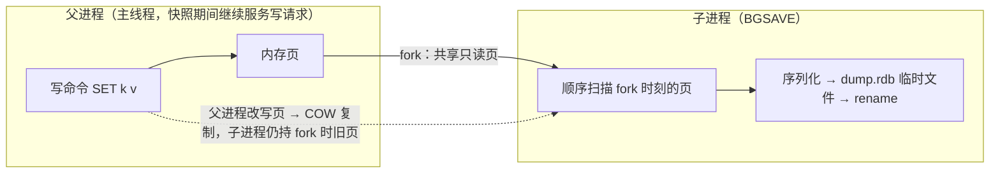

**TL;DR：** Redis 号称内存数据库，但"断电丢多少"从不是单一答案，而是你选出来的。默认配置（`appendonly no`，只开 RDB）丢最后一次快照之后的一切，分钟级起步；开 AOF 后三种 `appendfsync` 各有一个价签——`always` 每条命令 fsync、几乎不丢但吞吐跌回磁盘水平，`everysec`（默认）最多丢约 1 秒，`no` 最多丢约 30 秒。语义上 RDB 是**备份**（某时刻的状态快照，装载快、但两次快照之间全丢），AOF 是**日志**（每条命令重放，丢得少、但恢复要重放全部命令）。所以选型不是"哪个稳"，是"能接受丢几秒 × 启动恢复多慢 × fsync 吃多少 IO"的三选一；Redis 4.0 的混合持久化用 RDB 打底 + 增量 AOF，把"恢复快"和"丢得少"拼进同一个文件。

## 一、先立反直觉：内存数据库的"断电丢多少"是分档的

"内存数据库"这个名号容易让人以为它天然快、天然不留证据。反直觉的是：Redis 默认就带持久化，只是这套持久化是**分档**的——它不会回答"断电丢多少"这个单数问题，而是给你一组档位，每个档位承诺完全不同的丢失窗口。

默认配置下 Redis 开 RDB、关 AOF。官方默认的 save 点是 `save 3600 1 300 100 60 10000`（Redis 7.x 的 `CONFIG GET save` 返回），意思是三条触发条件任一满足就做一次后台快照：3600 秒内有 1 个键变更、300 秒内有 100 个键变更、60 秒内有 10000 个键变更。所以"默认配置丢多少"取决于最后一次快照距今多远——低写入时可能丢一整个小时，正常业务量下至少是分钟级。这就是第一档价签：**RDB 的丢失窗口 = 两次快照之间的全部**。

| 配置 | 断电最多丢 | 一句话 |
| :--- | :--- | :--- |
| `appendonly no`（默认，仅 RDB） | 最后一次快照之后的一切（分钟级起步） | 点备份，两次 save 之间的全丢 |
| AOF `always` | ≈ 0 | 每写必 fsync，最稳但慢 |
| AOF `everysec`（默认） | ≤ 约 1 秒 | 每秒 fsync，稳与快的折中 |
| AOF `no` | ≤ 约 30 秒 | 交给操作系统，最快最不稳 |

把四种档位并排看，问题就清楚了一半：Redis 的持久化本质是"**二选一地丢数据**"——不持久化丢全部，持久化则选一个丢得最少的时点。接下来的两节分别拆开两种记录方式：RDB 记录的是**结果**（某时刻的整份状态），AOF 记录的是**过程**（每一条写命令）。这个区别决定了后面所有数字：结果可以"装载"，过程只能"重放"。

## 二、RDB：fork + COW，为什么快照能"边写边抄"

RDB 的机制一句话：主进程 `fork()` 一个子进程，子进程把整个内存数据集序列化写进 `dump.rdb` 临时文件，写完 `rename` 原子替换旧文件。难点在于 Redis 在快照期间**不能停写**——谁来保证快照的"一致性"？答案是内核的 copy-on-write（写时复制）。



fork 是拿"一刻的一致视图"的唯一办法：fork 之后子进程读到的每个内存页都是 fork 那一刻的内容；父进程继续改写某个页时，内核先把原页复制一份给子进程，再让父进程在副本上改。于是子进程手里的视图永远是 fork 时刻的——哪怕快照写到一半父进程已经把数据改了几万次，快照依然是严格一致的时间点。**这就是"RDB 点备份"的语义基础：它是一个时刻的快照，不是一个区间。**

为什么低负载时 RDB 便宜，这里有了答案：子进程只做"顺序读页 + 顺序写文件"，父进程照常服务请求，双方共享绝大多数只读页（零复制）。写负载低时 COW 几乎不触发，fork 的固定成本（页表设置）摊在整份快照上，所以低写入实例的 BGSAVE 通常无感。代价都藏在三个地方：

1. **COW 写放大**：写负载越高，父进程改页越多，被复制的页越多。RDB 期间的磁盘写入和内存峰值都会上升，具体量级取决于写密集度，可用 INFO 的 persistence 段 `rdb_last_cow_size` 观察（Redis 7.0 前是 stats 段的 `rdb_cow_bytes`）；本文目前没有保存 Redis 版本、负载和原始观测值。
2. **全量重写**：每次 BGSAVE 都把整个数据集重写一遍。数据 10GB、一天快照 10 次，就是 100GB 磁盘写入——**快照越勤，写放大越重**，这是它和 AOF 逐命令追加在 IO 形状上的本质差别。
3. **阻塞点**：`fork()` 本身是同步的，数据集越大耗时越长（页表复制），官方文档把 fork 列为可观测的延迟来源之一。另外，上一次 BGSAVE 没结束时不会开新快照，持续高负载下快照会被推迟，实际丢失窗口比名义的更大。

恢复端是 RDB 唯一全胜的维度：`dump.rdb` 是紧凑二进制，装载就是反序列化整份状态，不需要重放命令。官方文档明确记载：大数据集下 RDB 重启比 AOF 快。这一快一慢、一丢多一丢少的组合，就是四节对照表的骨架。

## 三、AOF：重放日志，三档 appendfsync 的价签与"1 秒窗口"的物理含义

AOF 把每一条写命令按 RESP 协议追加到 `appendonly.aof`（概念模型；Redis 7 起 AOF 改为 manifest + base + incr 的多文件布局，增量命令仍按 RESP 追加），重启时把文件里的命令按顺序全部执行一遍，重建数据集。它和 RDB 的语义差异很直接：**RDB 备份"结果"，AOF 记录"操作"**——所以 AOF 恢复必须重放，命令数量通常远大于最终状态里的键数量，恢复慢的根源就在这里。

控制丢失窗口的旋钮只有一个：`appendfsync`，三档的语义官方文档给出如下：

| 档位 | 语义 | 断电最多丢 | IO 成本 |
| :--- | :--- | :--- | :--- |
| `always` | 每条写命令后都 fsync | ≈ 0 | 每写一次等一次磁盘确认，吞吐被 fsync 延迟钉死 |
| `everysec`（默认） | 每秒 fsync 一次 | ≤ 约 1 秒 | fsync 摊到每秒一次，吞吐接近纯内存 |
| `no` | 从不主动 fsync，交给 OS | ≤ 约 30 秒 | 最省，Linux 默认约 30 秒刷一次脏页 |

三档的丢失窗口必须和上一行"IO 成本"一起读，这正是三选一的由来：

- **`always` 用吞吐换持久性**：每次写都要等 `fsync()` 返回，提交吞吐的上限就是 1/fsync 延迟——fsync 1ms 则每秒约 1000 次写。Redis 会把并行写合并成一次 fsync（组提交），缓解但没有消除这条锁，模型细节见[fsync 那篇](/writing/fsync-group-commit)。
- **`everysec` 的"1 秒窗口"是页缓存给的**：每两次 fsync 之间，AOF 缓冲区数据只在内核页缓存里——`write()` 已返回、`fsync()` 未执行。断电时这段缓存整体蒸发，丢的正是"最后一次 fsync 之后 ≤1 秒"的写入。附带一个更细的档位差：**进程崩溃但操作系统还活着时，everysec 可能只丢还没来得及 `write()` 的那一条**；真正顶到 1 秒上限的是断电，因为断电把整个页缓存带走了。这个区分是"1 秒窗口"的物理含义，也是本机实验里 kill -9 测不出 1 秒的根源（见文末实验入口）。
- **`no` 把间隔交给内核写回**：Redis 从不调用 fsync，脏页由 writeback 机制周期刷，Linux 默认 `dirty_expire_centisecs=3000`（30 秒）左右，所以文档给出约 30 秒的上限。

本文不填写三档吞吐与丢失窗口的本机数值：`bench.sh` 可在隔离容器中压三档 SET 吞吐，`crash-loss.sh` 可观察 kill -9 后的恢复状态，但当前工作区没有对应 Redis 运行快照。官方给出的丢失窗口是语义上限，不是本机吞吐或断电实验结果。

AOF 还有两个绕不开的机制。一是**膨胀与 rewrite**：日志无限追加必然膨胀——一个 key 被 SET 十万次，AOF 里就有十万条命令，而最终状态只有一条。`BGREWRITEAOF`（也会自动触发）用当前内存数据重新生成"重建数据集的最少命令集"，本质也是 fork 子进程；rewrite 期间新命令写进增量文件，结束后合并。二是 **Redis 4.0 引入、5.0 起默认开启的混合持久化**（`aof-use-rdb-preamble`，当前默认 `yes`）：AOF 文件 = 一段 RDB 前导（rewrite 时刻的整份快照）+ 之后的增量命令，加载时先读 RDB 前导（快）、再重放增量。官方配置文档的说法是 RDB 格式装载"总是更快更省"，关闭只为了向后兼容。等于在重放表里装了半张备份表——把 RDB 恢复快与 AOF 丢得少拼进同一个文件。

## 四、对照表：备份与重放，在三个维度上的取舍

| 维度 | RDB（备份表） | AOF（重放表） |
| :--- | :--- | :--- |
| 记录什么 | 某时刻的整份状态 | 每一条写命令 |
| 恢复速度 | 快，装载二进制状态即可 | 慢，要重放全部命令；混合模式 = RDB 前导 + 增量重放 |
| 断电丢失窗口 | 最后一次 save 之后的一切（分钟级起步） | `always` ≈ 0 / `everysec` ≤ 约 1 秒 / `no` ≤ 约 30 秒 |
| 磁盘写入形状 | 每次全量重写，写放大与快照频率成正比 | 逐命令追加，周期 rewrite 压缩一次 |
| 文件可读性 | 二进制 | 明文命令流，可 `tail` 直接看 |
| 典型角色 | 备份、灾备、可容忍分钟级丢失 | 需要把丢失压到秒级甚至更低的存储 |
| 启动负载 | 一次性装载 | 重放可能吃满 CPU 一段时间 |

于是选型的问题从"RDB 和 AOF 哪个稳"——这个问法本身错了——变成三个变量的三选一：

1. **能接受丢几秒**：能丢分钟级 → 只开 RDB，甚至干脆关持久化；必须 ≤1 秒 → `everysec`；不能丢 → `always`。
2. **启动恢复多慢**：数据集大、重启要快 → RDB 或混合模式（AOF 全量重放在大数据集上通常更慢，但具体秒数必须绑定数据集、Redis 版本和磁盘，本文不假设一个通用值）。
3. **fsync 吃多少 IO**：`always` 把写吞吐钉在磁盘 fsync 延迟上，`everysec` 基本无感。

一句话为什么：RDB 的"备份"承诺的是"**我存了某个时间点的全量**"，AOF 的"日志"承诺的是"**我把最近每一笔记到了什么程度**"。你要的是"一个时刻"还是"一段最近"，决定了哪张表该进生产。

## 五、结论：缓存与存储的边界，以及下一步实验

Redis 官方定位是"缓存或数据存储"双角色，但两个角色对持久化的依赖完全不同，这正是[Redis 当消息队列那篇](/writing/redis-as-mq-consume-groups)结尾"该不该当存储"要接的题。

- **当缓存**：数据源头在别处，丢了能重建。持久化只是省启动时间的优化，甚至可以全关（`appendonly no` + `save ""`）换最大吞吐——此时谈 RDB/AOF 哪个稳没有意义。
- **当存储**：Redis 成了唯一事实源，丢失窗口直接等于你选的档位。这时 `everysec` 是最低门槛——它给"丢多少"一个可写进 SLO 的上界（≤ 约 1 秒），代价是启动要重放；想更稳，`always` 把丢失压到近零，但写吞吐要按次付磁盘 fsync 的等待。

边界判据一句话：**丢了这个键，谁能重建它？** 有源头 → 当缓存，持久化随意；没有源头（Redis 是唯一事实源）→ 当存储，选档位就是选"最多丢多少 × 多久恢复 × 写多慢"。这个三选一里没有免费选项：`everysec` 是多数场景的落点，因为它把三样开销都压到了可写的数量级——丢失上界 1 秒、fsync 摊到每秒一次、恢复最多重放最近一段增量。

下一步可执行的事：把上面的数字在本机跑出来。

### 实验入口

`experiments/redis-persistence/` 下两个脚本，用 docker 起 `redis:7` 容器：

```bash
# 1) 三档 appendfsync 的 SET 吞吐对比（每次一个干净容器，只改 appendfsync 一个变量）
bash experiments/redis-persistence/bench.sh

# 2) kill -9 模拟崩溃，看各档位恢复后剩多少（并演示"断电窗口 vs 进程窗口"的区别）
bash experiments/redis-persistence/crash-loss.sh
```

注意脚本 README 里写的读法：`kill -9` 只杀进程，宿主内核页缓存还活着，所以 AOF `everysec`/`no` 会表现成"几乎一条不丢"——这正是第三部分讲的"1 秒窗口是断电窗口"，不是进程窗口；要真正看到 1 秒 / 30 秒上限，需要让页缓存失效（宿主机重启或虚拟机快照回滚）。只有保存 `bench.sh` 和 `crash-loss.sh` 的环境、版本、原始输出后，才能把它们作为本机证据；本文目前保持草稿。

## 参考资料

1. Redis 官方文档：Redis persistence（RDB point-in-time snapshot、AOF 重放、appendfsync 三档与丢失窗口、BGREWRITEAOF、aof-use-rdb-preamble）—— https://redis.io/docs/latest/operate/oss_and_stack/management/persistence/
2. Redis 官方 redis.conf（默认 save 点 `save 3600 1 300 100 60 10000`、appendfsync、aof-use-rdb-preamble）—— https://raw.githubusercontent.com/redis/redis/7.2/redis.conf
3. Redis 官方文档：Latency problems troubleshooting（fork 列为延迟来源）—— https://redis.io/docs/latest/operate/oss_and_stack/management/optimization/latency/

> 延伸阅读：`write()` 只到页缓存、fsync 才到设备，以及 group commit 怎么把 fsync 从"每事务一次"摊成"每批一次"，见[数据库为什么宁可慢，也要等你 fsync](/writing/fsync-group-commit)；日志先行、崩溃恢复与 checkpoint 的完整链路，见[WAL 是数据库的命根子](/writing/wal-crash-recovery)；Redis 当消息队列时，"丢多少"的上界由哪一档持久化决定，见[Redis 当消息队列的账](/writing/redis-as-mq-consume-groups)。
