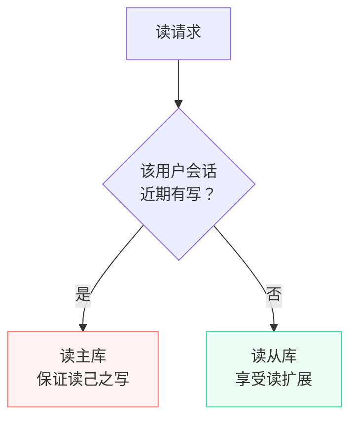
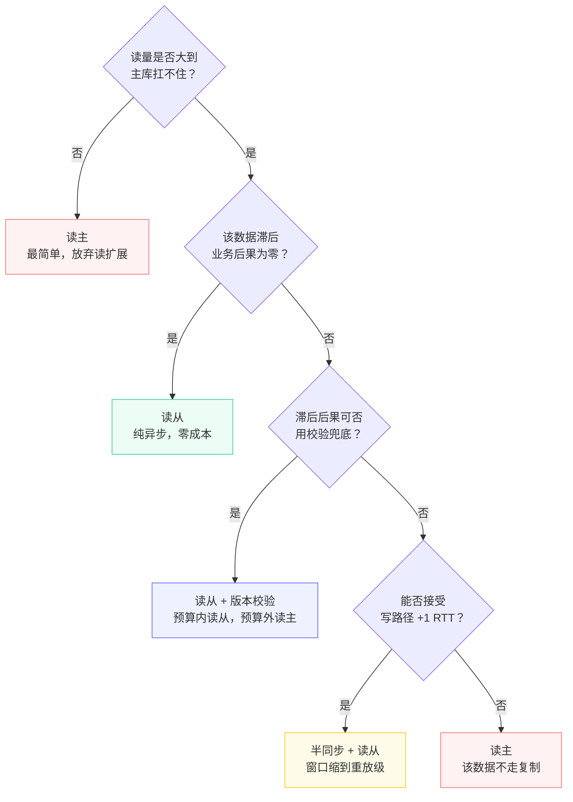

**TL;DR：** 主从复制延迟是异步复制的**固有账单**，不是配置错误：主库本地提交亚毫秒，从库却要经过网络拉取、relay log 写入、SQL 线程重放三段，典型 100ms 到秒级。读路径只有三种姿势——**读主**（放弃读扩展换强一致）、**读从 + 版本校验**（容忍延迟，校验失败重读主）、**半同步 + 读从**（用写延迟买读一致性）。选哪一种，取决于数据的一致性预算：昵称可以滞后五秒，余额一秒都不行。预算写进代码和监控，事故复盘才有对照。

## 一、延迟从哪来：异步复制的固有链路

先看一条写入从"主库提交"到"从库可见"经过的全部环节：


*图注：主库提交只保证 binlog 已落盘（与事务原子）；从库要经网络拉取、relay log 暂存、SQL 线程重放三步才可见——延迟大头永远在重放这一步。*

三个容易被低估的事实：

1. **主库的"成功"只证明 binlog 落盘**。异步复制下，主库提交后立刻返回，不等待任何从库确认。从库此刻可能还差着几千个事务。
2. **relay log 不 fsync**。IO 线程把 binlog 事件写进 relay log 时不做持久化保证——它只是重放的中转站，崩溃丢了对齐重拉即可。这一步省掉 fsync 是对的，但不是零延迟。
3. **SQL 线程是单点的历史遗留**。MySQL 5.6 之前从库只有一个 SQL 线程顺序重放，任何大事务都会堵住整个从库；5.6 起引入多线程复制（`slave_parallel_workers`），8.0 用 Writeset 依赖分析做到跨事务并行（需 `slave_parallel_type=LOGICAL_CLOCK` 且开启 writeset 依赖跟踪）。但**并行重放依然受制于事务间的写冲突**——同一行上的连续更新，注定只能串行。

MTS 的并行语义，MySQL 8.0 官方文档（`replica_parallel_type` 一节）有明确定义：

> "LOGICAL_CLOCK: Transactions that are part of the same binary log group commit on a source are applied in parallel on a replica... When this value is set, the binlog_transaction_dependency_tracking system variable can be used on the source to specify that write sets are used for parallelization in place of timestamps..."
>
> "Before MySQL 8.0.27, DATABASE is the default. From MySQL 8.0.27, multithreading is enabled by default for replica servers (replica_parallel_workers=4 by default), so LOGICAL_CLOCK is the default..."
>
> —— MySQL 8.0 官方文档：https://docs.oracle.com/cd/E17952_01/mysql-8.0-en/replication-options-replica.html

两句话值得拆开读：第一，"源端同一批 group commit 的事务在从库并行应用"是 LOGICAL_CLOCK 的官方语义，能否并行由源端 `binlog_transaction_dependency_tracking`（WRITESET）决定的依赖关系说了算；第二，8.0.27 起 MTS 框架已是出厂默认——`replica_parallel_workers=4`、`LOGICAL_CLOCK` 默认开启，不再需要手动开启并行，但源端 `binlog_transaction_dependency_tracking` 仍需显式设为 WRITESET 才能用写集依赖代替时间戳。换句话说：延迟大头在重放，而重放能并行到什么程度，取决于源端记录下来的依赖图有多细。

### 深化：binlog_transaction_dependency_tracking 的三种取值

源端决定"哪些事务在从库可以并行"，靠的是 `binlog_transaction_dependency_tracking` 的三个取值（MySQL 8.0 官方文档 "Binary Log Transaction Dependency Tracking" 一节有完整定义）：

| 取值 | 并行依据 | 行为 |
| :--- | :--- | :--- |
| COMMIT_ORDER（默认） | 同一 group commit 批次 | 同一批提交的事务在从库并行；并行度受批次数限制 |
| WRITESET | 事务写集（行级依赖） | 写集不冲突的事务即使不在同一批次也可并行，依赖历史窗口内记录的写集 |
| WRITESET_SESSION | WRITESET + 会话内保序 | 跨会话冲突检测并行，但同一会话内的事务保持原始顺序 |

两个只有踩过坑才懂的细节：第一，写集依赖有一个历史窗口 `binlog_transaction_dependency_history_size`（默认 25000）——源端只记住最近 N 个事务的写集，窗口之外的事务与任何事务都视为无依赖，也就是"更可并行"；**窗口不是安全阀，是并行度旋钮**，调大它从库并行度会变保守，调小则更激进。第二，WRITESET_SESSION 的存在本身就是一种承认：无脑并行可能把"同一用户会话的写入顺序"打乱（两条跨批次但写同一行的更新除外），所以"要并行又要保序"的会话场景，官方给的就是这个折中值。

延迟的典型量级：主库本地 `< 1ms`，网络 + relay 写入 `0.1 - 5ms`，SQL 重放 `10ms - 秒级`。所以"300ms 延迟"里 99% 在重放。**大事务、慢 SQL、无索引的 UPDATE、DDL 是延迟放大器**——它们不仅自己慢，还会让后续所有事务排队，延迟曲线瞬间变成阶梯。

## 二、位点与 GTID：给"追到哪了"一个精确坐标

从库"追到哪了"不能只靠"延迟多少秒"回答，还需要一个精确坐标。传统位点（binlog 文件名 + 偏移，如 `binlog.000042:123456`）有两个先天缺陷：**不可比**——不同从库的位点之间没有任何可比性，无法判断谁更先进；**failover 后失效**——主库切换后 binlog 文件序列变化，旧位点失去意义，切换前"追到哪"无从谈起。

GTID（Global Transaction Identifier）把坐标变成全局唯一的事务标识。官方定义：

> "A global transaction identifier (GTID) is a unique identifier created and associated with each transaction committed on the server of origin... The GTID is constructed as source_id:transaction_id, where source_id identifies the originating server, and transaction_id is a sequence number determined by the order in which the transaction was committed on this server."
>
> —— MySQL 8.0 官方文档：https://dev.mysql.com/doc/refman/8.0/en/replication-gtids-concepts.html

官方示例 `3E11FA47-71CA-11E1-9E33-C80AA9429562:23` 一眼就能读出全部信息：前半是源端服务器 UUID，后半是源端提交序号。GTID 的三个性质决定了它对延迟监控和切换的意义：

1. **全局唯一**：同一事务在整个复制拓扑中只有一个 GTID，不存在"两个从库各叫一个名"的歧义；
2. **复制中不变**：GTID 由源端生成，在 relay log、重放、级联转发全程不变——"这个事务"从出生到上应用到哪儿，都可以指认；
3. **已执行集合**：从库维护 `gtid_executed`（已执行 GTID 集合），判断"追到哪"变成了集合运算。

`SHOW REPLICA STATUS` 里两个字段直接给出延迟的两个精确坐标：

```sql
SHOW REPLICA STATUS\G
-- Retrieved_Gtid_Set: IO 线程已拉到 relay log 的 GTID 集合
-- Executed_Gtid_Set:  SQL 线程已重放完成的 GTID 集合
-- 两者的差集 = 排队等待重放的事务,比 Seconds_Behind_Source 精确得多
```

**Retrieved 与 Executed 的差集** 才是"排队中的重放债务"：Seconds_Behind_Source 是时间视角（受时钟与大事务影响），GTID 差集是**事务视角**——每个未重放的事务都列在那里，一个不少。

GTID 不是免费的：MySQL 8.0 中 `gtid_mode` 默认是 `OFF`，需要显式开启（`gtid_mode=ON` + `enforce_gtid_consistency=ON`，且只能按 OFF → OFF_PERMISSIVE → ON_PERMISSIVE → ON 的顺序逐级切换）。它也不是延迟的解药——它不减少任何重放工作。它是监控与切换的地基：**没有全局标识，就永远无法精确回答"从库到底追到哪了"**，也就无法回答切换时"丢没丢"。

failover 时 GTID 的价值最大化：从库用 `CHANGE REPLICATION SOURCE TO SOURCE_AUTO_POSITION = 1` 后，自动基于自己与新主各自的 `gtid_executed` 集合计算起点，不再依赖已失效的位点。这直接呼应第六节的切换演练——**切换的账，从建同步的那天就开始记了**。

## 三、三种姿势：读主、读从 + 版本校验、半同步 + 读从

读路径设计绕不开一个选择题：**读请求发向主库还是从库？** 三种姿势各有明确的账本。

### 姿势 A：读主——用读扩展换强一致

所有读都走主库。语义最简单：读写同源，永远读得到最新值。代价是主库承担全部读流量，读扩展性归零——而引入从库的目的恰恰是扩展读。

反例看余额扣减：余额是强一致数据，读请求一旦落到延迟 300ms 的从库，用户看到的"可用余额"还是上一秒的旧值——两个并发请求都读到"够扣"，扣减逻辑基于同一份旧余额执行，超扣的后果直接出现在用户账单上，而不是监控面板上。校验类请求更隐蔽：读从库判"余额是否充足"，通过后在主库扣减才发现透支，只能回滚或欠账。这类错误的主语是用户，不是延迟指标。

适用场景：写多读少、读量小到主库扛得住；或者数据强一致是硬约束（余额、库存、订单状态）。姿势 A 的正确理解是"**这一部分数据本来就不该走复制**"，而不是"我还没配好读写分离"。

### 姿势 B：读从 + 版本校验——容忍延迟，校验兜底

默认读从库（享受读扩展），但对一致性敏感的数据，把"版本号"随响应一起返回。读方发现版本落后于某个阈值时，主动重读主库：

```go
type Product struct {
    ID      int64
    Price   decimal.Decimal
    Version int64 // updated_at 或行版本号
}

func (s *Service) GetProduct(ctx context.Context, id int64) (*Product, error) {
    // 1. 默认读从库
    p, err := s.slaveRepo.Get(ctx, id)
    if err != nil {
        return nil, err
    }

    // 2. 版本校验：滞后超过预算，重读主库
    if p.Version < s.cache.GetLatestVersion(ctx, id)-maxLagBudget {
        return s.masterRepo.Get(ctx, id) // 兜底重读
    }
    return p, nil
}
```

版本校验的本质是**把"延迟"从黑盒变成可判定的量**：不关心复制到底慢了多少，只关心"我读到的版本是否在预算内"。预算外的读自动升级为主库读。代价是逻辑多一层，且`latestVersion` 本身要有可靠来源（主库的缓存或专门表）。

### 姿势 C：半同步复制 + 读从——用写延迟买读一致性

半同步复制（semi-sync）改变了"主库提交"的定义：主库提交时要等**至少一个从库** 确认收到 binlog（`rpl_semi_sync_master_enabled`、`rpl_semi_sync_master_timeout`）。这样从库的延迟窗口被压缩到"确认之后的网络 + 重放"，但**写路径多了一次 RTT**——主库提交从亚毫秒变成等从库回执。

```sql
-- 主库
INSTALL PLUGIN rpl_semi_sync_master SONAME 'semisync_master.so';
SET GLOBAL rpl_semi_sync_master_enabled = 1;
SET GLOBAL rpl_semi_sync_master_timeout = 1000; -- 等待 1s，超时降级为异步

-- 从库
INSTALL PLUGIN rpl_semi_sync_slave SONAME 'semisync_slave.so';
SET GLOBAL rpl_semi_sync_slave_enabled = 1;
STOP SLAVE IO_THREAD; START SLAVE IO_THREAD;
```

注：MySQL 8.0.26+ 中插件与变量已更名：`rpl_semi_sync_master*` → `rpl_semi_sync_source*`、`rpl_semi_sync_slave*` → `rpl_semi_sync_replica*`，命令 `STOP SLAVE` → `STOP REPLICA`；旧名仍可用但已弃用。

三个关键细节：第一，`rpl_semi_sync_master_timeout` 是**降级开关**——从库确认超时后自动退回异步复制，主库不阻塞；所以半同步不是强一致，是"**尽可能同步，超时放弃**"。第二，8.0.26 起 MySQL 改为**同步提交模型**（每个事务可能等待多个从库），行为与 5.7 的异步确认模型不同，升级时行为会变。第三，半同步还有一个关键旋钮 `rpl_semi_sync_master_wait_point`：默认 AFTER_SYNC 在 binlog 落盘后、提交前等待从库确认；若设为 AFTER_COMMIT，主库先提交再等确认——此时已确认的事务仍可能随主库崩溃丢失。

官方文档（8.4）把 `rpl_semi_sync_source_wait_point` 的两个取值定义得很精确：

> "AFTER_SYNC (the default): The source writes each transaction to its binary log and the replica, and syncs the binary log to disk. The source waits for replica acknowledgment of transaction receipt after the sync. Upon receiving acknowledgment, the source commits the transaction to the storage engine..."
>
> "AFTER_COMMIT: The source writes each transaction to its binary log and the replica, syncs the binary log, and commits the transaction to the storage engine. The source waits for replica acknowledgment of transaction receipt after the commit..."

两种模式在 failover 下的语义差别，文档同样写明了：

> "With AFTER_SYNC... In the event of source failure, all transactions committed on the source have been replicated to the replica... failover to the replica is lossless..."
>
> "With AFTER_COMMIT... other clients can see the committed transaction before the committing client. If something goes wrong such that the replica does not process the transaction, then in the event of an unexpected source exit and failover to the replica, it is possible for such clients to see a loss of data..."
>
> —— MySQL 8.4 官方文档：https://docs.oracle.com/cd/E17952_01/mysql-8.4-en/replication-semisync-interface.html

官方措辞值得逐字读：AFTER_SYNC 下 failover 是 **lossless**（无损）——源端所有已提交事务都已复制到从库（relay log）；而 AFTER_COMMIT 明确存在一个窗口：提交先于确认发生，其他客户端会先看到已提交的数据，若从库随后没处理该事务，failover 后这些客户端看到的数据就消失了。再叠加超时降级——`rpl_semi_sync_source_timeout` 默认 10000 毫秒（10 秒），超时自动退回异步——姿势 C 的真实语义是"默认 AFTER_SYNC 的尽可能同步"，不是强一致。

### 一个常见的误解：半同步 = 强一致，主从零丢失

半同步的"同步"只意味着"至少一个从库确认收到了 binlog"，三个缺口让它够不上强一致：第一，确认收到 ≠ 重放完成，从库 SQL 线程还没执行，读从库照样滞后；第二，`rpl_semi_sync_source_timeout` 默认 10 秒，从库超时未确认，主库自动退回纯异步——这个窗口内的提交与纯异步毫无差别；第三，AFTER_COMMIT 模式下即使 ack 成功，官方文档也写明"其他客户端先看到数据、随后可能丢失"。所以"半同步保证不丢"只在三重条件同时成立时才成立：AFTER_SYNC、确认未超时、无 failover 窗口。把它当强一致方案部署，等于把默认 10 秒的耐心当成无限耐心。

| 姿势 | 读一致性 | 写延迟代价 | 读扩展性 | 实现成本 |
| :--- | :--- | :--- | :--- | :--- |
| 读主 | 强一致 | 无 | 无 | 零 |
| 读从 + 版本校验 | 预算内一致，预算外重读 | 无 | 有 | 中 |
| 半同步 + 读从 | 窗口缩到重放级 | +1 次从库 RTT | 有 | 中高（运维面多一层） |

## 四、读己之写：写后读的一致性最短路径

三种姿势解决的是"别人看到的数据有多新"，还有一个更隐蔽的问题它们没直接回答：**"我自己刚刚写的数据，我自己读得到吗？"** 用户提交表单后立刻刷新，读到的是从库上的旧值——这不是脏读，是读己之写（read-your-writes）一致性没被满足。它的频率比想象中高：任何"写后立即回显"的交互（提交订单、改昵称、发评论后立刻展示）都在这条线上。

解法的核心是一个很朴素的观察：**写后读的一致性，只需要对自己保证**。按用户维度做会话粘性（session stickiness）——写请求落主库后，一段时间内该用户的读请求也路由到主库：



实现方式很轻：会话里记一个"最后写时间"（cookie 或用户上下文），粘性窗口取"复制延迟预算"量级（如 5 秒），窗口内读主库、窗口外回从库。成本是这部分流量在窗口内放弃读扩展——但只有刚写过的人受影响，量级通常很小。

```go
// 会话粘性路由:窗口内读主库,窗口外读从库
func (s *Service) GetCart(ctx context.Context, uid int64, lastWrite time.Time) (*Cart, error) {
    if time.Since(lastWrite) < s.stickyWindow { // 5 秒内:刚写过,读主
        return s.masterRepo.GetCart(ctx, uid)
    }
    return s.slaveRepo.GetCart(ctx, uid)
}
```

与姿势 B 的关系是互补而不是二选一：**粘性按"会话粒度"分配预算，版本校验按"数据粒度"分配预算**。粘性保"我读得到自己写的"，版本校验兜底"别人读到的也要在预算内"。极端场景可以叠加：写后窗口内读主，窗口外仍走版本校验。

### 一个常见的误解：读己之写 = 强一致

不是。粘性只保证"同一个用户写后能读到自己的写入"，不保证任何跨用户的一致性——A 刚提交的评论，B 五秒内看不到，这完全正常。读己之写是**最弱的一致性之一**（很多地方把它和"单调读"归在一致性梯度的底层），它的价值恰恰在于：用最少的资源（只影响刚写完的用户）覆盖最高频的体验问题（写后回显）。把它当强一致来验收，会得出"粘性没解决问题"的错误结论——它本来就不是解决那个问题的。

## 五、一致性预算：先分类，再选姿势

选姿势之前先回答一个问题：**这行数据滞后 300ms，业务后果是什么？** 把数据按后果分类，预算就出来了：

| 数据类别 | 可容忍滞后 | 姿势 |
| :--- | :--- | :--- |
| 用户昵称、商品介绍、榜单 | 分钟级 | 读从（纯 B） |
| 库存余量、可用余额 | 零 | 读主（A） |
| 订单列表、最近交易 | 秒级 + 幂等兜底 | 读从 + 版本校验（B） |
| 主从切换期间的仲裁数据 | 窗口敏感 | 半同步 + 读从（C） |

分类不是一劳永逸：促销把"库存"变成热点时，纯读主扛不住，需要临时降级为"读从 + 乐观校验 + 扣减时二次校验"——**把一致性的最终裁决权放到写路径**，读路径只负责"看起来对"。这套组合拳的完整账本，见[缓存一致为什么比缓存命中难](/writing/cache-consistency)里的一致性阶梯。

决策树：



## 六、监控与演练：延迟必须可见

选完姿势，把账本写进监控：

```sql
-- 从库延迟（秒）
SHOW REPLICA STATUS\G
-- Seconds_Behind_Source 的真相：它测量的是"重放到的时间点"与
-- "主库当前 binlog 时间点"的差，SQL 线程长时间空闲时会回到 0

-- 真实延迟：对比主从同一行的版本列
SELECT MAX(updated_at) FROM order_log;   -- 主库
SELECT MAX(updated_at) FROM order_log;   -- 从库，差值即真实滞后
```

`Seconds_Behind_Source`（旧名 `Seconds_Behind_Master`）有三个著名盲区：空闲从库返回 0（其实只是没活可干）；大事务期间它只涨到"事务执行时间"而不继续涨；主库写停顿期间它虚高。**用版本列对比法做定期对账，才是可告警的延迟指标**——延迟超过预算即报警，而不是等事故复盘才看到账单。

### 深化：延迟的统计形态与告警设计

告警之前先认清延迟的分布形态：复制延迟是**阶梯状的**，不是正态的——绝大多数事务在毫秒级重放完成，每出现一个大事务/慢 SQL，延迟瞬间抬升到秒级再慢慢回落。这决定了三个统计量各有用途：

| 统计量 | 抓什么 | 用途 |
| :--- | :--- | :--- |
| 平均值 | 稳态基线 | 日常体检，欺骗性最强（被大量正常事务稀释） |
| P95 | 阶梯的常见抬升 | 大多数"感觉卡顿"的来源，主要告警线 |
| 最大值 | 大事务与异常 | 事故哨兵，单独告警不要并入平均值 |

半同步部署还需要一组**专门的状态变量** 盯"同步是否还在生效"——半同步最危险的不是超时降级本身，而是降级了没人发现，生产一直跑在纯异步上。8.0.26 起的命名（旧名 `Rpl_semi_sync_master_*`）：

```sql
SHOW STATUS LIKE 'Rpl_semi_sync_source_%';
```

| 状态变量 | 含义 | 告警 |
| :--- | :--- | :--- |
| Rpl_semi_sync_source_status | 半同步是否启用 | OFF → 立即告警 |
| Rpl_semi_sync_source_clients | 已建立确认连接的从库数 | 0 → 没有从库在确认，形同虚设 |
| Rpl_semi_sync_source_no_tx | 超时未收到确认的事务数 | 持续增长 → 正在退化成异步 |

`Rpl_semi_sync_source_no_tx` 持续增长是最值得看的信号：它直接累计"降级为异步期间提交的事务数"——这几笔事务就是 failover 时可能丢的数据。**半同步的监控不是看它好不好用，而是看它什么时候假装在工作**。

最后是切换演练：主从切换（failover）时，新主库的 binlog 位置决定丢没丢数据。半同步配置下丢失窗口可以做到"至少一个从库"；纯异步下，切换前必须回答"我能接受丢多少"——这个问题，和上面的一致性预算，是同一道题。

## 参考资料

1. MySQL 官方文档：Replication Implementation（binlog、relay log、SQL 线程的完整链路）—— https://dev.mysql.com/doc/refman/8.4/en/replication-implementation.html
2. MySQL 官方文档：Semi-Synchronous Replication（超时降级语义与参数）—— https://dev.mysql.com/doc/refman/8.4/en/replication-semisync.html
3. MySQL 官方文档：Replication Threads（IO 线程与 SQL 线程职责）—— https://dev.mysql.com/doc/refman/8.4/en/replication-threads.html
4. MySQL 官方文档：Replication and Binary Logging Options（slave_parallel_workers 等）—— https://dev.mysql.com/doc/refman/8.4/en/replication-options-replica.html
5. MySQL 官方文档：SHOW REPLICA STATUS 输出（Seconds_Behind_Source 定义）—— https://dev.mysql.com/doc/refman/8.4/en/replication-administration-status.html
6. MySQL 8.4 官方文档：Configuring Semisynchronous Replication（AFTER_SYNC / AFTER_COMMIT 定义与 rpl_semi_sync_source_timeout 默认值原文）—— https://docs.oracle.com/cd/E17952_01/mysql-8.4-en/replication-semisync-interface.html
7. MySQL 8.0 官方文档：Replica Server Options and Variables（LOGICAL_CLOCK 语义与 8.0.27 起默认值原文）—— https://docs.oracle.com/cd/E17952_01/mysql-8.0-en/replication-options-replica.html
8. MySQL 8.0 官方文档：GTID Concepts and Format（source_id:transaction_id 定义与官方示例）—— https://dev.mysql.com/doc/refman/8.0/en/replication-gtids-concepts.html
9. MySQL 8.0 官方文档：Global Transaction ID System Variables（gtid_mode 默认 OFF 与逐级切换约束）—— https://dev.mysql.com/doc/refman/8.0/en/replication-options-gtids.html
10. MySQL 8.0 官方文档：Binary Log Transaction Dependency Tracking（binlog_transaction_dependency_tracking 三种取值与 history_size）—— https://dev.mysql.com/doc/refman/8.0/en/replication-options-binary-log.html

> 延伸阅读：延迟预算与一致性预算本是同一套账——从 TTL 容忍到强一致的分层解法，见[缓存一致为什么比缓存命中难](/writing/cache-consistency)；写路径重试与补偿的一致性，见[重试会放大一切错误：幂等性工程的完整账本](/writing/idempotency-engineering)。
