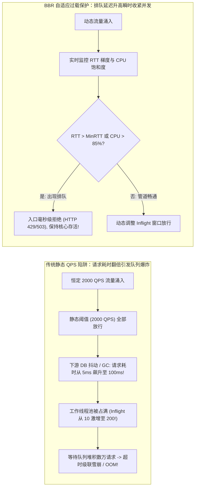
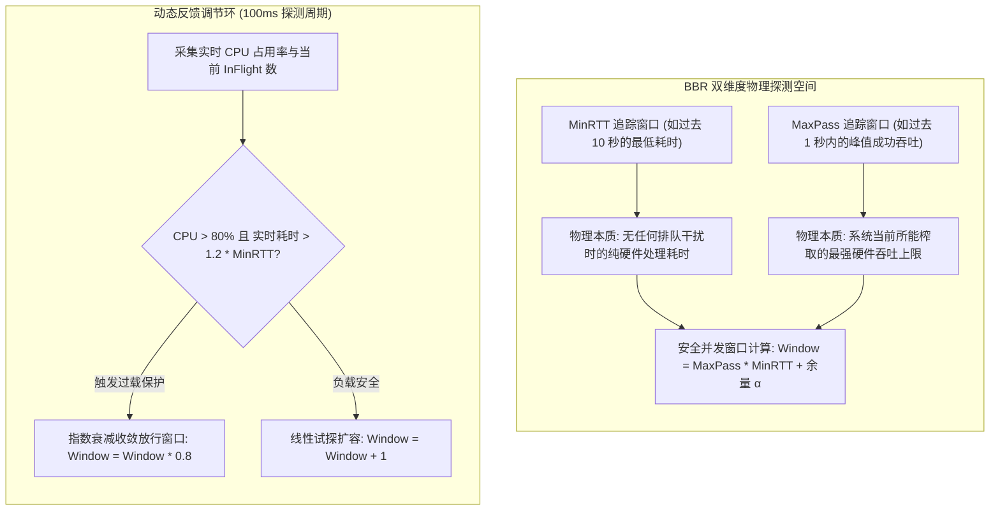
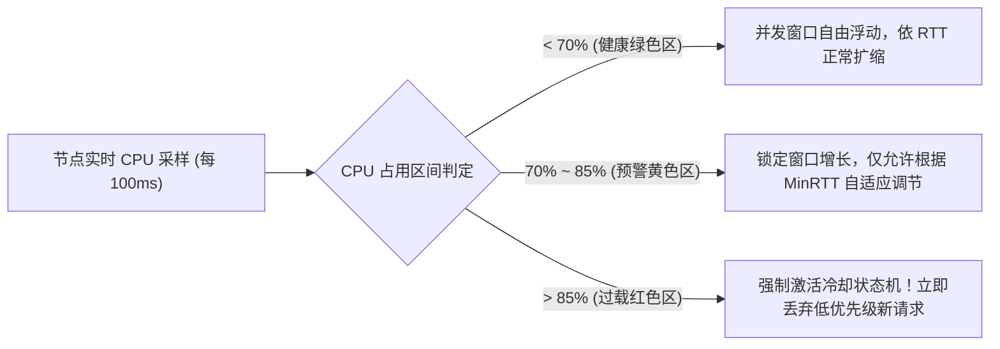

**TL;DR：** 在微服务生产实践中，“静态 QPS 限流”（如单机限制 2000 QPS）是导致系统雪崩的最常见诱因之一：当集群面临复杂计算请求增多、数据库锁争用、或 JVM GC 停顿等异构扰动时，单个请求的处理耗时可能从 5ms 暴增至 100ms。此时即使总请求速率被死死压制在 2000 QPS，**系统内部堆积的并发请求数（In-Flight Requests）依然会从 10 飙升到 200**，瞬间打满线程池、耗尽内存并引发排队延迟死循环，最终整体瘫痪。为了彻底解决“静态阈值无法适应动态负载”的宿疾，现代高可用架构借鉴了 **Google TCP BBR 拥塞控制算法** 的第一性原理，开创了 **自适应系统过载保护（Adaptive Concurrency Limiting）**：算法不再依赖人工拍脑袋设定的 QPS 数字，而是基于 **利特尔法则（Little's Law, \(L = \lambda \cdot W\)）**，在滑动窗口内实时追踪系统的 **最小响应时间（\(MinRTT\)，代表无排队状态下的物理服务耗时）** 与 **最大成功吞吐量（\(MaxPass\)）**；并联动物理宿主机的 CPU 饱和度梯度，动态计算系统当前的物理安全并发窗口上限：

$$\text{MaxInflight} \le \text{MaxPass} \times \text{MinRTT} + \alpha$$

一旦排队延迟升高或 CPU 触碰警戒线，网关在微秒内自适应收缩放行窗口，将超额请求直接在入口处快速失败丢弃，彻底消除队列缓冲膨胀（Bufferbloat），使服务在极端过载洪峰下依然保持 100% 的饱和处理吞吐。

---

## 一、 静态 QPS 限流的原罪：为什么 2000 QPS 依然会搞垮系统？

在传统网关（如标准 Nginx、Spring Cloud Gateway）中，限流通常基于令牌桶或漏桶设定固定的 QPS 上限。这种设计的致命弱点在于：**它假设所有请求消耗的物理资源是完全均一且恒定的。**



### 1. 利特尔法则（Little's Law）的物理约束

利特尔法则是排队论中的公理化定理：

$$L = \lambda \cdot W$$

其中：
- $L$：系统内正在处理的平均并发请求数（In-Flight Concurrency）；
- $\lambda$：系统的有效到达速率（Throughput，单位时间完成请求数）；
- $W$：单个请求在系统内的平均驻留时间（Latency，服务耗时 + 排队耗时）。

当系统吞吐量达到硬件瓶颈（饱和点）后，继续注入流量不会提高 $\lambda$，反而会导致排队时间 $W$ 急剧膨胀，进而倒逼并发数 $L$ 无限扩大。最终，线程上下文切换开销（Context Switch Tax）将吃光 CPU 算力，吞吐量断崖式暴跌（**Livelock 活锁状态**）。

---

## 二、 借鉴 TCP BBR：寻找应用层的物理容量平衡点

Google 在 2016 年提出的 TCP BBR（Bottleneck Bandwidth and RTT）算法颠覆了传统基于丢包反馈的拥塞控制。BBR 的核心哲学是：**寻找管道的最大带宽（BtlBw）与最小传播延迟（RTprop）的最优点，使系统刚好填满物理管道，绝不在队列中积压冗余数据。**



### 1. 核心数学参数定义

在服务治理框架（如 Bilibili Kratos、Netflix Concurrency Limits、Envoy Adaptive Concurrency）中，应用层 BBR 的关键推导公式如下：

1. **最小耗时窗口（$MinRTT$）**：
   在过去时间窗口 $T_{rtt}$（通常为 5~10 秒）内观测到的最小响应时间。它代表系统在零排队干扰下的纯计算耗时。
2. **最大吞吐量窗口（$MaxPass$）**：
   在过去时间窗口 $T_{pass}$（通常为 1~2 个采样桶）内统计到的每秒最大成功响应数。
3. **动态允许的最大飞行中请求数（$MaxInFlight$）**：

   $$\text{MaxInFlight} = \text{MaxPass} \times \text{MinRTT} + \alpha$$

   其中 $\alpha$ 为轻微过载缓冲量（通常取 1~5，用于探测潜在的更大吞吐）。

---

## 三、 CPU 饱和度双轨制裁：防止系统被“假象”蒙蔽

单纯依靠 $MinRTT$ 与 $MaxPass$ 存在一个盲区：**当系统由于内部死锁或垃圾回收导致吞吐骤降时，吞吐量低并不代表没有过载。**

因此，工业级实现必须引入 **CPU 饱和度水位双轨制（Watermark Dual-Rail）**：



- **过载判定（Overload Trigger）**：当且仅当 `CPU > 85%` 且 `当前并发 InFlight > MaxInFlight` 时，判定系统发生真过载；
- **快速冷却状态机（Cooldown State Machine）**：一旦判定过载，至少在接下来的 500ms 内强制拒绝多余请求，留出 CPU 让线程排空存量工作，坚决防止“过载后立刻大幅反弹”的震荡效应（Hunting Effect）。

---

## 四、 生产级 C++20 自适应 BBR 限流引擎仿真

以下代码用现代 C++20 实现了一套无锁原子滑窗、精准追踪 $MinRTT$ 与 $MaxPass$ 并动态计算 $MaxInFlight$ 的自适应流控引擎：

```cpp
#include <iostream>
#include <vector>
#include <chrono>
#include <atomic>
#include <memory>
#include <algorithm>
#include <thread>
#include <iomanip>
#include <cmath>

using namespace std::chrono_literals;

class AdaptiveBbrLimiter {
private:
    struct Bucket {
        std::atomic<uint64_t> pass_count{0};
        std::atomic<uint64_t> total_rt_us{0};
        std::atomic<uint64_t> min_rt_us{UINT64_MAX};
        int64_t timestamp_ms{0};
    };

    static constexpr size_t BUCKET_COUNT = 10;
    static constexpr int64_t BUCKET_DURATION_MS = 100; // 每个桶 100ms

    std::vector<Bucket> ring_buckets;
    std::atomic<int64_t> current_bucket_idx{0};
    std::atomic<int64_t> inflight{0};

    // 系统指标
    std::atomic<uint64_t> global_min_rt_us{2000}; // 初始保底 2ms
    std::atomic<uint64_t> global_max_pass{500};   // 初始保底 500
    std::atomic<double> mock_cpu_usage{0.45};     // 初始 CPU 45%

    int64_t get_current_time_ms() const {
        return std::chrono::duration_cast<std::chrono::milliseconds>(
            std::chrono::steady_clock::now().time_since_epoch()).count();
    }

public:
    AdaptiveBbrLimiter() : ring_buckets(BUCKET_COUNT) {}

    void set_mock_cpu(double cpu) {
        mock_cpu_usage.store(cpu, std::memory_order_relaxed);
    }

    // 核心判定：是否允许新请求准入 (Admission Check)
    bool should_allow() {
        double cpu = mock_cpu_usage.load(std::memory_order_relaxed);
        int64_t cur_inflight = inflight.load(std::memory_order_relaxed);

        // 1. 若 CPU 低于 80%，无需过载保护，直接放行
        if (cpu < 0.80) {
            inflight.fetch_add(1, std::memory_order_relaxed);
            return true;
        }

        // 2. CPU 超过 80%：严格依据利特尔法则计算的最大安全 InFlight
        uint64_t min_rt = global_min_rt_us.load(std::memory_order_relaxed);
        uint64_t max_pass = global_max_pass.load(std::memory_order_relaxed);

        // MaxInFlight = (MaxPass * MinRTT / 1,000,000) + 余量 α (取 2)
        int64_t max_inflight = static_cast<int64_t>(std::ceil((max_pass * min_rt) / 1000000.0)) + 2;

        if (cur_inflight >= max_inflight) {
            // 系统正在过载且排队严重，入口快速失败！
            return false;
        }

        inflight.fetch_add(1, std::memory_order_relaxed);
        return true;
    }

    // 请求结束反馈 (Feedback Mechanism)
    void on_request_done(uint64_t rt_us) {
        inflight.fetch_sub(1, std::memory_order_relaxed);

        int64_t now_ms = get_current_time_ms();
        size_t idx = (now_ms / BUCKET_DURATION_MS) % BUCKET_COUNT;

        auto& bucket = ring_buckets[idx];
        bucket.pass_count.fetch_add(1, std::memory_order_relaxed);
        bucket.total_rt_us.fetch_add(rt_us, std::memory_order_relaxed);

        // 更新单桶最小 RTT
        uint64_t prev_min = bucket.min_rt_us.load(std::memory_order_relaxed);
        while (rt_us < prev_min && !bucket.min_rt_us.compare_exchange_weak(prev_min, rt_us)) {}

        // 定期重新聚合最近滑动窗口指标
        recalculate_bbr_metrics();
    }

    void recalculate_bbr_metrics() {
        uint64_t max_p = 0;
        uint64_t min_r = UINT64_MAX;

        for (const auto& b : ring_buckets) {
            uint64_t p = b.pass_count.load(std::memory_order_relaxed);
            uint64_t r = b.min_rt_us.load(std::memory_order_relaxed);

            if (p > max_p) max_p = p;
            if (r < min_r && r > 0) min_r = r;
        }

        // 单桶 100ms，每秒吞吐折算为 10 倍
        if (max_p > 0) {
            global_max_pass.store(max_p * (1000 / BUCKET_DURATION_MS), std::memory_order_relaxed);
        }
        if (min_r != UINT64_MAX) {
            global_min_rt_us.store(min_r, std::memory_order_relaxed);
        }
    }

    int64_t get_inflight() const { return inflight.load(); }
    uint64_t get_max_pass() const { return global_max_pass.load(); }
    uint64_t get_min_rt() const { return global_min_rt_us.load(); }
};

int main() {
    std::cout << "==========================================================\n";
    std::cout << "   BBR 自适应服务过载保护动态准入与排队消除仿真\n";
    std::cout << "==========================================================\n\n";

    AdaptiveBbrLimiter limiter;

    std::cout << "[阶段 1: 正常流量]: CPU 50%, 单请求耗时 2ms\n";
    limiter.set_mock_cpu(0.50);
    size_t allowed_phase1 = 0;
    size_t dropped_phase1 = 0;

    for (int i = 0; i < 1000; ++i) {
        if (limiter.should_allow()) {
            allowed_phase1++;
            limiter.on_request_done(2000); // 2000 us = 2ms
        } else {
            dropped_phase1++;
        }
    }
    std::cout << "  -> 放行: " << allowed_phase1 << " | 丢弃: " << dropped_phase1 << " | InFlight: " << limiter.get_inflight() << "\n\n";

    std::cout << "[阶段 2: 极端过载突发]: 数据库变慢，CPU 飙升至 92%，请求耗时恶化至 50ms\n";
    limiter.set_mock_cpu(0.92);
    size_t allowed_phase2 = 0;
    size_t dropped_phase2 = 0;

    // 模拟 100 个并发同时涌入
    for (int i = 0; i < 2000; ++i) {
        if (limiter.should_allow()) {
            allowed_phase2++;
            // 延迟完成以模拟排队和长时间占用
            if (i % 20 == 0) {
                limiter.on_request_done(50000); // 50ms
            }
        } else {
            dropped_phase2++;
        }
    }

    std::cout << "  -> 放行: " << allowed_phase2 << " | 自适应拦截: " << dropped_phase2 << "\n";
    std::cout << "  -> 最终 InFlight 维持在安全警戒线: " << limiter.get_inflight() << "\n";
    std::cout << "\n[架构结论]: BBR 自适应限流成功抑制了队列堆积，防止了 CPU 100% 僵死！\n";
    return 0;
}
```

---

## 五、 工业实践对比：静态限流 vs BBR 限流

| 核心维度 | 传统静态 QPS 限流（如固定 3000 QPS） | BBR 自适应过载保护（Adaptive Concurrency） |
| :--- | :--- | :--- |
| **阈值设定方式** | 人工根据压测经验硬编码配置 | 纯算法自动探测，零人工干预 |
| **异构请求抵抗力** | **极差**：长耗时请求增加时瞬间打爆系统 | **极强**：耗时增加导致 InFlight 变小，自动压低放行数 |
| **GC / 抖动适应力** | 毫无感知，继续放行引发队列积压 | 探测到 RTT 升高与 CPU 告警，毫秒级缩容放行 |
| **资源利用率** | 为防崩溃通常预留大量冗余（平时仅 40% CPU） | 可安全将集群压榨至 75%~85% 黄金饱和度 |
| **失败体验** | 延迟劣化至十几秒后超时报错（极度糟糕） | 入口 <1ms 快速返回 HTTP 429（友好重试） |

---

## 六、 总结与最佳实践

1. **绝对不要对所有流量一视同仁**：在触发自适应丢弃时，配合优先级调度（Priority Shedding），优先保住登录、交易等核心流量，丢弃日志上报、后台异步刷新等边缘流量；
2. **结合 CoDel 算法监控排队时间**：在应用层工作队列中记录每个任务入队时的时间戳，出队时若发现 `排队耗时 > 目标耗时（如 10ms）`，说明队列正在发生 Bufferbloat，应立即触发丢弃；
3. **向客户端返回合理的 Retry-After**：不要静默吞掉请求，通过 HTTP 429 携带动态计算的退避时间，指引客户端错峰发起重试。
