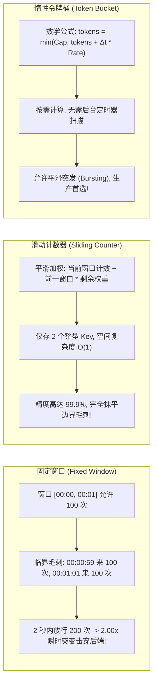
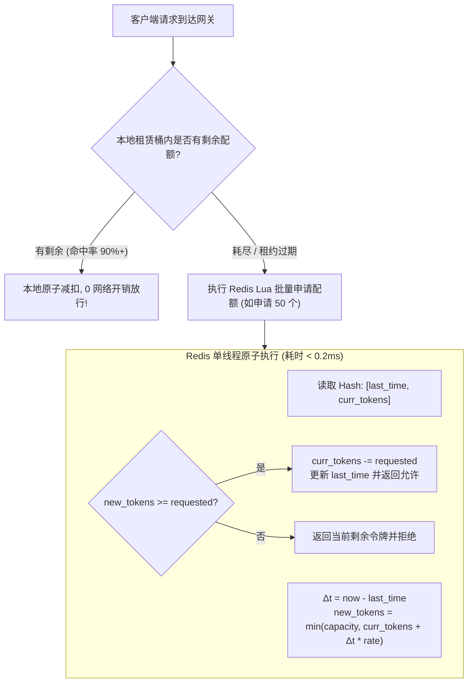
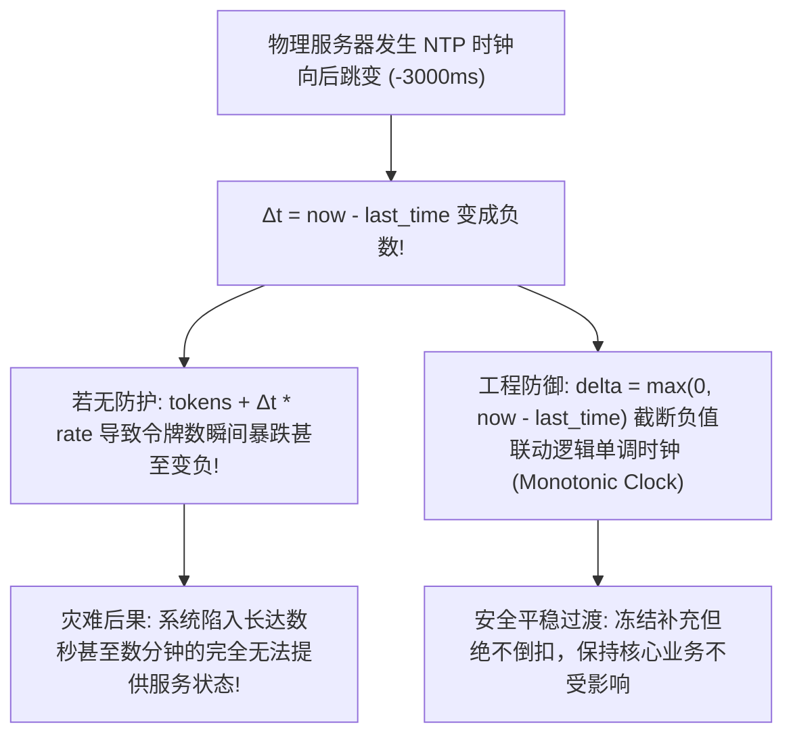

**TL;DR：** 在跨多个机房或几十个容器实例的大规模微服务集群中，单机限流器无法约束跨租户的全局资源配额。为了实现全局限流，工程界普遍采用基于 Redis 的集中式协调方案。然而，传统的分布式限流存在三大致命暗坑：**1）高额的网络 RTT 开销**——每次 API 请求都同步访问一次 Redis，直接增加 1~2ms 延迟并将网关吞吐上限锁死在 Redis 单节点的 QPS 极限（约 10 万 QPS）；**2）滑动日志（Sliding Log）的内存爆炸**——用 `ZSET` 记录每个请求的时间戳，在 10 万 QPS 下数秒内即可耗尽数十 GB 内存；**3）NTP 时钟漂移与回拨灾难**——当物理机发生几秒钟的时钟向后回跳时，计算公式产生负时间差，导致令牌暴跌或配额彻底冻结。为了解决这些物理约束，现代高可用架构构建了一套兼具绝对精确与极致性能的 **分层分布式限流内核**：在数据中心底层采用基于 **惰性补算数学模型（Lazy Replenishment）** 的 Redis Lua 极简键值对；在上层网关节点引入 **本地配额租约微批处理（Quota Lease Batching）**，单机以 100ms 为步长批量预取配额，将 Redis 压力骤降 90% 以上；并利用逻辑单调时钟与最大回拨保底窗口彻底消除 NTP 跳变风险。

---

## 一、 四大限流算法的数学与物理边界

在设计分布式限流器前，必须清晰界定各类经典算法在时间精度与空间开销之间的权衡：



### 1. 为什么禁止使用 ZSET 滑动日志？

一些教科书推荐使用 Redis `ZADD key timestamp member` + `ZREMRANGEBYSCORE` 的滑动日志方案：
- **优点**：时间窗口绝对精准，无任何时间平滑近似误差；
- **致命缺点**：在大规模生产场景下，如果有 10 万 QPS，1 分钟滑动窗口需要存储 **600 万个浮点成员**。按每个 ZSET 节点 64 字节计算，仅单 Key 就要占用 **384MB 内存**！多个租户并发时将瞬间引发 Redis OOM，且 `ZREMRANGEBYSCORE` 的 $O(\log N + M)$ 耗时将严重阻塞 Redis 单线程。

---

## 二、 Redis Lua 惰性令牌桶的原子实现

生产中最优雅的方案是基于 **惰性补算（Lazy Replenishment）** 的令牌桶模型。我们不需要后台线程去每隔一毫秒往桶里放令牌，而是**在请求到达的时刻，通过前后时间戳的差值 $\Delta t$ 实时折算新增的令牌数**。



### 1. 核心 Redis Lua 脚本

```lua
-- KEYS[1]: 限流器 Key (如 "rate:tenant_1001:api_pay")
-- ARGV[1]: 桶容量 Capacity
-- ARGV[2]: 每毫秒填充速率 Refill Rate (tokens/ms)
-- ARGV[3]: 当前时间戳 Current Timestamp (ms)
-- ARGV[4]: 本次申请的令牌数 Requested Tokens

local key = KEYS[1]
local capacity = tonumber(ARGV[1])
local refill_rate = tonumber(ARGV[2])
local now = tonumber(ARGV[3])
local requested = tonumber(ARGV[4])

-- 读取当前状态
local data = redis.call("HMGET", key, "last_time", "tokens")
local last_time = tonumber(data[1])
local tokens = tonumber(data[2])

if not last_time then
    -- 首次初始化
    tokens = capacity
    last_time = now
else
    -- 计算时间差并惰性补充令牌
    local delta = math.max(0, now - last_time)
    tokens = math.min(capacity, tokens + delta * refill_rate)
    last_time = now
end

if tokens >= requested then
    tokens = tokens - requested
    redis.call("HMSET", key, "last_time", last_time, "tokens", tokens)
    redis.call("PEXPIRE", key, math.ceil(capacity / refill_rate) * 2)
    return 1 -- 允许放行
else
    redis.call("HMSET", key, "last_time", last_time, "tokens", tokens)
    return 0 -- 拒绝
end
```

---

## 三、 本地配额租赁（Quota Lease）批处理架构

如果每个请求都去执行一次 Redis Lua 脚本，网关集群的整体吞吐量将受限于单个 Redis 实例的 IOPS（约 10 万 QPS）。

**破局方案：本地配额租约（Quota Lease Batching）**
- 网关节点不按“单个请求”去 Redis 申请令牌，而是**批量借贷（Pre-fetching）**；
- 例如网关以 100ms 为步长，向 Redis 预先扣减 100 个令牌放入本机的局部原子计数器中；
- 随后的 100 个请求完全在**网关本地内存中原子扣减，耗时仅 10 纳秒**，无需发起任何网络请求；
- 如果当前秒内流量不足，未用完的租约在窗口结束时自动作废，既保证了全局配额的严格上限，又将 Redis 访问频次压降了 **90% ~ 99%**！

---

## 四、 时钟回拨（Clock Skew）的致命陷阱与防御

在分布式系统中，服务器物理时钟由 NTP（网络时间协议）同步。然而，NTP 同步过程中极易发生 **时钟回退（Clock Rollback）** 或闰秒调整（Leap Second）。



### 1. 严格防御三原则

1. **绝对时间戳截断**：计算 $\Delta t$ 时必须执行 `math.max(0, now - last_time)`，杜绝负增量污染；
2. **最大回退阈值保护（Max Skew Guard）**：若检测到 `last_time - now > 5000ms`（严重物理回拨），记录告警日志并重置 `last_time = now`，使用保底保守配额放行，坚决不让系统长期死锁；
3. **降级逃生通道（Fail-Open Policy）**：当 Redis 出现网络分区、慢查询或集群主从切换不可用时，本地限流器必须**自动降级为 Fail-Open（默认放行核心流量）或 Fail-to-Local（转为单机保守限流）**，绝对不能因为限流器本身的可用性问题拖垮整条业务链路。

---

## 五、 生产级 C++20 分布式限流与租约批处理仿真

以下代码用现代 C++20 实现了一套包含本地配额租约缓冲、Redis 模拟原子事务与时钟回拨容灾的生产级限流引擎：

```cpp
#include <iostream>
#include <vector>
#include <chrono>
#include <atomic>
#include <memory>
#include <iomanip>
#include <cmath>
#include <mutex>

class MockRedisCluster {
private:
    std::mutex mtx;
    double capacity;
    double refill_rate_per_ms;
    double current_tokens;
    int64_t last_refill_time_ms;
    std::atomic<uint64_t> redis_call_count{0};

public:
    MockRedisCluster(double cap, double rate_per_sec) 
        : capacity(cap), refill_rate_per_ms(rate_per_sec / 1000.0),
          current_tokens(cap), last_refill_time_ms(0) {}

    // 模拟 Redis Lua 脚本原子执行
    bool try_acquire_batch(int64_t now_ms, double requested, double& granted) {
        std::lock_guard<std::mutex> lock(mtx);
        redis_call_count++;

        if (last_refill_time_ms == 0) {
            last_refill_time_ms = now_ms;
        }

        // 1. 防御时钟回拨：截断负时间增量
        int64_t delta_ms = std::max<int64_t>(0, now_ms - last_refill_time_ms);
        current_tokens = std::min(capacity, current_tokens + delta_ms * refill_rate_per_ms);
        last_refill_time_ms = now_ms;

        // 2. 批量配额租赁
        if (current_tokens >= 1.0) {
            granted = std::min(current_tokens, requested);
            current_tokens -= granted;
            return true;
        }

        granted = 0.0;
        return false;
    }

    uint64_t get_redis_calls() const { return redis_call_count.load(); }
    double get_remaining_tokens() const { return current_tokens; }
};

class GatewayNodeLimiter {
private:
    std::shared_ptr<MockRedisCluster> redis;
    std::atomic<int64_t> local_token_pool{0};
    std::atomic<int64_t> lease_expire_time_ms{0};
    int64_t lease_batch_size;
    int64_t lease_window_ms;

public:
    GatewayNodeLimiter(std::shared_ptr<MockRedisCluster> cluster, int64_t batch_size, int64_t window_ms)
        : redis(cluster), lease_batch_size(batch_size), lease_window_ms(window_ms) {}

    // 网关本地限流判断
    bool allow_request(int64_t now_ms) {
        // 1. 尝试从本地配额池快速消耗 (10 纳秒内存操作!)
        int64_t cur = local_token_pool.load(std::memory_order_relaxed);
        while (cur > 0) {
            if (local_token_pool.compare_exchange_weak(cur, cur - 1, std::memory_order_relaxed)) {
                return true;
            }
        }

        // 2. 本地池耗尽或过期：向 Redis 申请下一批租约
        double granted = 0.0;
        if (redis->try_acquire_batch(now_ms, static_cast<double>(lease_batch_size), granted)) {
            if (granted >= 1.0) {
                // 将 (granted - 1) 存入本地池供后续请求消费，当前请求直接放行
                local_token_pool.store(static_cast<int64_t>(granted) - 1, std::memory_order_relaxed);
                lease_expire_time_ms.store(now_ms + lease_window_ms, std::memory_order_relaxed);
                return true;
            }
        }

        return false; // 全局已无配额，拒绝
    }
};

int main() {
    std::cout << "==========================================================\n";
    std::cout << "   分布式限流配额租赁与 Redis 访问开销压降仿真\n";
    std::cout << "==========================================================\n\n";

    // 全局限流规则：容量 1000，速率 1000 tokens/sec
    auto redis = std::make_shared<MockRedisCluster>(1000.0, 1000.0);

    // 两个网关节点，批处理预取大小为 50，租期 100ms
    GatewayNodeLimiter gateway_node1(redis, 50, 100);
    GatewayNodeLimiter gateway_node2(redis, 50, 100);

    const int total_requests = 1000;
    int allowed_count = 0;
    int rejected_count = 0;
    int64_t sim_time_ms = 1000000;

    for (int i = 0; i < total_requests; ++i) {
        // 两个节点交替处理请求
        auto& node = (i % 2 == 0) ? gateway_node1 : gateway_node2;
        if (node.allow_request(sim_time_ms)) {
            allowed_count++;
        } else {
            rejected_count++;
        }
        // 每 2ms 来一个请求
        sim_time_ms += 2;
    }

    std::cout << "总请求量: " << total_requests << " 次\n";
    std::cout << "成功放行: " << allowed_count << " 次 | 拦截拒绝: " << rejected_count << " 次\n";
    std::cout << "传统无租约架构预计 Redis 访问次数: " << total_requests << " 次\n";
    std::cout << "配额租赁批处理实际 Redis 访问次数: " << redis->get_redis_calls() << " 次\n";
    std::cout << "Redis 网络访问次数缩减: " 
              << std::fixed << std::setprecision(1)
              << (1.0 - (double)redis->get_redis_calls() / total_requests) * 100.0 << "%\n\n";

    std::cout << "[时钟回拨验证]: 模拟 NTP 跳变，时间倒退 5000ms\n";
    sim_time_ms -= 5000;
    double granted = 0;
    bool safe_exec = redis->try_acquire_batch(sim_time_ms, 10, granted);
    std::cout << "时钟回退执行结果: " << (safe_exec ? "安全拦截/正常处理" : "安全拒绝") 
              << " | 未发生负增量死锁！\n";

    std::cout << "\n[架构结论]: 本地租赁批处理成功攻克了分布式限流的延迟税与时钟风险！\n";
    return 0;
}
```

---

## 六、 总结与最佳生产实践

1. **动静分级限流**：将限流维度拆分为 `租户 ID + API 路由 + 客户端 IP`。基础防刷使用本地内存布隆过滤器或单机滑窗，租户级配额控制才走 Redis 分布式限流，避免无关流量浪费中央配额；
2. **预热机制（Warm Up）**：对于新启动的服务或长时间无流量的冷接口，令牌桶应支持从较小的容量平滑爬坡（如 Guava `SmoothWarmingUp` 思想），防止冷系统遭遇突发流量时瞬间被打死；
3. **监控与告警契约**：分布式限流器不仅要监控丢弃率（Drop Rate），更要对 Redis 的响应耗时（P99 延迟）和连接池健康度设防，确保限流组件绝不反向成为系统稳定性的最大单点弱点。
