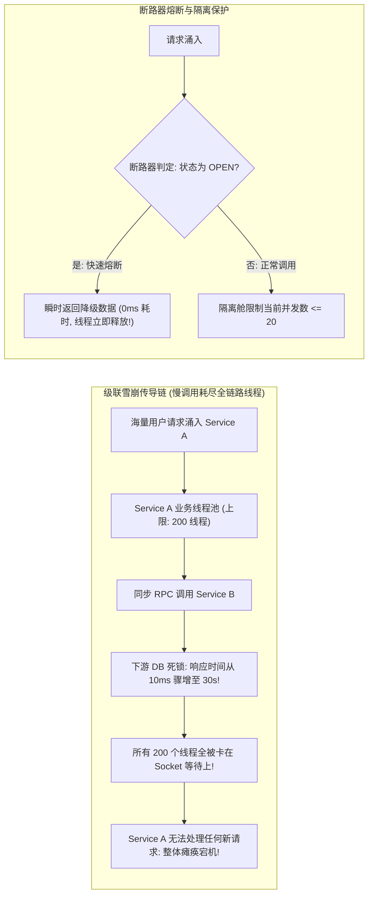
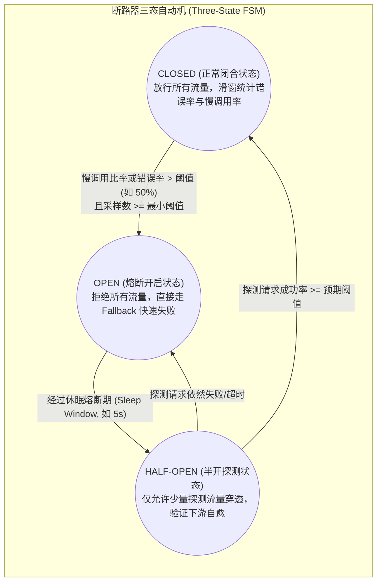
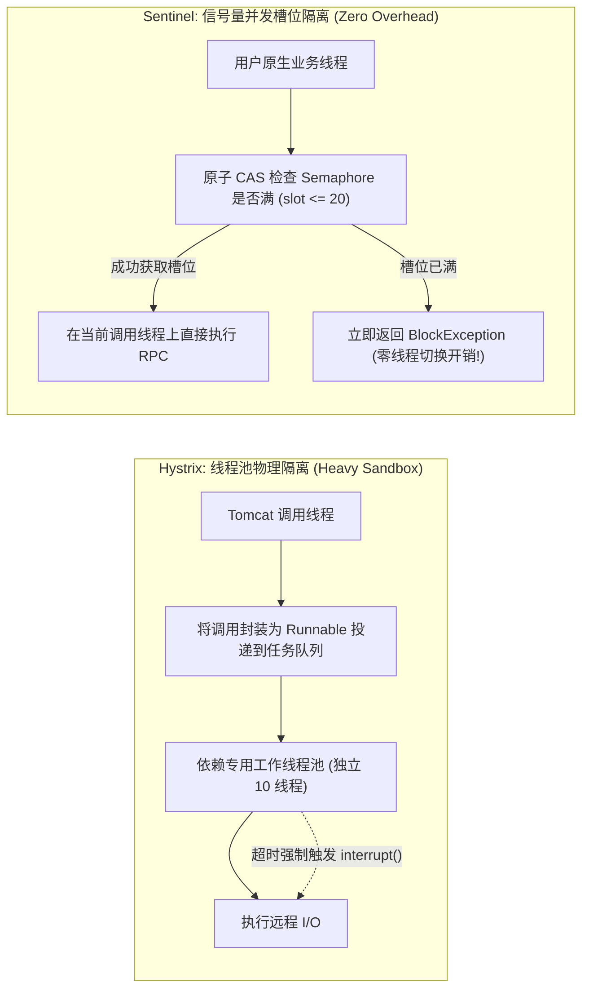
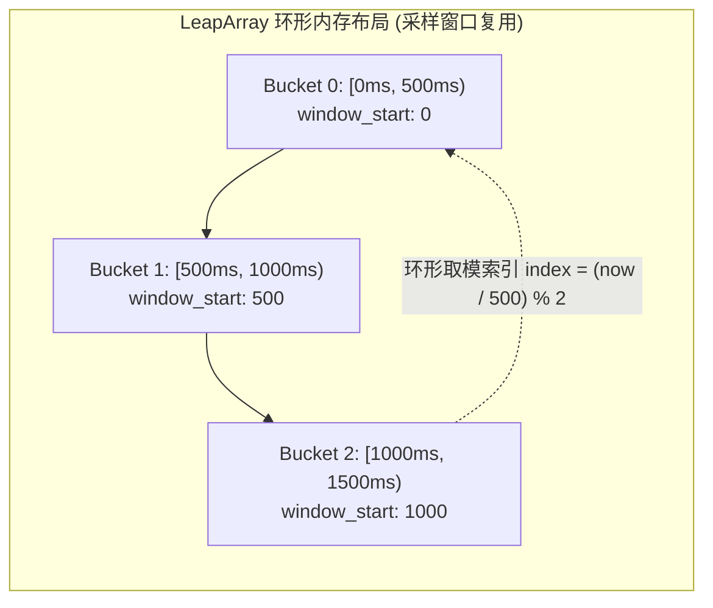

**TL;DR：** 在复杂的分布式微服务拓扑中，**“慢调用”比“快失败”更加致命**：当下游某一个非核心服务由于慢 SQL 或网络丢包出现 10 秒以上的延迟挂起时，上游服务调用方的工作线程会被死死阻塞在 Socket Read 上。在每秒数百请求的冲击下，容器内仅有的 200 个 Tomcat/Netty 业务处理线程会在几秒钟内被全部耗尽，进而引发调用方自身拒绝服务，并沿着调用链路向上传导，最终导致**整座数据中心的分布式级联雪崩（Cascading Failure）**。为了阻断故障扩散，微服务架构引入了 **断路器（Circuit Breaker）** 与 **隔离舱壁（Bulkhead）**。业界发展出了两大截然不同的技术流派：以 **Netflix Hystrix** 为代表的 **线程池物理隔离**，通过为每个依赖分配独立的子线程池实现绝对沙箱化并支持抢占式中断，但代价是沉重的高并发上下文切换开销与内存占用；而以 **Alibaba Sentinel / Envoy** 为代表的 **信号量并发槽位隔离（Semaphore Isolation）**，依托原子 CAS 计数器在原调用线程上就地运行，以几乎为零的 CPU 损耗实现微秒级熔断，但无法强制中断卡死线程。本文系统解构断路器三态机的自愈跃迁机理、LeapArray 无锁滑窗底层实现、以及在现代异步 I/O 时代两大流派的终局选型。

---

## 一、 级联雪崩的物理传导：慢调用如何勒死整个集群？

在微服务系统中，资源池是有限的。常见的同步阻塞模型（如标准 RPC 或 Spring MVC）具有固定的工作线程池上限：



### 1. 线程池耗尽的数学模型

设微服务容器工作线程池大小为 $C = 200$。系统面临的请求到达率为 $\lambda = 100 \text{ req/s}$。
- **正常状态**：下游响应耗时 $T = 20\text{ms} = 0.02\text{s}$。
  根据利特尔法则，占用线程数 $L = \lambda \cdot T = 100 \times 0.02 = 2$ 个线程，系统负载极为健康；
- **异常状态**：下游依赖出现故障，响应耗时飙升至 $T = 5\text{s}$。
  系统维持该吞吐量所需线程数 $L = 100 \times 5 = 500$ 个线程！
  **在不到 2 秒内，全部 200 个线程被锁死**，随后涌入的请求全部进入阻塞队列甚至被抛弃，引发全面雪崩。

---

## 二、 断路器三态自动机：形式化状态转移与自愈探针

断路器本质上是一个**基于故障率反馈的有限状态自动机（FSM）**：



### 1. 状态转移的关键数学守则

1. **最小请求样本门槛（Volume Threshold）**：
   在滑动时间窗口内（如 10 秒），如果总请求数不足（例如设置最小 20 次，当前只有 2 次且都失败），绝对不能触发熔断，防止由于低频访问下的偶发失败导致误触发；
2. **慢调用比例熔断（Slow Call Rate） vs 异常比例熔断（Error Rate）**：
   - 现代断路器不仅统计异常（5xx 或网络抛错），更核心的是统计 **超过预设 RT 阈值（如 500ms）的“慢调用比例”**；
   - 一旦慢调用比例超过 50%，立即熔断，拔掉慢依赖的电源；
3. **半开状态的渐进式自愈（Half-Open Probing）**：
   进入半开状态后，系统绝不能直接全量放行流量（否则脆弱的下游会再次被瞬间压垮），而是采用 **试探性放行（Canary Probing）**，仅允许固定数量的并发（如 5 个请求）访问，连续成功后才安全切回 `CLOSED`。

---

## 三、 两大隔离哲学：Hystrix 线程池 vs Sentinel 信号量

为了实现不同依赖之间的资源隔离，业界诞生了两种物理实现方案：



### 1. 核心特性与物理代价深度对比

| 核心维度 | Hystrix 线程池物理隔离 | Sentinel / Envoy 信号量槽位隔离 |
| :--- | :--- | :--- |
| **隔离级别** | **最高**：依赖之间物理线程完全隔离 | **较高**：共享线程池，仅限制并发槽位数量 |
| **抢占式超时中断** | **支持**：通过 `Future.cancel(true)` 强行中断挂起线程 | **不支持**：必须完全依赖 Socket 自身的 `read_timeout` |
| **CPU 上下文切换** | **极高**：每次 RPC 经历两次跨线程投递与调度 | **零**：直接在当前线程执行，无调度开销 |
| **内存开销** | **沉重**：每个依赖维护独立队列与线程（1MB/线程） | **极小**：仅为几个原子整型计数器（数十字节） |
| **适用编程范式** | 传统同步阻塞式老旧系统 | 现代非阻塞异步编程（Netty / WebFlux / Go / Rust） |

---

## 四、 Sentinel LeapArray：无锁环形滑动窗口实现

传统的滑动窗口如果每秒都新建数组会导致频繁的 GC 和锁争用。Sentinel 设计了精巧的 **`LeapArray`（环形滑动窗口数组）**：



- 将 1 秒拆分为例如 2 个 500ms 的采样桶（Bucket）；
- 根据当前时间戳计算桶在环形数组中的索引：`idx = (time / window_length) % array_length`；
- 使用原子 `compareAndSet` 进行时间戳覆写：当时间流逝到新的一圈时，直接原子重置旧桶的计数器并更新 `window_start`，**全程无全局互斥锁，单核读取性能达到数千万 QPS！**

---

## 五、 生产级 C++20 断路器与双模式隔离仿真

以下代码用现代 C++20 实现了一套包含完整三态机逻辑、信号量槽位限制与熔断降级自愈的生产级断路器引擎：

```cpp
#include <iostream>
#include <vector>
#include <chrono>
#include <atomic>
#include <memory>
#include <iomanip>
#include <thread>
#include <cstdint>

enum class CircuitState {
    CLOSED,
    OPEN,
    HALF_OPEN
};

class CircuitBreaker {
private:
    std::atomic<CircuitState> state{CircuitState::CLOSED};
    std::atomic<int64_t> last_state_change_ms{0};
    
    // 配置参数
    const int64_t sleep_window_ms = 2000;    // 熔断后休眠 2 秒进入半开
    const double error_rate_threshold = 0.50; // 错误率超过 50% 触发熔断
    const uint64_t min_request_threshold = 10; // 窗口最小采样请求数
    const int32_t max_concurrency = 5;       // 信号量最大并发隔离槽位

    // 统计指标
    std::atomic<uint64_t> total_requests{0};
    std::atomic<uint64_t> failed_requests{0};
    std::atomic<int32_t> current_inflight{0};
    std::atomic<uint64_t> half_open_success_count{0};

    int64_t get_now_ms() const {
        return std::chrono::duration_cast<std::chrono::milliseconds>(
            std::chrono::steady_clock::now().time_since_epoch()).count();
    }

public:
    CircuitBreaker() {
        last_state_change_ms = get_now_ms();
    }

    // 准入判定：信号量隔离 + 状态机拦截
    bool try_acquire() {
        int64_t now = get_now_ms();
        CircuitState cur_state = state.load(std::memory_order_relaxed);

        // 1. 检查 OPEN 状态是否可以跃迁为 HALF_OPEN
        if (cur_state == CircuitState::OPEN) {
            if (now - last_state_change_ms.load() >= sleep_window_ms) {
                // 尝试 CAS 跃迁为 HALF_OPEN
                CircuitState expected = CircuitState::OPEN;
                if (state.compare_exchange_strong(expected, CircuitState::HALF_OPEN)) {
                    last_state_change_ms.store(now);
                    half_open_success_count.store(0);
                    std::cout << "[状态机事件]: 熔断休眠期满，跃迁为 HALF-OPEN (半开试探状态)\n";
                }
            } else {
                return false; // 处于熔断冷却中，直接拒绝
            }
        }

        // 2. 信号量并发槽位检查 (Bulkhead Isolation)
        int32_t cur = current_inflight.load(std::memory_order_relaxed);
        while (cur < max_concurrency) {
            if (current_inflight.compare_exchange_weak(cur, cur + 1, std::memory_order_relaxed)) {
                return true; // 成功获取执行槽位
            }
        }

        // 并发槽位已满，触发隔离保护
        return false;
    }

    // 调用结果反馈
    void on_result(bool success) {
        current_inflight.fetch_sub(1, std::memory_order_relaxed);
        total_requests.fetch_add(1, std::memory_order_relaxed);
        if (!success) {
            failed_requests.fetch_add(1, std::memory_order_relaxed);
        }

        CircuitState cur_state = state.load(std::memory_order_relaxed);

        // 半开状态下的自愈判定
        if (cur_state == CircuitState::HALF_OPEN) {
            if (success) {
                if (half_open_success_count.fetch_add(1) >= 3) {
                    state.store(CircuitState::CLOSED);
                    last_state_change_ms.store(get_now_ms());
                    total_requests.store(0);
                    failed_requests.store(0);
                    std::cout << "[状态机事件]: 探测请求连续成功，断路器完全复位为 CLOSED！\n";
                }
            } else {
                state.store(CircuitState::OPEN);
                last_state_change_ms.store(get_now_ms());
                std::cout << "[状态机事件]: 半开探测失败，重新熔断进入 OPEN！\n";
            }
            return;
        }

        // CLOSED 状态下的熔断触发判定
        if (cur_state == CircuitState::CLOSED) {
            uint64_t total = total_requests.load();
            if (total >= min_request_threshold) {
                double error_rate = static_cast<double>(failed_requests.load()) / total;
                if (error_rate >= error_rate_threshold) {
                    state.store(CircuitState::OPEN);
                    last_state_change_ms.store(get_now_ms());
                    std::cout << "[状态机事件]: 错误率达到 " << (error_rate * 100) 
                              << "% >= 50%，断路器跳闸熔断进入 OPEN！\n";
                }
            }
        }
    }

    CircuitState get_state() const { return state.load(); }
};

int main() {
    std::cout << "==========================================================\n";
    std::cout << "   断路器三态自动机与并发隔离槽位仿真引擎\n";
    std::cout << "==========================================================\n\n";

    CircuitBreaker breaker;

    std::cout << "[阶段 1: 下游突发故障]: 连续注入 15 次失败请求\n";
    for (int i = 0; i < 15; ++i) {
        if (breaker.try_acquire()) {
            breaker.on_result(false); // 模拟依赖调用全部失败
        }
    }

    std::cout << "当前断路器状态: " << (breaker.get_state() == CircuitState::OPEN ? "OPEN (熔断)" : "其他") << "\n\n";

    std::cout << "[阶段 2: 熔断期快速失败验证]: 在 OPEN 状态下发起 5 次调用\n";
    size_t rejected = 0;
    for (int i = 0; i < 5; ++i) {
        if (!breaker.try_acquire()) {
            rejected++;
        }
    }
    std::cout << "  -> 拦截次数: " << rejected << " / 5 (全部快速失败，保护系统不受慢调用拖累)\n\n";

    std::cout << "[阶段 3: 等待 2.1 秒进入休眠恢复期]...\n";
    std::this_thread::sleep_for(std::chrono::milliseconds(2100));

    std::cout << "[阶段 4: 下游恢复健康，发起半开试探请求]:\n";
    for (int i = 0; i < 5; ++i) {
        if (breaker.try_acquire()) {
            breaker.on_result(true); // 试探流量成功
        }
    }

    std::cout << "\n最终断路器状态: " 
              << (breaker.get_state() == CircuitState::CLOSED ? "CLOSED (健康完全自愈)" : "其他") << "\n";
    std::cout << "\n[架构结论]: 断路器成功阻断了故障扩散并在下游恢复后实现无损自愈！\n";
    return 0;
}
```

---

## 六、 总结与现代云原生终局选型

1. **异步时代的终局统一**：随着微服务通信全面转向 gRPC、Netty 与 Go 协程（Goroutine），**信号量槽位隔离（Semaphore Isolation）已经成为了绝对的工业主流**。因为在非阻塞事件驱动模型中，一个物理线程可以轻松管理数万个 I/O 连接，为每个服务绑定专用操作系统线程池的做法已被时代淘汰；
2. **熔断与降级契约（Fallback Design）**：断路器跳闸后绝不能简单抛出 500 内部错误，而必须提供降级兜底方案：
   - 读请求：返回本地过期缓存数据（Stale Cache）或静态默认数据；
   - 写请求：写入可靠的消息队列（Dead Letter Queue）或提示用户排队稍后重试；
3. **指标协同**：断路器必须通过 Prometheus / OpenTelemetry 实时暴露当前状态值（0=Closed, 1=Half-Open, 2=Open）与拒绝计数器，联动报警系统在触发熔断的第 1 秒通报值班工程师。
