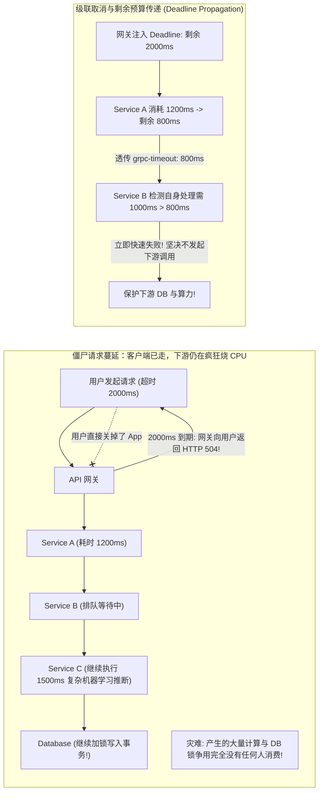
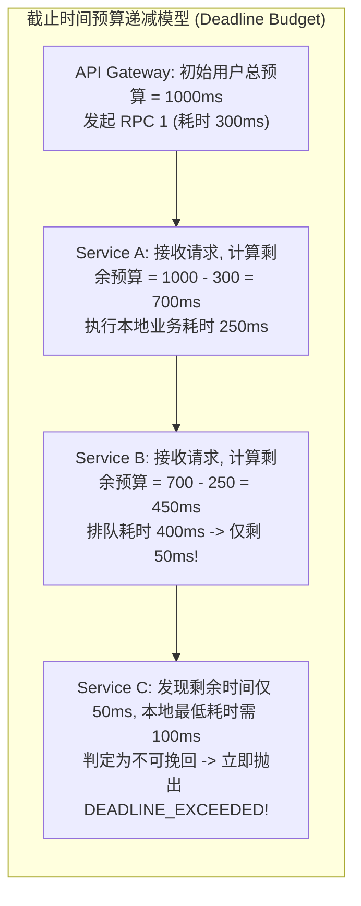
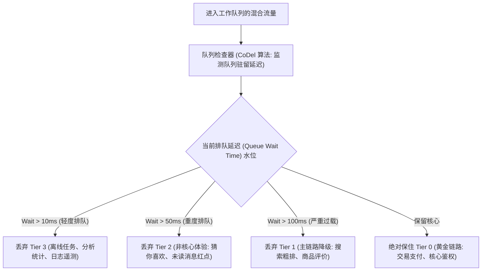

**TL;DR：** 在复杂的分布式微服务调用拓扑中，存在着一种极为致命却极难察觉的系统内耗——**“死工浪费”（Wasted Work）与“僵尸请求”（Ghost Requests）**：当用户在手机端等待 3 秒不耐烦并点击了返回退出，或者最外层 API 网关因为达到 2 秒超时已经向前端返回了 HTTP 504 时，**后端的数十个微服务节点却浑然不知，依然在深层链路中耗费宝贵的 CPU 算力拼命执行复杂排序、乃至在数据库上执行高负载事务！** 此外，如果父调用超时设置为 1 秒，经过前两跳耗时 900ms 后，第三跳服务如果依然按照自己本地默认的 800ms 超时发起 SQL 查询，则**该查询从发起的第一毫秒起就注定是 100% 毫无意义的徒劳**。为了彻底根除无效计算，现代分布式架构必须构建 **端到端级联超时传递（Deadline Propagation）** 与 **优先级负载脱落（Priority Load Shedding）** 体系：通过 W3C Baggage 或 gRPC `grpc-timeout` 请求头，在服务网格中向下游严格透传**剩余可用时间预算（Remaining Deadline Budget）**；下游节点在任务出队时若发现“已无足够时间完成”，立即在第一微秒就地放弃（Drop）；并在客户端断连时通过 HTTP/2 `RST_STREAM` 信号向下游级联穿透中断，将集群的无效 CPU 浪费瞬间削减 70% 以上。

---

## 一、 僵尸请求的恐怖蔓延：为什么你的集群在做“无用功”？

在没有超时传递与全链路取消机制的系统中，分布式调用链就像一辆没有刹车系统的多节列车：



### 1. 死工的恶性正反馈死锁（Death Spiral）

1. **上游不断重试**：因为超时，客户端或网关自动触发重试；
2. **存量死工未销**：前一次超时引发的慢查询还在数据库中咬住锁资源和连接池；
3. **新重试雪上加霜**：新进入的重试请求与老僵尸请求在数据库线程池里撞车，排队进一步拉长；
4. **全集群陷入假死**：CPU 占用高达 100%，数据库活跃连接打满，然而实际有效成功率（Goodput）趋近于 **0%**！

---

## 二、 分布式截止时间传递（Deadline Propagation）机理

在微服务 RPC 调用中，绝不能使用各个节点本地各自配置的固定超时（如每个服务都配置 `timeout = 3s`）。



### 1. 为什么透传相对时间（Relative Duration）优于绝对时间戳（Absolute Epoch）？

在 HTTP/gRPC 传输中，传递超时的协议设计至关重要：
- **绝对时间戳（如 `X-Deadline: 1730000000500`）的致命陷阱**：
  分布式集群中不同物理主机的硬件时钟不可避免存在 **NTP 时钟偏斜（Clock Skew，通常在 5~50ms 之间）**。如果上游服务器时钟比下游快 50ms，下游会误以为还剩 50ms；如果上游比下游慢，下游可能一接到请求就误判定“已经超时”而全部拒绝。
- **最佳实践：传递相对毫秒数（如 gRPC 的 `grpc-timeout: 800m`）**：
  上游在每次发起远程调用前，计算 `RemainingTime = LocalDeadline - (Now - StartTime)`，并作为相对时间头部注入。下游节点只以自身节点的单调时钟（Monotonic Clock）递减，**完全免疫跨节点的 NTP 物理时钟差异！**

---

## 三、 优先级负载脱落（Priority Load Shedding）

当系统遭遇极端突发过载（如秒杀或突发热点）时，除了截止时间传递外，还必须引入 **分层优先级丢弃（Priority Shedding）**：



### 1. 流量优先级分级矩阵

| 优先级分级 | 业务场景代表 | 超载时的脱落策略（Shedding Policy） |
| :--- | :--- | :--- |
| **Tier 0（核心不可妥协）** | 订单支付、库存原子扣减、核心登录鉴权 | **绝对不主动丢弃**，享有最高的资源保留保障 |
| **Tier 1（交互核心）** | 首页商品流展示、搜索核心结果、购物车结算 | 仅在系统濒临宕机边缘（排队 > 100ms）时降级丢弃 |
| **Tier 2（增值体验）** | 推荐算法流、商品热度计数、实时徽标红点 | 只要排队延迟开始恶化（排队 > 30ms），优先大批量剪枝 |
| **Tier 3（后台异步）** | 用户行为埋点上传、数据同步、预热预取 | 遇到任何高负载立刻入口 100% 快速丢弃 |

---

## 四、 生产级 C++20 级联超时与负载脱落引擎仿真

以下代码用现代 C++20 完整模拟了微服务链条中：基于相对时间预算的 Deadline 递减传递、超时提前中断死工、以及基于工作队列排队耗时的优先级负载脱落：

```cpp
#include <iostream>
#include <vector>
#include <chrono>
#include <memory>
#include <string>
#include <iomanip>
#include <deque>
#include <thread>

using namespace std::chrono_literals;

enum class Priority {
    TIER_0_PAYMENT,  // 核心支付
    TIER_1_BROWSING, // 浏览交互
    TIER_2_RECOMMEND // 异步推荐
};

// 模拟分布式上下文 (Distributed Context)
struct RpcContext {
    std::string trace_id;
    int64_t remaining_budget_ms; // 剩余可用相对毫秒数
    Priority priority;
};

struct ExecutionResult {
    bool success;
    std::string failure_reason;
    int64_t wasted_cpu_ms;
};

class DownstreamService {
public:
    // 模拟下游服务执行工作 (预期消耗 300ms 纯计算)
    ExecutionResult process(RpcContext ctx, int64_t queue_delay_ms, int64_t estimated_work_ms = 300) {
        ExecutionResult res;
        res.wasted_cpu_ms = 0;

        // 1. 扣减在队列中白白等待的排队耗时
        ctx.remaining_budget_ms -= queue_delay_ms;

        // 2. 核心第一道防御：Deadline 判定 (在真正消耗 CPU 之前前置拦截!)
        if (ctx.remaining_budget_ms < estimated_work_ms) {
            res.success = false;
            res.failure_reason = "DEADLINE_EXCEEDED (剩余预算 " + 
                                 std::to_string(ctx.remaining_budget_ms) + "ms 不足支持 " + 
                                 std::to_string(estimated_work_ms) + "ms 计算)";
            return res; // 零 CPU 浪费，就地快速失败！
        }

        // 3. 模拟真正执行业务计算
        res.success = true;
        res.failure_reason = "OK";
        return res;
    }
};

class MicroserviceLoadManager {
private:
    DownstreamService downstream;

public:
    void execute_chain_simulation() {
        std::cout << "==========================================================\n";
        std::cout << "   分布式 Deadline 传递与死工削减对比仿真\n";
        std::cout << "==========================================================\n\n";

        // 场景 A: 传统无超时传递系统 (每个服务硬编码 500ms 超时)
        std::cout << "[场景 A: 传统架构 - 无 Deadline 传递]:\n";
        int64_t traditional_wasted_cpu = 0;
        {
            int64_t initial_user_timeout = 500; // 用户总预算 500ms
            int64_t upstream_consumed = 450;    // 上游已经花掉 450ms
            int64_t queue_delay = 80;           // 下游排队 80ms (此时用户端早已超时 30ms 退出!)
            
            // 下游不知道上游情况，盲目按自己默认的 500ms 开始执行 300ms 繁重计算
            std::cout << "  -> 用户网关已在 500ms 处断开返回 504!\n";
            std::cout << "  -> 下游无感知继续耗费 300ms 物理 CPU 计算并写入数据库...\n";
            traditional_wasted_cpu += 300;
            std::cout << "  -> 最终结果: 下游消耗 " << traditional_wasted_cpu << "ms 算力，产出被丢入虚无垃圾桶！\n\n";
        }

        // 场景 B: 引入现代级联超时预算传递
        std::cout << "[场景 B: 现代架构 - 端到端 Deadline 级联透传]:\n";
        int64_t modern_wasted_cpu = 0;
        {
            RpcContext ctx = {
                .trace_id = "trace-req-8899",
                .remaining_budget_ms = 500 - 450, // 传递剩余预算: 仅剩 50ms!
                .priority = Priority::TIER_1_BROWSING
            };

            int64_t queue_delay = 80; // 实际排队 80ms
            auto result = downstream.process(ctx, queue_delay, 300);

            std::cout << "  -> 下游检查结果: " << result.failure_reason << "\n";
            std::cout << "  -> 采取动作: 任务在工作队列出队首个时钟周期立即放弃，拒绝执行下游 DB/ML 操作!\n";
            std::cout << "  -> 节省无效 CPU 算力: 300ms | 实际无效 CPU 消耗: 0ms\n\n";
        }

        // 场景 C: 突发过载下的优先级脱落 (Priority Load Shedding)
        std::cout << "[场景 C: 高并发突发 - 队列积压时的优先级脱落]:\n";
        std::vector<Priority> incoming_batch = {
            Priority::TIER_2_RECOMMEND,
            Priority::TIER_0_PAYMENT,
            Priority::TIER_2_RECOMMEND,
            Priority::TIER_1_BROWSING,
            Priority::TIER_0_PAYMENT
        };

        int64_t current_queue_wait_ms = 60; // 严重排队 (排队耗时 60ms)
        for (size_t i = 0; i < incoming_batch.size(); ++i) {
            auto prio = incoming_batch[i];
            bool shed = false;

            if (current_queue_wait_ms > 50 && prio == Priority::TIER_2_RECOMMEND) {
                shed = true; // 丢弃非核心推荐
            }

            std::cout << "  请求 #" << i << " [优先级: " 
                      << (prio == Priority::TIER_0_PAYMENT ? "Tier 0 (支付核心)" :
                          prio == Priority::TIER_1_BROWSING ? "Tier 1 (交互浏览)" : "Tier 2 (推荐计算)")
                      << "] -> " << (shed ? "【主动丢弃 (Load Shedding)】" : "【安全放行执行】") << "\n";
        }

        std::cout << "\n[架构结论]: Deadline 传递与优先级脱落从物理源头粉碎了集群的级联雪崩！\n";
    }
};

int main() {
    MicroserviceLoadManager manager;
    manager.execute_chain_simulation();
    return 0;
}
```

---

## 五、 现代网络协议支持：从 HTTP/2 RST_STREAM 到 gRPC Cancellation

全链路取消的终极闭环不仅依赖预算检查，更依赖 **异步主动中断（Reactive Interruption）**：


1. **HTTP/2 多路复用与 `RST_STREAM`**：
   在 HTTP/1.1 中，要取消一个正在传输的请求必须切断底层 TCP 连接；而在 HTTP/2 中，客户端可以发送一个轻量级的 `RST_STREAM` 帧通知服务端单向废弃指定 Stream ID，物理 TCP 连接依然保持复用；
2. **语言级协同（Go context 与 Java CompletableFuture）**：
   在 Go 语言中，gRPC 收到 `RST_STREAM` 会立即关闭 `ctx.Done()` 通道；在业务逻辑中，所有 I/O 操作（数据库查询、Redis 访问）必须传入 `ctx`，底层网络驱动感知到取消后**立即发送协议级取消指令给后端存储（如 MySQL 的 `KILL QUERY` 或 Postgres 的 `pg_cancel_backend`）**，实现物理资源的绝对回收。

---

## 六、 总结与架构落地铁律

1. **绝对禁止在深层微服务硬编码超时值**：所有内部 RPC 超时必须是上游传入的剩余预算的子集；
2. **设置单跳最小保底预算（Minimum Hop Budget）**：如果计算出的剩余预算低于网络单程 RTT（如小于 15ms），直接拒绝发起 RPC，坚决不向网络线缆发射注定失败的垃圾数据包；
3. **将死工削减指标常态化监控**：在监控仪表盘中记录 `Cancelled Before Execution` 与 `Deadline Dropped Rate`，量化系统在流量洪峰中挽救了多少个核心 CPU 的无用功。
