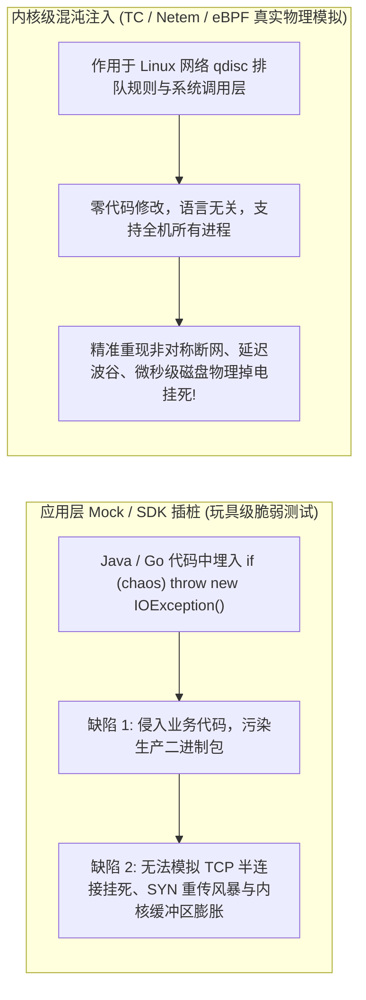
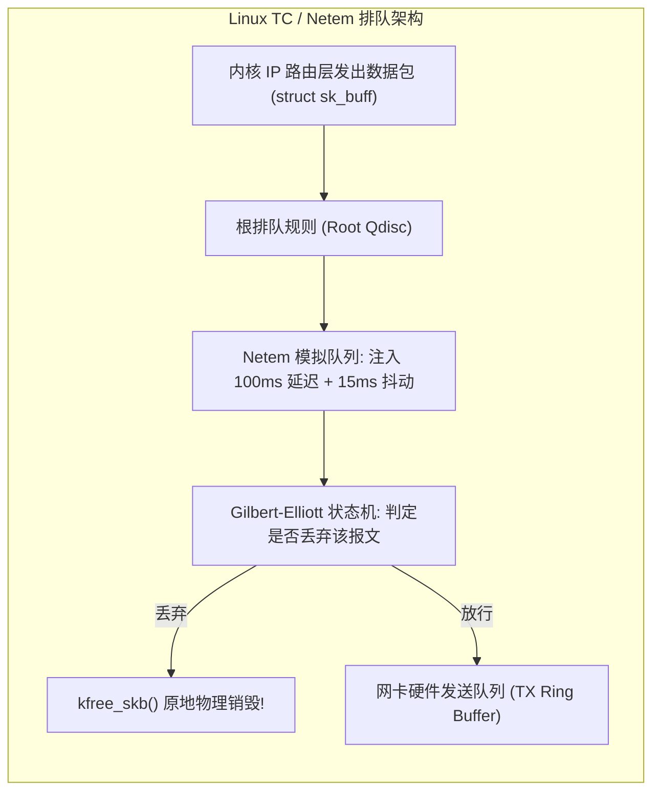
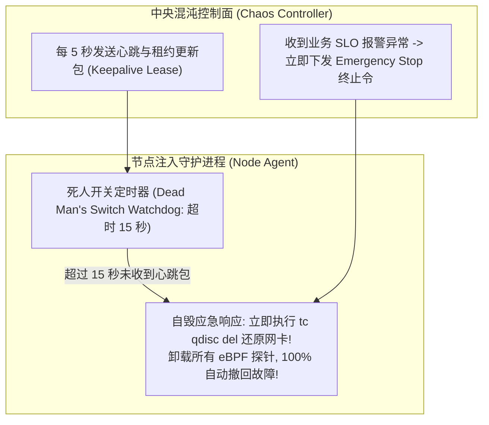

**TL;DR：** 任何未在生产环境经历过真实物理故障检验的高可用架构，其容灾承诺都只是“纸上谈兵”。以 Netflix Chaos Monkey 为代表的 **混沌工程（Chaos Engineering）** 核心理念是：**不等待故障在深夜突袭，而是在白天主动、可控地向生产系统注入极端异常，检验集群的稳态假说（Steady-State Hypothesis）与自愈韧性**。然而，早期的应用层故障注入（如通过 Java Agent 字节码增强或代码内嵌 if-else 开关）存在严重的缺陷：**语言绑定严重、具备侵入性、且完全无法模拟物理网卡闪断、非对称网络分区、单向丢包（Asymmetric Partition）、以及磁盘控制器 I/O 挂起（Hang）等真实物理层灾难**。为此，现代云原生混沌系统（如 CNCF Chaos Mesh）全面下沉至 **Linux 内核与网络数据面**：借助 Linux **TC（Traffic Control）与 Netem（Network Emulator）** 排队规则（qdisc），在内核网络层精准注入基于马尔可夫链的 **Gilbert-Elliott 突发相关丢包与双向延迟抖动**；并利用 **eBPF 的 `bpf_override_return` 原语** 在 VFS/Block 层和系统调用入口实施毫秒级错误覆写（如伪造 `ENOSPC` 磁盘满或 `EIO` 硬件损毁）。本文深度解构内核级故障注入的物理机理、网络排队树拓扑、以及具备“死人开关”（Dead Man's Switch）防失控保护的混沌引擎架构。

---

## 一、 为什么应用层 Mock 无法代替内核级故障注入？

在微服务测试阶段，开发者常用 Mock 工具伪造 RPC 异常，但这与真实世界的硬件物理故障存在天壤之别：



### 1. 真实网络环境的物理残酷性

- **非对称网络分区（Asymmetric Partition）**：Node A 可以给 Node B 发送数据包，但 Node B 发送给 Node A 的 ACK 包在物理线路上被单向丢弃；应用层 Mock 根本无法模拟这种导致 Raft / Paxos 选主颠簸的死锁状态；
- **TCP 重传与接收窗口归零（Zero Window Probe）**：当网络出现 5% 的偶发丢包时，TCP 拥塞窗口会发生拥塞避免甚至断崖式回退，引发应用层吞吐量暴跌 80% 以上，这是任何简单的“固定延时 2 秒”无法测出的系统脆弱点。

---

## 二、 Linux TC 与 Netem：网络受损的第一性原理

Linux 内核在网络设备驱动之上内置了强大的流量控制子系统（Traffic Control, TC）。每一个网卡设备（如 `eth0`）都绑定了一个排队规则（Queueing Discipline, qdisc）。



### 1. 经典 Netem 指令实战

1. **注入 100ms 固定延迟 + 10ms 随机抖动（高斯正态分布）**：
   ```bash
   tc qdisc add dev eth0 root netem delay 100ms 10ms distribution normal
   ```
2. **模拟真实的突发丢包（Burst Loss）：Gilbert-Elliott 2 状态马尔可夫模型**
   在实际光纤或无线网络中，丢包往往不是孤立的独立随机事件，而是成团成簇出现的（例如网络设备缓冲区瞬时溢出导致连续丢弃 5 个包）。
   - Netem 支持配置相关性参数（Correlation）：
     ```bash
     tc qdisc change dev eth0 root netem loss 5% 25%
     ```
     这意味着当前报文丢弃的概率不仅是 5%，而且有 25% 的概率与前一个报文的丢弃状态强相关！

---

## 三、 基于 eBPF 的精准系统调用级故障注入

虽然 TC 擅长模拟网络受损，但对于更细粒度的故障——例如“只针对访问某个特定 IP 的请求注入连接拒绝”，或者“模拟本地磁盘写文件时突然返回 `EIO`（输入输出错误）”，TC 则无能为力。

此时，**eBPF 的 `bpf_override_return` 原语** 展现了毁灭性的威力：

```mermaid
flowchart TD
    SyscallEntry["用户进程调用系统调用: sys_connect(fd, addr, len)"] --> KprobeHook["eBPF 挂钩点: fentry/__x64_sys_connect"]
    KprobeHook --> FilterCheck{"判断目标是否为特定受测容器 (PID / cgroup / 端口)?"}
    
    FilterCheck -- 命中目标混沌实验 --> Override["调用 bpf_override_return(ctx, -ECONNREFUSED)"]
    Override --> ShortCircuit["跳过真正的内核函数执行! 直接向用户态返回 Connection Refused!"]
    
    FilterCheck -- 非实验目标 --> NormalExec["正常放行内核执行"]
```



### 1. 模拟磁盘只读与 VFS 挂死

- 在没有真正损坏物理硬盘的前提下，通过向内核 `vfs_write` 或 `ext4_file_write_iter` 注入 `bpf_override_return(ctx, -EROFS)`（Read-only file system）；
- 瞬间考验数据库（如 MySQL / RocksDB / etcd）在面临底层存储只读断电时的 WAL 保护、从节点切换与报警通知机制，整个过程无需真正拔掉硬盘电源线，实验结束后卸载 eBPF 探针即可 **1 微秒瞬间恢复**。

---

## 四、 生产级 C++20 混沌注入与突发丢包状态机仿真

以下代码用现代 C++20 完整实现了模拟网络链路故障的 **Gilbert-Elliott 双状态突发丢包马尔可夫链** 与基于系统调用错误覆写的混沌实验引擎：

```cpp
#include <iostream>
#include <vector>
#include <random>
#include <chrono>
#include <string>
#include <iomanip>
#include <memory>

// Gilbert-Elliott 马尔可夫模型状态
enum class NetworkState {
    GOOD, // 良好状态 (极低随机丢包率)
    BAD   // 恶劣状态 (极高突发丢包率)
};

class GilbertElliottNetemSimulator {
private:
    NetworkState current_state{NetworkState::GOOD};
    std::mt19937 rng{1337}; // 固定随机种子以便确定性验证

    // 状态转移矩阵与丢包概率
    double p_good_to_bad = 0.05; // 从良好进入恶劣的概率
    double p_bad_to_good = 0.30; // 从恶劣自愈恢复良好的概率
    double loss_in_good  = 0.001; // 良好状态下 0.1% 丢包
    double loss_in_bad   = 0.850; // 恶劣状态下 85.0% 连续丢包 (突发网络黑洞)

public:
    // 模拟数据包通过 Netem 虚拟网卡
    bool transmit_packet(uint64_t packet_id, int64_t& simulated_latency_ms) {
        std::uniform_real_distribution<double> dist(0.0, 1.0);

        // 1. 马尔可夫状态跃迁
        if (current_state == NetworkState::GOOD) {
            if (dist(rng) < p_good_to_bad) {
                current_state = NetworkState::BAD;
            }
        } else {
            if (dist(rng) < p_bad_to_good) {
                current_state = NetworkState::GOOD;
            }
        }

        // 2. 判定丢包
        double loss_threshold = (current_state == NetworkState::GOOD) ? loss_in_good : loss_in_bad;
        if (dist(rng) < loss_threshold) {
            return false; // 丢包 (Packet Dropped)
        }

        // 3. 正常放行，叠加抖动延迟 (基础 50ms + 10ms 抖动)
        std::normal_distribution<double> latency_dist(50.0, 10.0);
        simulated_latency_ms = std::max<int64_t>(10, static_cast<int64_t>(latency_dist(rng)));
        return true;
    }

    NetworkState get_state() const { return current_state; }
};

// 模拟基于 eBPF 的系统调用错误注入器
class BpfFaultInjector {
private:
    bool inject_active{false};
    std::string target_api_path;

public:
    void enable_fault_injection(const std::string& path) {
        inject_active = true;
        target_api_path = path;
    }

    void disable() {
        inject_active = false;
    }

    // 模拟系统调用拦截
    int mock_sys_connect(const std::string& remote_endpoint) {
        if (inject_active && remote_endpoint == target_api_path) {
            // eBPF bpf_override_return 强行篡改为连接被拒绝
            return -111; // -ECONNREFUSED
        }
        return 0; // 正常成功连接
    }
};

int main() {
    std::cout << "==========================================================\n";
    std::cout << "   Linux TC/Netem 突发丢包与 eBPF 故障注入仿真\n";
    std::cout << "==========================================================\n\n";

    GilbertElliottNetemSimulator netem;
    const int total_packets = 100;
    int dropped_count = 0;
    int consecutive_drops = 0;
    int max_consecutive_drops = 0;

    std::cout << "[实验 1: Netem 突发丢包仿真 (模拟以太网物理损伤)]:\n";
    for (int i = 0; i < total_packets; ++i) {
        int64_t latency = 0;
        bool delivered = netem.transmit_packet(i, latency);

        if (!delivered) {
            dropped_count++;
            consecutive_drops++;
            if (consecutive_drops > max_consecutive_drops) {
                max_consecutive_drops = consecutive_drops;
            }
        } else {
            consecutive_drops = 0;
        }
    }

    std::cout << "  -> 总发射报文: " << total_packets << " 个\n";
    std::cout << "  -> 丢包总数: " << dropped_count << " 个 (丢包率: " 
              << (dropped_count * 100.0 / total_packets) << "%)\n";
    std::cout << "  -> 最大连续丢包长度: " << max_consecutive_drops 
              << " 个 (成功复现突发黑洞聚集效应!)\n\n";

    std::cout << "[实验 2: eBPF 零侵入伪造系统调用故障 (bpf_override_return)]:\n";
    BpfFaultInjector bpf;
    bpf.enable_fault_injection("10.0.0.88:3306"); // 针对 MySQL 从节点注入连接拒绝

    int ret_mysql = bpf.mock_sys_connect("10.0.0.88:3306");
    int ret_redis = bpf.mock_sys_connect("10.0.0.99:6379");

    std::cout << "  -> 发起连接目标 10.0.0.88:3306 结果: " << ret_mysql 
              << " (eBPF 成功注入 -ECONNREFUSED!)\n";
    std::cout << "  -> 发起连接目标 10.0.0.99:6379 结果: " << ret_redis 
              << " (非注入目标，零干扰正常连接)\n";

    std::cout << "\n==========================================================\n";
    std::cout << "[架构结论]: 内核级混沌工程能在不触碰业务代码的前提下检验极限制式！\n";
    return 0;
}
```

---

## 五、 爆炸半径收敛与“死人开关”（Dead Man's Switch）

在生产环境搞混沌工程，最危险的不是发现故障，而是**混沌注入工具本身发生崩溃，导致恶意网络损伤或丢包规则永久滞留在生产宿主机上，把一次受控演练演变成了真正的重大灾难（P0 事故）**。



### 1. 工业级防失控四大护栏

1. **死人开关（Watchdog Timer）**：
   Agent 在内核挂载规则时，必须在本地启动一个单调递减的高精度定时器（如 15 秒）。如果中央控制台断网或崩溃，未能续订心跳，Agent 自动无条件执行规则清理（Clean Up）；
2. **SLO 自动熔断红线**：
   混沌平台实时拉取核心系统的黄金指标（吞吐量、P99 延迟、HTTP 5xx 比例）。一旦发现集群总失败率超过预设的 **爆炸半径红线（如 1.5%）**，立刻触发自动回滚；
3. **标签与金丝雀隔离**：
   严格限制每次实验的节点范围在总体容量的 5% 以内，且绝对避开单机单实例的关键基础设施；
4. **回放与版本审计**：
   每一次注入的指令、时间戳与影响范围，必须写入不可篡改的审计日志，支持事后进行一比一全景根因复盘。
