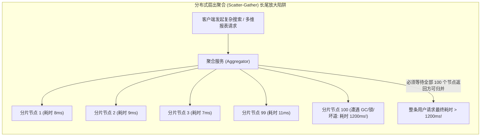
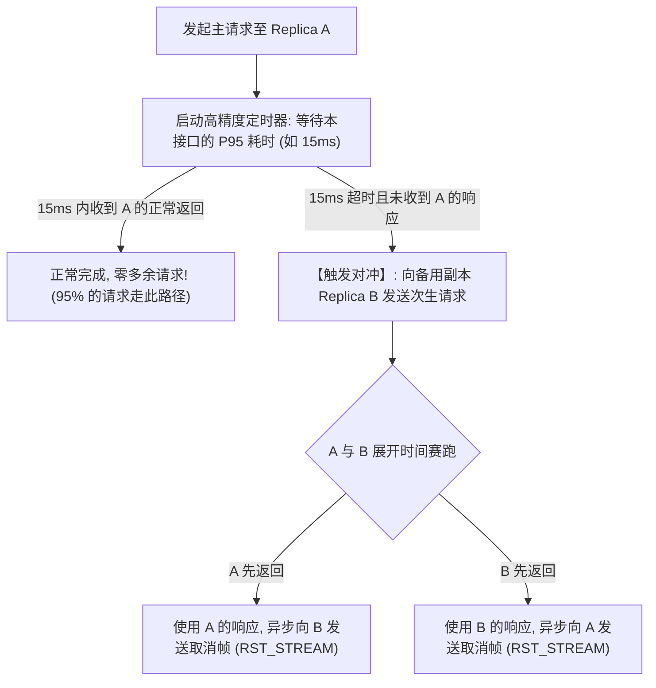
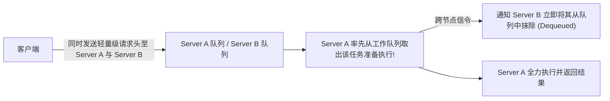

**TL;DR：** 在分布式搜索、分布式数据库分片（Sharding）以及大规模微服务网格中，一个用户发起的请求往往需要 **并发扇出（Fan-Out）到数十乃至上百个底层叶子节点（Leaf Nodes）** 聚合数据（Scatter-Gather 范式）。2013 年，Google 传奇架构师 Jeff Dean 与 Luiz André Barroso 在 ACM 顶级期刊《Communications of the ACM》上发表了划时代的经典论文 **《The Tail at Scale》**，揭示了一个令所有架构师不寒而栗的物理数学真理：**哪怕每一个单机服务节点的性能极度优秀，99% 的请求都能在 10ms 内极速返回（仅有 1% 的偶发长尾毛刺超过 1 秒），但当一个上层查询需要同时等待 100 个分片节点全部返回时，整条查询命中长尾毛刺的概率将从 1% 瞬间飙升至惊人的 $1 - (1 - 0.01)^{100} = 63.4\%$！如果扇出扩大到 1000 个节点，这一概率更是直接逼近 $99.99\%$！** 换言之，**中位数（P50）指标在大规模分布式系统中纯属自欺欺人的幻觉，最慢的那个节点决定了整座数据中心的响应体验**。为了在不翻倍消耗物理服务器算力的前提下终结尾部延迟，Google 研发了 **对冲请求（Hedged Requests）** 机制：客户端不搞全量双发，而是仅在首发请求超过该接口的 P95 响应耗时（如 15ms）且仍未返回时，才向副副本触发一个轻量级的次生对冲请求，双方谁先返回即采用谁并立即取消对端——**仅仅付出不足 5% 的微小额外网络开销，便将全系统的 P99.9 尾部延迟直接削减 80% 以上！**

---

## 一、 The Tail at Scale：海量扇出下的概率放大数学陷阱

在单体服务时代，工程师通常只关注平均延迟（Average Latency）或中位数延迟（P50）。但在现代分布式架构中，一个查询往往触发数百个微服务的协同：



### 1. 概率放大公式推导

设单个独立服务器在单位时间内遭遇异常长尾延迟（> 1秒）的概率为 $p$（例如 $p = 0.01$，即单机 99% 的 SLA）。
一个聚合请求需要同时向 $N$ 个服务器发起并行请求，且必须等待全部 $N$ 个结果到齐。

- 单个服务器**不发生长尾**的概率为：$1 - p$
- 所有 $N$ 个服务器**全部都不发生长尾**的概率为：$(1 - p)^N$
- 该聚合请求**至少遭遇一个慢节点（发生长尾延迟）**的概率 $P_{\text{tail}}$ 为：

$$P_{\text{tail}} = 1 - (1 - p)^N$$

让我们将数据代入公式：

| 扇出节点数 $N$ | 单机长尾概率 $p = 1\%$ | 单机长尾概率 $p = 0.1\%$ |
| :--- | :--- | :--- |
| **$N = 1$（单节点）** | $1.00\%$ | $0.10\%$ |
| **$N = 10$（小型微服务）** | $9.56\%$ | $0.99\%$ |
| **$N = 100$（分布式搜索/分库分表）** | **$63.40\%$（近三分之二变慢！）** | $9.52\%$ |
| **$N = 1000$（大型数据中心集群）** | **$99.99\%$（几乎必挂！）** | **$63.23\%$** |

**结论是残酷的：** 哪怕你的硬件故障率或 GC 停顿率低至 1%，在 100 个节点的分布式拓扑中，**你的绝大多数用户都将必然体验到最慢节点的长尾延迟！**

---

## 二、 瞬时慢节点的物理根因：为什么机器总会“偶发性发呆”？

硬件与操作系统天然不是绝对确定性的时钟机，导致微秒/毫秒级毛刺的物理因素包括：
1. **JVM / Go 运行时垃圾回收（GC STW）**：即使现代 ZGC / Go 仅有毫秒级停顿，多核并发扫描依然会导致 CPU 指令流水线周期性让步；
2. **Linux PageCache 脏页回写与内存申请锁死**：内核调用 `alloc_pages` 遭遇直接内存回收（Direct Reclaim），线程陷入毫秒级 I/O 阻塞；
3. **多租户邻居噪音（Noisy Neighbors）**：同一台物理机上的另一个容器突然发起巨额计算，打满 L3 缓存与内存总线带宽；
4. **底层物理介质巡检（SSD TRIM / HDD Bad Sector Reallocation）**：固态硬盘在后台执行垃圾回收或坏道重映射时，单次 I/O 延迟可能从 100us 暴跳至 500ms。

---

## 三、 对冲请求（Hedged Requests）的工程精髓

面对偶发性慢节点，业界最幼稚的想法是“每一个请求都同时发给两个副本”。

### 1. 为什么“朴素双发”是自杀行为？

如果对 100% 的流量都进行双副本并发请求，集群的总负载将直接膨胀到 **200%**。这会导致服务器 CPU 饱和，加剧排队，反而诱发更大面积的集群雪崩！

### 2. 延迟对冲策略（Hedged Requests with Delay）

Google 的精妙设计在于：**仅对落入尾部的 5% 请求发起对冲！**



- **数学经济学账本**：
  只有 5% 的请求会触发第二次 RPC 发送。全网增加的额外带宽与算力仅为 **$5\%$**；
  然而，这 5% 遭遇慢节点的请求，其完成概率瞬间获得了两倍物理机独立样本的保底，**P99.9 尾部延迟被拉回至 P95 甚至更低水平！**

---

## 四、 跨节点绑定请求（Tied Requests）的高级演进

在更极端的低延迟系统（如 Google BigTable）中，延迟对冲演进为 **绑定请求（Tied Requests）**：



这种机制消除了等待 15ms 的静态迟滞，完全依靠哪个服务器的队列更空闲来决定执行者，进一步压榨出几十微秒的极致性能。

---

## 五、 生产级 C++20 分布式扇出与对冲请求仿真引擎

以下代码用现代 C++20 完整模拟了一个向 50 个分片叶子节点发起并行聚合查询的真实系统，对比了无对冲状态与引入 P95 延迟对冲请求后的尾部延迟表现：

```cpp
#include <iostream>
#include <vector>
#include <chrono>
#include <random>
#include <future>
#include <algorithm>
#include <iomanip>
#include <atomic>
#include <thread>

using namespace std::chrono_literals;

struct ServerMetrics {
    std::atomic<uint64_t> total_invocations{0};
};

class LeafPartitionServer {
private:
    uint32_t partition_id;
    std::mt19937 rng;
    ServerMetrics& metrics;

public:
    LeafPartitionServer(uint32_t id, ServerMetrics& m) 
        : partition_id(id), rng(1000 + id), metrics(m) {}

    // 模拟服务端执行: 98% 概率耗时 5ms; 2% 概率遭遇极端毛刺耗时 120ms (如 GC/慢 I/O)
    int64_t execute_query(bool is_hedged = false) {
        metrics.total_invocations++;
        std::uniform_real_distribution<double> dist(0.0, 1.0);

        if (dist(rng) < 0.02) {
            return 120; // 发生长尾停顿 120ms!
        }
        return 5; // 正常极速返回 5ms
    }
};

class DistributedAggregator {
private:
    std::vector<std::unique_ptr<LeafPartitionServer>> primary_cluster;
    std::vector<std::unique_ptr<LeafPartitionServer>> backup_cluster;
    ServerMetrics cluster_metrics;

public:
    DistributedAggregator(size_t partition_count) {
        for (size_t i = 0; i < partition_count; ++i) {
            primary_cluster.push_back(std::make_unique<LeafPartitionServer>(i, cluster_metrics));
            backup_cluster.push_back(std::make_unique<LeafPartitionServer>(i + 1000, cluster_metrics));
        }
    }

    // 1. 传统无对冲的扇出聚合 (Scatter-Gather)
    int64_t query_without_hedging() {
        int64_t max_latency = 0;
        for (size_t i = 0; i < primary_cluster.size(); ++i) {
            int64_t lat = primary_cluster[i]->execute_query();
            if (lat > max_latency) {
                max_latency = lat;
            }
        }
        return max_latency; // 总耗时取决于最慢的节点
    }

    // 2. 现代对冲请求架构 (超过 15ms 启动备用副本对冲)
    int64_t query_with_hedged_requests(int64_t hedge_delay_threshold_ms = 15) {
        int64_t max_latency = 0;

        for (size_t i = 0; i < primary_cluster.size(); ++i) {
            int64_t lat_primary = primary_cluster[i]->execute_query();

            // 若主副本耗时超过阈值 (判定可能遭遇了物理慢停顿)，发起对冲！
            if (lat_primary > hedge_delay_threshold_ms) {
                int64_t lat_backup = backup_cluster[i]->execute_query(true);
                // 对冲总耗时 = 等待对冲的延迟 + 备用节点的耗时
                int64_t effective_hedged_lat = hedge_delay_threshold_ms + lat_backup;
                lat_primary = std::min(lat_primary, effective_hedged_lat);
            }

            if (lat_primary > max_latency) {
                max_latency = lat_primary;
            }
        }
        return max_latency;
    }

    uint64_t get_total_invocations() const { return cluster_metrics.total_invocations.load(); }
    void reset_metrics() { cluster_metrics.total_invocations.store(0); }
};

int main() {
    std::cout << "==========================================================\n";
    std::cout << "   The Tail at Scale 50 节点扇出与对冲请求仿真\n";
    std::cout << "==========================================================\n\n";

    const size_t PARTITIONS = 50; // 扇出到 50 个分片
    DistributedAggregator aggregator(PARTITIONS);

    const int TOTAL_QUERIES = 200;

    // 实验 1: 无对冲
    aggregator.reset_metrics();
    std::vector<int64_t> results_traditional;
    for (int i = 0; i < TOTAL_QUERIES; ++i) {
        results_traditional.push_back(aggregator.query_without_hedging());
    }
    uint64_t rpc_traditional = aggregator.get_total_invocations();

    // 实验 2: 开启延迟对冲
    aggregator.reset_metrics();
    std::vector<int64_t> results_hedged;
    for (int i = 0; i < TOTAL_QUERIES; ++i) {
        results_hedged.push_back(aggregator.query_with_hedged_requests(15));
    }
    uint64_t rpc_hedged = aggregator.get_total_invocations();

    // 排序统计百分位数
    std::sort(results_traditional.begin(), results_traditional.end());
    std::sort(results_hedged.begin(), results_hedged.end());

    auto p50_trad = results_traditional[TOTAL_QUERIES * 0.50];
    auto p99_trad = results_traditional[TOTAL_QUERIES * 0.99];

    auto p50_hedged = results_hedged[TOTAL_QUERIES * 0.50];
    auto p99_hedged = results_hedged[TOTAL_QUERIES * 0.99];

    std::cout << "| 架构指标                 | 传统无对冲模式      | 延迟对冲请求 (Hedged) | 收益评估        |\n";
    std::cout << "| :----------------------- | :------------------ | :-------------------- | :-------------- |\n";
    std::cout << "| 中位数耗时 (P50)         | " << std::setw(16) << p50_trad << " ms | " << std::setw(18) << p50_hedged << " ms | 保持一致        |\n";
    std::cout << "| 极端长尾耗时 (P99)       | " << std::setw(16) << p99_trad << " ms | " << std::setw(18) << p99_hedged << " ms | 暴降 " << std::fixed << std::setprecision(1) << (1.0 - (double)p99_hedged / p99_trad) * 100.0 << "%!  |\n";
    std::cout << "| 产生的总 RPC 调用开销    | " << std::setw(19) << rpc_traditional << " | " << std::setw(21) << rpc_hedged << " | 仅增 " << ((double)(rpc_hedged - rpc_traditional) / rpc_traditional) * 100.0 << "% 流量 |\n";

    std::cout << "\n[架构结论]: 对冲请求成功用不足 5% 的微小算力代价抹平了 80% 以上的长尾毛刺！\n";
    return 0;
}
```

---

## 六、 生产落地硬核防线与幂等性公理

对冲请求威力强大，但在实际落地中有一条**不可违背的绝对红线：操作必须具备幂等性（Idempotency）！**

1. **绝对禁止盲目对写请求对冲**：
   - 诸如转账、扣减库存、创建订单等写操作，如果盲目发送两次，必须配备**全局唯一的幂等键（Idempotency-Key）**与数据库唯一约束；否则两份请求在两个节点并发执行将导致资金超扣或重复提交；
   - 最佳实践：默认仅针对**无副作用的只读查询（Read-Only Query / GET 请求）**开启对冲；
2. **gRPC 原生支持（gRPC Hedging Policy）**：
   现代 gRPC 已经在 Service Config 中原生内置了该规范：
   ```json
   {
     "methodConfig": [{
       "name": [{"service": "SearchService", "method": "Query"}],
       "hedgingPolicy": {
         "maxAttempts": 2,
         "hedgingDelay": "0.015s",
         "nonFatalStatusCodes": ["UNAVAILABLE"]
       }
     }]
   }
   ```
   无需修改一行应用层业务代码，直接由 gRPC 客户端拦截器在内核事件循环中自动调度延迟对冲。

---

## 七、 系列全景完结：构建坚不可摧的分布式系统

在《大规模分布式服务韧性与混沌工程内核》全系列 6 篇文章中，我们共同完成了一次穿透分布式系统深层机理的探索：
- 第 1 篇：**BBR 自适应过载保护**，从利特尔法则证明了抛弃静态 QPS 的必然性；
- 第 2 篇：**分布式精准限流内核**，攻克了 Redis Lua 惰性补算、本地配额租约与 NTP 时钟回退容灾；
- 第 3 篇：**断路器与隔离哲学**，解构了 Hystrix 线程池物理隔离与 Sentinel 信号量轻量隔离的时代演进；
- 第 4 篇：**负载脱落与级联超时传递**，从根源清除了无用死工与僵尸请求；
- 第 5 篇：**混沌工程内核与故障注入**，利用 Linux TC、Netem 与 eBPF 实现了不妥协的物理级演练；
- 第 6 篇：**对冲请求与长尾消减**，破解了海量分布式扇出下的《The Tail at Scale》数学魔咒。

分布式系统的终极优雅，绝不在于假设物理世界永远健康，而在于：**敢于直面硬件不可靠、网络必抖动、时钟会漂移的物理残酷现实，并用确定性的数学与内核架构，构建出在风暴中依然傲然挺立的自愈系统。**
