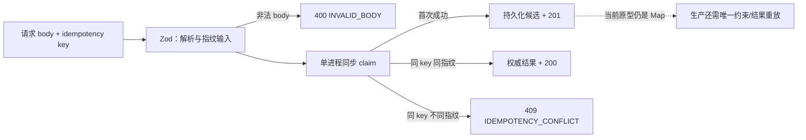

**TL;DR：** API 契约不只规定 200 的 JSON 长什么样，还要规定校验失败、重复请求和同 key 不同 payload 怎么结束。订单服务现在把错误统一成 `{error:{code,message,details?}}`，并让 `saveByKey` 在单个同步临界段返回权威结果：100 个并发同 key 请求得到 1 个 201、99 个相同订单的 200；同 key 携带不同 body 得到 409。这个实验修复的是进程内 check-then-act，不是 PostgreSQL、多实例或重启后的生产幂等。

## 一、先定失败形状，再定成功形状

外部输入失败时，调用方需要知道三件事：机器应该分支到哪里，人应该读什么，Agent 应该修正哪个字段。服务统一返回。下面是 schema 关键节选，完整文件还需要导入 Zod 并接入 validator：

```ts
const ApiErrorSchema = z.object({
  error: z.object({
    code: z.string(),
    message: z.string(),
    details: z.array(z.object({
      path: z.array(z.string()),
      code: z.string(),
      message: z.string(),
    })).optional(),
  }),
});
```

`code` 是稳定的机器合同，`message` 是诊断文本，`details` 是结构化校验问题。Zod validator 的失败路径会直接返回响应，不会抛给 `app.onError`；因此当前代码使用第三个参数 hook，把 `error.issues` 映射到自己的错误合同。这个判断来自当前依赖源码，不是把异常处理当成万能出口。

## 二、成功与失败的输出要能从当前工件重跑

进入 `experiments/service/` 后用 Node 24 运行服务，再通过请求得到以下形状。订单号是随机 UUID 前缀，所以示例只约束字段，不把某一次 ID 当成固定输出。

```json
// GET /orders/ghost -> 404
{"error":{"code":"ORDER_NOT_FOUND","message":"order ghost not found"}}
```

```json
// POST 非法 body -> 400
{"error":{"code":"INVALID_BODY","message":"request body failed validation","details":[{"path":["sku"],"code":"too_small","message":"..."}]}}
```

```json
// POST 合法 body -> 201
{"orderId":"A-<uuid>","sku":"sku-9","customerId":7,"qty":3,"status":"CREATED","createdAt":"<RFC3339>"}
```

错误详情中的 message 受 Zod 版本影响，文章不把完整英文句子当稳定合同；`path`、`code` 和自定义外层 `error.code` 才是调用方应依赖的字段。

## 三、幂等不是“先查一下 Map”

原来的流程是：

```text
findByKey
  -> 不存在
  -> 构造 order
  -> saveByKey
  -> 返回自己构造的 order
```

两个并发请求都可能在 `findByKey` 处看到不存在，即使 `saveByKey` 后面拒绝覆盖，第二个 handler 仍会把自己构造的订单返回成 201。这是审计中复现的两个不同 orderId、两个 201 的根因。

当前原型把检查、写入和返回结果收进 `saveByKey`。下面是关键控制流节选，不是脱离 `OrderStore` 类型和完整文件即可复制运行的独立程序：

```ts
async saveByKey(key, order, fingerprint) {
  // 方法体内没有 await，单个 JS 事件循环不会在这里插入另一个 handler。
  const existing = this.byKey.get(key);
  if (existing) {
    return {
      order: existing.order,
      created: false,
      conflict: fingerprint !== undefined
        && existing.requestFingerprint !== undefined
        && existing.requestFingerprint !== fingerprint,
    };
  }
  this.byKey.set(key, { order, requestFingerprint: fingerprint });
  this.orders.set(order.orderId, order);
  return { order, created: true, conflict: false };
}
```

这条边界可以画成一条更严格的响应路径：



路由只把 `created: true` 映射成 201；重放是 200；指纹不同是 409。这里的“原子”只在这个进程、这张 Map 和这次生命周期内成立。

## 四、反例先写进测试：100 个并发请求会怎样

`experiments/service/src/app.test.ts` 固定了三个比顺序重试更有价值的场景：

| 输入 | 创建副作用 | 响应 |
| --- | ---: | --- |
| 同 key、同 body，顺序两次 | 1 | 201，然后 200，订单号相同 |
| 同 key、同 body，并发 100 次 | 1 | 1 个 201，99 个 200，订单号全部相同 |
| 同 key、不同 body | 1 | 后续请求 409，不静默复用 |

这组测试证明了本地实现没有把“自己的临时 order”误当权威结果。它没有证明以下生产语义：

- 进程重启后幂等记录仍然存在；
- 两个实例同时 claim 时只有一个成功；
- 执行中连接断开后，未知结果能被安全重放；
- 失败、TTL、请求指纹和业务副作用都由同一个数据库事务裁决。

并发、冲突、状态码和指标路径的当前本机 raw 见 `evidence/service-testing-strategy/2026-08-16-local/`；该快照支持进程内原型的局部合同，不是 PostgreSQL、多实例或重启恢复证据。

生产实现需要数据库唯一约束、请求指纹、状态字段、最终响应和过期策略。把这份内存 Map 直接搬到多实例服务，只是把竞态从测试里搬到网络上。

## 五、结论：合同必须覆盖冲突，而不是只覆盖 happy path

这篇的增量不是再列一张字段表，而是把 API 的终态补全：

1. 校验错误必须有稳定外层形状和结构化 details。
2. 幂等响应必须返回权威结果，不能返回一个没有被保存的临时订单。
3. 同 key 不同 payload 必须显式冲突，不能把客户端 bug 伪装成重放。
4. 进程内测试通过后仍要标记边界，数据库、多实例和重启证据尚不存在。

下一步应把这份合同移到持久化存储测试，而不是继续给内存原型增加“生产级”形容词。

## 参考资料

- [Hono zod-validator 文档](https://github.com/honojs/middleware/tree/main/packages/zod-validator)
- [Zod API 文档](https://zod.dev/api)
