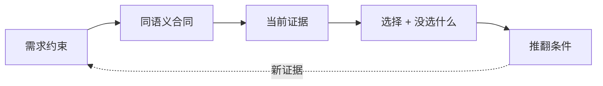

**TL;DR：** 选型不是把“快”“轻”“生态大”投票选出来，而是先定义同语义实验，再把决策、没选的方案和证据路径写进 ADR。原稿中的 plain HTTP/Fastify/Hono 吞吐、冷启动和内存数字没有随当前 checkout 保存 raw 输出与 commit，本次不继续复述它们。当前订单原型保留 Hono + Zod，是因为错误需要结构化 `path/code/message`，但这只是当前本地决策，不是在线性能结论。

## 一、先把选型问题写成可证伪的假设

订单服务需要的不是抽象的“最快框架”，而是几条可以测试的约束：

| 问题 | 可比较变量 | 不能混入的变量 |
| --- | --- | --- |
| handler 开销 | 同一响应、同一 Node、同一连接模型 | 不同序列化、日志和网络路径 |
| 路由匹配 | 同一路径集合、同一请求分布 | 一个用线性扫描、另一个用缓存 |
| 校验错误 | 同一坏 body、同一字段约束 | 一个返回原始库错误、另一个二次包装 |
| 冷启动 | 同一启动参数、同一采样方式 | 把依赖下载或 shell 启动算进去 |
| 产物/内存 | 同一 target、同一依赖锁 | 把 browser bundle 与 Node RSS 混为一谈 |

如果不能只改变一个变量，结果就只能作为探索性观察，不能作为 ADR 的数字理由。

## 二、当前决策：Hono handler + Zod schema

仓库里的 `experiments/service/` 使用 Hono、`@hono/node-server` 和 Zod。决策重点是错误路径：订单服务的调用方包含 Agent，校验错误需要被程序化读取并回传给模型；Zod 的 issues 有字段路径和错误码，服务再包成自己的 `{ error: { code, message, details } }` 合同。

这不是说 Hono 在所有场景都更快，也不是说 Fastify 的错误无法包装。它只说明在当前需求里，结构化错误是第一决策因子；框架吞吐只有在同语义 benchmark 和真实瓶颈证据存在时才进入排序。

## 三、ADR 必须记录没选什么，以及以后如何推翻

当前 ADR 的最小结构应当是：

```markdown
# 0001 框架：Hono + @hono/node-server

## 决策
订单服务使用 Hono handler，Node 运行时由 @hono/node-server 提供适配。

## 理由
1. 输入边界与 Zod schema 统一，错误可以映射成 Agent 可读的 details。
2. handler 可被 app.request() 独立测试，不要求测试先启动端口。
3. 迁移到另一种运行时只替换适配层，不改变业务 handler 合同。

## 没选什么
- Fastify：不是不能用；若错误合同和 schema 适配成本更低，基准结果应重新比较。
- 裸 node:http：小路由可以成立，但路由、校验和错误合同都要自己维护。

## 推翻条件
真实端口 benchmark、路由规模、依赖兼容或错误管道证据显示当前选择不再满足需求。
```

ADR 的作用不是冻结技术，而是让后来的人知道“哪一个假设成立时做了这个选择”。没有原始输出时，ADR 应明确标记证据尚未取得，并链接到下一次实验的 evidence 位置，而不是填入看起来精确的数字。

决策可以用下面的顺序复核，而不是从“我喜欢哪个框架”倒推理由：



如果 `evidence` 只有博客文章或一次未经保存的手工输出，结论应停在“候选决策”；只有命令、环境、原始结果和可接受阈值都落盘，ADR 才值得被后续发布复用。

## 四、当前工件的验证边界

现在可以直接验证：

- `experiments/service` 的 typecheck、18 个测试和 TypeScript build；
- Hono validator 的 400 错误转换；
- 100 并发同 key 的单进程 claim；
- 本地 handler 的路由与 store 组合。

当前不能由本篇验证：

- plain/Fastify/Hono 在生产网络下的吞吐排序；
- PostgreSQL、TLS、代理和远程调用加入后的尾延迟；
- Node 20/22/24 的真实 Actions 矩阵；
- 部署、回滚和线上错误形状。

这份边界比一张没有 raw 输出的性能表更有用，因为读者知道下一次实验应保存什么。

## 五、结论：先把决策写成合同，数字等证据回来再进入 ADR

选型文章的质量不由数字位数决定，而由数字能否重算决定。当前版本保留 Hono + Zod 的需求理由，撤掉未绑定 commit 与 raw 的性能承诺，并把“没选什么”和“何时推翻”写进决策结构。

读者可以从 `experiments/service/docs/adr/0001-framework.md` 开始，按同一输入、同一环境和同一变量补 benchmark；结果不佳也应更新 ADR，而不是删掉失败结果。

## 参考资料

- [Hono：Testing](https://hono.dev/docs/guides/testing)
- [Zod API documentation](https://zod.dev/api)
