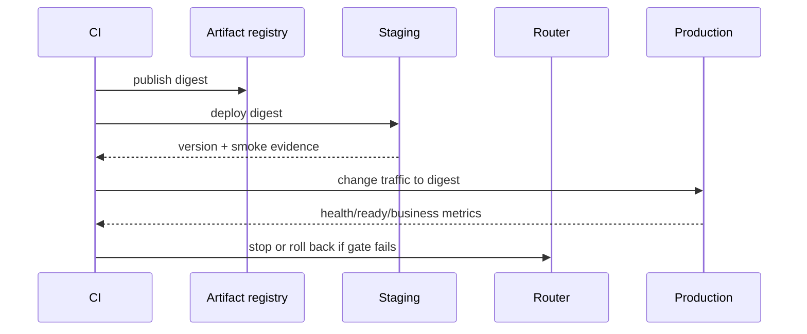

**TL;DR：** 清单的价值不是让人“记得做”，而是让每个勾都指向一份可以复核的证据。当前 `experiments/service/docs/release-checklist.md` 把本地教学原型能证明的内容，与需要持久化数据库、GitHub Actions run、staging smoke、监控和回滚演练的内容分开。现在能勾的是局部代码和测试，不能勾的外部项不会因为文章系列收官而自动变绿。

## 一、先按证据等级分层，而不是把所有项目都画成绿色

当前清单使用三种状态：

| 状态 | 例子 | 需要什么 |
| --- | --- | --- |
| 本地可重跑 | 18 个 service 测试、typecheck、build、双表容量 | 当前 checkout、固定 Node、完整命令和输出 |
| 配置已写、尚未在线证明 | Node 20/22/24 workflow、artifact upload | Actions run URL、job 日志、artifact 校验 |
| 当前未实现 | PostgreSQL 幂等、staging deploy、告警和回滚 | 外部系统、故障注入和恢复记录 |

清单不能把第二行和第三行改成第一行。它的第一条使用纪律是：勾选时写日期、commit、命令和 evidence 路径；没有证据就保留未勾。

## 二、代码层先检查“不变量”，不要只看启动成功

本地原型目前可以检查：

```text
□ 输入失败统一返回 error.code/message/details
□ 同 key 同 body 只创建一个权威订单
□ 同 key 不同 body 返回 409
□ 100 并发 claim 的结果全部指向同一订单
□ orders 与 byKey 都不超过容量上限
□ 404 / 400 / 500 都进入对应 latency bucket
```

这些项目对应的是当前测试中的可观察行为。它们没有把 `Map` 变成持久化存储，所以清单另外列出重启、多实例、唯一约束、TTL 和未知结果重试，避免“本地幂等通过”被误读成“生产幂等完成”。

## 三、发布证据要覆盖 CI、依赖和构建产物

本地复核命令是：

```bash
cd experiments/service
npm ci
npm run typecheck
npm test
npm run build
test -s dist/app.js
```

这只能证明 Node 24.19.0 当前 checkout 能完成独立 typecheck、18 个测试和非空 build。根 workflow 的 Node 20/22/24 矩阵已经进入生效路径，但还没有本次任务对应的 Actions run；因此清单把矩阵和 artifact 归到“外部证据”，不在正文里写“已经兼容三版并部署”。

把“发布完成”拆成闸门后，失败动作也必须跟着写出来：

| 闸门 | 必须留下的证据 | 证据缺失时的动作 |
| --- | --- | --- |
| source | commit、变更范围、数据库迁移版本 | 停止构建 |
| build | artifact 名称、digest、启动命令 | 不允许进入 staging |
| deploy | 环境、版本回显、迁移结果 | 停止放量，保留旧 artifact |
| runtime | health、ready、只读业务 smoke、错误/延迟指标 | 摘除新版本 |
| recovery | 回滚 artifact、流量切回时间、迁移兼容性 | 按预案恢复，不临时改库 |

建议把每次发布记录成机器可读的最小证据，而不是只在聊天里说“已上线”：

```text
release_id=service-2026-08-16.1
source_commit=<full-sha>
artifact_digest=sha256:<digest>
schema_migration=<expand-or-none>
staging_version=<version-endpoint>
smoke_result=<raw-output-path>
rollback_artifact=<previous-digest>
```

其中 `schema_migration` 不能被“回滚代码”一笔带过。破坏性删列或改消息格式可能让旧版本无法启动；更稳的发布顺序是 expand（先加兼容结构）→ 双读/双写观察 → contract（最后清理旧结构），并把每一步的停止条件写进清单。

## 四、SLO 与回滚是运行记录，不是 Markdown 复选框

`/healthz` 只表示进程存活，`/readyz` 才有依赖准备语义；本地内存 store 的 ready 永远为 true。发布前还需要把这些问题带到真实环境：

- 可用性 good event 是非 5xx 还是业务成功，分母和窗口是什么；
- 真实端口、数据库和代理延迟是否进入 p99；
- 告警是否在故障注入时触发，又是否在 404 等正常业务流量下保持安静；
- 部署失败时如何停止流量、回到哪一个 artifact、迁移如何兼容旧版本。

没有 staging 版本回显、告警记录和一次回滚演练，清单最多只能证明“发布前问题被列出来了”。

发布控制面的最小时序应当能回答“哪一个版本正在接流量”：



如果 CI 没有 `deploy` 的真实输出、Router 没有可逆动作，或者生产端点不能回显 digest，流程就只能算“构建通过”，不能算“发布完成”。

## 五、结论：清单的最后一勾是“我知道还没证明什么”

系列修订后的交付边界是：

1. 文章和实验提供本地可运行的代码、测试和命令。
2. CI 配置已经放到根目录并明确 service 工作目录，但在线 run 尚未纳入证据。
3. 订单服务仍是单进程教学原型，数据库、安全、部署、观测和恢复不在已完成范围。

读者可以复制这张清单到自己的服务，但应把每个 `[ ]` 绑定到真实输出，而不是照抄 `[x]`。如果一项不能给出证据路径，它就是风险条目，不是发布资格；如果回滚只写“重新部署旧代码”，还要补上 schema、缓存、队列和流量状态的兼容性。

## 参考资料

- [Google SRE：Service Level Objectives](https://sre.google/sre-book/service-level-objectives/)
- [GitHub Docs：Workflows](https://docs.github.com/en/actions/concepts/workflows-and-actions/workflows)
