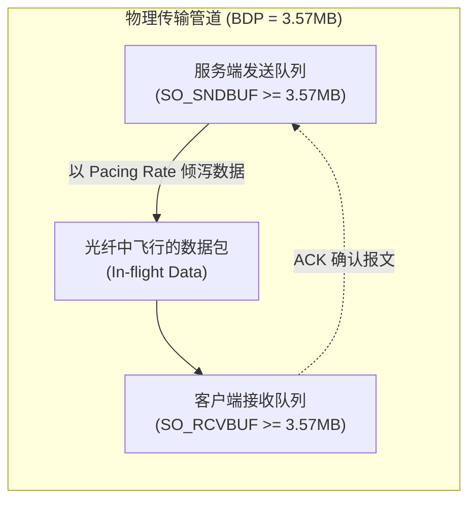
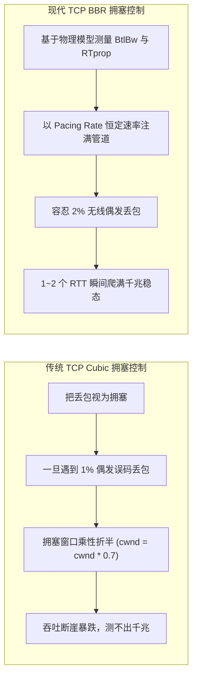

**TL;DR：** 很多人以为网络测速就是“发起一个 HTTP 请求下载大文件并除以耗时”，这在千兆宽带和 5G 时代会导致严重失真的测量结果。**网络测速的物理本质是在受控时间内激发物理链路的瓶颈容量，并由接收端提取出平稳工作状态下的有效吞吐率（Goodput）。** 本文作为《网络测速与极限吞吐工程》系列第一篇，从物理层与传输层第一性原理出发，剖析带宽时延积（BDP）对飞行数据（In-flight Data）的硬性约束；推导香农信息熵（Shannon Entropy $\ge 7.999$）如何阻断电信运营商的硬件透明压缩加速；对比 TCP Cubic 与 BBR 拥塞控制算法在无线偶发丢包下的表现差异；并给出基于 100ms 离散切片的 P90 截尾加权滤波数学模型。

## 一、传输瓶颈：带宽时延积（BDP）与飞行数据

在物理网络中，单条连接的极限吞吐并不直接等于网卡的标称物理速率，而是受限于**带宽时延积（Bandwidth-Delay Product, BDP）**：

$$\text{BDP} = \text{物理瓶颈带宽 (Bottleneck Bandwidth)} \times \text{往返时延 (RTT)}$$

```
【千兆光纤链路 BDP 实例】
带宽 = 1000 Mbps, 往返时延 RTT = 30 ms (0.03 s)
BDP = (1000 * 10^6 * 0.03) / 8 = 3,750,000 字节 ≈ 3.57 MB
```

这意味着：在任意时刻，从服务端网卡经由光纤传输、直到客户端网卡接收的整条物理管道中，**必须始终保持有 3.57MB 的飞行数据（In-flight Data / Unacknowledged Data）处于传输状态，物理链路才能被 100% 打满**。



如果操作系统内核套接字缓冲区（`SO_SNDBUF` / `SO_RCVBUF`）配置过小（例如传统的 64KB 默认值），或者 TCP 滑动窗口被拥塞控制算法限制，即使物理光纤支持万兆，单连接实测带宽也只能达到：

$$\text{Throughput}_{\max} = \frac{\text{Window Size}}{\text{RTT}} = \frac{64 \times 1024 \times 8}{0.03} \approx 17.47 \text{ Mbps}$$

这就是为什么在千兆网络下，粗暴的单一 HTTP GET 请求永远测不准真实带宽的原因。

## 二、防伪机制：香农信息熵与硬件透明压缩阻断

### 1. 硬件透明压缩的物理现象与欺骗

现代电信骨干网路由器、移动 4G/5G 基站核心网网关（PGW / UPF）以及企业级深层包检测（DPI）防火墙，广泛集成了基于硬件（ASIC / FPGA）的透明数据流压缩模块（常见算法为 LZ4、Snappy、Deflate）：

- **欺骗现象**：若测速服务发送由单一字符填充的静态数据（如全 `0x00` 或重复字符串 `0x5A`），中间硬件设备会在几个微秒内识别出重复模式，将其无损压缩为原大小的 **0.1% ~ 1%** 进行物理传输；
- **测量失真**：客户端在收到报文并解压后，还原出 100MB 有效载荷，但线路上实际仅流经了 1MB 物理数据。客户端如果按接收载荷除以耗时，会在百兆宽带上测出 **5000Mbps 甚至上万兆** 的荒谬速率。

### 2. 香农信息熵（Shannon Entropy）数学防线

为了彻底阻断任何无损压缩算法，发送端的数据必须具备最高的信息不确定性。对于离散随机变量 $X$（每个字节 $x_i \in [0, 255]$），其香农信息熵公式为：

$$H(X) = -\sum_{i=0}^{255} P(x_i) \log_2 P(x_i)$$

当 256 种字节出现的概率完全均匀相等，即 $P(x_i) = \frac{1}{256}$ 时，信息熵达到理论最大值：

$$H_{\max} = -\sum_{i=0}^{255} \frac{1}{256} \log_2 \left(\frac{1}{256}\right) = 8.0 \quad (\text{bits/byte})$$

```ts
// entropy.ts
export function calculateShannonEntropy(buffer: Uint8Array): number {
  const freqs = new Uint32Array(256);
  for (let i = 0; i < buffer.length; i++) {
    freqs[buffer[i]]++;
  }

  let entropy = 0.0;
  const total = buffer.length;
  for (let i = 0; i < 256; i++) {
    if (freqs[i] > 0) {
      const p = freqs[i] / total;
      entropy -= p * Math.log2(p);
    }
  }
  return entropy;
}
```

**工程落地法则**：
服务端在初始化阶段利用 CSPRNG（加密级安全伪随机数生成器）在内存中预先生成一块 **64MB 的静态高熵内存池**（实测 $H \ge 7.9999$）。测速推流时，仅通过环形切片（Ring Buffer Slice）直接读取，**实现 0% 运行时 CPU 随机数计算开销，同时彻底破坏中间硬件压缩**。

## 三、升窗对决：TCP Cubic vs BBR 在无线偶发丢包下的表现



### 1. TCP Cubic 的致命局限
Cubic 基于丢包驱动（Loss-based）。在移动 Wi-Fi 6 或 5G 环境中，无线空口存在物理反射与衰减，常存在 **0.5% ~ 1% 的非拥塞性偶发误码丢包**。Cubic 无法区分“误码丢包”与“网络拥塞”，一旦丢包就将拥塞窗口大幅减半并退回慢启动，导致 10 秒测试期内吞吐曲线剧烈锯齿波动，无法激发物理信道极限。

### 2. TCP BBR 的物理建模突破
BBR（Bottleneck Bandwidth and RTT）由 Google 提出，它不以丢包作为拥塞信号，而是交替测量：
- 链路的最大交付速率：$BtlBw$（Bottleneck Bandwidth）；
- 链路的最小固有传播时延：$RTprop$（Round-Trip Propagation Time）。

BBR 在连接建立后以恒定起跑速率（Pacing Rate）在 1~2 个 RTT 内瞬间注满管道，对 2% 以内的无线随机丢包完全免疫，能够稳定输出千兆物理线速。

## 四、稳态提取：100ms 离散采样与 P90 截尾滤波数学模型

测速的目标是度量物理链路在**稳定承载状态下的有效吞吐（Goodput）**，必须剔除启动阶段与拆除阶段的非稳态噪声。

```
时间轴 (10秒测试周期, 100ms 离散采样, 共 100 个时间片):
0.0s          1.5s                                              9.5s       10.0s
 ├─────────────┼──────────────────────────────────────────────────┼───────────┤
 │ 前 1.5s     │           稳态有效测量区间 (80 个采样点)          │ 后 0.5s   │
 │ TCP 慢启动  │                                                  │ 连接断开  │
 │ (强制剔除)  │                                                  │ (强制剔除)│
 └─────────────┴─────────────────────────┬────────────────────────┴───────────┘
                                         │
                                         ▼ 排序并截尾处理
                [ 10% 底部异常波动, ──── P10 ~ P90 有效样本区间 ────, 10% 顶部瞬时尖峰 ]
                     (剔除)                (计算 P90 或加权平均)          (剔除)
```

### 1. 瞬时速率离散采样公式
设测试总时长 $T = 10\text{s}$，采样间隔 $\Delta t = 100\text{ms}$，共采集 $N = 100$ 个时间切片。第 $k$ 个切片的瞬时速率为：

$$R_k = \frac{(B_k - B_{k-1}) \times 8}{\Delta t} = \frac{\Delta B_k \times 8}{0.1} \quad (\text{bps})$$

### 2. 稳态截尾算法实现

```ts
// filter.ts
export class SpeedSampleFilter {
  /**
   * 计算稳态有效速率（P90 截尾滤波）
   */
  public static calculateSteadyGoodput(samples: number[]): {
    goodputMbps: number;
    p90Mbps: number;
    p50Mbps: number;
    rawCount: number;
    validCount: number;
  } {
    // 1. 剔除前 1.5s (前 15 个点) 慢启动爬坡，剔除后 0.5s (后 5 个点) 拆除阶段
    const warmUpCutoff = 15;
    const tearDownCutoff = samples.length - 5;

    if (samples.length <= warmUpCutoff + 5) {
      throw new Error("Insufficient sample points for steady-state calculation.");
    }

    const steadySamples = samples.slice(warmUpCutoff, tearDownCutoff);

    // 2. 升序排序
    steadySamples.sort((a, b) => a - b);
    const M = steadySamples.length;

    // 3. 计算 P90 与 P50 次序统计量
    const p90Index = Math.min(M - 1, Math.floor(M * 0.9));
    const p50Index = Math.min(M - 1, Math.floor(M * 0.5));

    const p90RateBps = steadySamples[p90Index];
    const p50RateBps = steadySamples[p50Index];

    return {
      goodputMbps: +(p90RateBps / 1_000_000).toFixed(2),
      p90Mbps: +(p90RateBps / 1_000_000).toFixed(2),
      p50Mbps: +(p50RateBps / 1_000_000).toFixed(2),
      rawCount: samples.length,
      validCount: M,
    };
  }
}
```

## 五、小结与课后自检

在第一篇中，我们建立了网络测速的底层第一性原理：
1. **BDP 是物理上限**：传输链路上必须维持足够的 In-flight 数据才能打满带宽；
2. **高熵数据阻断压缩**：静态 64MB 高熵内存池（$H \ge 7.999$）杜绝运营商硬件透明加速带来的虚标；
3. **BBR 算法平稳爬升**：摆脱丢包驱动，以物理建模实现抗偶发误码的快速升窗；
4. **P90 稳态滤波**：剔除慢启动爬坡与连接关闭抖动，输出高保真速率。

在下一篇 **《02 下行压榨万兆网卡：sendfile、splice 与高熵数据灌水》** 中，我们将深入服务端操作系统内核——如何用零拷贝系统调用（`sendfile`/`splice`）与 CPU 绑核压榨满万兆网卡而不吃满 CPU。

---

## 参考资料

- RFC 6349: *Framework for TCP Throughput Testing*
- BBR: Congestion-Based Congestion Control (ACM Queue 2016)
- Shannon, C. E. (1948). *A Mathematical Theory of Communication*. Bell System Technical Journal.
- Linux Kernel TCP Buffer Sizing & `tcp_bbr` Source Code
