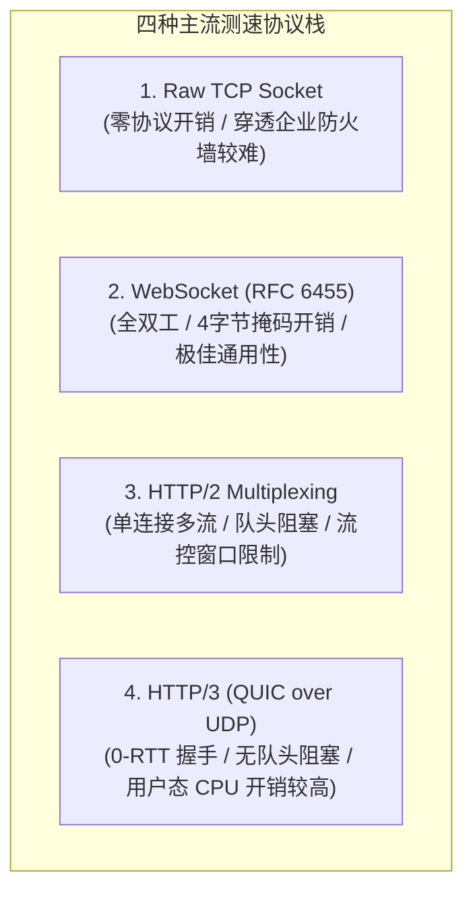
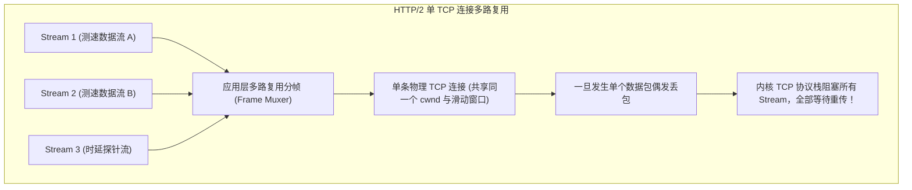
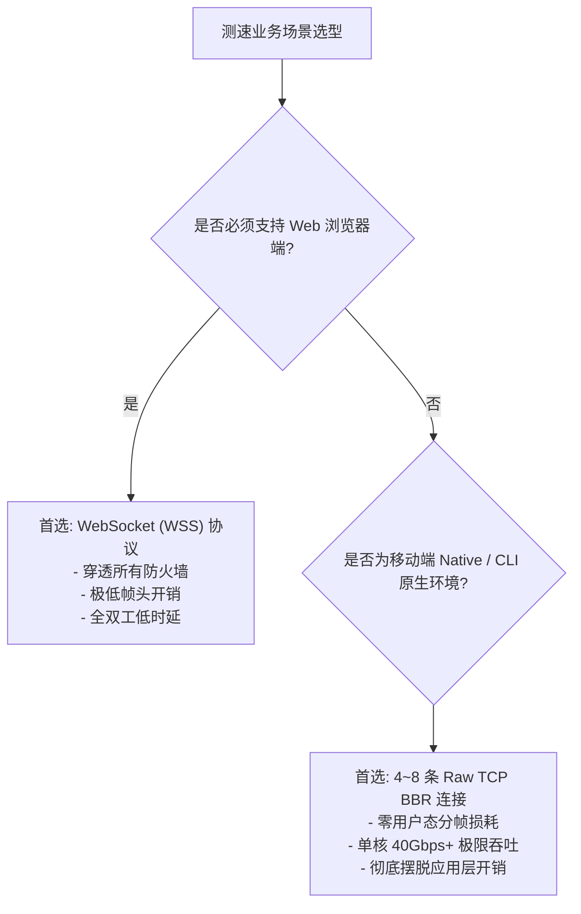

**TL;DR：** 在设计测速服务时，一个最常被争论的架构决策是：**到底该用 Raw TCP Socket、WebSocket、HTTP/2 还是基于 UDP 的 HTTP/3 (QUIC)？** 很多人直觉认为“HTTP/3 基于 UDP 一定最快”，但在千万并发或万兆吞吐的真实测速场景下，QUIC 在 Linux 用户态的 UDP 系统调用开销与加密消耗可能直接把 CPU 打爆，实际吞吐反而不如成熟的 TCP。另一方面，WebSocket 协议虽然具备全双工优势，但其客户端必须强制对数据进行 4 字节掩码（Masking）异或运算，在上行千兆推流时会成为客户端 CPU 的严重瓶颈。本文作为《网络测速与极限吞吐工程》系列第五篇，从**帧头开销数学推导**、**有效载荷纯净度（Payload Purity）**、**非对称 ACK 饥饿效应** 以及 **用户态与内核态损耗** 四个维度对四大协议进行深度物理裁决。

## 一、四大传输协议全景对比矩阵



| 维度 | Raw TCP Socket | WebSocket (RFC 6455) | HTTP/2 (Over TLS) | HTTP/3 (QUIC over UDP) |
| --- | --- | --- | --- | --- |
| **协议头每帧开销** | **0 字节**（纯二进制流） | 2~10 字节（+ 客户端 4 字节 Mask） | 9 字节帧头 + HPACK 头部 | 变长数据包头 + 帧头 |
| **有效载荷纯净度** | **100%** | **99.99%**（128KB 块下） | 99.95% | 98.5% ~ 99.2% |
| **客户端 CPU 消耗** | 极低（直接 Socket 写入） | 中等（需进行 Mask 异或计算） | 较高（TLS + 多路复用分帧） | **极高**（用户态 AES/ChaCha 加密与 UDP 发包） |
| **服务端单核极限吞吐**| **40Gbps+** | **35Gbps+** | ~12Gbps | ~8Gbps |
| **NAT / 防火墙穿透性**| 差（常被 80/443 策略拦截） | **极佳**（走标准 443 WSS） | **极佳**（标准 HTTPS） | 良好（部分企业路由器封禁 UDP 443） |

## 二、WebSocket 协议开销与有效载荷纯净度数学推导

根据 **RFC 6455** 规范，一个二进制 WebSocket 数据帧由以下部分组成：

```
 0                   1                   2                   3
 0 1 2 3 4 5 6 7 8 9 0 1 2 3 4 5 6 7 8 9 0 1 2 3 4 5 6 7 8 9 0 1
+-+-+-+-+-------+-+-------------+-------------------------------+
|F|R|R|R| opcode|M| Payload len |    Extended payload length    |
|I|S|S|S|  (4)  |A|     (7)     |             (16/64)           |
|N|V|V|V|       |S|             |   (if payload len==126/127)   |
| |1|2|3|       |K|             |                               |
+-+-+-+-+-------+-+-------------+ - - - - - - - - - - - - - - - +
|     Extended payload length continued, if payload len == 127  |
+ - - - - - - - - - - - - - - - +-------------------------------+
|                               |Masking-key, if MASK set to 1  |
+-------------------------------+-------------------------------+
| Masking-key (continued)       |          Payload Data         |
+-------------------------------- - - - - - - - - - - - - - - - +
:                     Payload Data continued ...                :
+---------------------------------------------------------------+
```

### 1. 服务端下行推流（Server $\to$ Client）
- 服务端发往客户端的数据**禁止掩码（Mask = 0）**；
- 当单次发送数据载荷 $L = 128\text{KB} = 131,072\text{ Bytes}$ 时（`Payload len == 127`），扩展长度占用 8 字节，基础帧头占用 2 字节，**总帧头开销仅为 10 字节**；
- **有效载荷纯净度（Downlink Payload Purity）**：
  $$\text{Purity}_{\text{down}} = \frac{131072}{131072 + 10} = \frac{131072}{131082} \approx 99.99237\%$$
- 协议开销损失不足 **$0.01\%$**，完全可以忽略不计。

### 2. 客户端上行推流（Client $\to$ Server）的掩码陷阱
- RFC 6455 强制要求客户端发送的所有数据帧**必须进行 4 字节 Mask 掩码变换**（防止中间透明代理缓存毒化）；
- **掩码计算公式**：
  $$D'_i = D_i \oplus \text{MaskingKey}[i \bmod 4]$$
- **性能灾难**：在千兆上行测速中，客户端每秒需对 125,000,000 个字节执行四字节循环异或运算。在性能较弱的低端移动设备上，未经 SIMD 向量化加速的 JavaScript / Swift 掩码计算会吃满一个 CPU 大核，导致吞吐卡在 400Mbps 上不去。

## 三、HTTP/2 多路复用在极限吞吐下的失真机制

很多工程师喜欢用 HTTP/2 的多流并行（Multiplexing）来实现多连接测速，但这在极限带宽下存在严重的传输层缺陷：



1. **TCP 层的队头阻塞（Head-of-Line Blocking）**：HTTP/2 的多条 Stream 物理上共享同一个底层 TCP 连接。一旦公网发生单个数据包丢包，整个 TCP 连接被内核挂起等待重传，**所有逻辑流同时被卡死**，无法体现真实并发多连接的容错能力；
2. **HTTP/2 流控窗口（Flow Control Window）上限**：HTTP/2 规范在应用层定义了 Connection-level 与 Stream-level 窗口大小（默认通常为 64KB）。如果服务端或客户端未主动发送 `WINDOW_UPDATE` 帧将流控窗口放大到兆字节级，吞吐会被应用层流控死死锁住。

## 四、非对称宽带下的 ACK 饥饿（ACK Starvation）效应

在典型的家庭宽带（如 1000M 下行 / 50M 上行）与 5G TDD 蜂窝网络中，上下行物理信道极不对称。

```
【上行测速全速激发时的 ACK 饥饿现象】
[客户端] ──(上行 100% 满载推流，占满网卡队列)──> [路由器上行队列塞满]
                                                     │
                                                     ▼
[服务端发来的下行 TCP ACK 确认包] <──(被堵在排队队列末尾，延迟暴增 300ms)
                                                     │
                                                     ▼
[客户端 TCP 协议栈] 误以为网络严重丢包超时，触发 RTO 超时，强制折半拥塞窗口！
```

- **物理成因**：当客户端以最大功率发射上行测速数据时，上行调制解调器（Modem）的物理信道被完全填满。此时服务端确认客户端收到数据的 TCP ACK 数据包无法及时送达，导致客户端协议栈触发 RTO 重传超时；
- **连接数工程铁律**：上行测速并发连接数**严禁超过 4 条**，且客户端必须将 ACK 延迟确认（Delayed ACK）与数据帧合并调度。

## 五、小结与协议选型决策树



在第五篇中，我们完成了测速协议栈的深度裁决：
1. **WebSocket 是 Web 端的最佳折中**：下行纯净度达 99.99%，兼具全双工与防火墙穿透性；
2. **警惕客户端 Masking 算力瓶颈**：移动端建议使用 Native C/Rust 模块通过 NEON / AVX 指令集加速掩码异或；
3. **避免 HTTP/2 单连接陷阱**：多路复用无法规避底层 TCP 队头阻塞；
4. **非对称宽带约束**：上行测速严格限制 4 条并发连接，规避 ACK 饥饿。

在下一篇 **《06 全局测速调度：BGP Anycast、就近选路与原子容量接纳》** 中，我们将把视野放大到分布式架构——如何在大规模边缘节点中实现毫秒级就近接入与并发容量防御。

---

## 参考资料

- IETF RFC 6455: *The WebSocket Protocol*
- IETF RFC 7540: *Hypertext Transfer Protocol Version 2 (HTTP/2)*
- IETF RFC 9000: *QUIC: A UDP-Based Multiplexed and Secure Transport*
- TCP ACK Starvation in Asymmetric Networks Research
