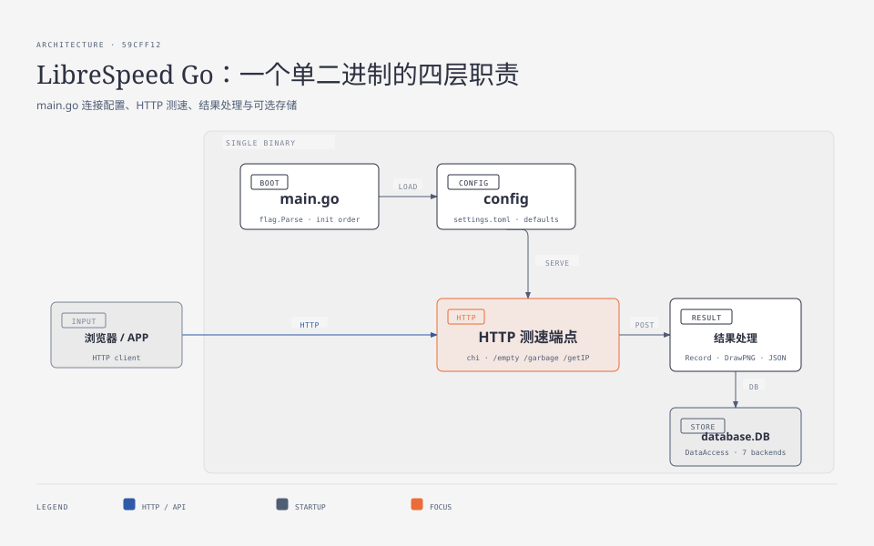
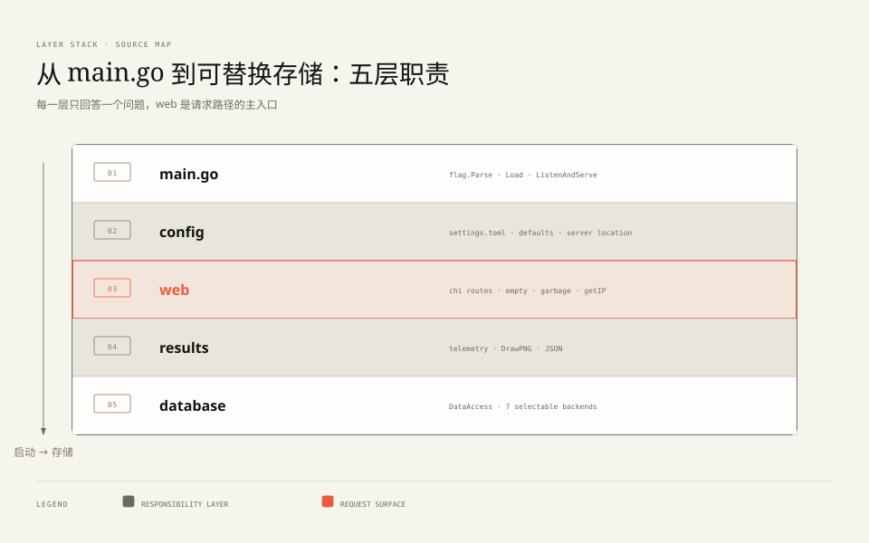

**TL;DR：** [librespeed/speedtest-go](https://github.com/librespeed/speedtest-go) 是 LibreSpeed 的官方 Go 实现：**全项目 21 个 `.go` 文件、2,371 行**（commit 59cff12 实测），编译出一个无外部依赖的单二进制，提供下载/上行/延迟/IP 归属/遥测/结果分享的完整测速服务。本篇是系列全景：`main.go` 只有 27 行、四个初始化调用；真正的逻辑在 `web/`（HTTP 层）、`results/`（结果与遥测）、`database/`（七种存储后端）三处。本机运行取证确认了每个端点的行为契约——garbage 默认恰好 4 MiB 随机字节、ckSize 参数上限钳制到 1 GiB、上行是纯粹的 `Discard` 汇。系列其余各篇再逐层拆。


---



## 一、为什么值得读这个项目

上一篇文章[《你的带宽是怎么被算出来的》](/writing/speedtest-service-architecture)给出了测速服务的通用节点地图：目录调度、测量边缘、载荷源、上行接收、结果上报。但那篇讲的是"它们长什么样"；这一系列要回答"它们怎么实现"。

选 speedtest-go 做标本有三个理由：

1. **体量刚好**。2,371 行意味着一篇文章可以负责任地说"我读完了全部"，而不是抽样；
2. **兼容包袱即教材**。它的路由同时挂着 `/backend/garbage` 和 `/garbage.php` 两套路径——PHP 版的历史合同在这里变成了活化石，读它就是读"协议如何向后兼容"；
3. **可本机取证**。`go build` 即得二进制，每个端点行为都能用 curl 复现。本系列的每一个行为断言都有对应的实测记录，存档在 `evidence/librespeed-go-series/2026-08-26-local/`。

## 二、main.go：27 行里的启动序列

整个入口文件（不含空行注释约 20 行有效代码）：

```go
func main() {
	flag.Parse()
	conf := config.Load(*optConfig)
	web.SetServerLocation(&conf)
	results.Initialize(&conf)
	database.SetDBInfo(&conf)
	log.Fatal(web.ListenAndServe(&conf))
}
```

四个初始化调用各有分工，顺序不能换：

| 步骤 | 函数 | 干什么 | 为什么要在这个位置 |
| --- | --- | --- | --- |
| 1 | `config.Load` | viper 读 settings.toml + 默认值 | 一切配置的源头 |
| 2 | `web.SetServerLocation` | 确定**服务器自己的经纬度**（配置给了就用，没给就调一次 ipinfo.io 查出口 IP 归属） | 后续计算"客户端离服务器多远"需要它 |
| 3 | `results.Initialize` | 解析并预渲染内嵌的两款 Noto Sans 字体为 font.Face | PNG 结果卡片绘制的前置 |
| 4 | `database.SetDBInfo` | 按 `database_type` 从七种后端里选一个赋给全局 `database.DB` | 遥测写入的前置 |
| 5 | `web.ListenAndServe` | 装配 chi 路由并阻塞监听 | 最后一步 |

两个容易忽略的细节：`import _ "time/tzdata"` 把时区数据库打进二进制（结果卡片要显示本地时间戳，scratch 容器里没有 /usr/share/zoneinfo）；`_ "github.com/breml/rootcerts"` 则是把系统 CA 根证书嵌入——同样是"单二进制扔进任何容器都能跑"这个目标的注脚。




## 三、文件地图：2,371 行都在哪

```
main.go                      27 行   启动序列
config/config.go             ~200    viper 配置加载与默认值
web/
  web.go                     244     路由装配 + garbage/empty/getIP 三大 handler
  helpers.go                 289     随机数据生成、ipinfo.io 与 MaxMind 双源、haversine 距离
  getip_util.go              120     五级代理头链与私网分类
  listener.go/_linux.go      ~60     TLS/HTTP2 监听（Linux 变体支持 tcp 抢占）
  fs.go                      ~60     禁用目录列举的 http.FileSystem 包装
results/
  telemetry.go               378     结果上报接收 + PNG 结果卡片绘制
  idobfuscation.go           ~90     结果 ID 混淆（salt 文件 + 位混淆）
  stats.go / json.go         ~150    密码保护的统计页与 JSON API
database/
  database.go                ~50     DataAccess 接口 + 七后端工厂
  sqlite|bolt|memory|none…           各后端实现（sqlite 用纯 Go 驱动 modernc.org/sqlite）
```

对照[测速架构篇](/writing/speedtest-service-architecture)的五类节点地图，映射关系一目了然：**测量边缘 + 载荷源**就是 `web.go` 的 `garbage` 与 `empty` 两个函数；**目录调度**在这个单体里退化为"没有调度"（客户端连的就是你）；**上报存储**是 `results/` 加 `database/`。一个自托管测速点不需要全球调度网络——这正是它能把代码压到 2,371 行的根本原因。


## 四、路由表：一套功能，三种挂载

`ListenAndServe` 里最显眼的是路由的双份甚至三份挂载（`web.go:67-96`）：

```go
r.HandleFunc(conf.BaseURL+"/empty", empty)
r.HandleFunc(conf.BaseURL+"/backend/empty", empty)
// PHP 兼容：
r.HandleFunc(conf.BaseURL+"/empty.php", empty)
r.HandleFunc(conf.BaseURL+"/backend/empty.php", empty)
```

同一逻辑挂三条路径：现代路径、`/backend/*` 前缀路径、以及带 `.php` 后缀的路径。第三种的存在理由写在注释里——"PHP frontend default values compatibility"：大量已有前端页面写死了 `empty.php`、`garbage.php`，Go 版必须能原样替换 PHP 版而不改前端一行代码。这是读老系统时反复出现的模式：**URL 即 API 合同，改路径就是破坏合同**。

中间件链也值得一读（`web.go:41-52`）：`RealIP`（从 X-Forwarded-For 重写 RemoteAddr）、`GetHead`（HEAD 自动转 GET）、CORS 允许所有来源、`NoCache`（测速响应绝不能被缓存）、`Recoverer`（panic 转 500）。注意 CORS 全开的含义：任何网页都可以把访客的浏览器变成这台服务器的测速客户端——自托管时的安全边界问题，第五篇展开。

## 五、本机运行取证：端点行为契约

构建并运行（memory 存储后端），逐个端点验证（原始输出见 `evidence/librespeed-go-series/2026-08-26-local/evidence_run.log`）：

| 断言 | 实测结果 |
| --- | --- |
| `GET /garbage` 默认载荷 = 4 chunks × 1 MiB | **4,194,304 字节整**，Content-Type `application/octet-stream`，内容为随机字节 |
| `GET /garbage?ckSize=1` | 恰好 **1,048,576 字节** |
| `GET /garbage?ckSize=99999` | 被钳制到上限 1024 chunks = **1,073,741,824 字节（1 GiB）** |
| `GET /empty` 三次 | 0.9–1.7ms（loopback，延迟测试的"空对象"基线） |
| `POST 10MB → /empty` | HTTP 200，服务端把请求体整体丢进 `ioutil.Discard` |
| `GET /getIP`（回环访问） | `{"processedString":"127.0.0.1 - localhost IPv4 access",...}` 私网分类生效 |
| `POST /results/telemetry` | 返回 `id 01M0WYDN7RMBHPT1BTQPV75J5P`（ULID） |

三个行为契约值得记住：

1. **下行载荷是"启动时预生成的随机数据"**（`web.go:36`，`crypto/rand` 生成 1 MiB）：随机是为了防中间缓存与压缩，预热是为运行时零分配开销——`garbage` 的循环体只是反复 `w.Write(randomData)`；
2. **`ckSize` 是客户端与服务端的协商参数**，但服务端保留最终裁量权：超过 1024 一律按 1024 执行。1 GiB 上限意味着恶意客户端最多白拿 1 GiB——免费流量出口的口子开在这里，且只有这一个旋钮；
3. **上行不需要服务端"准备"任何东西**：`empty` 把请求体拷贝进 `Discard`，只维持连接不存内容。上行的计量完全发生在客户端侧。

## 六、结论：小系统的分层纪律

2,371 行里没有接口抽象的炫技（`database.DataAccess` 是唯一的多态点），没有依赖注入框架，没有泛型容器——但 config/web/results/database 四层的边界始终清晰，`main.go` 的五个调用就是全部依赖流向。这印证了读小项目的第一个收获：**分层纪律与代码量无关，与"每层只回答一个问题"有关**。

下一站是系列第二篇：三大测速端点（`garbage`/`empty`/延迟基线）的服务端真相——包括为什么下载要用随机数、`ckSize` 钳制背后的滥用防御、以及 PHP 兼容层里藏着的 CORS 细节。

## 参考资料

- 项目仓库（本系列标本）：https://github.com/librespeed/speedtest-go ，commit `59cff12`
- 本机运行取证：本仓库 `evidence/librespeed-go-series/2026-08-26-local/`
- 站内相关：[你的带宽是怎么被算出来的](/writing/speedtest-service-architecture)、[评审幂等 PR](/writing/review-idempotent-pr-concurrency)
