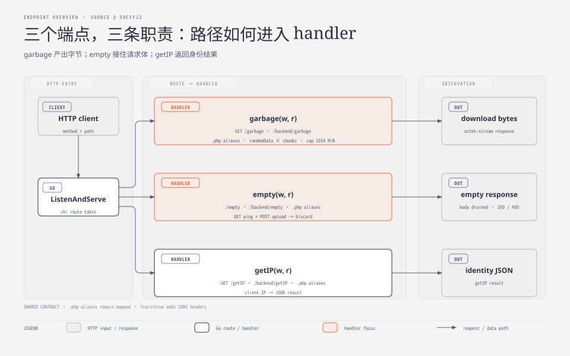
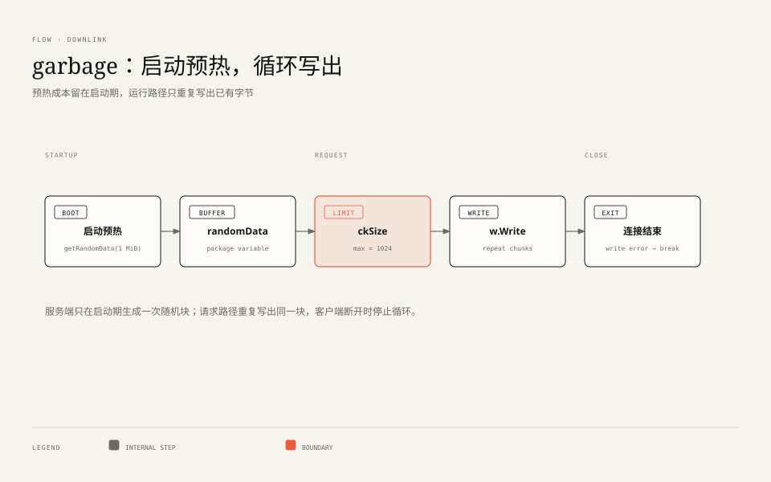
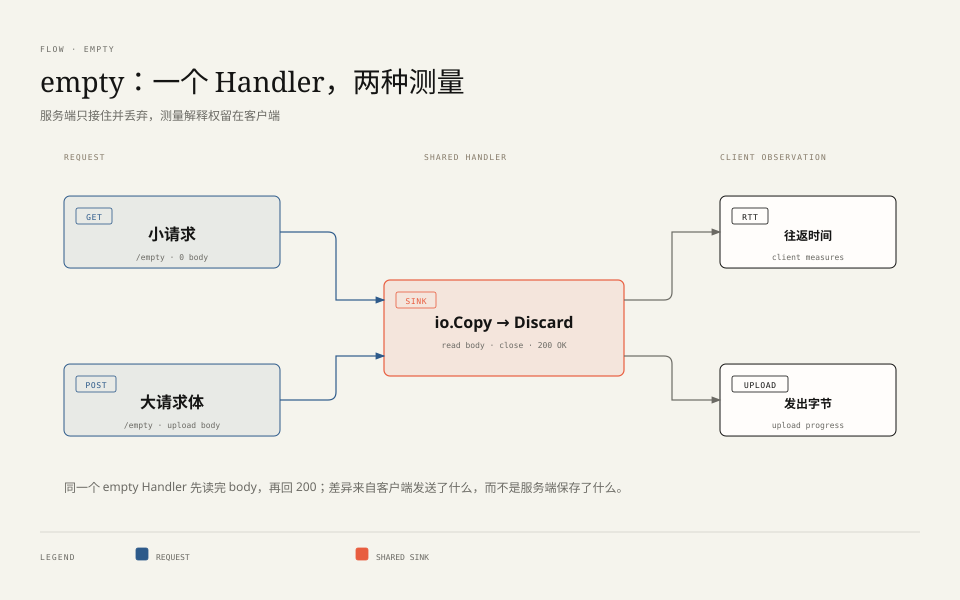

**TL;DR：** LibreSpeed Go 版的三个测速端点各回答一个测量学问题。**下行**（`/garbage`）：载荷必须是随机字节——既防缓存命中又防压缩，且在进程启动时一次性预生成 1 MiB，运行时零分配；客户端可用 `ckSize` 协商倍数，但服务端把上限钳制在 1024 chunks = **1 GiB**（实测恰好 1,073,741,824 字节）。**上行与延迟**共用 `/empty`：服务端把请求体整体拷贝进 `ioutil.Discard`——上行的计量完全发生在客户端，服务端只负责"接住并扔掉"。所有端点还挂着 `.php` 后缀的影子路由和 `?cors=true` 查询参数——那是一份活的 PHP 兼容合同。


---






## 一、下行端点 garbage：随机、预热、钳制

`web.go:161-193` 是完整的 `garbage` handler，不到 30 行，却浓缩了测速服务端的三个核心决策。

### 决策一：为什么是随机数据

```go
// web.go:26-37
const chunkSize = 1048576 // 1 MiB

//go:embed assets
var defaultAssets embed.FS

var (
	// generate random data for download test on start to minimize runtime overhead
	randomData = getRandomData(chunkSize)
)
```

`randomData` 是包级变量，进程启动时由 `getRandomData` 用 `crypto/rand` 填充 1 MiB。两个"为什么"：

- **为什么要随机**：测速流量一旦能被中间盒识别为"重复内容"，就会遭遇两类劫持——透明缓存直接命中返回（测的是缓存不是带宽），或 gzip 压缩后传输（1 MiB 随机数压不出水分，但可压缩的零填充会被压掉 99%）。随机字节让任何中间设备都只能老老实实搬完整带宽；
- **为什么预热**：`crypto/rand.Read` 一次生成 1 MiB 的成本不可忽略，放在请求路径里会给每次测速叠加延迟与分配压力。包级变量初始化把它挪到进程启动时付一次，运行时每个连接只是内存拷贝。

### 决策二：ckSize 是协商，不是命令

```go
// web.go:168-185（节选）
chunks := 4
ckSize := r.FormValue("ckSize")
if ckSize != "" {
	i, _ := strconv.ParseInt(ckSize, 10, 64)
	if i > 1024 {
		chunks = 1024   // 上限钳制
	} else {
		chunks = int(i)
	}
}
for i := 0; i < chunks; i++ {
	if _, err := w.Write(randomData); err != nil { break }
}
```

默认发 4 chunks（4 MiB）；客户端可以用 `?ckSize=N` 协商到 N MiB。但注意那个钳制：**N > 1024 一律按 1024 执行**。本机实测三种情况（原始输出 `evidence/librespeed-go-series/2026-08-26-local/evidence_run.log`）：

| 请求 | 实测字节数 |
| --- | --- |
| 默认 | 4,194,304 |
| `ckSize=1` | 1,048,576（恰好 1 MiB） |
| `ckSize=99999` | 1,073,741,824（恰好 1024 × 1 MiB = 1 GiB） |

这个钳制是免费公开服务的生命线：没有它，任何一个 `curl /garbage?ckSize=9999999` 循环都是无限流量抽取口。1 GiB 的上限意味着单次滥用封顶，而正常测速（前端默认只要几十 MB）远够用。写对外服务时的通用模式：**客户端参数永远只影响"下限体验"，资源上限必须由服务端单方面锁死**。

还有一个容易漏看的失败处理：写循环里的 `break`。客户端中途断开（测速结束就该断开）时，`w.Write` 返回错误，循环退出——服务端不会傻乎乎地把剩余几百 MB 写进黑洞连接。

### 决策三：响应头的"伪装"

`garbage` 设置了四个响应头：`Content-Disposition: attachment; filename=random.dat`、`Content-Type: application/octet-stream` 等。这不是装饰：历史上有人直接在浏览器地址栏打开 garbage URL，浏览器若按文本渲染会卡死标签页；声明成附件二进制流让浏览器走下载通道。兼容性细节，但正是这类细节决定一个端点敢不敢公开。




## 二、empty 端点：上行与延迟共用的"黑洞"

```go
// web.go:148-159
func empty(w http.ResponseWriter, r *http.Request) {
	_, err := io.Copy(ioutil.Discard, r.Body)
	if err != nil {
		w.WriteHeader(http.StatusBadRequest)
		return
	}
	_ = r.Body.Close()
	sendPHPCORSHeaders(w, r)
	w.Header().Set("Connection", "keep-alive")
	w.WriteHeader(http.StatusOK)
}
```

一个函数服务两种测量：

- **延迟测试**：客户端对 `/empty` 发起小请求，计往返时间。loopback 实测三次 0.9–1.7ms；
- **上行测试**：客户端 POST 大体积随机 body，服务端 `io.Copy(ioutil.Discard, ...)` 把数据读进来全部丢弃。本机实测 POST 10 MB 耗时 6.4ms 返回 200。

关键认知：**上行的计量发生在客户端**。服务端不计数、不存储——`Discard` 就是它的全部职责。这与下行形成镜像对称：下行时客户端计量自己收到了多少，上行时客户端计量自己发出了多少，服务端两边的任务都只是"别拖累测量"。`Connection: keep-alive` 头是给老前端的保险：确保复用连接做多次采样时不因连接重建引入噪声。

## 三、PHP 兼容层：一份活着的合同

路由表里每个逻辑端点都有 `.php` 影子（`/empty.php`、`/garbage.php`…），并且 handler 里有一个专门的函数：

```go
// web.go:138-146
func sendPHPCORSHeaders(w http.ResponseWriter, r *http.Request) {
	if r.FormValue("cors") == "true" {
		w.Header().Set("Access-Control-Allow-Origin", "*")
		w.Header().Set("Access-Control-Allow-Methods", "GET, POST")
		w.Header().Set("Access-Control-Allow-Headers", "Content-Encoding, Content-Type")
	}
}
```

三层兼容设计叠在一起看很有意思：

1. **路径兼容**：`.php` 后缀让存量前端无改动迁移；
2. **参数兼容**：PHP 版的 CORS 是 per-request 的 `?cors=true` 行为，Go 版虽有全局 CORS 中间件，仍保留这个查询参数语义；
3. **行为注释即合同**：函数注释明确写着"matching the PHP backend's behavior"——Go 版把自己定位为 PHP 版的**行为继承者**而非新协议。

对读者的启示：替换一个在线服务时，真正的交付物不是"功能等价"，而是**请求级行为等价**（路径、参数、响应头）。这个项目是"如何体面地接管一段历史合同"的范本。

## 四、结论：三个端点，三条测量学纪律

| 端点 | 测什么 | 服务端纪律 |
| --- | --- | --- |
| `/garbage` | 下行容量 | 随机防劫持 + 预热零开销 + 资源上限单方面锁死 |
| `/empty` | 上行容量 | 只接不计，计量权留给客户端 |
| `/empty`(小请求) | 往返延迟 | 最小处理路径，keep-alive 保采样纯度 |

验证入口：clone 后 `go build -o speedtest main.go`，把 `settings.toml` 里 `database_type` 改成 `memory`，然后照 `evidence/librespeed-go-series/2026-08-26-local/evidence_run.log` 的六条命令逐个敲一遍——十分钟就能亲手确认本文每一个数字。

下一篇转向最容易被忽略的一层：`/getIP` 背后的五级代理头链、私网分类的位运算技巧，以及 ipinfo.io 与 MaxMind 双源的回退设计。

## 参考资料

- 项目仓库 @ commit `59cff12`；本机取证：`evidence/librespeed-go-series/2026-08-26-local/evidence_run.log`
- 站内相关：[27 行的 main.go](/writing/librespeed-go-01-overview)、[你的带宽是怎么被算出来的](/writing/speedtest-service-architecture)、[Socket 背压](/writing/socket-backpressure-slow-consumer)
