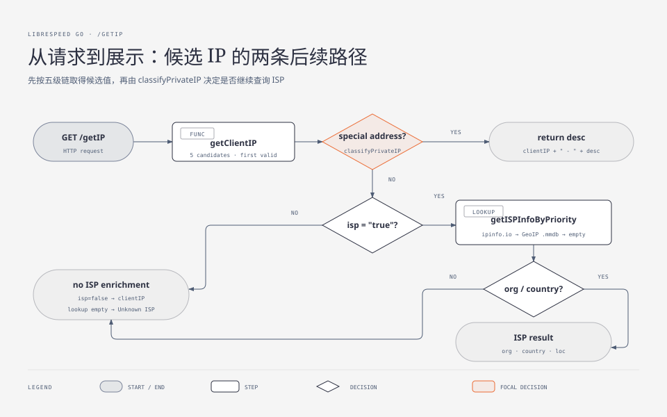
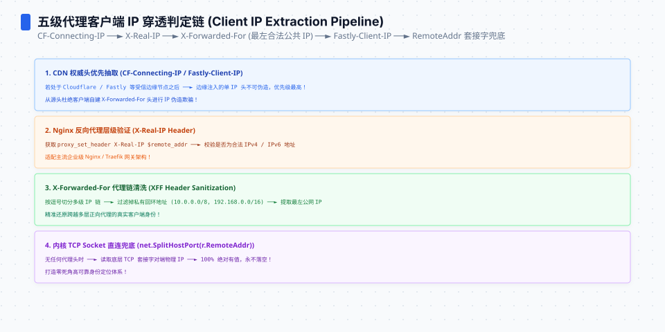
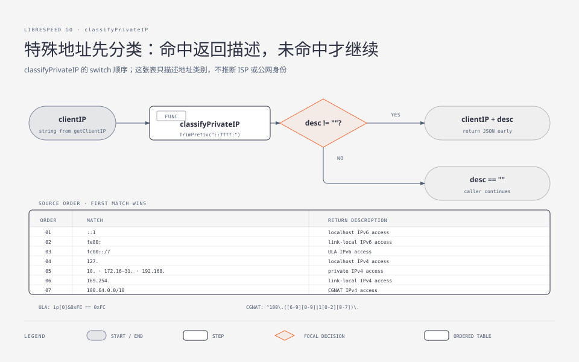

**TL;DR：** 测速服务的 `/getIP` 端点要回答三个问题：你是谁（IP）、你在哪个网（ISP）、你离服务器多远（距离）。LibreSpeed Go 的实现（`web/getip_util.go` + `web/helpers.go`）给出了三个值得抄的工程答案：还原客户端 IP 用**五级优先链**且每一级都做合法性校验；判断私网/特殊地址用一张覆盖 localhost/私网/link-local/CGNAT/ULA 的分类表，其中 ULA 判定是一条位运算 `ip[0]&0xFE == 0xFC`；ISP 归属走 **ipinfo.io 在线 API 优先、MaxMind 离线 mmdb 兜底**的双源回退，距离计算用 haversine 并把"四舍五入到十位"写成了与 PHP 版 `round($d,-1)` 逐位一致的合同。


---






## 一、你是谁：五级代理头链

反代与 CDN 普遍存在的今天，`r.RemoteAddr` 经常只是最后一跳代理的地址。`getClientIP`（`getip_util.go:44-72`）按固定优先级逐级尝试：

```text
1. CF-Connecting-IPv6   （Cloudflare 注入，必须是合法 IPv6）
2. Client-IP
3. X-Real-IP
4. X-Forwarded-For      （取逗号分隔链的第一段）
5. RemoteAddr           （兜底）
```

两个设计细节比顺序本身更重要：

**第一，每一级候选都要过校验函数** `normalizeCandidateIP`：去空白、XFF 取首段、`net.ParseIP` 验证；对 CF 头还额外要求"必须真的是 IPv6"（`To16() != nil && To4() == nil`）。校验失败不是报错而是**降级到下一级**——伪造或格式错误的头部不会毒化结果。同时所有返回值统一 `TrimPrefix("::ffff:")`，把 IPv4-mapped IPv6 归一成点分 IPv4，避免同一个客户端在分类逻辑里被当成两种形态。

**第二，注释明确写着"mirroring the PHP getIP_util.php behavior"**。这条优先级链不是 Go 版的发明，而是 PHP 版多年沉淀的行为合同。它也直接告诉你这套链的安全边界：这些头全部可以被客户端伪造，所以它只适合"提升展示友好度"，绝不能当访问控制依据（08 篇安全话题会回到这一点）。




## 二、它在哪个网：一张特殊地址分类表

拿到 IP 后先过 `classifyPrivateIP`（`getip_util.go:77-103`）：命中特殊地址就不再查询 ISP，直接返回人类可读描述。本机回环实测：

```json
{"processedString":"127.0.0.1 - localhost IPv4 access","rawIspInfo":{...}}
```

分类表覆盖六类，每类都有存在理由：

| 分类 | 匹配 | 为什么单独列出 |
| --- | --- | --- |
| localhost IPv6 / IPv4 | `::1`、`127.*` | 自托管时最常见的访问来源 |
| link-local | `fe80:` 前缀、`169.254.*` | DHCP 失败/直连线场景 |
| 私有 IPv4 | `10.*`、`172.16-31.*`、`192.168.*` | 家用/办公内网 |
| ULA IPv6 | fc00::/7 | IPv6 的"私有地址"等价物 |
| CGNAT | `100.64.0.0 – 100.127.x.x` | 运营商级 NAT，移动网络用户的海量来源 |

两处实现技巧值得展开。**ULA 判定没有用正则**，而是一条位运算：

```go
// fc00::/7 means the first 7 bits are 1111110
return ip[0]&0xFE == 0xFC
```

fc00::/7 的意思是前 7 位为 `1111110`——把首字节与 `0xFE`（保留最高 7 位）比较是否等于 `0xFC`，一行就覆盖 fc00 到 fdff 的整个区间，比任何前缀枚举都便宜且不会写错边界。**CGNAT 判定则用正则** `^100\.([6-9][0-9]|1[0-2][0-7])\.`：第二段只在 64–127 之间命中，精确圈出 RFC 6598 分配的 100.64.0.0/10。两种手法混用的标准是清晰的——能用位运算表达的语义就用位运算，需要跨字节段匹配的才上正则。

这个分类表的实际价值：自托管测速点的访问日志里大量来自内网与 CGNAT，把它们显式标注出来，既避免拿内网 IP 去查 GeoAPI 的无意义外呼，也让用户看到"你正在内网测速，结果不代表公网带宽"。

## 三、你的 ISP 与距离：在线优先、离线兜底、距离有取整合同

ISP 信息查询实现了三级瀑布（`helpers.go:270-289`）：

```text
getISPInfoByPriority:
  ① ipinfo.io 在线 API（可配 token）
  ② 结果为空 → MaxMind/ipinfo 离线 .mmdb 库
  ③ 仍为空 → 只显示裸 IP
```

离线库部分（`getGeoIPData`）兼容了**两种数据库字段方言**：ipinfo 官方 mmdb 的 `as_name`/`country_name`，以及标准 MaxMind GeoIP2 的 `autonomous_system.organization` / `country.names.en`——查一次库、两套 schema 都能读，这是"离线回退"能真正落地的前提（只支持一种格式的 fallback 在现实数据面前经常等于没有）。mmdb reader 用惰性单例打开（`geoIPOpened` 标志 + 首用时 Open），避免启动时的硬依赖。

距离计算的输入是 ipinfo 返回的 `loc` 字段（"纬度,经度"字符串），算法是 haversine 球面距离，但真正有意思的是**输出层的取整合同**：

```go
// roundToNearest10 rounds a float64 to the nearest 10,
// matching PHP round($d, -1)
func roundToNearest10(val float64) float64 {
	return float64(int64(val/10+0.5)) * 10
}
```

公里数四舍五入到十位（`<20 km` 有专门文案）、海里保留两位、英里同样取整到十位。注释点名"matching PHP round($d, -1)"——又是那条纪律：前端会把这段文字原样展示给用户，Go 版必须和 PHP 版产出逐字符一致的结果，否则同一份测速记录在两代服务之间会"漂移"。另外注意服务器坐标的来源（`SetServerLocation`）：配置文件给了经纬度就用配置，没给就在**启动时调一次 ipinfo.io 查自己的出口 IP 归属**——本系列运行取证的服务器日志第一条就是 `Fetched server coordinates: 25.053100, 121.526400`。

## 四、结论：身份层的三条纪律

1. **信任要分级**：五个头的优先级是"越可信的越靠前"，且每一级独立校验、失败降级——永不因一个坏头而报错；
2. **特殊地址先于外部查询**：内网/CGNAT/ULA 显式分类，省掉无效外呼，也向用户诚实说明"这次测量发生在哪一层"；
3. **展示层的一致性也是合同**：取整方式、单位文案、甚至 `<20 km` 这种阈值文案，都是前后端之间的隐式协议。

下一篇进入数据层：遥测上报里的 ULID 生成、`RedactIP` 的三组脱敏正则、ID 混淆的 salt 文件设计，以及七种存储后端的工厂模式。

## 参考资料

- 项目仓库 @ commit `59cff12`；运行取证：`evidence/librespeed-go-series/2026-08-26-local/evidence_run.log`
- 关键文件：`web/getip_util.go`（120 行）、`web/helpers.go`（289 行）
- 站内相关：[garbage、empty 与被钳制的 1 GiB](/writing/librespeed-go-02-endpoints)、[RSS、heapUsed 与 GC 后保留量](/writing/memory-metrics-rss-heapused)
