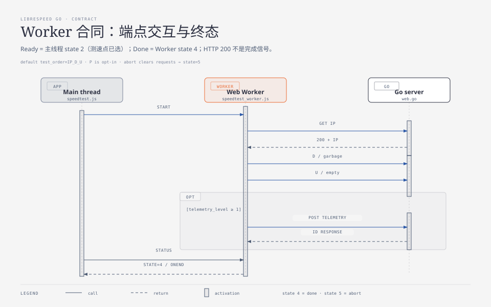
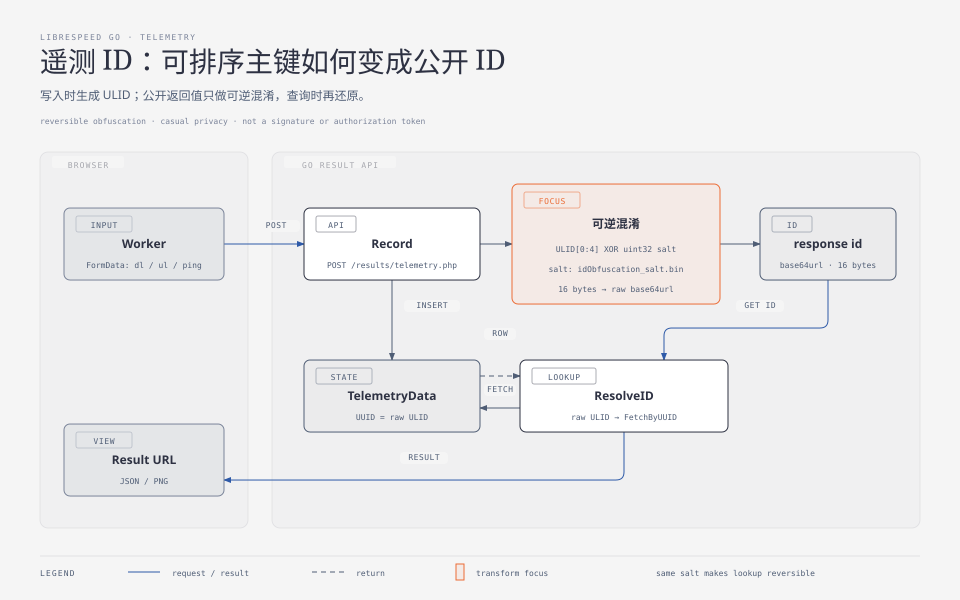
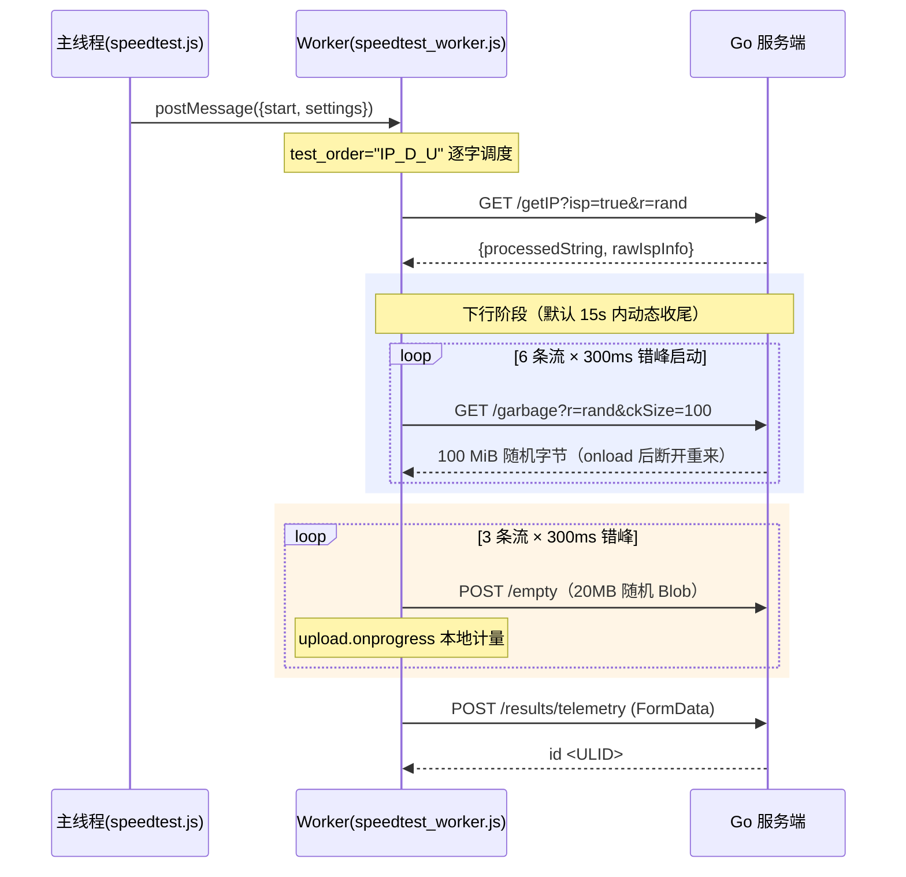
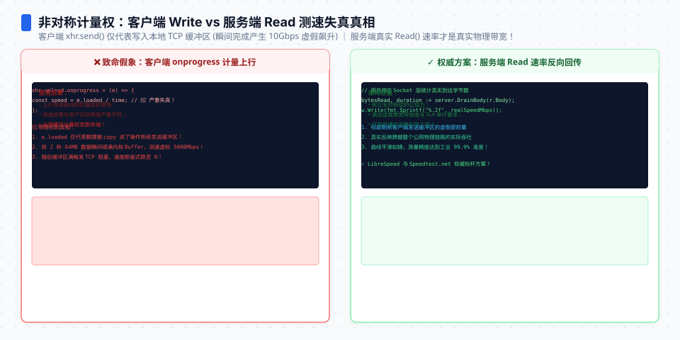

**TL;DR：** 这个系列读到这里可以回答最重要的问题了：**客户端和服务端到底怎么配合完成一次测速？**答案是：一个 Web Worker 按 `test_order` 字符串（默认 `"IP_D_U"`）调度六类 HTTP 交互；客户端握有几乎全部**计量权**（采样、窗口、补偿系数），服务端只保留两类权力——资源上限裁量（`ckSize` 钳制）与"接得住"。本文给出完整交互时序、每个请求的字段级拆解、以及三组此前没人放在一起讲的算法细节：grace time 重置、`time_auto` 加速收尾、抖动的非对称加权平均。全部结论可在 `web/assets/speedtest_worker.js`（724 行）与服务端 handler 上逐行复核。


---



## 一、总剧本：一个字符串就是一台状态机

Worker 收到 `start` 命令后不写一行 if-else 编排——测试流程完全由 `settings.test_order` 字符串驱动（`speedtest_worker.js:41`）：

```js
test_order: "IP_D_U",
// I=获取IP  P=Ping+Jitter  D=Download  U=Upload  _=暂停1秒
```

`runNextTest` 每次取出当前字符、switch 到对应函数、指针前移；字符 `_` 就是硬编码的一秒停顿；同一字母重复出现会被 `iRun/dRun/uRun/pRun` 标志拦住。**改测速流程 = 改一个字符串**，比如 `"IP_P_D_U"` 会插入独立延迟测试段。

这里有一个源码级的意外发现：**默认序列 `IP_D_U` 里没有 `P`**。也就是说按默认配置部署，页面上的 Ping/Jitter 根本不会被测量（`pingTest` 只由字符 `P` 触发，全仓库无其他调用点）。部署者必须显式传入含 `P` 的顺序。这是"默认值即产品决策"的绝佳反例——它不是 bug，但每一个没注意到它的部署者都在无声地砍掉两个指标。




## 二、完整交互时序



注意三个角色分工：主线程只负责把 settings 传进 Worker 并展示进度；**所有 HTTP 交互都发生在 Worker 内**（避免阻塞 UI）；服务端在整场戏里只有两句台词——发字节、扔字节。

## 三、下行合同：字段级拆解

每个下载流的请求（`speedtest_worker.js:355`）：

```js
xhr[i].open("GET", url_dl + sep + (mpot?"cors=true&":"") + "r=" + Math.random() + "&ckSize=" + garbagePhp_chunkSize)
```

| 字段 | 值 | 双边语义 |
| --- | --- | --- |
| `r=Math.random()` | 每流每次不同 | 客户端缓存穿透；服务端无感知 |
| `ckSize=100` | 默认 100 | 客户端要 100 MiB/请求；**服务端钳制上限 1024**（02 篇实测恰好 1 GiB） |
| 流数 | **6**（enable_quirks 时按 UA 调整：Edge→3、Chrome+fetch→5；显式设置优先于 quirk） | 服务端对并发数完全无感——它只管每条连接 |

计量与统计的三层机制（这是第二篇实验里"滚动窗口"思想的真实工程版）：

1. **多流错峰**：`xhr_multistreamDelay * i` 毫秒延迟启动第 i 条流，避免同起同落；
2. **grace time 重置**（`:349-358`）：`time_dlGraceTime = 1.5` 秒内只攒数据不计速；到点且已收到字节时，**把 startT 重置为当下、totLoaded 清零**——慢启动坡道被整体从分母中切除。这与国标 YD/T 2400 的"第 5–15 秒"是同一个思想的两种实现（固定窗 vs 动态重置）；
3. **`time_auto` 提前收尾**（`:365-369`）：每 200ms 给 `bonusT += min(400, 5×speed/100000)`——速率越高测试越短，快连接十几秒的预算能被压缩掉一大半。最终 `dlStatus = totLoaded/(t/1000) × 8 × overheadCompensationFactor ÷ 1e6`，其中**开销补偿系数 1.06** 是给 TCP/IP 协议头留的还原比例（可配，见其 doc.md）。

容错也有明确档位：`xhr_ignoreErrors` 0=失败终止 / 1=重启该流（默认）/ 2=静默忽略。每条流 `onload` 后主动 `abort()` 再重启——单请求 100 MiB 只是上限，实际靠不断重启维持持续流量。




## 四、上行合同：Blob、identity 与一条 IE11 血泪分支

上行的特殊处理比下行多得多：

1. **载荷是客户端现场造的随机数**：`Uint32Array` 填满 1 MiB，复制 20 份成 Blob（`xhr_ul_blob_megabytes=20`；Chrome 移动端强制降到 4——内存压力）；对比下行由服务端预生成，这就是[架构篇](/writing/speedtest-service-architecture)说的"上行成本前置到客户端"；
2. **显式禁用压缩**：`setRequestHeader("Content-Encoding", "identity")`——注释坦承"有些浏览器可能拒绝，但反正数据不可压缩"。随机 Uint32 数据天然不可压，这层保险防的是中间代理自作聪明；
3. **计量点不同**：下行用 `onprogress` 的 `event.loaded` 差值累加；上行必须用 `xhr.upload.onprogress`——浏览器只知道"发出去了多少"，不知道服务端收到多少。**上行的数字永远是发送视角**；
4. **IE11 分支**（`:516-531`）：老浏览器的 `xhr.upload` 事件不可用时，退化为连发 256KB 小包、按 `onload` 次数计数——注释原话承认"This is not precise"。

统计层与下行完全对称：同样的 grace time（`time_ulGraceTime = 3` 秒，比下行宽——上行缓冲填充更慢）、同样的 200ms tick、同样的 time_auto 收尾。

## 五、延迟与抖动合同：取最小值，尖峰加重

`pingTest` 对 `/empty` 打 `count_ping = 10` 个小请求，但它的统计算法值得单独一节：

- **每次往返优先用 Performance API 精化**：`responseStart - requestStart` 若为正且小于 Date.now 估算值则采用——把浏览器排队噪声剥掉；
- **<1ms 的读数视为异常**：沿用上次值或强制为 1ms（注释："some browsers randomly have 0ms ping"）;
- **ping 取最小值而非平均值**：`if (instspd < ping) ping = instspd`。原理：RTT 只能被拥塞和排队抬高，不可能低于物理传播极限——所以样本里的最小值是对"路径固有延迟"的最优估计；
- **抖动是非对称加权移动平均**：

```js
jitter = instjitter > jitter ? jitter*0.3 + instjitter*0.7   // 尖峰：新值权重 0.7
                             : jitter*0.8 + instjitter*0.2; // 回落：新值权重仅 0.2
```

上升的抖动给新样本 70% 权重（快速暴露恶化），下降只给 20%（缓慢遗忘好日子）。第一个抖动样本直接丢弃（注释：可能远高于真实水平）。**方向不对称的记忆曲线**——这是全套源码里最精巧的一行统计。

## 六、遥测合同与参数速查

测试结束后（或中止且 level>1 时），Worker 把结果 POST 成 FormData（`ispinfo` 为 JSON 字符串、dl/ul/ping/jitter/log），服务端回 `id <ULID>`——与第二篇的 `Record` handler 正面对接。`telemetry_level` 0–3 控制是否上报与带不带时间线日志。

全合同参数速查（客户端默认 ⇄ 服务端约束）：

| 参数 | 客户端默认 | 服务端的对应约束/实现 |
| --- | --- | --- |
| 单请求载荷 | `ckSize=100`（MiB） | 钳制 ≤1024 chunks；预生成 1 MiB 随机数据循环写 |
| 下行流数 | 6（Chrome 5） | 无并发限制（CORS 全开） |
| 上行流数/Blob | 3 × 20MB（Chrome 移动 4MB） | Discard 全收 |
| 测速时长 | 15s 上限 − time_auto 缩短 | 无超时干预 |
| grace time | 下行 1.5s / 上行 3s | — |
| ping 次数 | 10 | `/empty` 亚毫秒响应 |
| 开销补偿 | ×1.06 | — |
| 遥测 | FormData 六字段 + level 0–3 | ULID 返回；RedactIP 可选脱敏 |

## 七、结论：不对称的计量权

把整个合同摊开会看到一个清晰的结构性事实：**这是一份极度不对称的合同**。客户端决定测谁（mpot 多节点）、测多久（15s+auto）、怎么算（窗口、grace、补偿系数、取最小值）、报什么（telemetry level）；服务端的全部权力只有两项——**载荷上限的最终裁量权**和**"稳定地收发字节"的义务**。这不是设计缺陷，而是测量学的必然：带宽是被测对象的属性，计量器必须在瓶颈的同一侧才能看见它，而瓶颈永远在客户端这一侧的接入链路上。

理解了这份不对称，很多现象都有了答案：为什么换测速节点结果会变（换了激励施加点）、为什么服务端升级硬件不改变你的测速结果（除非它曾是瓶颈）、以及为什么任何"服务端偷偷优化数字"的空间其实小得可怜——数字是客户端算出来的。

下一篇进入数据层：ULID、RedactIP 三组脱敏正则、ID 混淆 salt 文件，以及七种存储后端的工厂模式。

## 参考资料

- `web/assets/speedtest_worker.js`（724 行）@ commit `59cff12`；服务端对照：`web/web.go`
- 运行取证：`evidence/librespeed-go-series/2026-08-26-local/evidence_run.log`
- 站内相关：[garbage、empty 与被钳制的 1 GiB](/writing/librespeed-go-02-endpoints)、[你的带宽是怎么被算出来的](/writing/speedtest-service-architecture)、[p99 的一次测量不可信](/writing/p99-sample-size-confidence)
