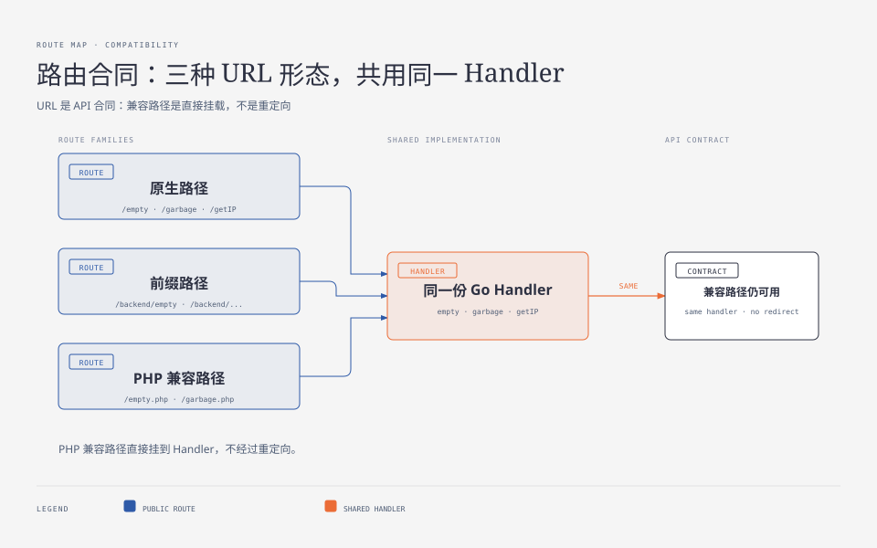
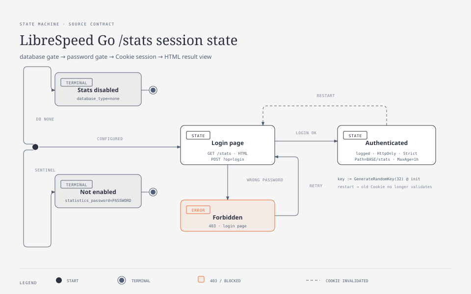
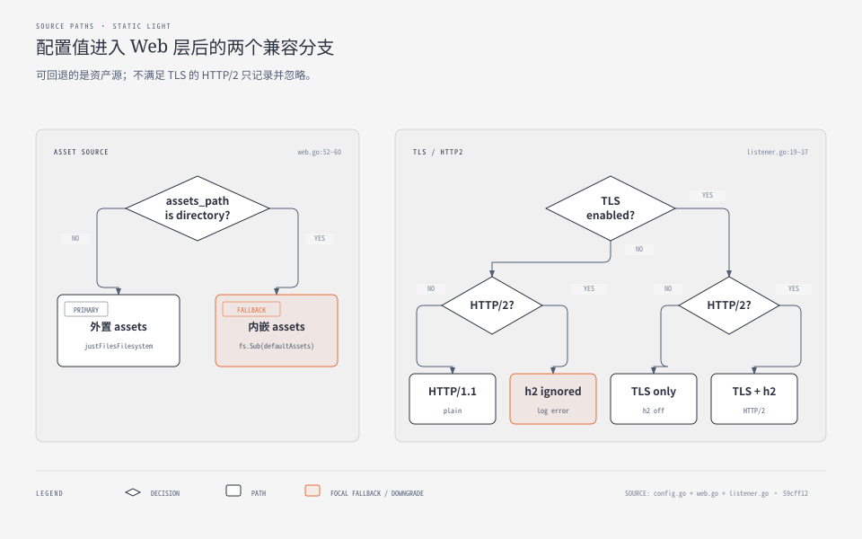

**TL;DR：** 这个服务的接口合同不只是“有哪些 URL”，还包括路径兼容、请求方法、响应口径和监听入口。现代路径、`/backend/` 前缀和 `.php` 路径直接复用同一个 Handler；客户端真正需要的测量面只有 `getIP`、`garbage`、`empty` 和 telemetry，结果读取与 `/stats` 属于另一层。配置面则必须区分“Viper 能读取”与“当前代码真的消费”：`database_type` 和统计密码会改变行为，`download_chunks`、`distance_unit` 在这个 commit 中不会改变 `garbage` 的实际行为。

## 一、URL 形态本身就是兼容合同

同一个逻辑端点有三种公开形态：原生路径、`/backend/` 前缀和 PHP 兼容路径。它们不是三份实现，也不是重定向，而是多条路由指向同一个 Go Handler。



这使旧的 PHP 前端可以直接把后端换成 Go 版本，不必先改写所有 `empty.php`、`garbage.php` 等 URL。`?cors=true` 仍保留为请求级兼容参数；全局中间件还会处理 RealIP、HEAD、CORS、NoCache 和 panic 恢复。兼容的代价是路由表看起来比业务功能更大：很多 URL 是历史合同，而不是新功能。

## 二、对接客户端只需要四个测量端点

不要把所有路径都写成一张难以维护的“12 条 API”清单。按调用者真正需要的能力分组更清楚：

| 方法 | 路径 | 请求者得到什么 | 服务端边界 |
| --- | --- | --- | --- |
| `GET` | `/getIP` | 来源、可选 ISP 和距离描述 | 特殊地址先分类，公网地址才可能外呼 |
| `GET` | `/garbage` | 随机二进制下行载荷 | 默认 4 MiB；`ckSize` 上限 1024 MiB |
| `GET/POST` | `/empty` | RTT 基线或上行接收汇 | body 读到 `Discard`，不保存 |
| `POST` | `/results/telemetry` | 一个结果 ID | `none` 后端直接关闭写入 |

结果读取是第二组接口：`/results/json?id=...` 返回展示用 JSON，`/results?id=...` 返回 PNG，`/stats` 提供受密码保护的管理视图。它们消费已经写入的记录，不参与下行、上行和 RTT 的原始计量。

一个最小会话只需要几步：

```sh
BASE=http://127.0.0.1:8915
curl -s "$BASE/getIP"
curl -s "$BASE/garbage?ckSize=1" -o /dev/null -w '%{http_code} %{size_download}B\n'
curl -s --data-binary @u.bin "$BASE/backend/empty" -o /dev/null -w '%{http_code}\n'
ID=$(curl -s -X POST "$BASE/results/telemetry" \
  --data-urlencode 'dl=938.4' --data-urlencode 'ul=103.9' \
  --data-urlencode 'ping=2.8412' --data-urlencode 'jitter=1.05' \
  --data-urlencode 'ispinfo={"processedString":"1.2.3.4 - TestNet, XX"}' | sed 's/^id //')
curl -s "$BASE/results/json?id=$ID"
```

## 三、结果与管理面有自己的语义

`/results/json` 是展示 API，不是原始数据导出：数字会按小于 10、10–99、100 及以上分成不同显示精度，调用者如果要做统计不能把返回字符串当成原始测量值。

`/stats` 则是管理面：

| 场景 | 实际行为 |
| --- | --- |
| `statistics_password="PASSWORD"` | 哨兵值，统计功能未配置 |
| 未登录 | 返回登录页 |
| 错误密码 | `403` |
| 正确密码 | 保存 HttpOnly、Strict Cookie 后重定向 |
| 已登录 | 读取最近 100 条或指定 ID |



会话密钥在进程初始化时随机生成，重启会使旧 Cookie 失效；多实例部署若没有共享会话密钥，就不能假设一台机器签发的 Cookie 在另一台机器上可用。这个实现细节比“有密码登录”更接近真实部署边界。

## 四、配置文件要追到调用点

Viper 的来源优先级不能代替“这个键有没有消费者”的检查：

| 配置 | 当前行为 |
| --- | --- |
| `database_type` | 默认值是 `postgresql`，会影响启动时选择的后端 |
| `statistics_password` | 默认哨兵值 `PASSWORD`，影响 `/stats` 是否真正启用 |
| `download_chunks` | 当前 `garbage` 使用硬编码的 4，修改该键不改变实际 chunk 数 |
| `distance_unit` | 距离单位由请求参数分支决定，该默认键没有接入当前路径 |



图中两个判断分别说明了配置的两种失败形态：外部 assets 不存在时回到嵌入资源；请求 HTTP/2 但没有 TLS 时，代码记录约束并忽略不成立的组合。配置系统能接受一个值，不代表业务路径会消费它；审计配置时必须回到读取点和使用点。

## 五、监听方式是平台边界，不是默认生产证明

非 Linux 路径使用普通 `net.Listen`，TLS 和 HTTP/2 的组合大致是：

| TLS | HTTP/2 | 实际行为 |
| --- | --- | --- |
| 关 | 关 | 明文 HTTP/1.1 |
| 开 | 关 | TLS，但显式不启用 h2 |
| 开 | 开 | TLS + HTTP/2 |
| 关 | 开 | 记录 TLS 必需，忽略 h2 请求 |

Linux 构建还可以通过 systemd socket activation 接收继承的文件描述符；此时 bind/port 配置必须与 socket 的所有权保持一致。`proxyprotocol_port` 则是独立监听入口，用于由前置代理注入真实来源地址，不是对所有普通连接自动增加可信度。

仓库里存在 Dockerfile、systemd 和发行版打包入口，但当前 dated evidence 只覆盖 Darwin/arm64、loopback、`database_type=memory` 的本地进程。没有 Linux socket、TLS、proxy protocol 或外部拓扑证据，就只能说“代码提供了这些入口”，不能说“生产部署已经验证”。

## 六、接口文章的使用边界

如果目标是接入自己的前端，先实现四个测量端点，再按需实现结果读取；如果目标是开放公网，至少要重新检查统计密码、CORS、NoCache、`garbage` 上限、代理头信任和结果后端。路由兼容解决的是客户端迁移成本，不能自动解决认证、容量、备份和多实例一致性。

## 参考资料

- [librespeed/speedtest-go](https://github.com/librespeed/speedtest-go)，commit `59cff12`
- `web/web.go`、`web/listener.go`、`web/listener_linux.go`、`config/config.go`、`stats.go`
- 本机会话取证：`evidence/librespeed-go-series/2026-08-26-local/evidence_session.log`
- 系列相关：[一个测速点的最小闭环](/writing/librespeed-go-01-overview)、[身份、隐私与存储](/writing/librespeed-go-03-client-ip)、[Worker 合同与计量算法](/writing/librespeed-go-04-contract)
