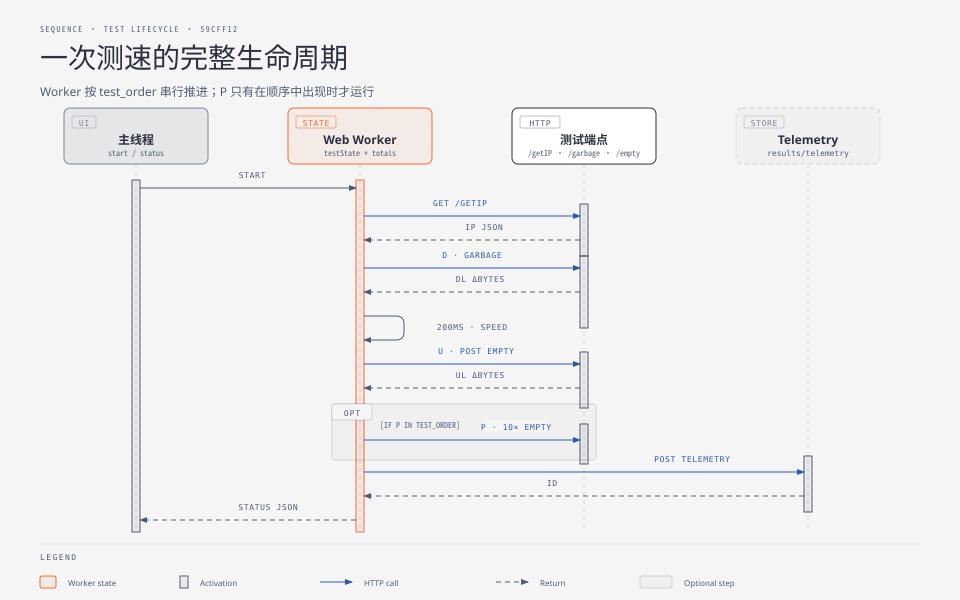
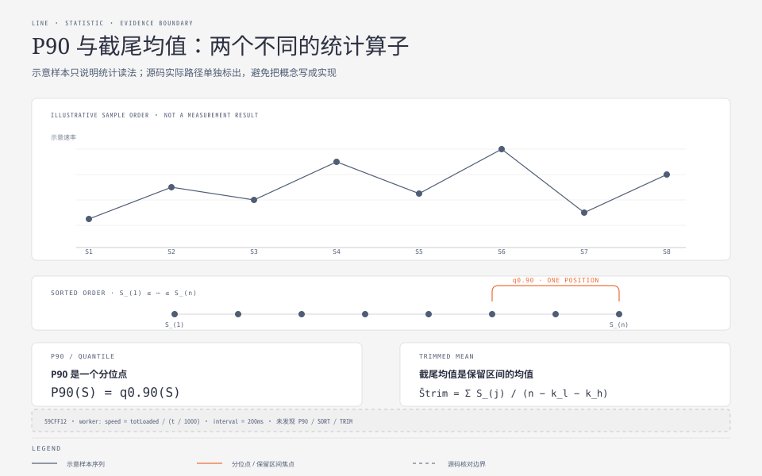
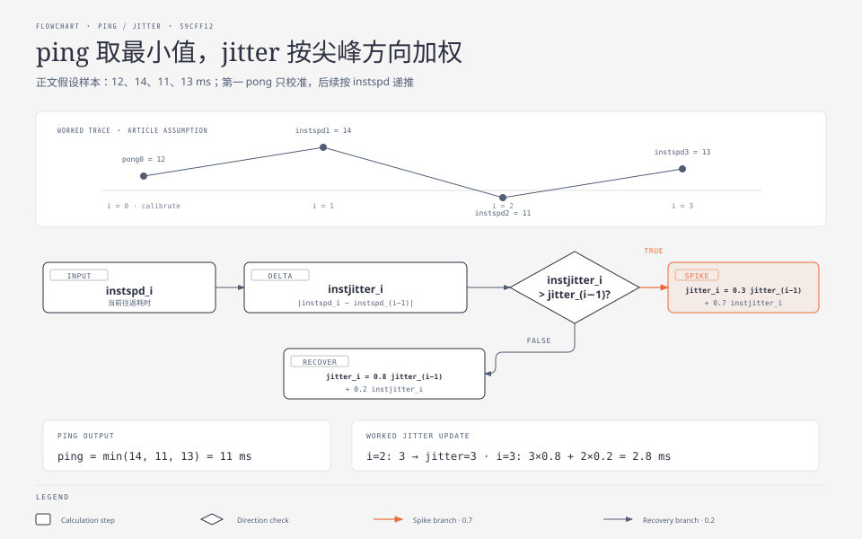

**TL;DR：** 前几篇分别讲了端点、合同与接口；这一篇把它们串成一条时间线，把**每一次测速背后的每一步算术**摊开：为什么单条流有吞吐天花板（`吞吐 ≤ 窗口/RTT`）、grace time 重置如何切除慢启动坡道、屏幕上那个 Mbps 是 `字节 × 8 × 1.06 ÷ 1e6` 的哪一步、上行的 progress 事件到底在数什么、以及 ping 取最小值和抖动加权公式的手算示例。读完后你应当能对任何测速结果回答："这个数字是从哪些字节、经过哪些运算得来的。"


---



## 一、开测之前：两件预备工作

**Worker 隔离**。测量循环是每 50–200ms 一次的密集计算加多条并发连接——放在主线程会把页面卡成幻灯片，也会污染自己的计时。所以全部逻辑住在 Web Worker 里，主线程只通过 postMessage 收进度。这是测量类前端的铁律。

**服务端的三件启动期准备**（第一篇讲过，这里只提醒它们在时间线上的位置）：1 MiB 随机数据已生成（下行要用的每一字节都不再临时计算）；服务器坐标已定位（距离计算的分子）；字体已渲染成 Face（结果卡片的绘制前缀）。**测速开始时，服务端没有任何一件事需要"现在才做"。**

## 二、阶段 I：身份请求

`GET /getIP?isp=true&distance=km&r=0.5312…`。响应是 JSON：`processedString` 给人看（IP + ISP + 距离），`rawIspInfo` 给遥测存档。`r=` 随机数防缓存；多节点模式（mpot）会追加 `cors=true` 走 PHP 口径的头。这一步同时是**连通性预检**——它失败的话后续阶段大概率也失败，但 Worker 选择继续跑完而不是提前终止（`getIp failed, done()` 照常回调）。




## 三、阶段 D：下行的完整演算

### 原理一：单流有天花板，所以要多流

TCP 吞吐的近似上限是 **`吞吐 ≤ 拥塞窗口 / RTT`**：任意时刻一条连接的在途字节数被窗口封顶，除以往返时间就是速率。代入数字：千兆链路（125 MB/s）、10ms RTT 时，单流需要维持约 **1.25 MB** 的在途数据才能跑满——而窗口能否涨到那里受拥塞控制算法、两端缓冲区、中间设备限制多方牵制。**并行 N 条流等价于把"在途字节预算"放大 N 份**，这就是所有测速客户端默认开多条连接的第一性原因（LibreSpeed 默认 6 条，错峰 300ms 启动避免同起同落）。

### 原理二：慢启动坡道与 grace time 的账本

TCP 连接建立后速率不是瞬间到位的——慢启动让它指数爬坡。若从第一个字节开始计时，爬坡期会拉低平均值。LibreSpeed 的处理是**整段重置**：

```text
假设 time_dlGraceTime = 1.5s，6 条流在前 1.5s 共收到 8 MB：
  t = 1.5s 时：startT ← 现在，totLoaded ← 0   （8 MB 全部作废）
  此后 speed = totLoaded / (now - startT)
```

对照第二篇实验的结论：不做这个重置，201 Mbps 的稳态会被报成 138 Mbps（-31%）。国标 YD/T 2400 用的是固定窗版（第 5–15 秒），思想相同：**坡道不进分母**。还有一个防御性细节——如果链路慢到 grace 期内一个字节都没收到，计数器**不重置**（否则永远凑不满一个窗口），注释专门写了这条。

### 原理三：200ms 一记的账本与最终公式

grace 之后，定时器每 200ms 结一次账：

```js
speed   = totLoaded / (t / 1000.0);                      // 字节/秒
dlStatus = (speed * 8 * overheadCompensationFactor)      // ×8：字节→比特
           / (useMebibits ? 1048576 : 1000000);          // ÷单位进制
```

逐项拆开：`×8` 是字节转比特；`overheadCompensationFactor` 默认 **1.06**——因为应用层数的字节不含 TCP/IP/以太网头部，而运营商卖给你的带宽按线路字节计，1.06 把 HTTP 层读数还原回接入带宽口径；最后的除法选择十进制（Mbps）或二进制（Mibps）口径。**你屏幕上的数字 = 六条流的累计字节 × 8 × 1.06 ÷ 时间**，没有任何一步是玄学。

### 收尾加速：time_auto

每 200ms 追加 `bonusT += min(400ms, 5×speed/100000)`——速率越高，每个 tick 缩短越多，测试总时长从 15s 上限动态压缩。快连接少等、慢连接测满，总预算自适应。

## 四、阶段 U：上行——计量点换了一侧

上行先在客户端现场构造随机载荷：1 MiB 的 `Uint32Array` 填满随机整数，复制 20 份拼成一个 Blob（Chrome 移动端因内存限制强制 4 MB）。然后三条流并行 POST 到 `/empty`。

两个必须分清的语义：

1. **计量点是 `xhr.upload.onprogress`**——它统计的是浏览器**已经交给网络栈**的字节数，不是服务器确认收到的字节数。所以上行数字的准确说法是"客户端发出速率"，服务端的真实接收率可能因丢包重传略低；
2. **`Content-Encoding: identity` 显式禁用压缩**：随机 Uint32 数据本就不可压，这层声明防的是中间代理自作聪明地"优化"。

IE11/Edge/PS4 有专门的降级分支（这些浏览器 `upload.onprogress` 不触发）：改发 256KB 小包、用 `onload` 计次——源码注释自己承认精度受损。统计层（grace 3 秒、time_auto、15s 上限）与下行对称。




## 五、阶段 P：延迟与抖动的手算

对 `/empty` 打 10 个小请求，每次优先用 Performance API 取精确耗时（`responseStart − requestStart`），拿不到再退回 Date.now 差值；小于 1ms 的读数视为噪声沿用上次。给一组样本手算一遍（假设 10 次往返为 12, 14, 11, 13 ms）：

```text
i=0（首 pong）：仅校准基准，不计
i=1：instspd=14 → ping=14
i=2：instspd=11 → ping=min(14,11)=11；instjitter=|11-14|=3 → jitter=3（首个样本）
i≥3：instspd=13 → ping 仍 11；
     instjitter=|13-11|=2 < jitter(3) → jitter = 3×0.8 + 2×0.2 = 2.8
最终：ping = 11.00 ms（最小值），jitter ≈ 2.80 ms
```

两条原则都体现在算式里：**RTT 只能被排队抬高，最小样本是对固有传播时延的最优估计**；抖动则用方向不对称的记忆曲线——恶化以 0.7 权重快速计入，回落只以 0.2 权重缓慢承认。

## 六、终站：上报与上屏

六个字段打包成 FormData（dl/ul/ping/jitter/ispinfo/log），POST 到 telemetry，换回一个 ULID；第五篇讲过它之后的三种读法（PNG 卡片 / JSON API / 后台表）。屏幕上的显示值最后经 `toFixed(2)` 定格——而 JSON API 还会对它做三档精度再格式化（05 篇）。**从字节到屏幕，数字经过了五道变换：采样 → 加窗 → 补偿 → 单位换算 → 格式化**，任何一道都会改变它。

## 七、结论：原理一张表

| 步骤 | 发生了什么 | 为什么 |
| --- | --- | --- |
| 多流并行 | 6 条 GET 同时拉 | 绕开单流 `窗口/RTT` 天花板 |
| 错峰启动 | 每流延迟 300ms | 避免同起同落造成速率锯齿 |
| grace 重置 | 1.5s/3s 后清零计数器 | 慢启动坡道不进分母 |
| 200ms 结账 | `totLoaded/t` | 滚动累计而非单点采样 |
| ×8 ×1.06 ÷1e6 | 字节→比特→线路口径→Mbps | 对齐运营商的计费口径 |
| 上行发视角 | upload.onprogress | 浏览器只见"已交内核"的字节 |
| ping 取 min | RTT 不可能低于物理极限 | 最小样本≈固有时延 |
| 抖动非对称加权 | 尖峰 0.7 / 回落 0.2 | 快速报警、缓慢原谅 |

验证入口：全部代码位置见前四篇的行号引用；本系列取证档案在 `evidence/librespeed-go-series/2026-08-26-local/`。读完这篇，再去任何一个测速网站按下按钮——你应该能看见那台机器内部的每一根齿轮。

## 参考资料

- 系列 01–05 与运行取证：`evidence/librespeed-go-series/2026-08-26-local/`
- `web/assets/speedtest_worker.js` @ commit `59cff12`
- 站内相关：[一份测速合同的全文](/writing/librespeed-go-04-contract)、[接口手册](/writing/librespeed-go-05-interface)、[你的带宽是怎么被算出来的](/writing/speedtest-service-architecture)
