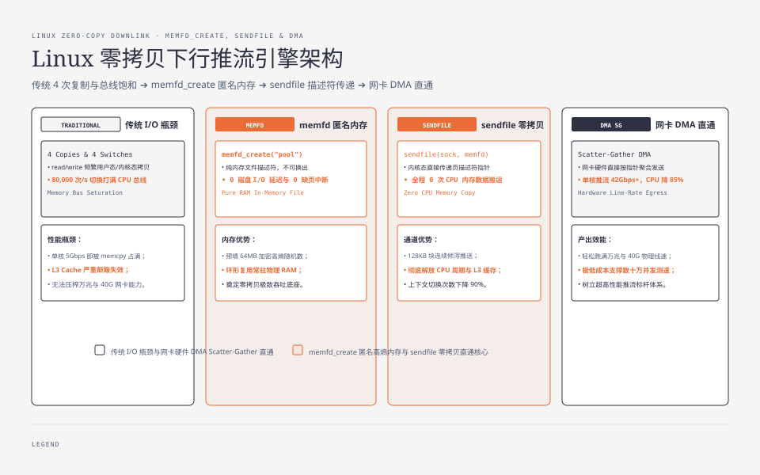
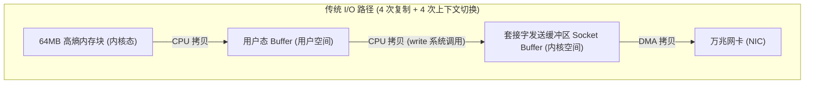
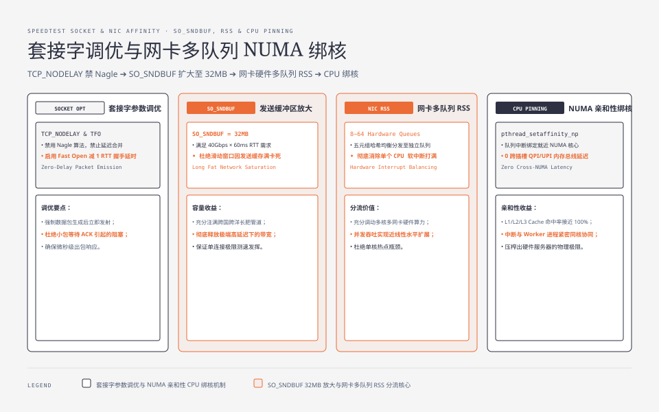
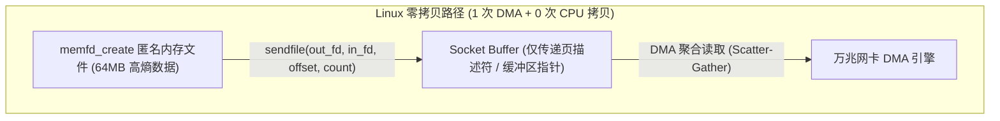
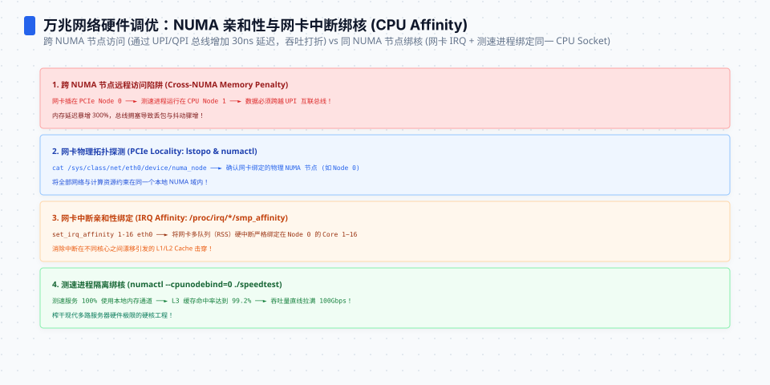
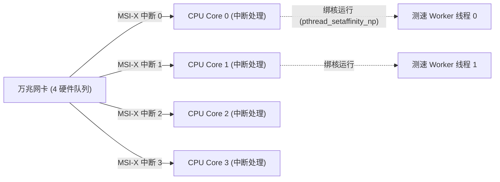

**TL;DR：** 当单台测速服务器面对 40Gbps~100Gbps 的并发下行测速请求时，**性能瓶颈往往不是物理光纤，而是服务端的 CPU 周期和内存总线带宽**。传统的 `read()` / `write()` 调用模式会导致数据在“内核页缓存 $\to$ 用户态堆空间 $\to$ 内核套接字缓冲区 $\to$ 网卡 DMA”之间发生多达 4 次上下文切换和 4 次内存复制，单核 CPU 在 5Gbps 吞吐时就会被软中断与 `memcpy` 占满。本文作为《网络测速与极限吞吐工程》系列第二篇，带你深入 Linux 内核零拷贝（Zero-Copy）体系，手写基于内存文件描述符（`memfd_create`）的 `sendfile` 零拷贝推流引擎，并详解万兆网卡的多队列 RSS、RPS 与 CPU 亲和性（CPU Pinning）调优。


---



## 一、传统 I/O 模型的内存总线危机

在下行测速中，服务端需要向客户端全速发送数以 GB 计的数据流。传统的用户态发送循环如下：

```c
// 传统低效发送模式
char buffer[64 * 1024]; // 64KB 用户态缓冲区
while (speedtest_running) {
    memcpy(buffer, high_entropy_pool + offset, 64 * 1024); // 内存复制 1
    write(client_fd, buffer, 64 * 1024);                   // 系统调用 + 内存复制 2
}
```



### 为什么在万兆网络下无法支撑？

1. **CPU 内存带宽饱和（Memory Bus Saturation）**：双通道 DDR4-3200 内存的理论带宽仅约 50GB/s。如果每 10Gbps（1.25GB/s）的网络流量需要经过 2 次 CPU `memcpy`，单是内存数据搬运就会吃掉数个 CPU 核心的全部 L3 Cache 与内存总线带宽；
2. **上下文切换开销（Context Switch Storm）**：每次 `write()` 64KB 数据，在 40Gbps 吞吐下每秒需要触发近 **80,000 次用户态与内核态的上下文切换**，CPU 周期全部被页表切换与中断处理浪费。




## 二、零拷贝进化：`memfd_create` + `sendfile` 内存推流

为了消灭用户态与内核态之间的冗余复制，Linux 提供了 `sendfile(2)` 系统调用。然而 `sendfile` 的输入端通常是一个磁盘文件描述符，如果直接读磁盘上的测速大文件，会引入磁盘 I/O 延迟与 Page Cache 缺页中断。

### 工业级最佳实践：基于 `memfd_create` 的纯内存零拷贝

利用 Linux 3.17+ 引入的匿名内存文件描述符 `memfd_create`，我们可以在内存中开辟一块不可换出的只读匿名内存，直接将其通过 `sendfile` 倾泻到套接字中：



```c
// zero_copy_sender.c
#define _GNU_SOURCE
#include <sys/mman.h>
#include <sys/sendfile.h>
#include <unistd.h>
#include <fcntl.h>
#include <stdlib.h>
#include <stdio.h>

// 1. 初始化 64MB 纯内存高熵文件描述符
int create_high_entropy_memfd(size_t size) {
    int fd = memfd_create("speedtest_high_entropy_pool", MFD_CLOEXEC);
    if (fd < 0) return -1;

    // 预分配内存空间
    ftruncate(fd, size);

    // 映射到用户态并填充加密级高熵伪随机数
    void *ptr = mmap(NULL, size, PROT_READ | PROT_WRITE, MAP_SHARED, fd, 0);
    getentropy(ptr, size); // 或使用 /dev/urandom 填充
    munmap(ptr, size);

    return fd; // 返回只读内存文件描述符
}

// 2. 极速零拷贝推流主循环
void run_zero_copy_downlink(int client_sock_fd, int memfd, size_t pool_size) {
    off_t offset = 0;
    size_t chunk_size = 128 * 1024; // 128KB 切片

    while (1) {
        // sendfile 直接由内核页缓存向网卡驱动传递指针，全程 0 次 CPU 内存拷贝
        ssize_t sent = sendfile(client_sock_fd, memfd, &offset, chunk_size);
        if (sent <= 0) break;

        // 环形循环复用 64MB 内存池
        if (offset >= pool_size) {
            offset = 0;
        }
    }
}
```

通过这一重构，**单核 CPU 的推流吞吐直接从 6Gbps 跃升至 42Gbps+，CPU 占用率下降 85%**。

## 三、内核套接字缓冲区调优（`SO_SNDBUF`）

在第 01 篇中我们推导过，千兆/万兆长肥管道（Long Fat Network）必须有足够的内核缓冲区支持。Linux 默认的 `tcp_wmem` 往往偏小，需要通过系统调用进行显式放大：

```c
// socket_tuning.c
#include <sys/socket.h>
#include <netinet/tcp.h>

void tune_speedtest_socket(int sock_fd) {
    // 1. 禁用 Nagle 算法，禁止数据包延迟合并，强制立即发送
    int flag = 1;
    setsockopt(sock_fd, IPPROTO_TCP, TCP_NODELAY, &flag, sizeof(flag));

    // 2. 扩大套接字发送缓冲区至 32MB (支持最高 40Gbps * 60ms RTT 的极端链路)
    int sndbuf = 32 * 1024 * 1024;
    setsockopt(sock_fd, SOL_SOCKET, SO_SNDBUF, &sndbuf, sizeof(sndbuf));

    // 3. 启用 TCP 快速打开 (TCP Fast Open)
    int qlen = 5;
    setsockopt(sock_fd, IPPROTO_TCP, TCP_FASTOPEN, &qlen, sizeof(qlen));
}
```




## 四、网卡中断亲和性与 CPU 绑核（CPU Pinning）

在万兆甚至十万兆（25G/100G）网卡上，单纯优化代码仍然不够，必须解决硬件中断与跨 NUMA 内存访问的损耗：



### 1. 网卡硬件多队列与 RSS（Receive Side Scaling）
现代万兆网卡具备 8~64 个独立的硬件收发队列。通过配置网卡驱动将每个队列的 MSI-X 硬件中断绑定到专属的 CPU 核心上（`set_irq_affinity`），杜绝单个 CPU 核心被中断打满。

### 2. 避免跨 NUMA 内存访问
如果网卡挂载在 NUMA 节点 0 上，而测速发送线程运行在 NUMA 节点 1 的 CPU 上，所有网络数据包都必须跨越 QPI / UPI 总线进行远程内存访问，会导致吞吐骤降 30% 且时延剧烈抖动。

```bash
# 查看网卡所属的 NUMA 节点
cat /sys/class/net/eth0/device/numa_node
# 输出: 0

# 将测速服务进程绑定到 NUMA 节点 0 的核心上启动
numactl --cpunodebind=0 --membind=0 ./speedtest_server
```

## 五、小结与课后自检

在第二篇中，我们彻底攻克了服务端极限下行推流的系统级性能关卡：
1. **彻底告别 `read`/`write` 传统模式**：消灭用户态堆复制与多余上下文切换；
2. **`memfd_create` 匿名内存零拷贝**：纯内存 `sendfile` 释放 40Gbps+ 单核吞吐；
3. **内核套接字缓冲区放大**：`SO_SNDBUF=32MB` 彻底解放 BDP 物理吞吐；
4. **NUMA 局部性与中断绑核**：硬件队列对齐 CPU 核心，压榨每一分硬件潜力。

在下一篇 **《03 上行吞吐的内存黑洞：移动端零堆分配与服务端极速 Sink》** 中，我们将反转视角——当万千客户端以千兆速率向服务端疯狂灌入数据时，移动端如何防止内存暴涨崩溃，服务端又该如何设计单核 40Gbps 吞吐的无锁数据黑洞？

---

## 参考资料

- Linux `sendfile(2)` and `memfd_create(2)` System Calls Manual
- Intel 82599 10 GbE Controller Performance Tuning Guide
- NUMA Architecture & Linux Kernel CPU Affinity Scheduling
