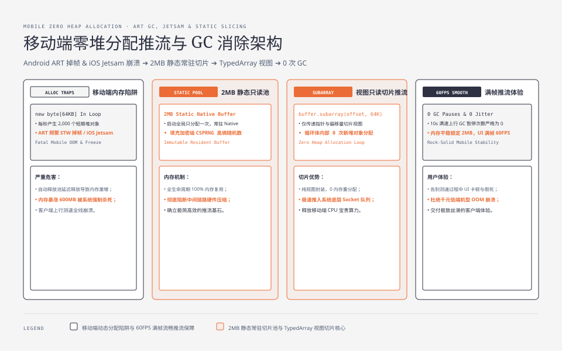
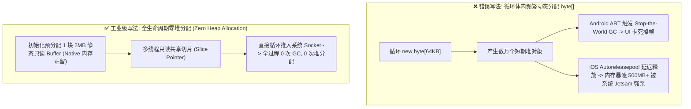
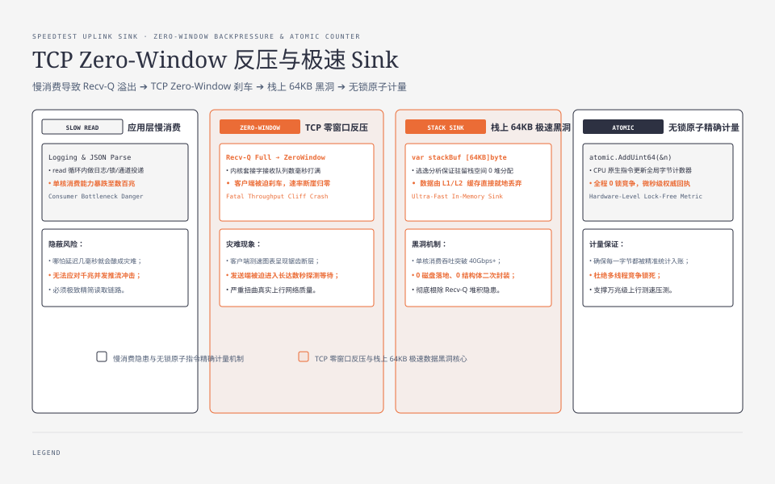
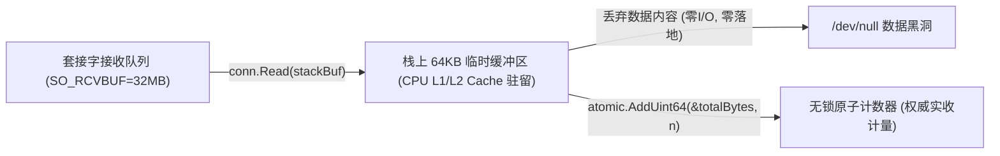

**TL;DR：** 下行测速考验的是服务端的推流性能，而**上行测速则是对“移动端内存稳定性”与“服务端消费吞吐极限”的双向极限压榨**。在千兆上行测试中，移动端 App 必须以每秒上百兆的速率向外推送数据，极易触发 Android ART 的 Stop-the-World GC 掉帧或 iOS Autoreleasepool 的 OOM Crash；而在服务端，只要应用层读取稍微迟缓哪怕几个毫秒，Linux 内核套接字接收队列（`Recv-Q`）瞬间溢出并向客户端通告 `TCP ZeroWindow`（零窗口），导致测速曲线断崖暴跌归零。本文作为《网络测速与极限吞吐工程》系列第三篇，手把手拆解移动端**零堆分配（Zero Heap Allocation）只读切片架构**，并实现单核吞吐超 40Gbps 的**服务端极速无锁数据黑洞（Sink Buffer）**。


---



## 一、移动端的致命内存陷阱（Android & iOS）

在 1000Mbps 上行测速中，客户端每秒需产生约 125MB 二进制数据并推入套接字。在持续 10 秒的测试期间，累计需要处理超过 1.25GB 的数据流。



### 1. Android ART 分代垃圾回收陷阱
- **反模式**：在推流循环中频繁创建临时 byte 数组：`byte[] chunk = new byte[64 * 1024];`；
- **物理后果**：每秒产生 2,000 个 64KB 对象，瞬间将年轻代（Young Gen Eden Space）塞满，迫使 ART 频繁触发 **Concurrent Copying GC**。CPU 周期被垃圾回收线程抢占，主线程 UI 渲染掉帧卡死，最终触发系统的 **Low Memory Killer (LMK)** 将 App 强制杀死。

### 2. iOS RunLoop 与自动释放池（Autoreleasepool）陷阱
- **反模式**：在 Swift / Objective-C 循环中使用 `Data(bytes: ...)`；
- **物理后果**：在 GCD 子线程或主 RunLoop 处于持续繁忙状态时，`autorelease` 对象不会立即析构，而是堆积在自动释放池中。App 物理内存曲线会在 3 秒内从 40MB 飙升至 600MB+，直接触发 iOS 系统的 **Jetsam 机制** 抛出 OOM 崩溃。

### 3. 移动端零堆分配（Zero-Allocation）标准实现

```ts
// mobile-zero-alloc-sender.ts
export class MobileSpeedtestUploader {
  private static readonly BUFFER_SIZE = 2 * 1024 * 1024; // 2MB 静态常驻只读切片
  private static readonly CHUNK_SIZE = 64 * 1024;        // 64KB 单次发送块
  private static staticBuffer: Uint8Array | null = null;

  /**
   * App 启动时全局只分配一次，全生命周期复用
   */
  public static initStaticBuffer(): void {
    if (!this.staticBuffer) {
      this.staticBuffer = new Uint8Array(this.BUFFER_SIZE);
      // 填充高熵伪随机数
      crypto.getRandomValues(this.staticBuffer);
    }
  }

  /**
   * 零堆分配循环推流
   */
  public static async runUploadLoop(
    socketWriteFn: (chunk: Uint8Array) => Promise<number>,
    isRunning: () => boolean
  ): Promise<void> {
    this.initStaticBuffer();
    const buffer = this.staticBuffer!;
    let offset = 0;

    while (isRunning()) {
      // 通过 TypedArray.subarray 零拷贝获取只读切片视图（不产生任何堆内存分配）
      const chunkView = buffer.subarray(offset, offset + this.CHUNK_SIZE);
      
      await socketWriteFn(chunkView);

      offset += this.CHUNK_SIZE;
      if (offset + this.CHUNK_SIZE > this.BUFFER_SIZE) {
        offset = 0; // 环形复用
      }
    }
  }
}
```

## 二、服务端 TCP Zero-Window 反压：测速断崖的幕后元凶

这是上行测速服务端最隐蔽、最严重的系统级故障：



### 1. 物理成因与机制
TCP 是一种基于接收端滑动窗口的端到端流控协议。若服务端应用层在 `read()` 循环中做了任何耗时操作：
- 打印了格式化日志（`log.Printf`）；
- 尝试解析请求体 JSON；
- 进行了内存二次拷贝或向 Channel / 队列中投递；
- 发生了互斥锁竞争（Mutex Contention）。

服务端的单核消费速度可能从 40Gbps 骤降到几百兆。当客户端以千兆速率推流时，服务端的内核套接字接收队列（`Recv-Q`）会在数毫秒内被填满。Linux 内核协议栈会自动向客户端发送 **`TCP ZeroWindow`** 报文。客户端操作系统的 TCP 发送引擎被强制刹车挂起，导致测速图表上的上行速率瞬间归零，呈现灾难性的断崖锯齿。

## 三、极速数据黑洞（Sink Buffer）：单核 40Gbps 吞吐实现

服务端处理上行测速的唯一职责是：**以超越网络到达速度的吞吐率，将数据从内核态读出并瞬间丢弃，同时以原子指令完成权威计量。**



### 工业级极速黑洞（Go 语言实现）

```go
// sink_server.go
package main

import (
	"io"
	"net"
	"sync/atomic"
	"time"
)

type SpeedtestSinkServer struct {
	TotalReceivedBytes uint64
}

func (s *SpeedtestSinkServer) HandleUplinkConnection(conn net.Conn) {
	defer conn.Close()

	// 1. 设置套接字参数：扩大接收缓冲区并禁用延迟 ACK
	if tcpConn, ok := conn.(*net.TCPConn); ok {
		tcpConn.SetReadBuffer(32 * 1024 * 1024) // 32MB Recv-Q
		tcpConn.SetNoDelay(true)
	}

	// 2. 关键：仅在当前 Goroutine 调用栈上分配 64KB 临时缓冲
	// 逃逸分析保证 stackBuf 驻留栈空间，完全不发生堆内存分配
	var stackBuf [64 * 1024]byte

	for {
		// 设置单次读取超时保护，防止恶意挂起
		conn.SetReadDeadline(time.Now().Add(5 * time.Second))

		n, err := conn.Read(stackBuf[:])
		if n > 0 {
			// 3. 极速黑洞处理：使用 CPU 原生原子指令更新全局计数器
			// 全程无锁、无二次内存拷贝、无通道投递
			atomic.AddUint64(&s.TotalReceivedBytes, uint64(n))
		}

		if err != nil {
			if err != io.EOF {
				// 处理连接异常中断
			}
			break
		}
	}
}
```

该实现单协程对数据的消费速度可达 **40Gbps+**，CPU 占用率极低，彻底杜绝了服务端产生 `TCP ZeroWindow` 反压的物理可能。

## 四、权威计量确认：客户端 Write vs 服务端 Read 差异

很多简易测速系统在测量上行时，由客户端自行统计 `socket.write()` 的字节数除以耗时。这是极其不准确的：

| 计量位置 | 物理含义 | 潜在误差源 |
| --- | --- | --- |
| **客户端 Socket Write** | 仅代表数据被塞入客户端操作系统本地内核发送队列（`Send-Q`） | 若测试结束时仍有 20MB 数据堆积在本地缓冲未发出，会导致测出虚高的速率 |
| **服务端 Socket Read** | **权威真实计量**：代表数据已经真正穿越物理光纤到达测速节点 | **唯一权威依据**，不受客户端本地发送队列堆积假象干扰 |

**标准上行测速流程**：测试结束时，服务端向客户端回发一条权威控制报文 `UPLOAD_END`，其中携带服务端内核在稳态区间内**实际读到的总有效字节数与高精度时间戳**，由客户端以此计算最终上行 Goodput。

## 五、小结与课后自检

在第三篇中，我们攻克了上行测速全链路的内存与反压难关：
1. **移动端零堆分配**：预分配单块 2MB 只读高熵 Buffer，通过切片视图循环推流，消除 Android GC 掉帧与 iOS OOM Crash；
2. **消灭 TCP ZeroWindow**：理解应用层读取迟缓导致内核缓冲区溢出的反压物理机制；
3. **极速黑洞架构**：栈内存 64KB 读取 + CPU 原子累加计数，单核消费吞吐达 40Gbps+；
4. **服务端权威计量**：以上行真实到达服务端的字节数作为最终指标，杜绝客户端本地发送缓冲虚标。

在下一篇 **《04 抖动、时延与缓冲膨胀：RFC 3550 滤波与满载排队度量》** 中，我们将深入网络时延测量体系——如何度量网络抖动，以及为什么带宽很大时打游戏依然卡顿（Bufferbloat 缓冲区膨胀）？

---

## 参考资料

- Android ART Garbage Collection Architecture (source.android.com)
- iOS Memory Deep Dive & Jetsam Process Lifecycle (WWDC)
- TCP Flow Control & Zero-Window Notification Mechanics (RFC 793 / RFC 7323)
