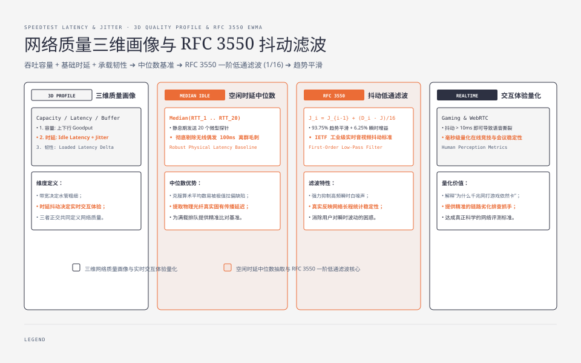
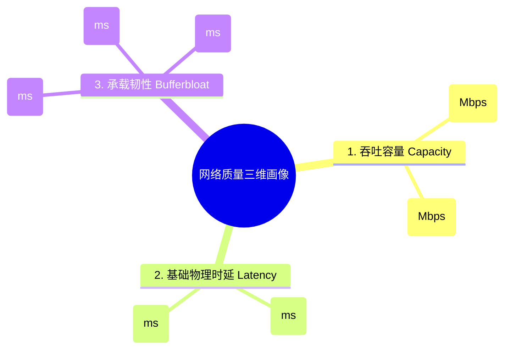
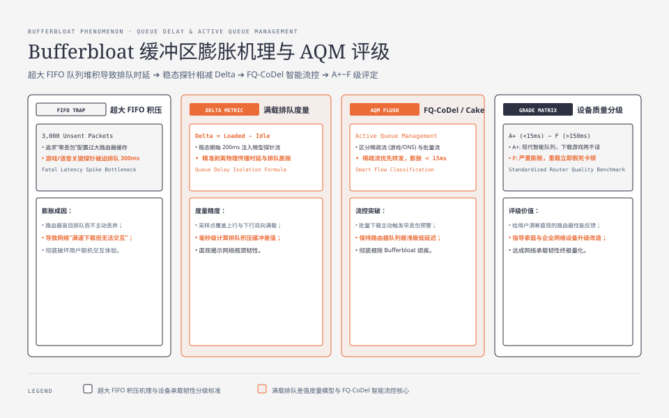
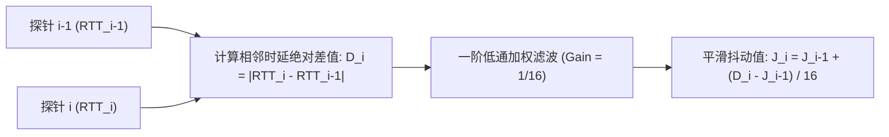
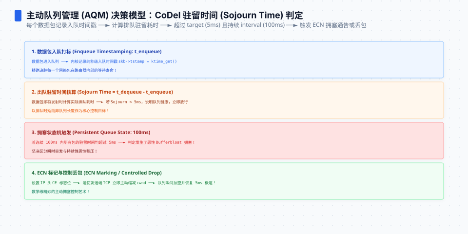
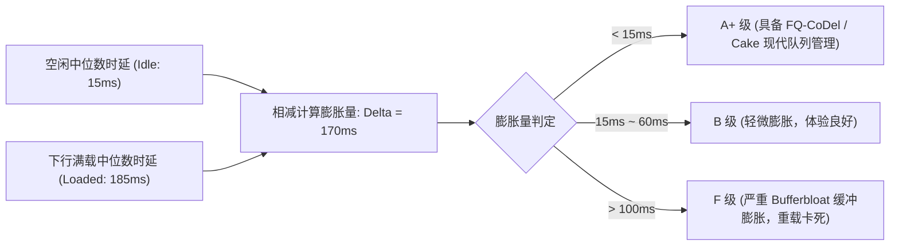

**TL;DR：** 许多用户常有这样的困惑：“我的宽带明明测出了 1000Mbps，但为什么只要有人在下载电影，打游戏时延迟就会从 20ms 瞬间飙升到 300ms 疯狂卡顿？” 答案在于：**带宽（Bandwidth）只代表水管的粗细，而决定实时交互体验的是时延（Latency）、抖动（Jitter）以及满载时的缓冲区膨胀（Bufferbloat）**。传统的测速只测空闲时的 Ping 值，完全掩盖了真实网络在重载下的劣化程度。本文作为《网络测速与极限吞吐工程》系列第四篇，推导 IETF **RFC 3550 网络抖动一阶低通滤波递推公式**，并详细讲解如何在推流稳态期注入轻量探针，度量 **Bufferbloat 排队膨胀量** 与家庭路由器的队列调度能力。


---



## 一、网络度量的三维坐标系

一个完整的网络质量画像必须由三个独立正交的维度共同定义：






## 二、空闲时延（Idle Latency）中位数抽取

在下行和上行吞吐测试正式开始前，物理链路处于完全无负载的静息状态。客户端以 50ms 为间隔连续发送 $N = 20$ 个微型探针报文：

- 单次探针往返耗时：$RTT_k = T_{\text{recv}} - T_{\text{send}}$；
- **为什么不使用算术平均数？**
  在公网环境中，偶尔会遇到无线空口瞬时避让或路由器 ARP 查询产生的单个 100ms 离群毛刺。如果用算术平均数会被显著拉偏，因此采用**中位数滤波（Median Filter）**作为最稳健的物理基准：

$$\text{Idle Latency} = \text{Median}(RTT_1, RTT_2, \dots, RTT_{20})$$

## 三、RFC 3550 抖动（Jitter）一阶低通滤波数学推导

网络抖动用于度量时延的离散波动程度。对于实时音视频通话（VoIP / WebRTC）和在线联机游戏，抖动比单纯的时延更为致命（会导致音频撕裂与画面瞬移）。

IETF 在 **RFC 3550（RTP 实时传输协议标准）** 中定义了平滑抖动的经典递推算法：



### 1. 数学递推公式

1. 计算相邻两个探针时延的绝对差异变异量（First-order Difference）：
   $$D_i = |RTT_i - RTT_{i-1}|$$
2. 递推更新平滑抖动估计值 $J_i$（初始值 $J_0 = 0$）：
   $$J_i = J_{i-1} + \frac{D_i - J_{i-1}}{16}$$

### 2. 滤波增益系数 $\alpha = \frac{1}{16}$ 的物理内涵
将递推公式展开：
$$J_i = \left(1 - \frac{1}{16}\right) J_{i-1} + \frac{1}{16} D_i = \frac{15}{16} J_{i-1} + \frac{1}{16} D_i$$
这表明：当前平滑抖动值中，**$93.75\%$ 取决于历史平滑趋势，仅 $6.25\%$ 吸收当前瞬时变化**。该一阶低通滤波器（Low-pass Filter）具备极强的抗瞬时偶发噪声能力，能够精准反映网络的长期统计抖动基线。

```ts
// jitter.ts
export class RFC3550JitterCalculator {
  private previousRtt: number | null = null;
  private currentJitter = 0.0;

  public addSample(rttMs: number): number {
    if (this.previousRtt === null) {
      this.previousRtt = rttMs;
      return 0.0;
    }

    const d = Math.abs(rttMs - this.previousRtt);
    // RFC 3550 递推低通滤波: J = J + (D - J) / 16
    this.currentJitter = this.currentJitter + (d - this.currentJitter) / 16.0;
    this.previousRtt = rttMs;

    return +this.currentJitter.toFixed(2);
  }

  public getJitter(): number {
    return +this.currentJitter.toFixed(2);
  }
}
```




## 四、满载时延与 Bufferbloat（缓冲区膨胀）排队度量

### 1. 什么是 Bufferbloat（缓冲区膨胀）？
网络设备制造商为了追求“零丢包”，在家庭 Wi-Fi 路由器、PON 光猫和蜂窝基站中配置了极其巨大的数据包缓冲区（FIFO 队列）。

```
【空闲状态】
[探针包] ──────────────────────────(直接穿透)──────────────────────────> RTT = 15ms

【满载推流状态 (未启用主动队列管理 AQM)】
[探针包] ───> [ 路由器巨大缓冲区: 塞满了 3000 个未发送的下行大包 ] ───> RTT = 280ms
                                      │
                                      ▼ 探针被迫在队列末尾排队等待 265ms！
```

当网络被打满时，路由器不会适时丢弃多余报文，而是把所有数据包积压在庞大的队列中。后续所有高优先级的游戏指令包、DNS 请求包和语音包，都必须在数千个大包后面排队等待几百毫秒，造成网络“虽然满速下载、但完全无法交互”的假死状态。

### 2. 满载时延采样与膨胀量计算

在下行和上行测速进入第 **3.0s ~ 9.0s 的稳态推流区间**，客户端并行注入轻量探针流（每 200ms 发送 1 个探针），采集满载往返时延序列：

$$\text{Bufferbloat}_{\text{down}} = \text{Median}(RTT_{\text{down\_loaded}}) - \text{Idle Latency}$$
$$\text{Bufferbloat}_{\text{up}} = \text{Median}(RTT_{\text{up\_loaded}}) - \text{Idle Latency}$$



### 3. 主动队列管理（AQM）评分标准

| 膨胀量（Bufferbloat Delta） | 评级 | 物理状态与用户体验 |
| --- | --- | --- |
| **$< 15\text{ms}$** | **A+** | 路由器启用了 **FQ-CoDel** 或 **Cake** 智能流控，大流量下载时打游戏毫无感知 |
| **$15\text{ms} \sim 60\text{ms}$** | **B** | 正常轻度排队，交互基本流畅 |
| **$60\text{ms} \sim 150\text{ms}$** | **C** | 存在明显排队积压，视频会议可能出现声音卡顿 |
| **$> 150\text{ms}$** | **F (严重劣化)** | 路由器缺少队列调度，一旦推流网络彻底假死 |

## 五、小结与课后自检

在第四篇中，我们构建了多维度的网络质量量化体系：
1. **中位数基准**：消除偶然误码干扰，提取真实物理传播时延；
2. **RFC 3550 抖动滤波**：一阶低通递推公式平滑高频噪点，精确量化交互稳定性；
3. **Bufferbloat 满载度量**：在推流稳态期探测排队膨胀量，揭示家庭路由器队列管理缺陷。

在下一篇 **《05 协议开销战争：Raw TCP vs WebSocket vs HTTP/2 vs HTTP/3》** 中，我们将深入应用层与传输层协议边界——对比不同协议在测速场景下的帧头开销、有效净荷纯净度与多路复用损耗。

---

## 参考资料

- RFC 3550: *RTP: A Transport Protocol for Real-Time Applications* (Section 6.4.1 Jitter Calculation)
- Gettys, J., & Nichols, K. (2012). *Bufferbloat: Dark Buffers in the Internet*. Communications of the ACM.
- IETF RFC 8290: *The Flow Queue CoDel (FQ-CoDel) Packet Scheduler*
