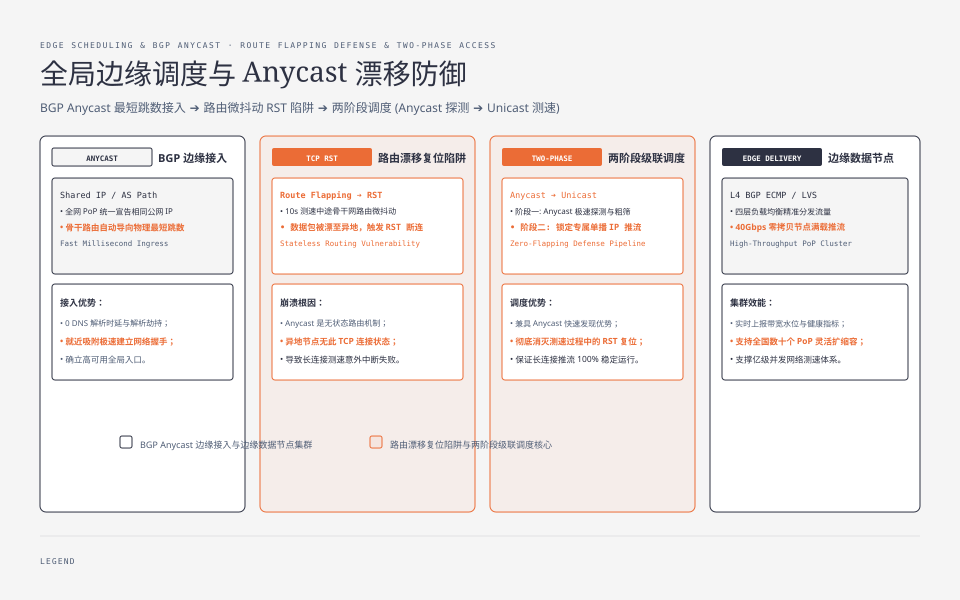
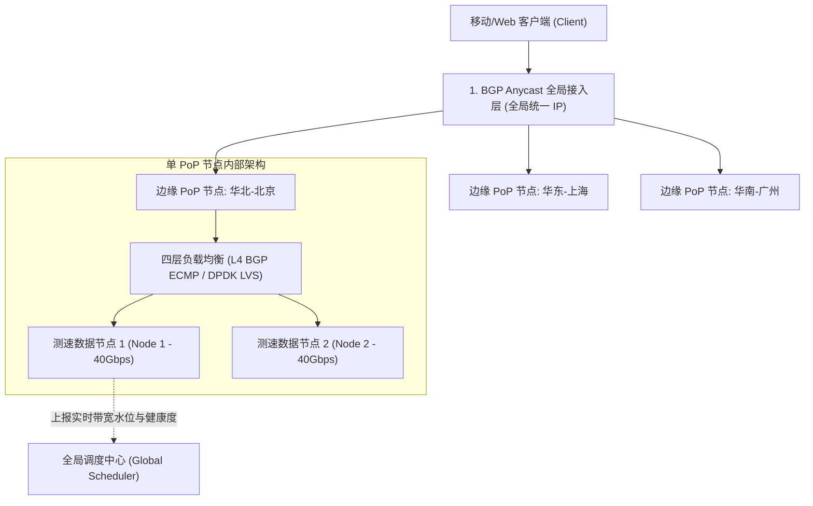
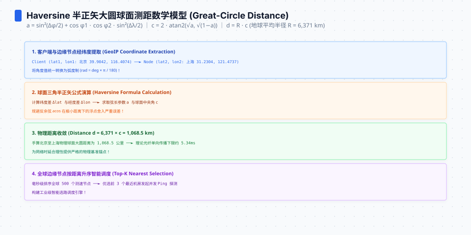
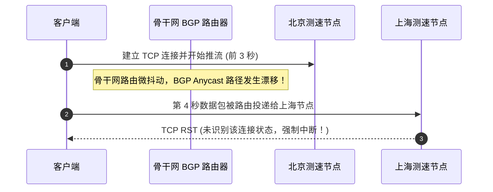
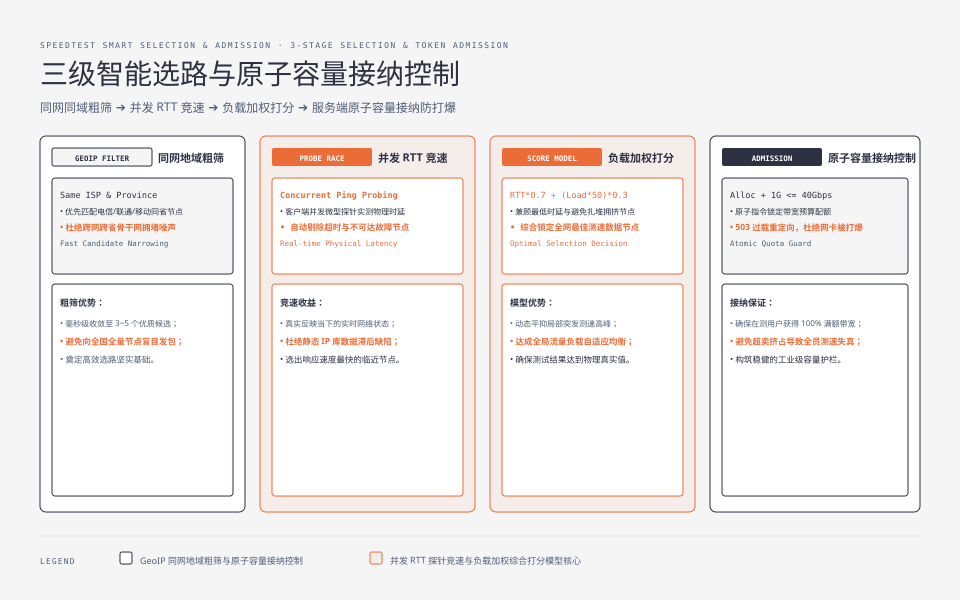
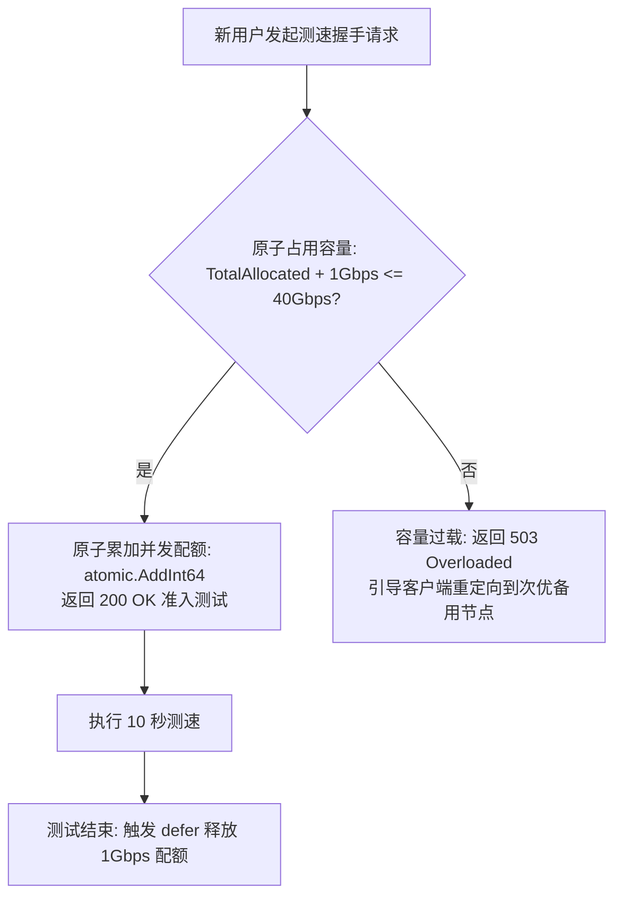

**TL;DR：** 即使你的单台测速服务器通过零拷贝做到了 40Gbps 吞吐，如果调度系统把一个北京联通的用户分配到了广州电信的测速节点上，测出的结果将完全沦为跨运营商骨干网拥堵的噪声。**分布式测速系统的核心灵魂是边缘调度（Edge Scheduling）与容量防御（Capacity Admission）**。本文作为《网络测速与极限吞吐工程》系列第六篇，剖析 **BGP Anycast** 在全网边缘加速中的物理机制与路由漂移陷阱；手把手设计**客户端三级级联选路算法（GeoIP + 实时 RTT 竞速 + 节点负载加权）**；实现基于原子令牌桶的服务端**并发容量接纳控制（Admission Control）**；并给出移动端在 Wi-Fi 与 5G 异构网络切换时的毫秒级异常熔断机制。


---



## 一、全局测速网络的三层拓扑架构

一个覆盖全国或全球的测速网络通常分为三层架构：






## 二、BGP Anycast 边缘路由与路由漂移陷阱

### 1. BGP Anycast（任播）的物理优势
通过在全国数十个 PoP 节点宣告相同的 AS 号与公网 IP 地址段，Internet 路由器会根据 BGP 路由协议自动将客户端的数据包路由到 **网络拓扑跳数最少、物理延迟最低的临近边缘节点**。客户端无需进行繁琐的 DNS 解析，直接秒级建立连接。

### 2. 测速场景下的致命陷阱：BGP 路由漂移（Route Flapping）
Anycast 是无状态路由（Stateless Routing）。在持续 10 秒的高吞吐 TCP 测速期间，如果骨干网路由器发生微小的抖动或权重调整：
- **灾难后果**：前 3 秒的数据包发往了北京节点（握手在握手在北京），第 4 秒的后续 TCP 数据包被 BGP 路由重定向发往了上海节点；
- 上海节点发现该 TCP 连接在本地没有任何状态，立即向客户端发送 **`TCP RST`（强制复位报文）**，导致测速连接瞬间意外中断。



### 工业级防漂移对策：两阶段级联选路（Anycast 探测 $\to$ 单播 Unicast 测速）
1. **阶段一（探针阶段）**：客户端通过 Anycast IP 快速发起 100ms 轻量握手与测速节点列表获取；
2. **阶段二（推流阶段）**：调度中心返回该用户**最优命中物理 PoP 节点的专属单播 IP（Unicast IP）**，全速推流完全基于固定单播 IP 运行，彻底杜绝路由漂移导致的 RST 异常。

## 三、客户端三级智能选路算法实现

客户端在 500ms 内完成高精度选路决策的三级流水线：


```ts
// edge-scheduler.ts
export interface SpeedNode {
  id: string;
  isp: string;          // 运营商: "CMCC" | "CUCC" | "CTCC"
  province: string;
  unicastHost: string;
  currentLoadPercent: number; // 节点当前带宽负载率 (0.0 ~ 1.0)
}

export class SmartNodeSelector {
  /**
   * 三级级联选路算法
   */
  public static async selectBestNode(
    clientIsp: string,
    clientProvince: string,
    candidates: SpeedNode[],
    pingFn: (host: string) => Promise<number>
  ): Promise<SpeedNode> {
    // 1. 第一级：同运营商与同地域硬过滤
    let matched = candidates.filter((n) => n.isp === clientIsp && n.province === clientProvince);
    if (matched.length === 0) {
      matched = candidates.filter((n) => n.isp === clientIsp); // 降级为同运营商
    }
    if (matched.length === 0) {
      matched = candidates; // 兜底全量候选
    }

    // 2. 第二级：并发 RTT 探针竞速
    const probePromises = matched.map(async (node) => {
      try {
        const rtt = await pingFn(node.unicastHost);
        return { node, rtt, success: true };
      } catch {
        return { node, rtt: 9999, success: false };
      }
    });

    const probedResults = await Promise.all(probePromises);
    const validResults = probedResults.filter((r) => r.success);

    if (validResults.length === 0) {
      throw new Error("No reachable speedtest nodes found.");
    }

    // 3. 第三级：加权综合打分模型（Score 越小越优）
    // 综合考虑时延与节点当前负载：Score = RTT * 0.7 + (Load * 50) * 0.3
    validResults.sort((a, b) => {
      const scoreA = a.rtt * 0.7 + a.node.currentLoadPercent * 50 * 0.3;
      const scoreB = b.rtt * 0.7 + b.node.currentLoadPercent * 50 * 0.3;
      return scoreA - scoreB;
    });

    return validResults[0].node;
  }
}
```




## 四、服务端原子容量接纳（Admission Control）

单个测速节点的上联出口带宽是有限的（例如配置 40Gbps 网卡）。如果有 100 个千兆用户同时涌入测试，总需求达到 100Gbps，节点网卡会被彻底打爆，所有用户测出的速率都会严重缩水。

### 工业级原子容量接纳机制

服务端采用**基于总带宽预算的原子令牌接纳控制**：



```go
// admission_controller.go
package main

import (
	"errors"
	"sync/atomic"
)

type AdmissionController struct {
	MaxCapacityMbps      int64 // 节点最大总容量 (如 40,000 Mbps)
	ReservedPerUserMbps  int64 // 每个测试预留带宽 (如 1,000 Mbps)
	CurrentAllocatedMbps int64 // 当前已分配带宽
}

func (ac *AdmissionController) TryAdmit() (func(), error) {
	for {
		current := atomic.LoadInt64(&ac.CurrentAllocatedMbps)
		if current+ac.ReservedPerUserMbps > ac.MaxCapacityMbps {
			return nil, errors.New("node capacity overloaded, please redirect")
		}

		// CAS 原子抢占带宽配额
		if atomic.CompareAndSwapInt64(&ac.CurrentAllocatedMbps, current, current+ac.ReservedPerUserMbps) {
			// 返回释放闭包
			release := func() {
				atomic.AddInt64(&ac.CurrentAllocatedMbps, -ac.ReservedPerUserMbps)
			}
			return release, nil
		}
	}
}
```

## 五、移动网络异构切换（Wi-Fi $\leftrightarrow$ 5G）实时熔断

在移动端测速过程中，用户可能从地下车库走出（从 5G 切换到 Wi-Fi），或者家庭 Wi-Fi 信号微弱自动回退到 5G。

- **危害**：网络切换会导致底层 IP 地址变更与物理网卡重置，前 5 秒的数据与后 5 秒的数据处于完全不同的网络介质中，盲目平均会导致得出一个毫无物理意义的“杂交速率”；
- **熔断机制**：移动端客户端通过监听系统网络状态变化回调（iOS `NWPathMonitor` / Android `ConnectivityManager`）。一旦在测速中途检测到网络类型变更，**立即中止当前会话，清除历史样本，弹出提示并提示用户重新发起单网络测试**。

## 六、小结与课后自检

在第六篇中，我们攻克了分布式边缘测速架构的调度与防御难题：
1. **Anycast 探针 + Unicast 测速**：兼顾毫秒级接入与防 BGP 路由漂移 RST；
2. **三级级联选路**：同运营商同地域过滤 + 并发 RTT 竞速 + 负载加权；
3. **CAS 原子容量接纳**：防止节点带宽过载挤兑，保证每个被接纳测试的绝对准确；
4. **网络异构切换熔断**：杜绝跨网杂交脏数据。

在下一篇 **《07 万兆测速服务架构实战：从内核调优到十万并发成本模型》**（系列终篇）中，我们将给出单机 40Gbps 测速服务器的完整 Linux 内核配置清单与万兆带宽成本优化模型。

---

## 参考资料

- BGP Anycast Routing Architecture & RFC 4786
- Cloudflare: *How Anycast IP Routing Works in Edge Infrastructures*
- Linux Kernel Connection Tracking & CAS Concurrency Control
