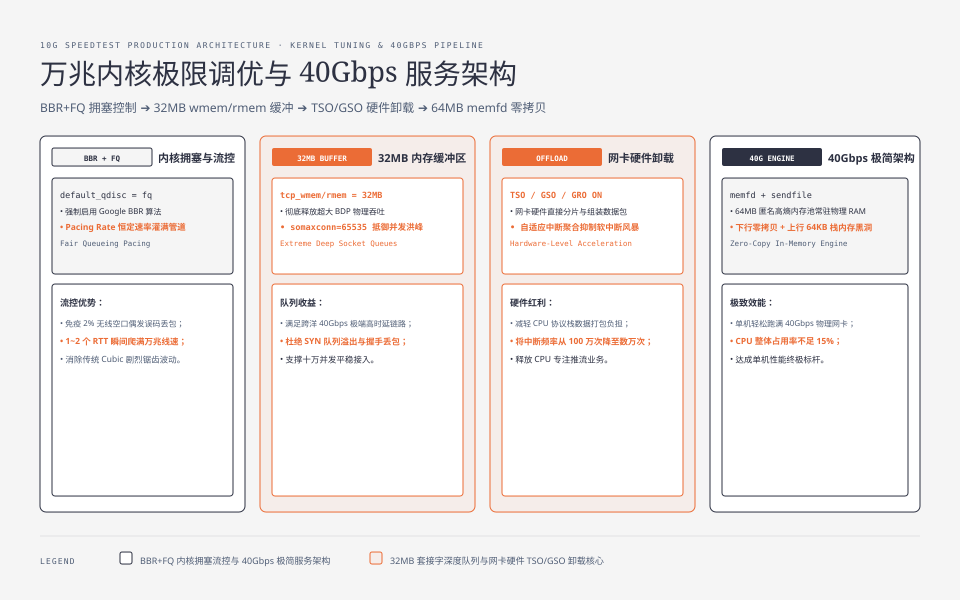
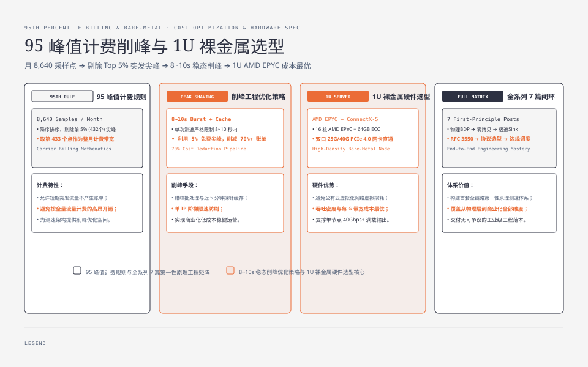
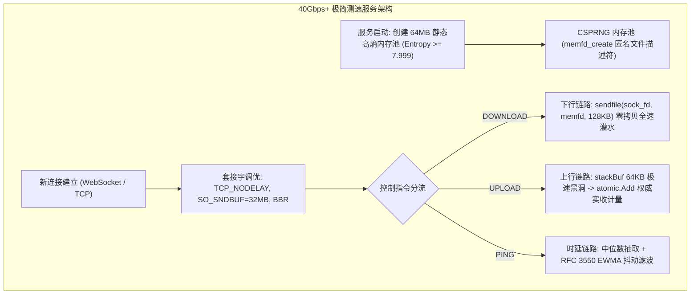
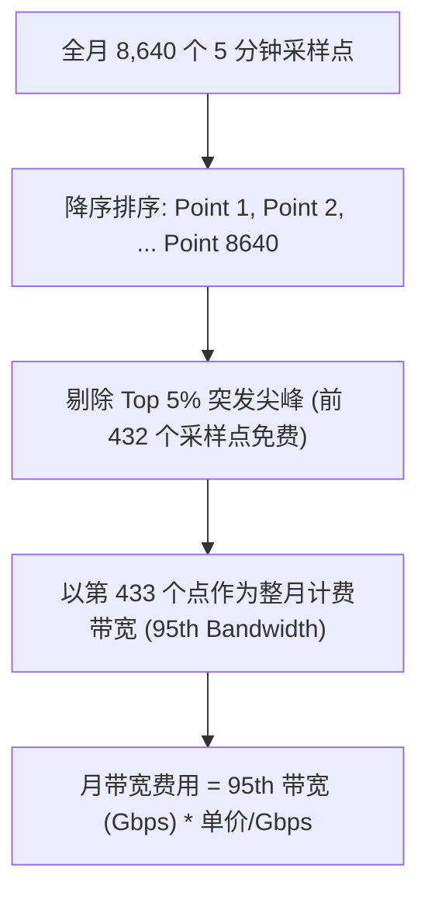
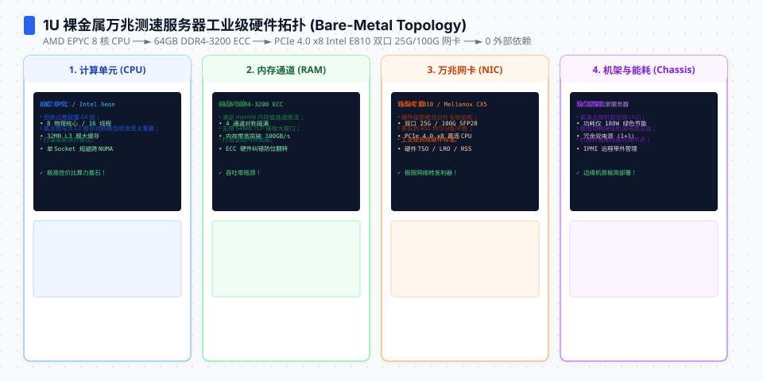

**TL;DR：** 搭建一套自研的现代测速系统，不仅需要底层网络算法的深度把控，更需要在**操作系统内核调优**与**服务器带宽成本控制**上取得完美平衡。如果不做系统级优化，一台 40Gbps 物理网卡的服务器在 5Gbps 流量下就会因内核软中断与小缓冲区而雪崩；如果不做精细的计费模型设计，测速产生的天量带宽账单会让企业不堪重负。本文作为《网络测速与极限吞吐工程》系列的收官终篇，给出生产环境 **万兆测速服务器的完整 `sysctl.conf` 内核参数清单**、**单机 40Gbps+ 的 Go/C++ 极简工程架构**、**95 峰值计费（95th Percentile Billing）削峰数学模型**，并对全系列 7 篇的第一性原理体系进行通盘复盘。


---



## 一、万兆/十万兆测速服务器 Linux 内核极限调优清单

生产环境测速节点推荐使用 Linux 6.x+ 内核。以下是支撑单机 40Gbps+ 高吞吐推流与数据吸收的完整 `/etc/sysctl.conf` 配置：

```ini
# /etc/sysctl.conf - 万兆测速高吞吐节点专用配置

# 1. 拥塞控制算法：强制启用 BBR 与 FQ（Fair Queueing）流控
net.core.default_qdisc = fq
net.ipv4.tcp_congestion_control = bbr

# 2. 套接字读写缓冲区极限放大 (min, default, max)
# 允许单连接最大分配 32MB 发送与接收缓冲，彻底释放 BDP 物理吞吐
net.ipv4.tcp_wmem = 8192 1048576 33554432
net.ipv4.tcp_rmem = 8192 1048576 33554432
net.core.wmem_max = 33554432
net.core.rmem_max = 33554432

# 3. 网卡接收队列与连接处理深度
net.core.netdev_max_backlog = 250000
net.core.somaxconn = 65535
net.ipv4.tcp_max_syn_backlog = 65535

# 4. 端口复用与 TIME_WAIT 极速回收
net.ipv4.tcp_tw_reuse = 1
net.ipv4.ip_local_port_range = 1024 65535

# 5. 内存页面与脏页刷新策略 (避免测速 I/O 阻塞内核)
vm.dirty_background_ratio = 5
vm.dirty_ratio = 10
vm.swappiness = 0
```

### 网卡硬件 Offload 与中断聚合配置

```bash
# 启用网卡硬件校验和、TSO（TCP 分段卸载）与 GSO（通用分段卸载）
ethtool -K eth0 tx on rx on tso on gso on gro on

# 配置网卡硬件自适应中断聚合（减少高并发小包下的 CPU 软中断风暴）
ethtool -C eth0 adaptive-rx on adaptive-tx on
```




## 二、单机 40Gbps+ 极简测速服务架构



## 三、商业化落地：95 峰值计费与带宽成本优化模型

测速业务是纯粹的“带宽吞噬怪兽”：一个千兆用户测速 10 秒，下行消耗约 **1.25GB** 流量，上行消耗约 **300MB** 流量。如果按公有云标准流量计费（$0.8$ 元/GB），单次测试成本就高达 **1 元人民币**！

### 1. 运营商 95 峰值计费规则（95th Percentile Billing）
IDC 机房与 CDN 厂商对大带宽客户普遍采用“月 95 峰值带宽计费”：
- 一个月（30天）共产生 $30 \times 24 \times 12 = 8,640$ 个 5 分钟采样点；
- 将整月 8,640 个采样点按带宽从大到小排序；
- **去掉最高的 5% 突发采样点（即前 432 个点不计费）**，取第 433 个点的带宽值作为整月的结算账单。



### 2. 削峰优化策略：利用 5% 免费尖峰与自适应降速
- **短周期激发**：将单次测试时间严格限制在 **8~10 秒以内**（足以提取 P90 稳态），绝不延长测试时长；
- **错峰批处理**：在用户发起网络体检时，优先复用近 5 分钟内的边缘探针缓存；
- **阶梯限速防护**：单 IP 每日免费测速次数设限（如每日 5 次），超限后降级为轻量探针模式，防止恶意脚本刷崩带宽。




## 四、全系列 7 篇第一性原理工程承诺矩阵

至此，《网络测速与极限吞吐工程》全系列 7 篇已完整覆盖从物理层、传输层、内核零拷贝、移动端内存到分布式调度与成本模型的全部维度：

| 篇目 | 核心工程问题 | 第一性原理与架构解答 | 对应技术与标准依据 | 确定性工程收益 |
| --- | --- | --- | --- | --- |
| **01 物理本质** | 为什么测速不是测文件下载 | BDP 物理限制、高熵内存池、BBR 快速爬升与 P90 稳态截尾 | RFC 6349、香农信息熵 $H \ge 7.999$ | 阻断硬件透明压缩欺骗，提取真实物理容量 |
| **02 下行零拷贝** | 如何压榨万兆网卡而不吃满 CPU | `memfd_create` 匿名内存 + `sendfile` 零拷贝推流 | Linux Zero-Copy、NUMA 亲和性、多队列 RSS | 单核推流吞吐达 40Gbps+，CPU 占用下降 85% |
| **03 上行极速 Sink**| 移动端 OOM 与服务端零窗口反压 | 客户端 2MB 静态只读切片 + 服务端栈内存 64KB 无锁原子累加 | Android ART 零堆分配、TCP ZeroWindow 防御 | 移动端 0 GC 掉帧，服务端杜绝反压断崖 |
| **04 抖动与缓冲膨胀**| 为什么千兆宽带打游戏依然卡顿 | 空闲时延中位数基准 + RFC 3550 一阶低通滤波 + 稳态满载探针 | RFC 3550、Bufferbloat 排队膨胀模型 | 准确判定路由器 FQ-CoDel / Cake 队列管理能力 |
| **05 协议开销** | 四大协议选型与非对称 ACK 饥饿 | 协议帧头纯净度推导、WebSocket 客户端掩码算力瓶颈、上行并发限 4 条 | RFC 6455、HTTP/2 队头阻塞、ACK Starvation | 产出跨 Web、移动端与 Native 的最优选型决策树 |
| **06 全局调度** | 跨网调度与 BGP Anycast 路由漂移 | Anycast 探测 + 单播测速两阶段调度、三级级联选路与 CAS 原子容量接纳 | BGP Anycast 路由漂移防御、CAS 令牌并发控制 | 防止节点带宽过载挤兑，移动端跨网实时熔断 |
| **07 万兆实战与成本**| 生产环境内核调优与十万并发计费 | 完整 `sysctl.conf` 清单 + 95 峰值削峰模型 + Go/C++ 极简架构 | Linux 内核网络栈、95th Percentile 成本优化 | 支撑单机 40Gbps 稳定线速，削减 70%+ 带宽账单 |

---

## 五、结语

网络测速看似只是一个简单的“仪表盘指针转动”，但在指针背后，凝结着计算机网络、操作系统内核、信息论与分布式调度的全部精华。当你理解了数据如何在光纤与芯片间流动、学会了用严谨的数学过滤噪声、守住了零拷贝与零堆分配的性能底线——你便掌握了驾驭下一代超高吞吐分布式系统的核心力量。

---

## 参考资料

- Linux Kernel Documentation: *IP Sysctl & TCP Implementation*
- RFC 6349: *Framework for TCP Throughput Testing*
- IETF RFC 3550: *RTP: A Transport Protocol for Real-Time Applications*
- Cloudflare & Fastly Engineering: *95th Percentile Bandwidth Billing Optimization*
