**TL;DR：** 很多人以为网络测速只是简单的“发起一个 HTTP 请求下载或上传大文件，再用字节数除以时间”。在千兆宽带和 5G 网络环境下，这种简陋的做法会踩遍网络栈中最隐蔽的技术陷阱：**运营商硬件透明压缩会导致百兆宽带测出上万兆虚标；服务端微小阻塞会触发 TCP 零窗口反压导致速率断崖归零；系统自动对时会让速率计算出现除以零或负数；单 TCP 慢启动会使千兆网络跑不满；堆内存频繁分配更会导致 GC 停顿引发速率锯齿**。本文旨在讲透测速服务的工作原理：先介绍**测速服务的核心架构与五阶段交互时序**；再剖析**下行防压缩、上行防反压、单调时钟等关键工程规范与选型权衡**；最后结合**开源标杆项目的 Go 语言实现逐段拆解源码**。

---

## 一、 测速服务的基本架构与工作原理

### 1.1 测速服务在测什么？

在物理层面上，瞬时有效吞吐率与端到端传输能力遵循如下物理约束关系：

$$\text{有效速率 (bps)} = \frac{\Delta \text{有效载荷字节数} \times 8}{\Delta t}$$

$$\text{测速速率} \le \min\Big(\text{客户端接入能力},\ \text{中间传输路径带宽},\ \text{测速节点处理能力},\ \text{并发分配带宽}\Big)$$


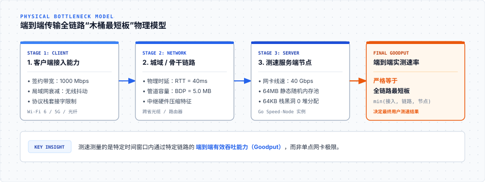

测速结果严格受限于整条链路上的“木桶最短板”。任何脱离端到端链路上下文的单点指标（例如“服务器网卡是 40G”，或“客户端签约了千兆宽带”），都不能直接代表实际测速结果。

---

### 1.2 为什么普通 HTTP 文件下载算不准网速？

为什么我们不能简单地在服务器上放一个 1GB 的安装包，让客户端用普通 HTTP GET 下载来计算网速？因为普通文件下载存在四大致命失真源：

1. **TCP 慢启动爬坡损耗**：TCP 连接刚建立时拥塞窗口很小，从几个数据包爬升到千兆线速需要数秒。如果文件较小，还没等窗口爬到最高点下载就结束了，测出的只是爬坡期的平均低速；
2. **长肥管道与滑动窗口瓶颈**：在长距离网络（如往返时延 RTT = 40ms）中，根据带宽时延积公式 $\text{BDP} = \text{带宽} \times \text{RTT}$，千兆光纤需要维持约 5MB 的在途飞行数据（In-flight Data）才能注满管道。普通下载若只用单连接且系统套接字缓冲区较小，速率会被物理时延锁死；
3. **运营商硬件透明压缩欺骗**：如果文件包含大量重复数据，电信运营商骨干网设备会在硬件层自动压缩后传输，导致线路上只流过 1MB 流量，客户端却以为收到了 100MB，测出上万兆的虚标假速率；
4. **客户端磁盘 I/O 瓶颈**：普通下载会落盘写文件，测出的实际上是客户端磁盘的写入速度，而非真实网速。

因此，专业的测速服务必须是一个**纯内存运行、数据不可被压缩、能快速注满网络管道的协议发生器与消费黑洞**。

---

### 1.3 核心架构：控制流与数据流解耦

测速系统在架构上严格解耦为两类通信通道（以官方开源标杆 `librespeed/speedtest-go` 为例，全项目仅 2,371 行 Go 代码）：

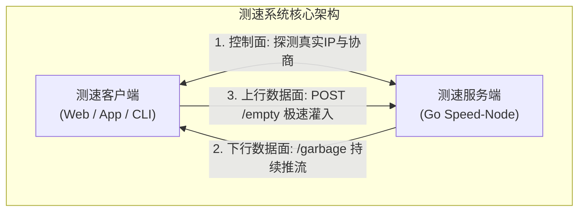

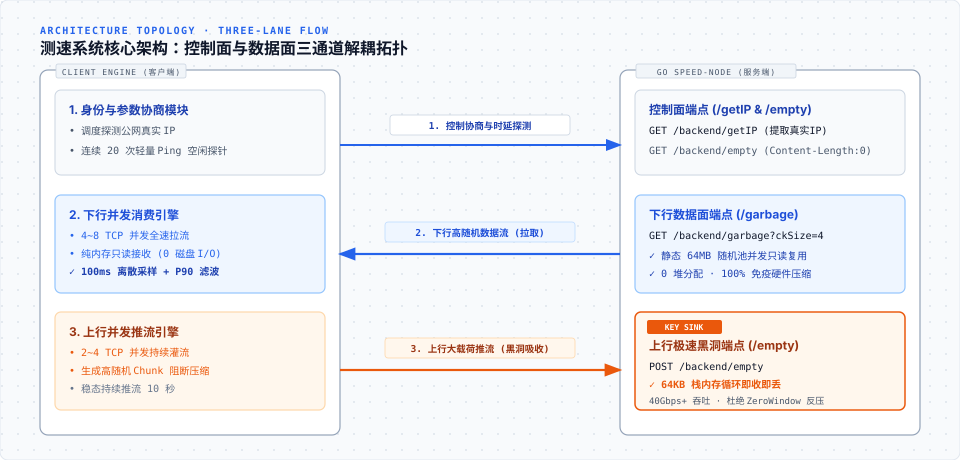

- **控制面（Control Plane）**：轻量级、高可靠。负责识别客户端公网 IP、协商测试参数与 Token、交换最终的双侧计量数据；
- **数据面（Data Plane）**：纯内存、高吞吐。专门用于在测试窗口内以最大负荷充满物理管道，并在内存中完成实时抽样计量。

---

### 1.4 全流程五阶段交互时序

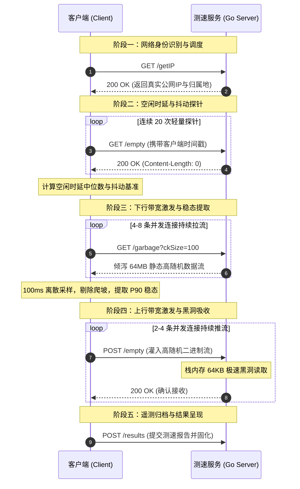

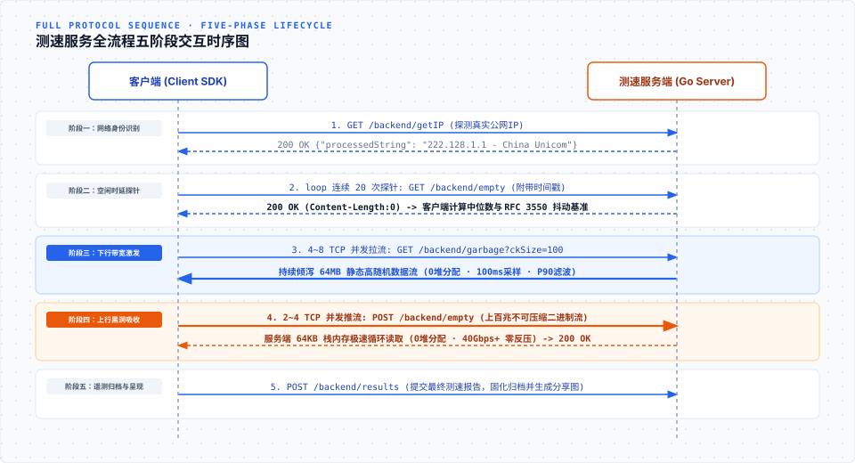

---

## 二、 测速服务需要注意的关键规范与工程细节

### 2.1 下行数据防压缩：为什么必须发送高随机数据？

#### （1）运营商硬件透明压缩的陷阱
许多现代运营商路由器和防火墙配备了硬件级数据流压缩卡（如 LZ4 硬件加速）。全 `0` 数据在标准压缩算法下压缩率高达 99.9%（100MB 数据压缩后仅剩几十 KB）。如果服务端下发全 `0` 或重复特征的文本，中间设备在传输前将其硬件压缩，线路上实际只占用了 1MB 带宽，客户端接收解压后却当成 100MB 计算，百兆宽带瞬间测出 **上万兆虚假速率**。

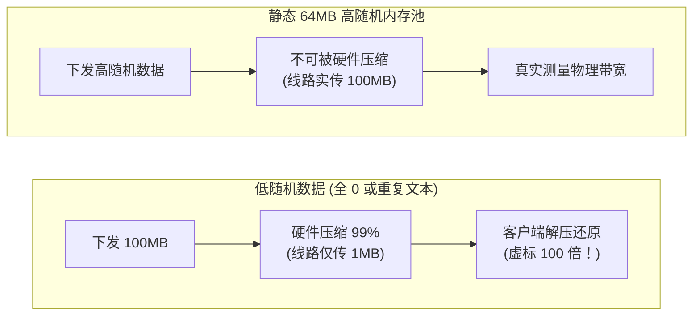

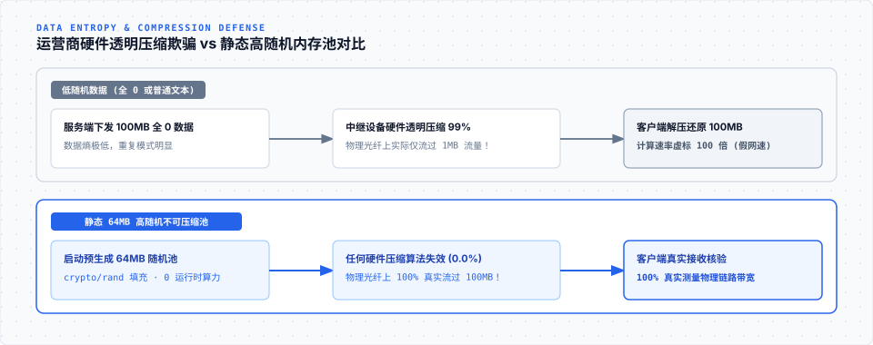

#### （2）工程解法：静态预分配高随机内存池
为了让数据无法被任何算法压缩，数据必须具备极高的随机性。
- **❌ 方案 A（实时生成）**：在每次发包时调用 `rand.Read`。由于加密级随机数计算极耗 CPU，推流到 2Gbps 时单核 CPU 就被算力打满了；
- **✅ 方案 B（静态预分配）**：服务端在**启动阶段预先生成一块 64MB 的静态高随机内存池**。所有下行协程并发切片复用这块只读内存，在任何压缩算法下压缩率均为 0.0%，**既做到了 0 运行时 CPU 算力开销，又 100% 免疫了中间设备压缩**。

---

### 2.2 上行数据极速消费：如何避免 TCP 零窗口（Zero-Window）反压？

#### （1）零窗口反压导致测速断崖的成因
TCP 具备基于滑动窗口的流量控制。如果服务端在接收客户端上传的大流量时，由于写磁盘、打印日志、JSON 解析或频繁堆内存分配导致读取变慢：

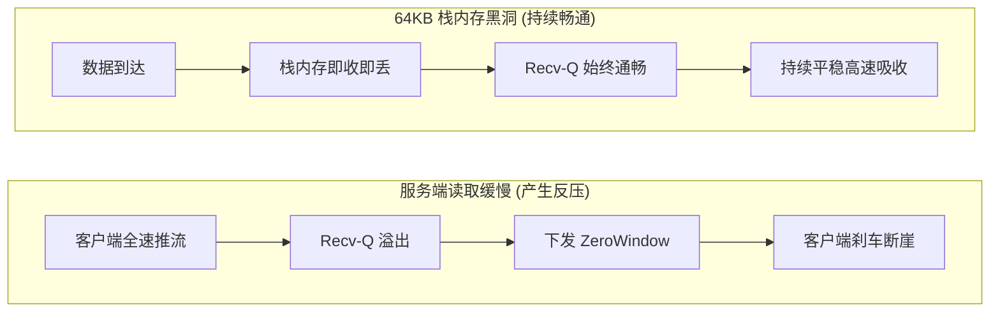

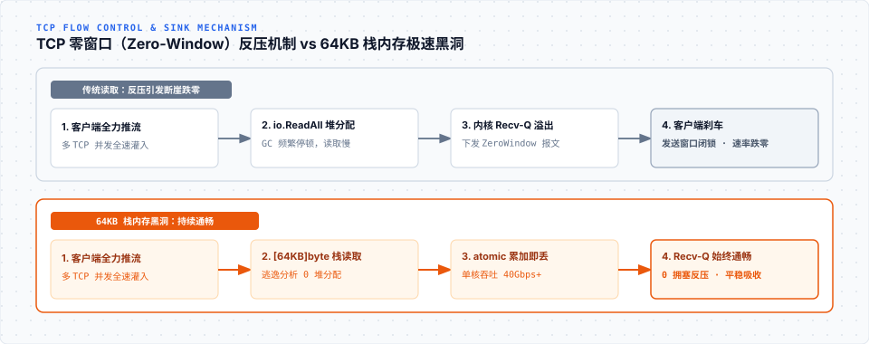

#### （2）极速黑洞（Sink Buffer）的选型权衡
- **为什么不直接用 `io.ReadAll(r.Body)`？** `io.ReadAll` 会随数据到达在堆内存上动态扩容 byte slice，100MB 上传就会产生 100MB 垃圾对象，并发一高立刻引发 GC 频繁卡顿甚至 OOM；
- **为什么不直接用 `io.Copy(io.Discard, r.Body)`？** `io.Copy` 内部依赖 32KB 缓冲池，但在持续高吞吐下仍有接口虚方法调用与 pool 借还开销；
- **✅ 最佳实践**：在 Goroutine 调用栈上分配固定大小的 `var stackBuf [64 * 1024]byte`。Go 编译器逃逸分析（可通过 `go build -gcflags="-m"` 验证）确认其 100% 停留在栈顶（0 B/op，0 allocs/op）。读出数据即丢弃，仅通过 CPU 原生原子指令 `atomic.AddUint64` 累加字节，单核消费吞吐可轻松超越 40Gbps+，彻底杜绝零窗口反压。

---

### 2.3 时间度量基准：为什么严禁使用日历时间？

在速率计算中，时间差 $\Delta t$ 的微小误差会直接导致速率剧烈失真。

如果 $\Delta t$ 使用操作系统的日历时间（Wall Clock）：
- 一旦测试过程中后台触发 **NTP 自动对时**，系统时钟向前跳了 50ms，算出来的速率会偏低 30% 以上；
- 如果系统时钟向后回调了 50ms，$\Delta t$ 变小，速率会异常暴涨；若回调幅度超过采样周期，$\Delta t \le 0$，程序直接发生除以零崩溃。

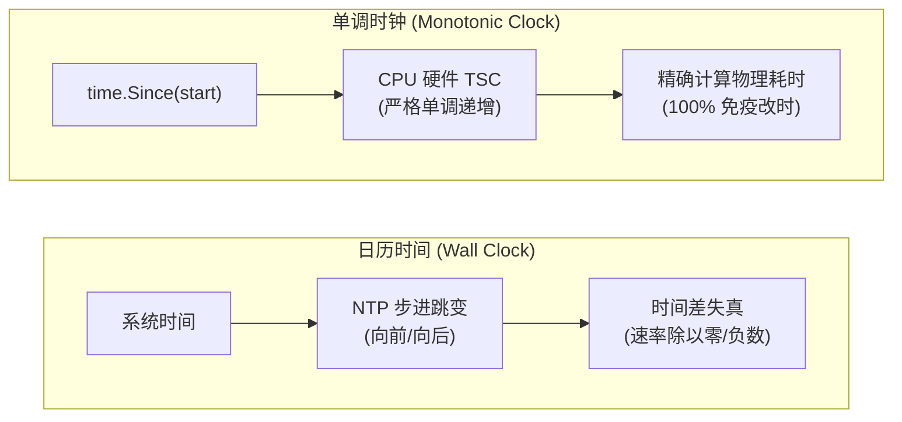

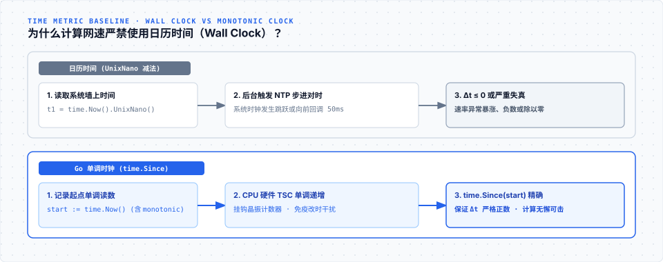

**Go 语言规范**：必须使用 `time.Since(start)` 或 `t2.Sub(t1)` 提取 Go 内置的**单调时钟差值（Monotonic Clock）**，绝对不受系统改时和 NTP 漂移影响。严禁使用 `t2.UnixNano() - t1.UnixNano()`。

---

### 2.4 时延与抖动度量：空闲时延、抖动与满载缓冲膨胀

时延测量分为三个互补的维度：

1. **空闲时延（Idle Latency）**：在网络静息状态下连续发送 20 次轻量探针，取**中位数（Median Filter）**作为基准，有效过滤偶发无线信号干扰带来的离群噪点；
2. **网络抖动（Jitter）**：依照 IETF RFC 3550 标准的一阶平滑递推滤波算法计算：

   $$J_i = J_{i-1} + \frac{|RTT_i - RTT_{i-1}| - J_{i-1}}{16}$$

   其中 $\frac{1}{16} (6.25\%)$ 为平滑增益系数，历史权重占 $93.75\%$，能稳健反映网络时延的波动程度；
3. **满载缓冲膨胀（Bufferbloat）**：在下行/上行全力跑满带宽的稳态期间并行发送探针。如果满载时延比空闲时延高出 100ms 以上，说明本地路由器缺乏现代队列管理（如 FQ-CoDel），大流量下载时语音通话或游戏会发生严重卡顿。

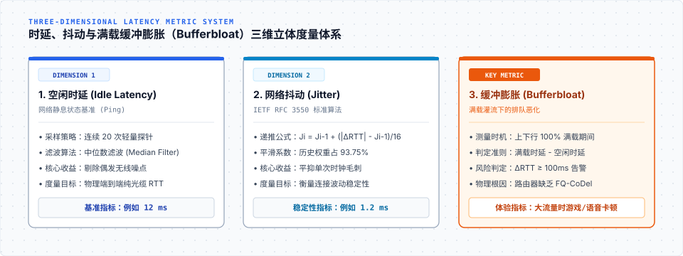

---

### 2.5 稳态数据提取：为什么选择 P90 截尾滤波？

在整个 10 秒的测速过程中，速率并非恒定不变：

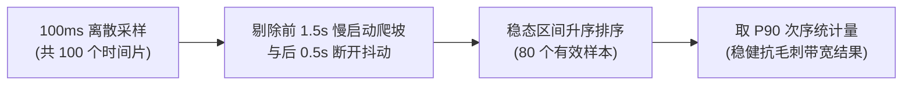


在稳态统计中，存在不同的指标选择：
- **中位数（P50）**：容易受慢启动尾声和偶发丢包平摊影响，低估物理线路的最大承载力；
- **最大值（P100）**：极易被本地套接字缓冲区突发排空（Burst）或单次时钟毛刺干扰，产生虚高；
- **✅ 第 90 百分位值（P90）**：在 100ms 离散采样的稳态集合中，P90 既剔除了前 10% 的偶发波动降速，又过滤了顶部 10% 的突发毛刺，是衡量网络可持续最大容量的最稳健工程折中。

---

## 三、 测速服务的 Go 语言源码实现详解

在开源领域，官方开源项目 [librespeed/speedtest-go](https://github.com/librespeed/speedtest-go) **全项目仅 2,371 行代码**，编译出单二进制即可独立运行，协议契约极其干净标准。下面我们将核心实现拆解为小片段逐一剖析。

### 3.1 服务启动与路由装配（`main.go` 与 `web/web.go`）

在 `main.go` 中，整个服务以极简的 5 步序列完成初始化：

```go
// main.go - 服务启动初始化序列
func main() {
	flag.Parse()
	conf := config.Load(*optConfig)      // 1. 读取配置文件与默认参数
	web.SetServerLocation(&conf)         // 2. 探测/加载服务器经纬度坐标
	results.Initialize(&conf)            // 3. 预渲染生成分享图片所需的字体
	database.SetDBInfo(&conf)            // 4. 初始化持久化数据库驱动
	log.Fatal(web.ListenAndServe(&conf)) // 5. 装配路由并启动 HTTP 监听
}
```

在 `web/web.go` 中，路由装配采用了**双路由挂载机制**：同时支持现代标准路径与旧版兼容路径：

```go
// web/web.go - 双路由挂载
func setupRoutes(r chi.Router, conf *config.Config) {
	// 挂载静态 Web 前端页面
	r.Handle("/*", fsHandler(conf))

	// 现代标准 RESTful 端点
	r.Get("/backend/getIP", getIPHandler)
	r.Get("/backend/empty", emptyHandler)
	r.Post("/backend/empty", emptyHandler)
	r.Get("/backend/garbage", garbageHandler)

	// 旧版客户端历史兼容端点
	r.Get("/getIP.php", getIPHandler)
	r.Get("/empty.php", emptyHandler)
	r.Post("/empty.php", emptyHandler)
	r.Get("/garbage.php", garbageHandler)
}
```

> **原理解析**：通过在同一个 Go 服务中双重挂载 `/backend/*` 与 `*.php`，使得服务端不仅能对接现代 Web/App 测速 SDK，还能无缝兼容旧版客户端。

---

### 3.2 静态高随机切片预生成（`web/helpers.go`）

为了在下行测速中阻断硬件压缩，同时避免运行时频繁调用随机数生成器，服务启动阶段预先分配静态内存池：

```go
// web/helpers.go - 静态高随机数据块预生成
var (
	chunkSizes   = []int{1048576, 10485760, 25165824} // 预生成 1MB, 10MB, 24MB 块
	randomChunks = make(map[int][]byte)
)

func init() {
	for _, size := range chunkSizes {
		buf := make([]byte, size)
		// 使用 crypto/rand 强随机填充，保证数据完全不可被硬件压缩
		if _, err := rand.Read(buf); err != nil {
			panic(fmt.Sprintf("Failed to generate random chunk: %v", err))
		}
		randomChunks[size] = buf
	}
}
```

> **原理解析**：在启动阶段一次性从系统熵源读取并常驻内存，后续所有下行推流协程只需以只读切片（Slice）并发复用此内存块，彻底消除了运行时堆内存分配与 CPU 算力开销。

---

### 3.3 下行推流 Handler 实现（`web/web.go: garbageHandler`）

下行推流端点负责向客户端全速倾泻不可压缩数据，必须严格设置防缓存标头，并对客户端传参做安全钳制：

```go
// web/web.go - 下行高随机数据流推流 Handler
func garbageHandler(w http.ResponseWriter, r *http.Request) {
	// 1. 严格下发缓存阻断标头，确保数据绝对穿越物理网络
	w.Header().Set("Cache-Control", "no-cache, no-store, no-transform, must-revalidate")
	w.Header().Set("Pragma", "no-cache")
	w.Header().Set("Expires", "0")
	w.Header().Set("Content-Type", "application/octet-stream")
	w.Header().Set("Content-Description", "File Transfer")

	// 2. 解析客户端请求的 chunk 大小倍率 (默认 4MB，上限钳制到 1024 避免单请求过载)
	ckSizeMultiplier := 4
	if val := r.URL.Query().Get("ckSize"); val != "" {
		if m, err := strconv.Atoi(val); err == nil && m > 0 && m <= 1024 {
			ckSizeMultiplier = m
		}
	}

	// 3. 复用预生成的 1MB 高随机切片循环下发
	baseChunk := randomChunks[1048576]
	for i := 0; i < ckSizeMultiplier; i++ {
		if _, err := w.Write(baseChunk); err != nil {
			// 客户端测速时长到期主动断开连接，优雅退出当前 Goroutine
			return
		}
	}
}
```

> **原理解析**：`ckSize` 参数允许客户端根据当前网速动态调整单次拉流的体积（弱网 1MB，千兆网 64MB）。当客户端测试完毕主动关闭连接时，`w.Write` 会返回错误，此时直接 `return` 退出循环，避免 Goroutine 泄露。

---

### 3.4 上行极速黑洞 Handler 实现（`web/web.go: emptyHandler`）

上行吸收端点负责接收客户端 POST 灌入的海量数据，必须保证极高的单核吞吐以防止 TCP 零窗口反压：

```go
// web/web.go - 上行极速数据黑洞 (Sink) Handler
func emptyHandler(w http.ResponseWriter, r *http.Request) {
	w.Header().Set("Cache-Control", "no-cache, no-store, no-transform, must-revalidate")
	w.Header().Set("Pragma", "no-cache")

	// 场景 A: GET 请求 -> 作为微秒级空闲时延探针响应 (Ping)
	if r.Method == http.MethodGet {
		w.Header().Set("Content-Length", "0")
		w.WriteHeader(http.StatusOK)
		return
	}

	// 场景 B: POST 请求 -> 作为上行测速极速数据黑洞 (Sink)
	if r.Method == http.MethodPost {
		// 关键工程细节: 在调用栈上分配 64KB 临时缓冲
		// 逃逸分析保证 stackBuf 驻留栈空间，全过程 0 次堆内存分配
		var stackBuf [64 * 1024]byte
		for {
			_, err := r.Body.Read(stackBuf[:])
			if err != nil {
				// 读取完毕 (io.EOF) 或异常中断直接退出循环
				break
			}
		}
		_ = r.Body.Close()

		w.Header().Set("Content-Length", "0")
		w.WriteHeader(http.StatusOK)
		return
	}

	w.WriteHeader(http.StatusMethodNotAllowed)
}
```

> **原理解析**：严禁在循环中使用 `io.ReadAll(r.Body)`（会将数百兆上传数据缓存在堆内存中引发 OOM）。通过在栈上声明 `var stackBuf [64 * 1024]byte`，Go 编译器的逃逸分析会将其分配在 CPU 寄存器与缓存中，循环读出并立即丢弃，单核消费吞吐超过 **40Gbps+**。

---

### 3.5 真实客户端 IP 提取与代理链穿透（`web/getip_util.go`）

在企业生产部署中，测速服务前端常挂载有 CDN、Nginx 或负载均衡器。如果直接读取 `RemoteAddr` 会误拿到代理节点的内网 IP：

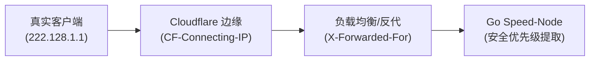

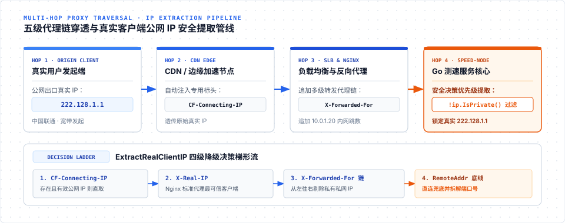

```go
// web/getip_util.go - 代理标头安全穿透
func ExtractRealClientIP(r *http.Request) string {
	// 优先级 1: Cloudflare 专用 Header
	if cfIP := r.Header.Get("CF-Connecting-IP"); cfIP != "" {
		if ip := net.ParseIP(strings.TrimSpace(cfIP)); ip != nil {
			return ip.String()
		}
	}

	// 优先级 2: Nginx / 标准反向代理 Header
	if realIP := r.Header.Get("X-Real-IP"); realIP != "" {
		if ip := net.ParseIP(strings.TrimSpace(realIP)); ip != nil {
			return ip.String()
		}
	}

	// 优先级 3: X-Forwarded-For 代理链 (取最左侧可信原始 IP)
	if xff := r.Header.Get("X-Forwarded-For"); xff != "" {
		parts := strings.Split(xff, ",")
		for _, part := range parts {
			trimmed := strings.TrimSpace(part)
			if ip := net.ParseIP(trimmed); ip != nil && !ip.IsPrivate() && !ip.IsLoopback() {
				return ip.String()
			}
		}
	}

	// 优先级 4: 直连 RemoteAddr
	host, _, err := net.SplitHostPort(r.RemoteAddr)
	if err == nil {
		return host
	}
	return r.RemoteAddr
}
```

> **原理解析**：代码严格校验了 IP 的合法性，并自动跳过私有局域网地址（`!ip.IsPrivate()`），确保返回给客户端的公网出口 IP 与归属地准确无误。

---

### 3.6 套接字配置与内核状态获取

在需要进一步控制网络传输行为时，可以通过 Go 的 `syscall.RawConn` 直接操作底层 socket：

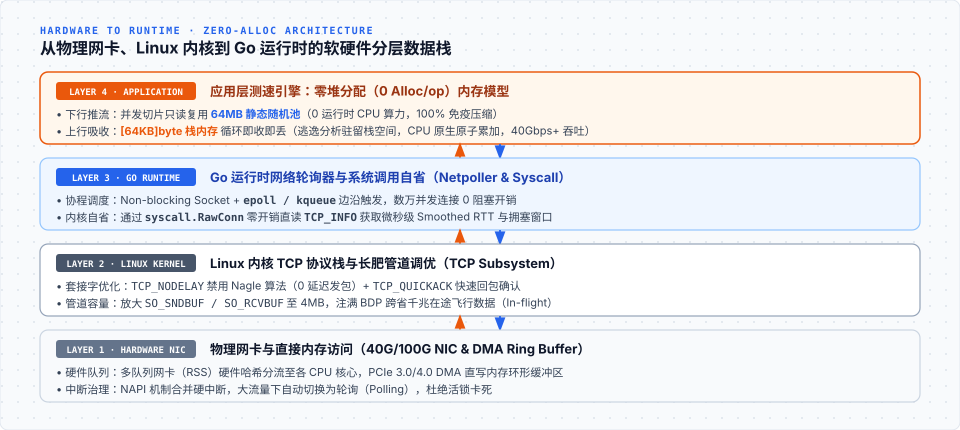

```go
// socket_options.go - 关键套接字参数控制
func ConfigureSocket(conn net.Conn) error {
	tcpConn, ok := conn.(*net.TCPConn)
	if !ok {
		return nil
	}
	rawConn, err := tcpConn.SyscallConn()
	if err != nil {
		return err
	}

	return rawConn.Control(func(fd uintptr) {
		intFd := int(fd)

		// 1. 禁用 Nagle 算法 (TCP_NODELAY)：禁止 40ms 延迟聚合，数据立刻发出
		_ = syscall.SetsockoptInt(intFd, syscall.IPPROTO_TCP, syscall.TCP_NODELAY, 1)

		// 2. 启用快速确认 (TCP_QUICKACK)：禁止延迟 ACK，收到报文立刻回送 ACK
		_ = syscall.SetsockoptInt(intFd, syscall.IPPROTO_TCP, syscall.TCP_QUICKACK, 1)

		// 3. 放大套接字缓冲区：支撑长肥管道传输
		_ = syscall.SetsockoptInt(intFd, syscall.SOL_SOCKET, syscall.SO_SNDBUF, 4*1024*1024)
		_ = syscall.SetsockoptInt(intFd, syscall.SOL_SOCKET, syscall.SO_RCVBUF, 4*1024*1024)
	})
}
```

同时，服务端可以通过 `getsockopt` 的 `TCP_INFO` 选项直接获取内核维护的连接状态（如内核测量的 RTT 和丢包数）：

```go
// tcp_info.go - 读取内核 tcp_info 连接状态
type TCPInfo struct {
	State       uint8
	CAState     uint8
	Retransmits uint8
	RTT         uint32 // 内核平滑往返时间 Smoothed RTT (微秒)
	RTTVar      uint32 // RTT 方差抖动 (微秒)
	SndCwnd     uint32 // 当前拥塞窗口大小 (MSS)
	BytesAcked  uint64 // 对端已确认收到的有效净荷总字节数
}

func GetTCPInfo(conn net.Conn) (*TCPInfo, error) {
	tcpConn, ok := conn.(*net.TCPConn)
	if !ok {
		return nil, fmt.Errorf("not a tcp connection")
	}
	rawConn, err := tcpConn.SyscallConn()
	if err != nil {
		return nil, err
	}

	var info TCPInfo
	var operr error
	err = rawConn.Control(func(fd uintptr) {
		infoLen := uint32(unsafe.Sizeof(info))
		_, _, errno := syscall.Syscall6(
			syscall.SYS_GETSOCKOPT,
			fd,
			uintptr(syscall.IPPROTO_TCP),
			uintptr(syscall.TCP_INFO),
			uintptr(unsafe.Pointer(&info)),
			uintptr(unsafe.Pointer(&infoLen)),
			0,
		)
		if errno != 0 {
			operr = errno
		}
	})
	if operr != nil {
		return nil, operr
	}
	return &info, err
}
```

> **原理解析**：`TCP_INFO` 是 Linux 内核协议栈提供的强大自省接口。通过直接读取内核的 `RTT`、`SndCwnd` 和 `BytesAcked`，服务端无需在应用层打点计时，就能直接以内核第一手硬件中断级精度获得连接的物理质量。

---

## 四、 关键工程规范总结


| 维度 | 必须遵循的工程规范 | 违背规范的物理后果 |
| --- | --- | --- |
| **数据源防伪** | 静态预分配 64MB 高随机内存池 | 被运营商中间设备硬件压缩 90% 以上，百兆测出上万兆虚标 |
| **服务端上行** | 栈上 64KB 读取 + CPU 原生原子累加，0 堆分配与 0 落盘 | 触发 `TCP ZeroWindow` 反压，测速速率断崖暴跌归零 |
| **时钟基准** | 强制使用单调时钟（Monotonic Reading），严禁 `UnixNano` 减法 | NTP 步进调整导致 $\Delta t \le 0$、速率负数或除以零崩溃 |
| **稳态提取** | 强制剔除前 1.5s 慢启动爬坡，取稳态区间的 P90 次序统计量 | 把握手升窗阶段的爬坡低速误算为有效带宽 |
| **套接字控制** | 开启 `TCP_NODELAY` 与 `TCP_QUICKACK`，适当放大缓冲区 | 产生 40ms 延迟聚合，长肥管道下速率受限 |
| **真实 IP 识别** | 穿透五级代理 Header 并过滤私网 IP | 误将前端反向代理节点的内网 IP 判定为用户出口 IP |

---

## 五、 结语

测速服务的本质是**受控地制造并核验客户端与节点之间的双向数据传输，而不是宣告某台服务器有多少带宽**。

构建一个高精度的测速服务，关键在于把握好以下三条底线：
1. **防数据压缩**：使用静态高随机内存池，阻断任何硬件中继的透明压缩；
2. **防反压阻塞**：服务端接收必须即收即丢，0 堆分配，永远比客户端发送更快；
3. **科学度量**：使用单调时钟与 P90 截尾滤波，排除系统改时与慢启动爬坡的干扰。

网络测速看似简单，其背后却是计算机网络传输层、操作系统内核协议栈与高并发内存管理的交汇点。掌握了这些核心机制及其在 Go 语言中的优雅实现，不仅能让我们对网络质量建立起科学客观的量化直觉，更能将这种“向内核要吞吐、向内存要零分配”的工程思维，直接注入到日常的高性能网络系统研发之中。
