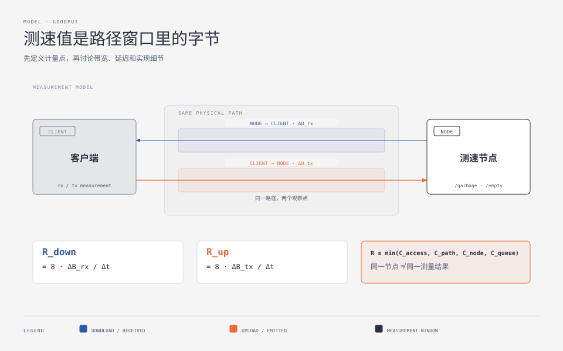
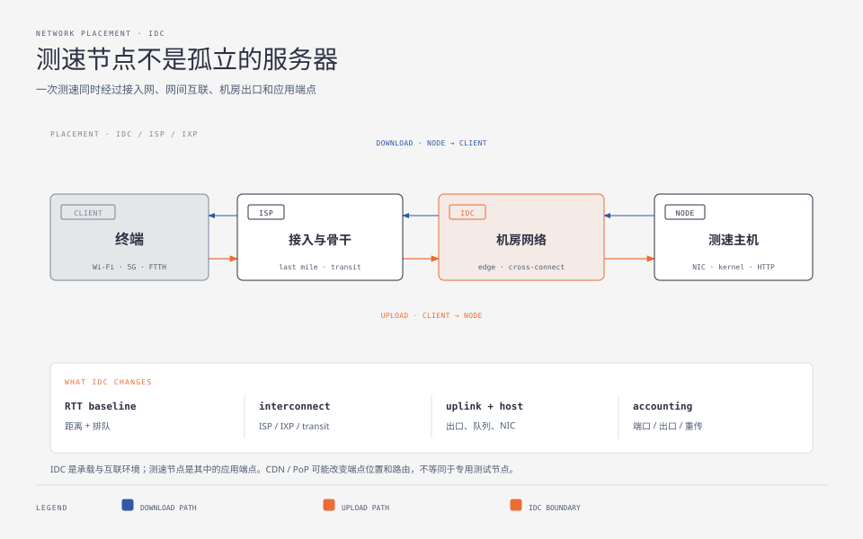
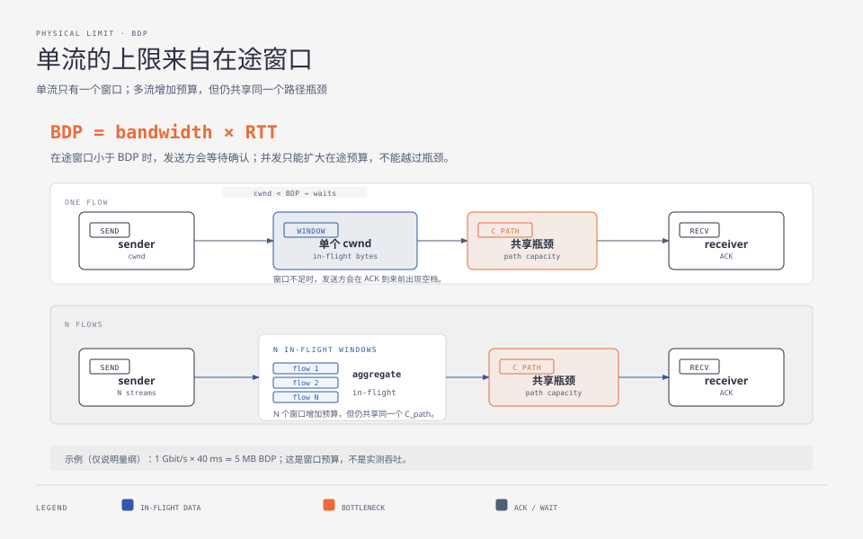
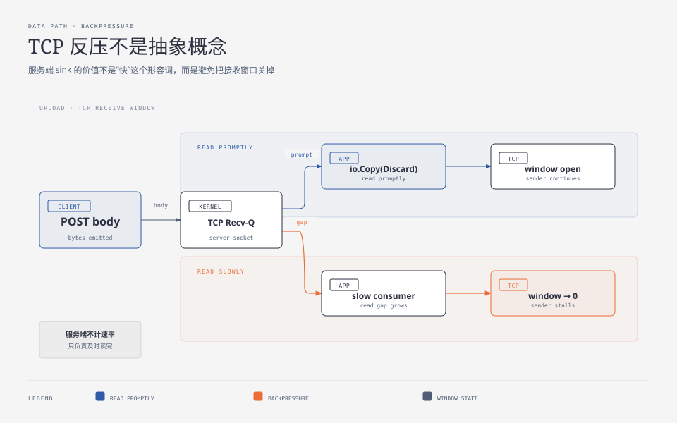
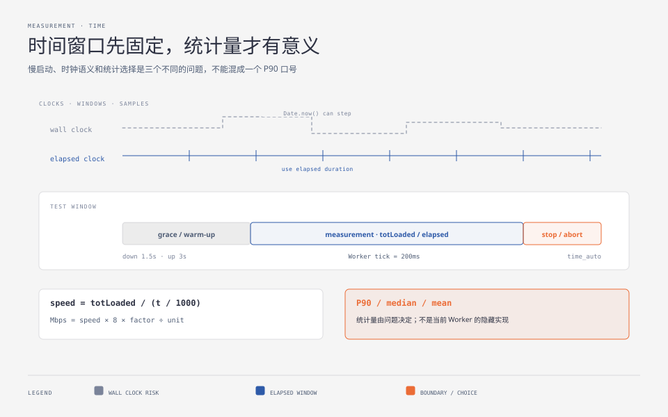
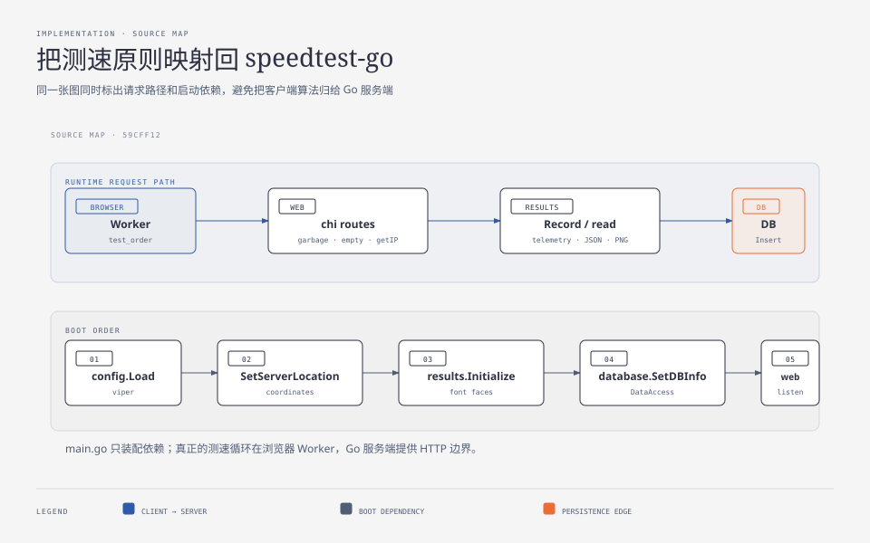
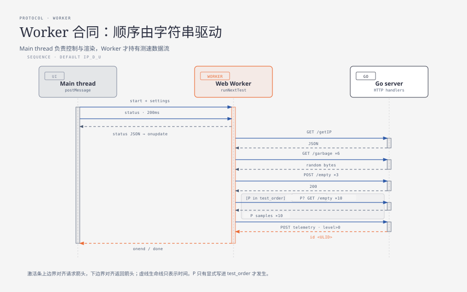
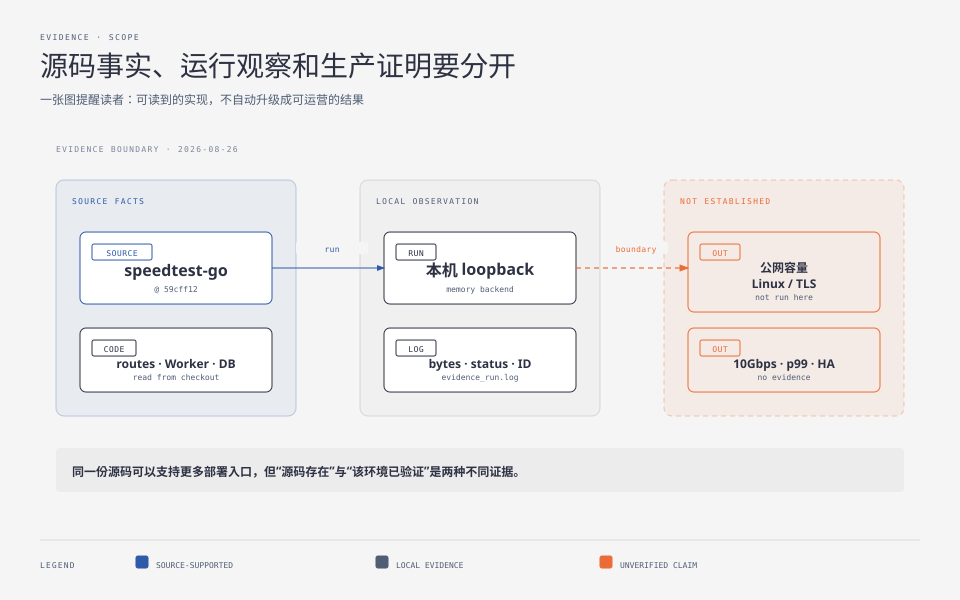

**TL;DR：** 测速结果不是某台服务器的带宽宣言，而是一个方向、一个计量点和一个时间窗口里的有效字节速率。测速节点通常部署在 IDC（Internet Data Center，互联网数据中心）或云数据中心，但真正经过的是“终端接入网 → ISP/骨干/网间互联 → IDC 出口 → 测速主机”的完整路径；节点也可能放在私有云或 CDN 边缘，此时请求终止点、上联和计费边界会改变。IDC、ISP、IXP 和测速节点不是同一个概念。下行通常统计客户端收到的字节，上行通常统计客户端已经交给网络栈的字节；两者都要面对访问链路、路径队列、拥塞窗口、服务端消费速度和浏览器事件语义。一个可信的测速服务要先定义这些边界，再处理缓存/压缩、BDP、TCP 反压、启动坡道、时钟和采样。`librespeed/speedtest-go@59cff12` 是一个很适合学习的 HTTP/XHR 参考实现：它用 1 MiB 随机块循环提供下行，用 `io.Copy(ioutil.Discard, r.Body)` 吸收上行，浏览器 Web Worker（后台线程）默认按 `IP_D_U` 调度 6 条下行流和 3 条上行流，并可选提交遥测。它没有替你完成全局选点、容量接纳、服务端上行权威计量或生产容量证明。

## 一、先定义“测到了什么”：有效吞吐是路径窗口里的字节

“带宽”至少有三个容易混淆的含义：链路的名义容量、某一段的瞬时可用容量，以及应用在一段时间内真正观察到的有效吞吐（通常称为 goodput）。测速客户端最终能计算的只是第三种。

### 1.1 先给每个指标绑定定义

测速结果不是只有一个 Mbps 数字。不同指标来自不同层，不能互相替代：

| 指标 | 定义或公式 | 它反映什么 |
| --- | --- | --- |
| goodput | `8 × 应用有效字节 / 正式时间窗` | 用户在应用层真正收到或发出的数据速率 |
| RTT | `响应时间戳 − 请求时间戳` | 一次请求-响应往返经历的传播、排队和处理时延 |
| jitter | 简化为 `|RTTₙ − RTTₙ₋₁|`；实际算法可用指数加权移动平均（EWMA） | 时延样本的变化，不等同于平均 RTT |
| packet loss | `1 − 收到的序列号 / 应发送的序列号` | UDP/探针的丢包比例；TCP 应用通常只看到重传带来的延迟 |
| retransmission | 传输层重复发送已发过的序号空间 | 链路损伤或拥塞恢复的迹象，不应再次计入应用有效字节 |
| percentile | 对一组样本排序后取 P50/P90 等位置 | 样本分布位置，不是另一种带宽单位 |
| availability | `成功测试次数 / 尝试次数` | 节点是否能工作，不代表可提供多少吞吐 |

### 1.2 一次测速跨越哪些协议层

把“网速”拆成协议层，才能知道某个数字是被谁限制的：

| 层次 | 测速相关对象 | 可能改变结果的因素 |
| --- | --- | --- |
| 物理/链路层 | 光纤、以太网、Wi-Fi、5G、FTTH（光纤到户）、NIC | 介质共享、信号质量、协商速率、链路错误和局部队列 |
| 网络层 | IPv4/IPv6、IP 转发、NAT、BGP、MTU | 路由选择、地址转换、路径长度、分片/PMTUD 和上下行不对称 |
| 传输层 | TCP、UDP；QUIC 在 UDP 上提供传输语义 | 拥塞窗口、接收窗口、重传、丢包、流控、pacing（发送节奏）和队头阻塞 |
| 安全层 | TLS | 握手、证书、加解密 CPU、记录分片和连接复用 |
| 应用层 | HTTP/1.1、HTTP/2、HTTP/3、XHR、WebSocket | 请求终止点、缓存/压缩、代理、应用缓冲和 JavaScript 事件 |

设下行测试窗口为 `[t₀, t₁]`，客户端在窗口内报告收到的有效字节为 `B_rx`，则：

$$
R_{down} = \frac{8 \times (B_{rx}(t_1)-B_{rx}(t_0))}{t_1-t_0}
$$

上行的计量点换到了发送侧。若客户端的上传事件报告已经发出的字节为 `B_tx`，则：

$$
R_{up} = \frac{8 \times (B_{tx}(t_1)-B_{tx}(t_0))}{t_1-t_0}
$$

这里的“有效”不是“所有经过网卡的比特”。它通常排除了协议头，也不自动等于服务端已经持久化或应用层已经处理的字节。方向更不能省略：下载是节点到客户端，上行是客户端到节点，路径上的瓶颈可能完全不同。

同一份流量在不同层会得到不同的数字：

| 层次 | 看到的量 | 适合回答的问题 |
| --- | --- | --- |
| 应用层 | 响应体收到的字节、请求体发出的字节、Handler 读到的字节 | 用户和应用“有效搬运”了多少 |
| 传输层 | TCP 序号空间、协议头、确认、重传和拥塞状态 | 哪些字节正在传输，为什么会等待或重发 |
| 主机接口 | NIC 收发包计数、内核队列和 CPU 处理 | 主机实际处理了多少线速流量 |
| IDC/运营商 | 上联端口、出口方向、峰值或周期流量 | 机房网络资源如何被使用和核算 |
| 账单 | 供应商定义的计费单位、计费方向和结算周期 | 要付费的流量是多少 |

这些层的分母不能互换：应用层的 `B_rx/B_tx` 不包含所有协议头和重传，也不自动等于 IDC 出口或账单字节。单位同样要写全：`1 Byte = 8 bit`；`MB` 通常按 `10^6` 字节，`MiB` 按 `2^20` 字节；`Mb/s`（兆比特每秒）与 `MB/s`（兆字节每秒）相差约 8 倍。当前 Worker 还会用 `1,000,000` 或 `1,048,576` 做显示换算，因此结果必须同时记录单位和换算因子。



图中的两条横线是同一条物理路径上的相反方向；内部色带只是区分下行收到的 `B_rx` 和上行发出的 `B_tx`，不代表额外的网络层。箭头直接接客户端和测速节点的边框，计量点由下方公式说明。

沿着整条路径，应用可观察到的速率受到多个上限共同约束：

$$
R \leq \min(C_{access}, C_{path}, C_{node}, C_{queue})
$$

`C_access` 是客户端接入能力，`C_path` 是中间网络和拥塞状态，`C_node` 是测速节点实际能提供或消费的能力，`C_queue` 表示缓冲与调度是否让数据持续流动。这个式子不是精确容量模型，却能阻止一个常见错误：看到服务器有 40 Gbit/s 网卡，就把客户端测到的 200 Mbit/s 解释成“服务器只剩 200 Mbit/s”。测速值是这一次路径、这一个时间窗里的观察，不是服务器的静态属性。

## 二、测速节点为什么常放在 IDC：机房位置不等于网络路径

IDC 在本文中指 Internet Data Center，中文通常称“互联网数据中心”。它首先是一个承载计算、存储和网络设备的设施与网络接入环境：机柜、供配电、制冷、交换设备、外部线路和运维能力共同构成了它的运行条件。它不是某一台服务器，也不是“运营商网络”的同义词。相关国家标准项目《信息技术 数据中心设备和基础设施 第 1 部分：通用概念》的公开说明，已经把通信区、可用性、实体安全、能效和业务成本放进数据中心的设计与运行语境；对测速而言，最重要的不是机房有多少机柜，而是测试主机通过什么网络出口接入哪些上游网络。

还要把几个容易混在一起的名词拆开：

| 名词 | 在测速路径中的角色 | 不能直接等同于 |
| --- | --- | --- |
| IDC | 放置设备并提供网络接入、交叉连接和出口条件的设施/网络边界 | ISP、测速程序或“最近的网络节点” |
| ISP（Internet Service Provider） | 提供用户接入、骨干传输或互联网转接的网络运营商 | IDC 机房本身 |
| IXP（Internet Exchange Point） | 让不同网络交换流量的互联平台；某条路径可能经过，也可能不经过 | 必经的中间路由器 |
| 测速节点 | 在某个 IDC、云区域或边缘站点运行的 HTTP 服务和主机 | 整个 IDC 或整条运营商网络 |
| PoP（Point of Presence） | 一个网络或服务商在某处的存在点，可能只有网络设备或少量服务 | 自动等于完整数据中心 |
| CDN（Content Delivery Network） | 分布式边缘服务，可能动态选择入口和内容 | 固定的专用测速节点 |

一条简化的访问路径可以写成：

```text
终端
  → Wi-Fi / 5G / FTTH 接入
  → 接入 ISP
  → 城域网 / 骨干网
  → 对等互联 / transit（上游转接）/ IXP（可选）
  → IDC edge / cross-connect
  → 机架交换机 / 主机 NIC（网卡）
  → 内核 socket / HTTP Handler
```



下行数据从测速主机所在的 IDC 网络发出，经过上述路径到达终端；上行方向反过来。两者即使使用同一个域名，也不应默认拥有相同的物理路径：路由策略、运营商互联、IPv4/IPv6、拥塞和流量工程都可能让两个方向的瓶颈不同。所谓“在某城市部署节点”，只说明服务端入口的地理或设施位置，不能证明用户的流量一定经过最近的 IDC，更不能证明用户到该节点有一条独占链路。

### 2.1 IDC 的“层级”不是一个维度

“IDC 有几层”要先问是在讨论哪一种层级。设施可用性、网络位置、机房内部拓扑和运营商互联是四套不同的坐标系；把它们压成一个“一级/二级 IDC”会误导测速判断。

| 层级维度 | 常见说法 | 对测速的直接影响 | 不代表什么 |
| --- | --- | --- | --- |
| 设施可用性 | 例如 Uptime Tier I–IV，关注冗余、维护和故障承受能力 | 主要改变节点可用性和中断风险 | 不直接决定 RTT 或 Mbps |
| 网络位置 | 接入/边缘、城域、区域、骨干或核心节点 | 可能改变路径长度、RTT 和上游选择 | “边缘”不保证每个用户都就近到达 |
| 机房拓扑 | 主机 NIC、接入/ToR、汇聚、Spine-Leaf、Border、上联 | 可能改变端口容量、队列、跨层转发和故障域 | 同一机房不等于同一交换路径 |
| 互联范围 | 单运营商、双线/多线、IXP、transit | 改变跨网路径、策略、可用出口和流量成本 | 多线不代表每个用户都会走同一条线 |

Uptime Tier 评价的是数据中心基础设施的冗余和可维护性，不是网络测速等级；网络上的“边缘/区域/核心”也通常是拓扑或部署语境，而不是一套统一的 IDC 认证。测速要关注的是实际数据路径落在哪个端口、哪个上联和哪个互联关系，而不是给机房贴一个抽象等级。

### 2.2 选点是控制面，测速流量是数据面

多节点测速首先要解决“把请求送到哪里”，再解决“这条路径能搬多少字节”。控制面可以用静态节点列表、DNS/GeoDNS、Anycast（同一地址前缀从多个站点发布）或主动探测来选候选节点；数据面才是选定节点上的持续 GET/POST 流。DNS 解析只把域名映射到一个或多个 IP，不等于已经证明了物理距离或后续路由；GeoDNS 只能按地理或运营商信息做粗粒度选择；Anycast 让路由系统根据 BGP（边界网关协议）和网络策略选择入口，也不保证选择地理上最近的机器。

CDN 或 PoP 还会改变“测到谁”：如果请求在边缘节点终止，客户端测到的是边缘到客户端的路径；如果边缘只是转发，源站 IDC 的出口和边缘到源站的链路又会进入结果。它们都不能直接当作固定测速节点的等价物。要做可解释的测试，选点后应在整场测试中绑定节点，并记录节点 ID、解析出的 IP、IP 版本、上游/ASN（自治系统号）、协议和是否经过代理；中途换节点就已经是多点测试，而不是一条路径的单次吞吐。

当前 `speedtest-go` 的 `SetServerLocation` 只获取服务器坐标等元数据，源码没有替你实现基于客户端实测的全局调度、节点健康评分或跨节点会话绑定。这是“能显示节点位置”和“能选出合适节点”之间的差别。

客户端这一侧也有隐藏边界：Wi-Fi 的空口竞争、5G 的无线调度、家庭网关队列、NAT/CGNAT（运营商级地址转换）和 VPN/代理都可能改变路径或可见身份。服务端看到的公网 IP 不一定对应一个设备；按公网 IP 做限流在 CGNAT 下可能把很多用户合并，按它做地域和 ISP 推断也可能失真。测速前还应说明是否存在 VPN、代理、热点共享和其他背景流量。

### 2.3 IDC 改变的是路径条件，不是测速定义

IDC 会把以下变量带进测速结果，但它们仍然要和客户端接入能力分开分析：

| IDC 相关变量 | 它可能改变什么 | 诊断时要避免的误读 |
| --- | --- | --- |
| 位置与路由 | RTT（往返时延）基线、路径长度和可选的中间网络 | 地理距离近不代表实际路由短、空闲或低丢包 |
| 互联方式 | 哪些 ISP 通过对等互联、IXP 或 transit 到达节点 | 机房“多线接入”不代表每个用户都走同一条线 |
| 出口与共享队列 | IDC 上联端口、出口争用、排队和丢包 | 主机有大网卡不等于 IDC 对外有同样的可用容量 |
| 主机接入 | NIC、内核 socket、虚拟化或前置代理的处理上限 | 测到的低速不能直接归因于用户宽带或 Go Handler |
| 流量核算 | 出口方向、端口/带宽计费、协议头和重传可能进入不同账本 | 应用有效字节、网卡字节和计费字节不是同一个分母 |

因此，第一节公式中的 `C_access` 可以理解为终端到接入网络的最后一段，`C_path` 则覆盖接入 ISP 之后的城域/骨干、网间互联和 IDC 出口；两者不要重复计算。`C_node` 才描述测速主机和应用服务本身。要判断 IDC 是否是瓶颈，至少应把节点的 IP 版本、上游/互联、空闲与负载 RTT、丢包/重传、出口利用率和主机资源分开记录，而不是只在结果里保存一个城市名。

RTT 也不是一个永恒常数：空闲 RTT 更接近传播和基础排队延迟，加载测速流后的 RTT 还包含新增队列；队列长期膨胀形成的延迟问题通常称为 bufferbloat（缓冲膨胀）。因此“下载速率高”与“交互延迟好”可以同时不成立，节点选择和容量评估都应同时观察 idle 与 loaded 两种状态。

### 2.4 典型位置与运营商组合的对比

“同城/异地”描述地理关系，“同运营商/跨运营商”描述网络归属与互联关系；二者是两个独立轴。以中国电信、中国移动、中国联通为例，“直连运营商”最多表示用户接入网与测速节点上游属于同一运营商，或两家网络之间存在直接对等互联，不表示中间没有交换设备，也不表示物理上是一根专线。

| 场景 | 典型路径变化 | 对测速的直接影响 |
| --- | --- | --- |
| 同 IDC、同运营商 | 用户接入与节点可能共享机房或本地网络边界 | RTT 通常较小、BDP 较小，短测试更容易暴露主机或本地 IDC 出口条件 |
| 同城、同运营商 | 通常经过同一运营商的城域/汇聚网络；可能跨 IDC | 少一个跨运营商互联变量，但城域队列和跨机房路由仍可能拉高 RTT 或降低吞吐 |
| 同城、跨运营商 | 需要运营商边界、IXP、对等互联或 transit | 互联策略、端口容量、排队和回程路径进入结果，上下行可能不对称 |
| 异地、同运营商 | 经过运营商自己的城际/省际/骨干网络 | 传播时延、骨干调度和长距离队列更重要，单流需要更大的在途窗口 |
| 异地、跨运营商 | 同时包含长距离路径和跨网互联 | 变量最多，跨网拥塞、回程差异、重传和方向不对称更容易进入结果 |
| CDN/PoP 入口 | DNS/Anycast/调度把请求送到边缘，可能再回源 | 测到的可能是边缘到客户端，源站 IDC 的出口未必参与这次数据传输 |

下面用一组纯示意数字把关系算出来。假设路径的可用容量暂定为 `1 Gbit/s`、没有丢包，表中的 RTT 是空闲状态下的假设值，不是电信、移动或联通的实测数据：

$$
BDP_{bytes} = \frac{1\,Gbit/s \times RTT}{8}
$$

| 场景 | 假设空闲 RTT | `1 Gbit/s` 下的 BDP | 对测速的直观影响 |
| --- | ---: | ---: | --- |
| 同 IDC、同运营商 | 1 ms | 0.125 MB | 单流很容易填满在途窗口，短测试更容易接近主机/出口条件 |
| 同城、同运营商 | 5 ms | 0.625 MB | 仍主要看接入、城域队列和 IDC 出口，单流窗口压力较小 |
| 同城、跨运营商 | 10 ms | 1.25 MB | 跨网互联的 RTT、排队和回程差异开始明显影响起速和稳定性 |
| 异地、同运营商 | 30 ms | 3.75 MB | 同一运营商的长距离骨干需要更大的在途窗口，单流更容易爬坡不充分 |
| 异地、跨运营商 | 50 ms | 6.25 MB | 长距离路径叠加跨网互联，单流窗口、重传和方向不对称更容易进入结果 |

这个表只演示量纲关系，不宣称“跨运营商一定多 5 ms”或“异地一定慢”。例如 RTT 为 50 ms 时，如果单流实际只能维持 1 MB 在途数据，窗口受限的粗略上限约为 `1 MB × 8 / 0.05 s = 160 Mbit/s`；若开 8 条相同窗口的流，总在途预算约为 8 MB，窗口上限约为 `1.28 Gbit/s`，这时假设的 1 Gbit/s 路径瓶颈才重新成为主限制。多流是在移除窗口上限，不是在 IDC 或运营商网络中创造容量。真实比较必须把同一终端、同一时间段、同一协议下的实测 RTT、吞吐、丢包/重传和失败率填回表中。

BGP 的路由选择以网络策略和工程配置为主，AS 路径较短也不必然代表 RTT 最低、队列最短或可用容量最高。实际策略可能参考 local preference（本地偏好）、AS_PATH（跨越的自治系统序列）、MED（多出口提示）和流量工程；运营商还可能因为成本、对等关系或链路负载改变出口。要比较两个节点，至少应固定测试端、记录解析地址和 IP 版本，并用重复的空闲/加载 RTT、吞吐、丢包/重传和失败率做对照；“同城同运营商”只能作为一种实验组合，不能作为天然的质量保证。

实际实验中，“同运营商”最好用 ASN、上游和路由证据确认，而不是只看品牌名称；如果这里的“不同层”是“不同城市”，网络测试通常写作“异地”，对应表中的两行异地场景；如果指机房内部层级，则应回到前面的接入、汇聚、Spine-Leaf、Border 和上联拓扑来讨论。

## 三、为什么一次普通文件下载经常测错

### 3.1 单流首先受 BDP 约束

带宽时延积（Bandwidth-Delay Product，BDP）是“为了保持链路忙碌，路径上需要同时存在多少在途数据”的量纲估计：

$$
BDP = C \times RTT
$$

例如 1 Gbit/s、40 ms RTT（往返时延）的路径，BDP 约为 5 MB。这个 5 MB 不是文件大小，也不是服务端缓存大小，而是发送方需要在确认到来前维持的在途字节预算。如果单条连接的拥塞窗口（cwnd）还没有涨到这个量级，发送方就会在等待 ACK（确认报文）的时间里出现空档。



图中的橙色 `C_PATH` 方框是路径容量的共享瓶颈（bottleneck），不是时间轴，也不是另一个测量点；单流和多流都必须经过它，所以多流只能增加在途窗口预算，不能凭空增加路径容量。

多条连接的作用是同时拥有多份拥塞窗口，让总在途字节更容易覆盖 BDP。它不能绕过接入线路或中间链路的瓶颈，也不能保证多流一定更快：共享队列、无线重传、服务端 CPU 和浏览器调度都会改变结果。更准确的说法是“多流提高填满窗口的机会”，而不是“并发创造带宽”。

### 3.2 TCP 窗口会随拥塞和接收能力变化

BDP 是稳态路径的量纲估计，不是 TCP 一开始就拥有的发送额度。连接建立后，发送方通常经历慢启动，再进入拥塞避免；每个确认会推动拥塞窗口（cwnd）增长，丢包、超时或 ECN（显式拥塞通知）会让它收缩。接收方通告的接收窗口（rwnd）也会限制发送，实际可发送窗口近似受 `min(cwnd, rwnd)` 约束。具体增长曲线还取决于操作系统和拥塞控制算法，例如 CUBIC 与其他算法并不相同。

| 事件 | 对传输窗口的影响 | 测速中可能看到的现象 |
| --- | --- | --- |
| 新连接刚开始 | cwnd 尚未覆盖 BDP | 速率从低到高爬坡 |
| 丢包、超时或拥塞信号 | cwnd 降低并重新探测 | 短时降速、重传和抖动 |
| 服务端/客户端消费变慢 | rwnd 缩小，甚至变成 zero window | 发送方停顿，应用层进度不再增长 |
| 共享队列变长 | RTT 和确认周期上升 | 速率未必下降，但延迟和抖动上升 |

所以“多开几条流”既可能帮助填满窗口，也可能把同一条 IDC 出口或接入链路的队列推得更满。测速实现能控制流数和错峰，却不能从浏览器端保证底层拥塞算法、丢包恢复或中间队列的行为。

路径的包化条件也会参与结果：MTU（最大传输单元）、MSS（最大报文段长度）和 PMTUD（路径 MTU 发现）决定一个 TCP 段怎样装进链路；VPN、隧道或异常防火墙可能导致额外开销、分片或 PMTUD 失败。当前 Worker 没有把这些参数作为结果字段，因此跨接入方式比较时不能只看应用层 Mbps。

还要记住，测速是主动负载，不是旁观者。多流长时间发送会主动填充共享队列，可能暂时影响同一家庭、热点或机房里的其他流量；这既是测量路径承载能力的手段，也是测量本身的扰动。严肃比较应记录测试时的背景流量和对其他业务的影响。

### 3.3 文件内容还可能被缓存或变换

如果每次请求都拿到同一份静态文件，中间缓存可能直接返回本地副本；如果内容高度重复，代理或硬件可能尝试压缩。此时客户端统计到的字节和物理链路上真正搬运的字节就不再是同一个量。

常见的防失真手段有三层：

| 风险 | 控制手段 | 仍然不能保证什么 |
| --- | --- | --- |
| 缓存命中 | 每次请求加入随机查询参数；响应使用 no-cache/no-store | 不能证明所有中间设备都遵守 HTTP 缓存语义 |
| 内容压缩 | 使用不可压缩的随机字节；必要时声明 `no-transform` | 随机性只降低风险，不能代替抓包或链路证据 |
| 本地 I/O 混入 | 客户端收到即计量或丢弃，不写磁盘 | 浏览器自身缓冲和事件调度仍会影响观测 |

随机内容也有成本。请求时调用密码学安全随机数生成器（CSPRNG）会把 CPU 工作放入热路径；预先生成只读块则把成本移到启动期，但会占用常驻内存。工程取舍不是“随机池越大越专业”，而是找到足以避免重复变换、又不会让内存预算失控的块大小。

## 四、下行路径：服务端提供字节，客户端决定怎样计量

在 `speedtest-go@59cff12` 中，下行数据由 `web/web.go` 的包级变量在启动时生成：

```go
const chunkSize = 1048576 // 1 MiB

var randomData = getRandomData(chunkSize)
```

`getRandomData` 使用 `crypto/rand` 填充这 1 MiB，`garbage` Handler 在请求路径里重复写它。服务端默认写 4 个 chunk；`ckSize` 可以表达客户端想要的 chunk 数，但大于 1024 时被服务端钳制。因此本地取证得到：默认 4,194,304 字节，`ckSize=1` 得到 1,048,576 字节，`ckSize=99999` 得到 1,073,741,824 字节。

```go
chunks := 4
if ckSize := r.FormValue("ckSize"); ckSize != "" {
	i, err := strconv.ParseInt(ckSize, 10, 64)
	if err == nil {
		if i > 1024 {
			chunks = 1024
		} else {
			chunks = int(i)
		}
	}
}

for i := 0; i < chunks; i++ {
	if _, err := w.Write(randomData); err != nil {
		break
	}
}
```

这里有三个值得记住的边界：

1. `randomData` 是 1 MiB 的启动期随机块，不是 64 MiB 或 1 GiB 常驻池；大响应通过重复写块产生。
2. `ckSize` 是协商输入，不是客户端可以突破的资源命令；服务端上限决定一次请求最多写多少。
3. 客户端断开后 `Write` 返回错误，循环退出；“结束测试”需要和服务端停止继续写入同时发生。

`ListenAndServe` 使用 chi 的 `middleware.NoCache`，Handler 还设置二进制下载相关响应头；Worker 给每条下行请求附加随机 `r` 参数。它们共同降低缓存干扰，但不能把“设置了响应头”写成对所有代理行为的形式证明。

下行的 `xhr.onprogress` 也不是“每收到一个 TCP 包就回调一次”。它是浏览器向 JavaScript 暴露的累计进度快照，事件会被合并、延迟或受浏览器调度影响；因此应使用累计 `loaded` 和明确的时间窗，而不是把回调次数当成网络采样频率。如果请求在 CDN、反向代理或其他边缘层终止，进度代表的是该终止点到客户端的交付，不一定是源站 IDC 到客户端的直接交付。

## 五、上行路径：TCP 反压如何从慢消费传回发送方

上行更容易被一句“服务端把数据丢掉了”掩盖。真实路径是：

```text
客户端发送
  → TCP 接收缓冲区
  → 服务端内核把字节交给 socket
  → Go Handler 读取 r.Body
  → ioutil.Discard
```

如果应用层读取及时，Recv-Q（socket 接收队列）不会长期堆积，TCP 通告窗口保持可用，客户端可以继续发送。如果应用层读取很慢，接收队列会变满，通告窗口逐渐缩小，最终可能出现 zero window；发送方不是“网络突然没有带宽”，而是在等待接收方腾出空间。



`speedtest-go` 的实际 Handler 很短：

```go
func empty(w http.ResponseWriter, r *http.Request) {
	_, err := io.Copy(ioutil.Discard, r.Body)
	if err != nil {
		w.WriteHeader(http.StatusBadRequest)
		return
	}
	_ = r.Body.Close()
	w.Header().Set("Connection", "keep-alive")
	w.WriteHeader(http.StatusOK)
}
```

它的关键承诺是“读取并丢弃”，不是“服务端给出上行速度”。当前代码没有在这个 Handler 里维护服务端接收字节计数，也没有应用层 `MaxBytesReader` 之类的显式 body 限制；公网部署时，连接数、请求体大小、持续时间和慢客户端回收都需要由前置层或后续工程补上。

客户端的 `xhr.upload.onprogress` 统计的是浏览器报告的上传进度，接近“已经交给网络栈的字节”，不是服务端已经读取完成的字节。没有 upload progress 事件的旧浏览器走 256 KiB 小块和完成次数估算，源码明确承认这条降级路径不精确。所以上行结果的严谨叫法应当是“客户端发送视角的有效吞吐”，不是服务端接收真值。

如果服务端把 `io.Copy` 返回的 `n` 记下来，它代表请求体已经被服务端应用层读取的字节数，比浏览器进度更接近节点视角；但它仍不是“对端应用已经确认”的全链路证明。把客户端 `B_tx`、服务端读取 `B_rx_server` 和连接结束原因分开保存，才能识别客户端取消、途中断开、代理缓冲和服务端消费变慢分别发生在哪里。

## 六、时间窗口和统计量：三个问题不能用一个 P90 解决

### 6.1 时间源先决定差分是否可信

速率依赖 `Δt`。墙上时钟可以被 NTP 校正、用户手动调整或系统恢复影响；如果直接拿两个日历时间相减，理论上可能得到异常的小值、回退甚至非正差分。持续时间测量应使用单调时间源。

浏览器里，`performance.now()` 提供相对页面生命周期的高分辨率时间；`Date.now()` 是墙上时间。需要特别区分设计建议和标本事实：当前 `speedtest_worker.js` 的下行、上行和大部分日志时间使用 `new Date().getTime()`，ping 会尝试从 Resource Timing 取 `responseStart - requestStart`，失败时再回退到 Date 差值。因此不能把“测速服务应该使用单调时间”改写成“这个 Worker 已经端到端使用单调时钟”。

### 6.2 grace time 处理启动坡道

TCP 连接建立后，拥塞窗口和缓冲尚未进入稳态。若从第一个字节开始除以总时间，短测试会把启动阶段的低速算进去。Worker 的实际做法是等待 grace time：下行默认 1.5 秒，上行默认 3 秒；到点且已经收到/发出字节后，把 `startT` 重置为当前时间并清零累计字节。

grace 只是在吞吐公式中切出“正式观察窗口”，并不会让 DNS 解析、TCP 建连、TLS 握手、代理排队和首字节等待从用户体验里消失。若问题是“建立连接后能稳定搬多少字节”，可以把这些阶段排除，但必须写清楚；若问题是“用户点击后多久拿到可用服务”，就应把它们单独计时，不能用一个 Mbps 数字代替。

正式窗口每 200 ms 更新一次：

```js
const speed = totLoaded / (t / 1000.0);
const status = (speed * 8 * overheadCompensationFactor)
  / (useMebibits ? 1048576 : 1000000);
```

默认 `overheadCompensationFactor` 是 1.06。它是显示口径的补偿参数，不是一次抓包就能证明的真实链路开销；使用者应该把它和单位选择、采样窗口一起记录。`time_auto` 还会根据当前速率累计 `bonusT`，提前结束快连接的测试：

```js
const bonus = (5.0 * speed) / 100000;
bonusT += bonus > 400 ? 400 : bonus;
```

这改变的是测试持续时间，不是字节计量点。它也意味着两个配置不同的客户端，可能在不同的窗口长度上得到不同的结果。

### 6.3 统计量必须和问题匹配

平均值、最小值、中位数、P90 和滚动窗口最大值回答的不是同一个问题：

| 统计量 | 更适合回答 | 主要风险 |
| --- | --- | --- |
| 全窗口平均 | 整个测试期间实际搬运了多少字节 | 启动坡道和收尾停顿会被纳入分母 |
| 中位数 | 典型采样处于什么水平 | 可能掩盖短时峰值或持续退化 |
| 最小 RTT | 路径固有延迟的近似下限 | 对样本量、异常修正和排队状态敏感 |
| P90/其他分位数 | 分布尾部或高位稳态的位置 | 必须说明样本、排序、插值和有效窗口 |
| 滚动窗口最大 | 某段连续窗口能达到的峰值 | 容易把 burst 当成长期容量 |

当前 `speedtest-go` Worker 的下行/上行状态公式是累计字节除以经过时间，并没有把 P90 截尾滤波隐藏在实现里。P90 可以是另一个测速协议的设计选择，但不能因为它听起来专业，就把它归给当前源码。

仓库中的 `experiments/speedtest-arch/window.mjs` 用应用层模拟了“先爬坡、后稳态”的字节流，比较三种估计器。历史记录中的一次运行得到：全程平均 138.6 Mbps，丢弃起步段后为 191.9 Mbps，800 ms 滚动窗口取最大为 199.8 Mbps；本次复跑得到的点值不同，但方向一致。这个差异本身就是边界：脚本里的定时器和 loopback 消费足以让点值漂移，因此它只证明不同估计器对同一类爬坡曲线的响应，不构成真实 TCP 慢启动、丢包、重传、公网队列或商业测速精度的证明。

一次测试里的 P90 只描述这一次窗口内的样本位置，不等于多次测试之间的置信度。要比较两个 IDC 或两个协议，应固定设备、接入方式、节点、IP 版本、流数和时间段，重复运行并报告分布、失败率和异常原因；否则把一次高分写成“节点容量”仍然是在用样本替代结论。



### 6.4 ping 和 jitter 是这份源码自己的口径

Worker 默认做 10 次 ping。这里的 ping 是对 `/empty` 发起的 HTTP/XHR 请求-响应耗时，不是 ICMP Echo；它会包含应用端点、HTTP 处理和可能的连接复用条件。除第一轮校准外，后续样本更新最小 ping；jitter 使用相邻样本差的非对称加权：

```js
jitter = instjitter > jitter
	? jitter * 0.3 + instjitter * 0.7
	: jitter * 0.8 + instjitter * 0.2;
```

尖峰给新样本 0.7 权重，回落只给 0.2 权重。第三个 pong 才给 jitter（时延抖动）一个初始值，之后进入加权更新。这是当前 Worker 的展示算法，不应写成 RFC 3550 的实现，也不应直接等同于音视频系统里的 jitter 定义。

## 七、测速协议全景：协议决定了被测对象

这里的 HTTP 是 Hypertext Transfer Protocol，XHR 是浏览器的 XMLHttpRequest 接口。测速协议不是只比较“帧头谁更小”，而是先决定测量点、流控、丢包处理和浏览器可达性。下面的“当前标本”指 `speedtest-go@59cff12`，不是对协议本身能力的评级。

| 协议/形态 | 浏览器可达性 | 主要观测量 | 会改变的条件 | 当前标本 |
| --- | --- | --- | --- | --- |
| ICMP Echo | 普通网页不能直接发起 | 网络层 RTT、可达性和部分丢包 | 可能被防火墙丢弃；路径不一定等于 HTTP 数据路径 | 未采用 |
| UDP 应用探针 | 普通网页不能直接发起 | 单向/双向丢包、抖动和自定义时间戳 | 没有 TCP 重传；需要 pacing、鉴权和放大防护 | 未采用 |
| Raw TCP | 普通网页不能直接打开 | 传输层 goodput、窗口和重传 | 需要原生客户端和独立协议 | 未采用 |
| HTTP/1.1 + XHR | 浏览器原生，兼容 PHP 路径 | 应用层持续字节和轻量 HTTP 探针 | Header、缓存、CORS、连接池和 XHR 事件进入测量 | 采用 |
| HTTP/2 | 浏览器通常通过 TLS 协商 | 多路复用下的应用字节 | 多个流共享 TCP、流控和队头阻塞条件 | 有可选 HTTP/2+TLS 路径，本文无外部实测 |
| QUIC / HTTP/3 | 由浏览器、TLS 和服务端支持决定 | QUIC 流上的应用 goodput、连接迁移条件 | UDP 承载、流级丢包处理和连接级拥塞 | checkout 无 HTTP/3 实现或外部实测 |
| WebSocket | 浏览器可达 | 双向长连接上的应用消息 | 帧、掩码、代理和关闭语义进入测量 | README 明确不依赖 |
| WebRTC / WebTransport | 依赖浏览器和建连服务 | 浏览器可用的数据通道或 QUIC 流 | NAT 穿透、STUN（发现公网映射）/TURN（中继）、权限、代理和中继路径 | 未采用 |

这些协议会改变实验对象，而不只是改变报文格式：HTTP/1.1 的多个 XHR 可能占用多个连接，也可能受浏览器连接池复用策略影响；HTTP/2 通常把多个流复用到同一个 TCP 连接，共享该连接的拥塞控制和队列，单个 TCP 丢包还可能让多个流一起等待；HTTP/3 使用 QUIC，在 UDP 之上提供不同的连接、流和丢包处理语义，能减少传输层队头阻塞，但连接总量仍共享路径拥塞。TLS 还会引入握手、加解密 CPU、记录分片和连接复用条件。比较协议时，必须说明到底比较的是相同路径上的应用吞吐，还是把连接建立和协议栈成本也纳入用户时延。

代理、CDN 和 TLS 终止点会进一步改变测量边界：浏览器看到的证书和 HTTP 响应可能来自边缘，而不是源站 IDC；边缘缓存命中时，源站甚至没有参与这次下行。若目标是测量某个 IDC 的出口，应使用不会把数据路径悄悄迁移到其他 PoP 的部署方式；若目标是测量用户访问 CDN 的体验，就应把边缘节点作为被测端点写进结果。

因此，HTTP/XHR 不是“协议开销绝对最低”的结论，而是把浏览器、代理和自托管部署纳入同一个可访问接口的工程选择。若要比较协议，必须固定方向、载荷、连接数、时间窗、TLS、浏览器和统计规则；只比较一个帧头数字没有意义。

## 八、节点部署模型：同一个程序不代表同一条网络

测速节点可以放在托管 IDC 的裸机、公有云虚拟机、私有云/企业机房、CDN/边缘站点或混合云网络里。部署形态决定请求在哪里终止、谁控制上联和出口、哪些中间设备会改写流量；“二进制相同”并不意味着测速条件相同。

| 部署形态 | 请求通常在哪里终止 | 进入测速结果的主要变量 |
| --- | --- | --- |
| 托管 IDC / 裸机 | 机房内的主机或自有反向代理 | 交叉连接、ToR（机架顶端交换机）/汇聚/Border、上游运营商、端口容量、物理主机和机房出口 |
| 公有云 VM（虚拟机）/容器 | 云网卡、负载均衡器或 EIP（弹性公网 IP）对应的云边界 | Region/AZ、虚拟网卡额度、实例多流带宽、VPC（虚拟私有云）路由、NAT/网关、LB（负载均衡）、共享宿主机和出口计费 |
| 私有云 / 企业 IDC | 内部 VPC、园区出口或企业边界防火墙 | 内部交换、专线/VPN、东西向与南北向策略、NAT 和防火墙队列；可能根本没有经过公网 ISP |
| CDN / 边缘 PoP | 边缘 PoP 的 TLS/HTTP 终止点 | Anycast/DNS 选点、缓存、边缘队列、PoP 到源站链路；源站 IDC 可能不在主测量路径 |
| 混合云 / 多云 | 云、IDC、专线、VPN 或互联网网关中的某个终止点 | 跨云/跨 IDC 互联、MTU、网关、出口方向、回程路由和多份账单 |

公有云不是 IDC 的反义词：云厂商的虚拟机和容器仍运行在数据中心，只是把物理主机、交换路径和部分出口策略抽象成云资源。公有云里的 Region 通常是地理和服务编排边界，Availability Zone（可用区）是区域内的故障隔离/部署边界；它们帮助描述资源位置和冗余，却不能单独告诉读者客户端会从哪个运营商出口进入。云厂商文档也会把实例类型、多流、网关和网络带宽作为不同条件，因此“实例标称 10 Gbit/s”仍不是某个客户端能够获得的固定吞吐。公有云的 Region/AZ、实例网络额度和出口计费要按具体厂商与产品核对，本文不把任何厂商的默认值推广成通用事实。

私有云测试要先问被测对象：如果客户端和节点都在企业专网里，结果回答的是专网或园区出口；如果通过公网 EIP、NAT 或边界防火墙出去，才进入公网 ISP/IDC 路径。CDN 测试则相反，通常回答“用户到边缘入口”的体验。两类结果都有效，但不能放在同一列里解释成“某台服务器带宽”。

因此每个生产节点至少要登记：`deployment_model`、物理/逻辑位置、Region/AZ、IDC、上游 ASN、出口方向和容量、请求终止点、是否经过 LB/CDN/NAT、IP 版本、TLS/HTTP 版本以及健康/接纳策略。只有这些字段和测速值绑定，后续才有可能解释“是运营商互联慢、云出口受限、IDC 队列拥塞，还是主机本身饱和”。

成本也要沿同一条字节路径计算，而不是拿测速结果直接乘一个“带宽单价”：

$$
Cost \approx F+B_oP_o+B_xP_x+V
$$

其中 `F` 是实例/端口/网关等固定成本，`B_o/P_o` 是供应商账单口径下的出口流量与单价，`B_x/P_x` 是跨区流量与单价，`V` 代表负载均衡、NAT、日志等可变成本；协议头、重传和公网 IP 是否计费，要按具体 IDC/云产品确认。应用层 goodput 只是其中一个观测量，不能直接当作账单分母。

## 九、把原则映射回 `speedtest-go@59cff12`

### 9.1 启动顺序是依赖图

实际 `main.go` 只有 27 行：

```go
func main() {
	flag.Parse()
	conf := config.Load(*optConfig)
	web.SetServerLocation(&conf)
	results.Initialize(&conf)
	database.SetDBInfo(&conf)
	log.Fatal(web.ListenAndServe(&conf))
}
```



它表达出一个重要的所有权边界：Go 入口负责装配配置、服务器坐标、结果渲染资源、数据库实现和 HTTP 监听；测速阶段的状态机在浏览器 Worker，不在 `main.go` 里。`web.SetServerLocation` 获取的服务器坐标是元数据，不能替代客户端选点、路由测量或 IDC 互联验证。配置没有坐标时，它会在启动阶段请求 `ipinfo.io`；请求失败只记录错误并继续启动，这更说明坐标是可降级的展示信息，而不是网络路径的控制器。`time/tzdata` 和 `rootcerts` 通过空白导入进入单二进制，但“单二进制”不等于没有依赖，而是运行时不需要另起一个 Web 框架服务。

### 9.2 HTTP 层把兼容和测量放在同一个 Handler 面

`web.ListenAndServe` 注册了几组路由：

```text
/empty                 /backend/empty                 /empty.php
/garbage               /backend/garbage               /garbage.php
/getIP                 /backend/getIP                 /getIP.php
/results/telemetry     /backend/results/telemetry     /results/telemetry.php
/results/json          /backend/results/json          /results/json.php
/stats                 /backend/stats                 /stats.php
```

PHP 后缀不是新的业务实现，而是同一处理函数的兼容入口；`/backend/` 也不是一层自动代理。全局中间件负责 RealIP、HEAD、全局 CORS、NoCache 和 panic 恢复。这个设计减少了前端迁移成本，却不会自动提供可信客户端身份：`CF-Connecting-IPv6`、`Client-IP`、`X-Real-IP` 和 `X-Forwarded-For（XFF）` 都必须根据前置代理的信任边界使用。

当前全局 CORS 允许任意来源，解决的是浏览器跨域调用的可达性，不是接口认证。若把同一组路由直接暴露到公网，部署者仍需决定哪些来源可以调用、哪些结果可以读取，以及如何对测速流和遥测流做限额；不能因为响应带有 CORS 头，就把开放端点当成安全端点。

`/getIP?isp=true` 返回的 ISP、国家或距离信息来自 IP 数据库查询：当前实现优先请求 `ipinfo.io`，可再回退到配置的离线 GeoIP 数据库。它是地址元数据，不是 BGP 路由、IXP 互联或实际数据包路径的证明；遇到 VPN、代理、NAT/CGNAT 时尤其不能把它当成用户真实接入运营商的绝对结论。

### 9.3 Worker 把一次测试变成可观察的协议

Worker 默认设置包含：

| 设置 | 默认值 | 解释 |
| --- | --- | --- |
| `test_order` | `IP_D_U` | 获取 IP、下行、上行；`P` 不默认出现 |
| `xhr_dlMultistream` | 6 | 下行流数；部分浏览器 quirk 会改为 3 或 5 |
| `xhr_ulMultistream` | 3 | 上行流数 |
| `xhr_multistreamDelay` | 300 ms | 流之间错峰启动 |
| `time_dlGraceTime` / `time_ulGraceTime` | 1.5 s / 3 s | 正式计量前的启动窗口 |
| `count_ping` | 10 | `P` 阶段的 ping 次数 |
| `telemetry_level` | 0 | 默认不提交遥测 |
| `xhr_dlUseBlob` | `false` | 可用磁盘换取较低的下载内存压力；不改变网络容量 |



图中的虚线是生命线（lifeline），只表示参与者在时间轴上的存在；细竖框是激活条（activation bar），表示该参与者正在执行一次调用。对每个服务端请求，激活条的上边界与请求箭头的 y 对齐，下边界与返回箭头的 y 对齐；箭头不能只落在激活条中间，也不能指向顶部的参与者名称框。这样读者看到的才是“请求开始 → Handler 执行 → 返回结束”，而不是三条互相接近但语义不一致的线。

Main thread 不是孤立的业务参与者。它是浏览器 UI/控制线程：创建 Worker，发送 `start + settings`，每 200 ms 发送一次 `status`，接收 Worker 返回的 JSON 后调用 `onupdate` 更新界面；当 `testState >= 4` 时停止轮询并调用 `onend`，用户取消则发送 `abort`。真正的大块 GET/POST 数据流在 Worker 和 Go Handler 之间，Main thread 只搬运控制消息和状态快照，所以图中它的位置表达的是“控制面”，不是“数据面”。

`runNextTest` 逐字符读取 `test_order`，同一类型只执行一次；下载完成或出错后清理请求，按 `xhr_ignoreErrors` 决定失败、重启流或忽略。测试状态 `-1/0/1/2/3/4/5` 分别覆盖未开始、启动、下载、ping、上传、完成和中止等阶段。这里的状态是 Worker 的状态，不是服务端 HTTP 状态；一个 `200` 只能说明一次请求返回成功。

### 9.4 结果层保存观察，不重新发明速率

遥测请求提交 `dl`、`ul`、`ping`、`jitter`、`ispinfo`、`log` 和 `extra` 等字段。`results.Record` 的路径是：

```text
database_type == "none"
  → Telemetry is disabled
否则
  → 读取请求元数据和表单
  → 可选 RedactIP
  → 生成 ULID（Universally Unique Lexicographically Sortable Identifier）
  → database.DB.Insert
  → 返回 id <id>
```

`DataAccess` 只定义 `Insert`、`FetchByUUID` 和 `FetchLast100` 三个操作，具体实现由配置选择：PostgreSQL、MySQL、MSSQL、SQLite、Bolt、memory 或 none。ULID 是可按字典序排序的唯一标识；ID 混淆使用持久化的 4 字节 salt（随机盐）对 ULID 的前 4 字节做 XOR（异或），再用 base64url（URL 安全的 Base64）编码。源码注释明确说明它不是密码学安全方案，目标是降低顺手枚举，而不是代替认证令牌。

```go
type DataAccess interface {
	Insert(*schema.TelemetryData) error
	FetchByUUID(string) (*schema.TelemetryData, error)
	FetchLast100() ([]schema.TelemetryData, error)
}
```

接口很窄，是因为测速服务只需要写入、按 ID 读取和读取最近记录；它没有替部署者定义事务、复制、备份或故障切换语义。

## 十、这份参考实现没有替你完成什么



结合源码和 dated evidence，可以把结论分成三层：

| 层次 | 当前能说什么 | 不能据此说什么 |
| --- | --- | --- |
| 源码事实 | 有 chi 路由、随机下行块、Discard 上行汇、Worker 参数、结果后端和配置分支 | 不能说所有配置组合都已运行验证 |
| 本机观察 | loopback、`database_type=memory` 下，字节数、状态码、回环分类和遥测 ID 可复现 | 不能外推公网吞吐、跨地域 RTT 或 Linux 行为 |
| 生产证明 | 当前材料没有完整的容量、并发、部署和故障数据 | 不能宣称 10Gbps、十万并发、HA、SLO 或“生产就绪” |

### 10.1 控制面、数据面和容量必须分开

生产测速平台至少有两条面：控制面维护节点清单、健康状态、候选选择、会话绑定和并发接纳；数据面才执行 `/garbage`、`/empty` 等长流。把一个节点的地理坐标或一次客户端高分直接当成容量证明，是把控制面元数据和数据面观测混在了一起。

对一个同时承载 `N` 个测试的节点，至少要分别看两个方向的总量：

$$
R_{\downarrow,total} \leq \min(C_{IDC,out}, C_{host,out}, C_{proxy})
$$

上行同理要看 `C_{IDC,ingress}`、`C_{host,ingress}` 和应用消费能力。`N`、每个测试的流数、测试持续时间、并发启动波峰和共享队列都会改变结果；单个用户的 `R_down` 只能说明这个用户在那个窗口里的观察，不能证明节点能稳定承载多少并发。

### 10.2 安全、隐私和可观测性不是发布后的补丁

测速端点天生会产生大量出站字节、入站请求和长连接，因此开放 `/garbage` 与 `/empty` 时要考虑每 IP/会话的并发、总字节额度、持续时间、空闲超时、异常重启和出口预算。`getIP` 读取的转发头只有在前置代理可信时才有身份意义；全局 CORS 方便浏览器跨域调用，却不是认证和授权。遥测还可能携带 IP、ISP 信息、浏览器环境和日志，必须定义收集级别、保留期限、访问权限和脱敏策略；ID 混淆只能降低顺手枚举，不能代替访问控制。

要解释一次异常测速，结果至少应能关联到节点 ID、解析出的地址和 IP 版本、协议/TLS、流数、应用层字节、服务端读取字节、grace 与正式窗口、HTTP 状态、结束原因，以及当时的主机 CPU/内存、socket 队列和 IDC 出口利用率。没有这些字段，就很难区分用户接入瓶颈、互联拥塞、IDC 出口争用、主机饱和和浏览器事件延迟。

### 10.3 当前实现的具体缺口

具体缺口包括：

- 没有全局节点选择、BGP/GeoDNS 调度或跨节点会话绑定；多节点能力主要由前端配置和 MPOT（Multiple Points of Test，多点测速）路径承担。
- 没有在测量端点内做并发接纳、速率限制、总字节额度或慢客户端回收策略；`ckSize` 上限只是单次下行请求的一个保险丝。
- 上行的权威观测点仍在浏览器 `upload.onprogress`，服务端没有把实际读取字节写回结果。
- `memory` 后端适合测试，`none` 关闭遥测；持久化、备份、迁移、复制和跨实例会话不是这个小实现自动提供的。
- Linux socket activation、TLS/HTTP/2、proxy protocol 等路径在源码中存在，但当前本机证据没有覆盖它们；因此不能把 HA（高可用）或 SLO（服务等级目标）写成已成立的运营承诺。

这不是贬低参考实现。恰恰相反，边界清楚的小实现更适合教学：它让人看见“一个测速节点”与“一个全球测速平台”之间到底差了哪些控制面、数据面和证据。

## 十一、把测速结果写成带条件的工程结论

一个可审计的测速结果至少要绑定六件事：

1. **方向**：下行还是上行，客户端和节点谁在发送；
2. **计量点和单位**：收到、发出、服务端读取，还是应用层确认；是 `Mb/s`、`MB/s` 还是 `MiB/s`；
3. **时间窗**：是否包含启动坡道、grace、time_auto 和收尾；
4. **网络路径**：节点 ID、IDC、ISP/IXP、解析地址、IP 版本和是否经过 CDN/代理；
5. **运行条件**：设备、浏览器、连接数、协议、TLS、背景流量和测试时间；
6. **证据与重复性**：源码、实验或生产观测分别支持什么，是否有重复运行、失败率和异常原因。

如果要从这个项目继续构建服务，最先补的不是“把数字做大”，而是把这些边界做成可观察合同：

- 给每次测试记录节点、方向、流数、时间窗、请求字节和结束原因；
- 在前置层限制连接、请求体、持续时间和空闲连接，并区分客户端取消与服务端拒绝；
- 将客户端观察值与服务端接收值分开命名，不能把两者塞进同一个 `upload` 字段；
- 对不同浏览器、TLS、HTTP 版本和代理路径使用同语义对照，不把 loopback benchmark 当作公网结论；
- 保留原始输出、公式和环境，让“这个数字为什么是这样”可以重新计算。

测速服务最后教给我们的不是一套万能参数，而是一种工程纪律：先明确被测对象和观察边界，再设计数据路径；先识别会改变字节或时间的中间层，再决定统计量；最后把源码事实、本机实验和生产承诺放在不同的证据格子里。这样一篇文章才不会只是“有个下载接口、一个上传接口”，而能解释一个速度数字究竟是怎样被制造、观察和限制的。

## 参考资料

- [国家标准项目：信息技术 数据中心设备和基础设施 第1部分：通用概念](https://std.samr.gov.cn/gb/search/gbDetailed?id=E579B5B8A5BC5E57E05397BE0A0A96D8)
- [工业和信息化部：关于加快推进国家新型互联网交换中心创新发展的指导意见](https://www.miit.gov.cn/jgsj/xgj/yjtxyhlht/art/2025/art_f05938b6c38246e0ac9fdc3c06f8b58a.html)
- [中央网信办：数据中心：数字化时代的“幕后英雄”](https://www.cac.gov.cn/2020-08/03/c_1598010252261643.htm)
- [Uptime Institute：Tier Standard: Topology](https://uptimeinstitute.com/publications/asset/tier-standard-topology)
- [AWS：Regions and Availability Zones](https://docs.aws.amazon.com/global-infrastructure/latest/regions/aws-availability-zones.html)
- [AWS：EC2 instance network bandwidth](https://docs.aws.amazon.com/AWSEC2/latest/UserGuide/ec2-instance-network-bandwidth.html)
- [Microsoft Azure：What are Azure Availability Zones?](https://learn.microsoft.com/en-us/azure/availability-zones/az-overview)
- [Google Cloud：Geography and regions](https://cloud.google.com/docs/geography-and-regions)
- [librespeed/speedtest-go@59cff12](https://github.com/librespeed/speedtest-go/tree/59cff12d1b95b3f80acd8a42b0156aa4fde440de)
- [RFC 9293：Transmission Control Protocol](https://www.rfc-editor.org/rfc/rfc9293)
- [RFC 5681：TCP Congestion Control](https://www.rfc-editor.org/rfc/rfc5681)
- [RFC 7323：TCP Extensions for High Performance](https://www.rfc-editor.org/rfc/rfc7323)
- [RFC 4271：A Border Gateway Protocol 4 (BGP-4)](https://www.rfc-editor.org/rfc/rfc4271)
- [RFC 9111：HTTP Caching](https://www.rfc-editor.org/rfc/rfc9111)
- [RFC 7540：HTTP/2](https://www.rfc-editor.org/rfc/rfc7540)
- [RFC 9000：QUIC](https://www.rfc-editor.org/rfc/rfc9000)
- [RFC 9114：HTTP/3](https://www.rfc-editor.org/rfc/rfc9114)
- [RFC 8446：The Transport Layer Security (TLS) Protocol Version 1.3](https://www.rfc-editor.org/rfc/rfc8446)
- `experiments/speedtest-arch/window.mjs`：应用层爬坡曲线的估计器对照实验
- `evidence/librespeed-go-series/2026-08-26-local/`：loopback 运行取证；完整宿主环境记录保留在证据目录，不进入正文结论
- [LibreSpeed Go 源码行纪：服务骨架与三个测量端点](/writing/librespeed-go-01-overview)
- [LibreSpeed Go 源码行纪：身份、隐私与存储](/writing/librespeed-go-03-client-ip)
- [LibreSpeed Go 源码行纪：Worker 合同、计量点与算法](/writing/librespeed-go-04-contract)
- [LibreSpeed Go 源码行纪：接口兼容与部署边界](/writing/librespeed-go-05-interface)
