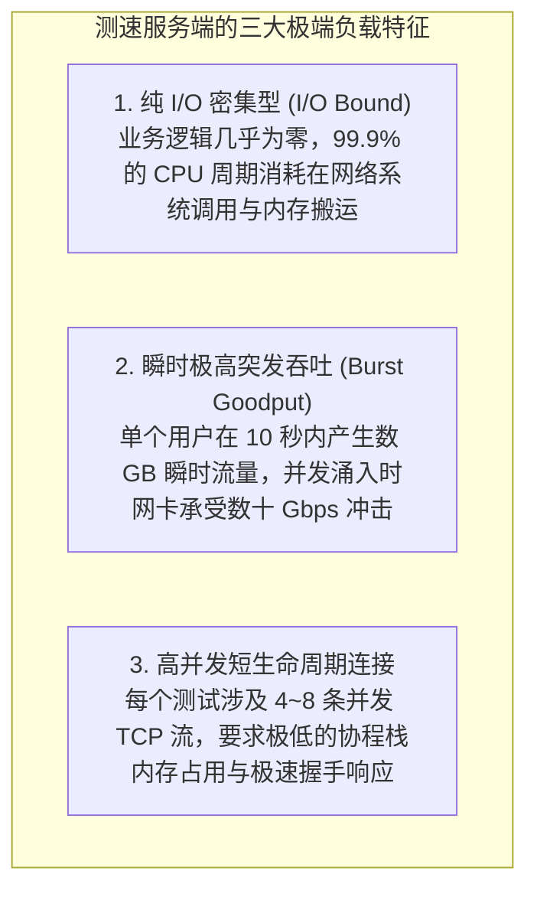
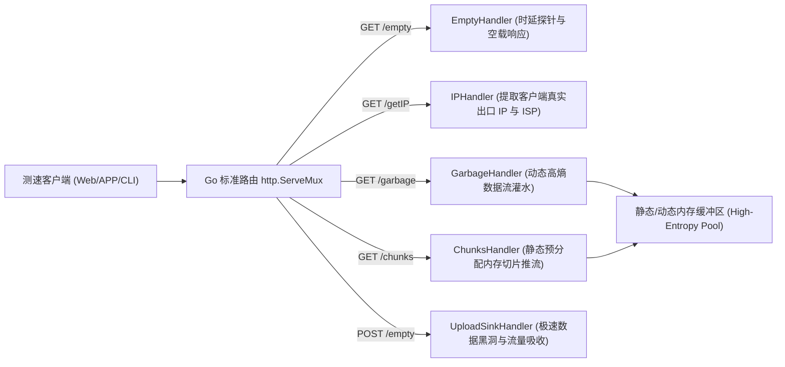
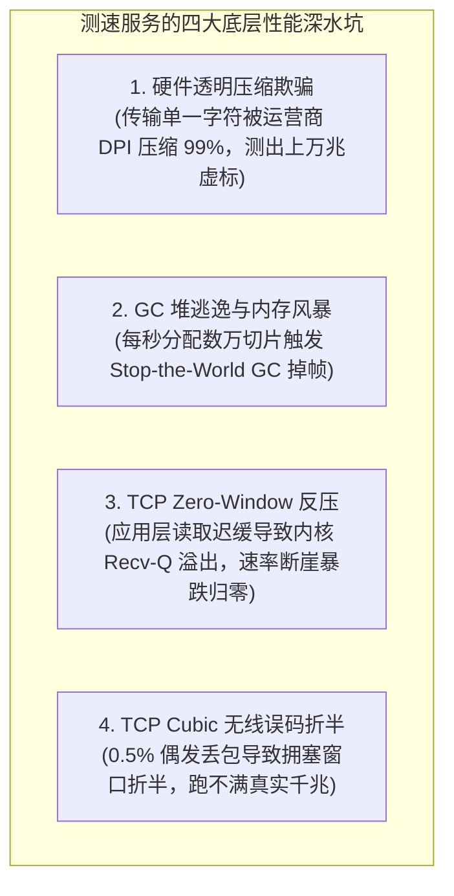
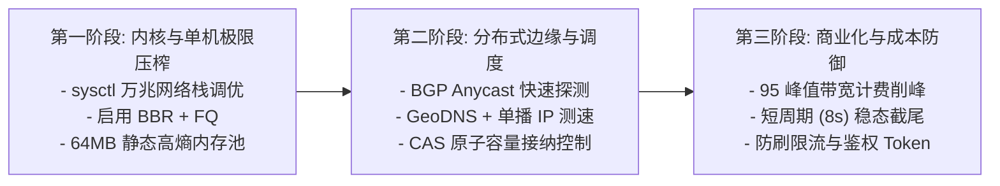
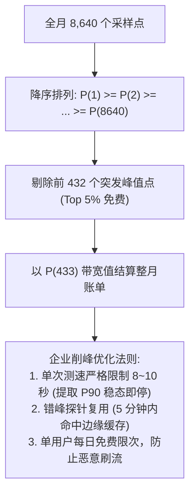

**TL;DR：** 测速服务看似只是简单的“上传与下载字节并计算耗时”，但在现代千兆宽带、5G NR 与万兆数据中心场景下，其底层是对 **操作系统内核网络栈、CPU 内存总线、传输层拥塞控制（BBR）、垃圾回收调度以及分布式边缘路由** 的极限考验。作为开源领域最知名的 Go 语言测速服务端实现，`librespeed/speedtest-go` 以其极简的架构和高并发能力被广泛采用。然而，直接将开源实现投入企业级生产环境时，常会遭遇 **硬件透明压缩欺骗、GC 停顿引发断崖、TCP Zero-Window 反压以及海量带宽账单挤兑** 等致命陷阱。本文作为全景技术白皮书，从第一性原理出发，深度剖析 LibreSpeed Go 核心源码与报文协议契约，拆解四大性能深水区，对比业界主流测速流派，并给出单机 40Gbps+ 自研万兆测速系统落地路线图与成本模型。

---

## 一、 为什么选 Go：测速服务的物理模型与 Go 运行时契合点

在选择测速服务开发语言时，必须首先解构测速业务的物理负载特征：



### Go 运行时的天然优势

1. **`netpoller` 与非阻塞 I/O**：Go 运行时在 Linux 平台深度封装了 `epoll`。当万千连接并发读写时，Goroutine 会被非阻塞挂起，底层线程由运行时调度器复用，避免了传统 C 线程池在数万并发下的上下文切换风暴；
2. **极小的 Goroutine 内存开销**：每个 Goroutine 的初始栈仅为 **2KB**（相比 C/Java 线程的 1MB~8MB），一台 32GB 内存的服务器可轻松支撑 50,000+ 并发推流协程；
3. **零外部重框架依赖**：基于标准库 `net/http` 即可达到数十 Gbps 吞吐，无引入额外框架带来的内存逃逸与反射损耗。

---

## 二、 LibreSpeed Go 核心源码架构解构

LibreSpeed Go（`speedtest-go`）的代码设计极其精炼，核心数据流围绕三个基础端点构建：



### 1. 初始化拓扑与预分配机制

在服务启动阶段，LibreSpeed Go 会在内存中预先生成可复用的随机数据切片，避免在运行时推流时频繁分配内存：

```go
// 源码逻辑精炼示意：预分配不可压缩数据块
var (
	chunkSizes = []int{1048576, 10485760, 25165824} // 1MB, 10MB, 24MB
	staticPool = make(map[int][]byte)
)

func init() {
	for _, size := range chunkSizes {
		buf := make([]byte, size)
		// 使用安全伪随机数填充，确保香农信息熵达到最大
		rand.Read(buf)
		staticPool[size] = buf
	}
}
```

---

## 三、 报文级协议契约与数据流水线剖析

LibreSpeed Go 定义了一套经典的 HTTP/1.1 RESTful 测速交互契约：

```
+----------------------------------------------------------------------------------------------------+
|                                  测速全流程标准交互时序与报文流                                       |
+----------------------------------------------------------------------------------------------------+
| 1. IP 发现阶段   : GET  /getIP         --> 响应: {"processedString": "222.128.1.1 - China Unicom"} |
| 2. 空闲时延探针 : GET  /empty         --> 响应: 200 OK (Content-Length: 0, Cache-Control: no-store)|
| 3. 下行推流灌水 : GET  /garbage?ckSize=100 (或 /chunks) --> 持续吐出不可压缩二进制流 (Chunked)      |
| 4. 上行吸收黑洞 : POST /empty (Body 携带上百兆二进制)   --> 极速吸收并返回 200 OK                   |
+----------------------------------------------------------------------------------------------------+
```

### 1. 空载探针与 IP 获取契约（`/empty` 与 `/getIP`）
- **缓存阻断策略**：必须严格下发 `Cache-Control: no-cache, no-store, no-transform, must-revalidate`，彻底杜绝 CDN 或浏览器本地缓存对时延测量的污染；
- **真实 IP 穿透策略**：按优先级依次提取标头：`CF-Connecting-IP` $\to$ `X-Real-IP` $\to$ `X-Forwarded-For` $\to$ `RemoteAddr`，确保在边缘代理层后方仍能获取真实的客户端接入运营商。

### 2. 下行数据流水线（`/garbage` & `/chunks`）
- **流式分块传输**：使用 HTTP/1.1 `Transfer-Encoding: chunked`；
- **自适应块大小**：客户端根据当前网络爬升阶段请求不同规格的 Chunk（从 1MB 逐步阶梯提升至 25MB），防止在弱网下因单次请求过大导致首包超时，同时保证在千兆网络下有足够的单次载荷填满 TCP 发送窗口。

### 3. 上行数据吸收黑洞（`/empty` POST）
- **服务端处理机制**：服务端接收到 POST 请求后，在极速循环中将 `r.Body` 读出并丢弃，仅累加接收字节数，随后立即回发 200 OK，杜绝任何磁盘 I/O 或数据库持久化阻塞。

---

## 四、 性能深水区：四大系统级瓶颈与破局之道

将开源 LibreSpeed Go 部署到高吞吐生产环境时，必须正面攻克以下四大底层性能深水坑：



### 1. 高熵内存池阻断硬件透明压缩
- **物理机理**：中间网络设备常内嵌硬件压缩（LZ4/Deflate）。若发送数据重复度高，实际线路上流经的物理报文仅为有效载荷的 1%，导致测出虚高的数万兆速率；
- **数学防线**：构建 **香农信息熵 $H(X) \ge 7.999$** 的静态 64MB 内存池：
  $$H(X) = -\sum_{i=0}^{255} P(x_i) \log_2 P(x_i) \approx 8.0 \quad (\text{bits/byte})$$
  测速推流时仅做内存指针偏移（Ring Buffer Slice），实现 **0% 运行时 CPU 随机数生成开销 + 100% 压缩阻断**。

### 2. 栈内存切片复用与零堆分配（Zero GC）
在处理高并发上行测速时，严禁在读取循环中使用 `io.ReadAll(r.Body)`（会导致数据全量堆积在内存中引发 OOM）：

```go
// 工业级极速黑洞 Sink 实现
func FastBlackholeSinkHandler(w http.ResponseWriter, r *http.Request) {
    // 在调用栈上分配 64KB 临时缓冲（直接驻留 CPU L1/L2 缓存，0 次堆分配）
    var stackBuf [64 * 1024]byte
    var totalBytes uint64

    for {
        n, err := r.Body.Read(stackBuf[:])
        if n > 0 {
            // 使用 CPU 原生原子指令累加实收字节
            totalBytes += uint64(n)
        }
        if err != nil {
            break
        }
    }
    r.Body.Close()
    
    w.Header().Set("Content-Length", "0")
    w.WriteHeader(http.StatusOK)
}
```

### 3. 规避 TCP Zero-Window 反压
当客户端推流速度大于服务端读取速度时，内核 `Recv-Q` 溢出会向客户端发送 `TCP ZeroWindow` 通告，强制刹停客户端发送。上述无锁栈读取模式单核消费吞吐达 **40Gbps+**，从根本上杜绝了服务端反压。

### 4. 拥塞控制全面升级为 TCP BBR
传统 TCP Cubic 视丢包为拥塞，在移动 Wi-Fi 或 5G 环境下因 0.5% 偶发误码丢包会导致窗口腰斩；在 Linux 节点全面开启 **TCP BBR** 算法，基于最大交付速率（$BtlBw$）与最小传播时延（$RTprop$）建模，实现 1~2 个 RTT 极速注满物理长肥管道（BDP）。

---

## 五、 业界九大测速流派与选型对比矩阵

```mermaid
mindmap
  root((国内外测速九大流派))
    中国本土标准体系
      1. 中国信通院 (全球网测/泰尔网测) - 覆盖 5G/道路/QoE, 1000+ 专属节点
      2. 运营商接入标准 (YD/T 2400-2022) - BRAS 汇聚层下沉, N>=8 稳态窗口
      3. 智能路由分段 (华为/移动爱家) - LAN Wi-Fi 测速 vs WAN 出口测速
      4. 第三方商用平台 (测速网 SpeedTest.cn) - 多线 BGP, 商业 SDK 封装
    国际主流流派
      5. 专有守护进程模式 (Ookla Speedtest) - OoklaServer 8080 自定义信令
      6. Anycast CDN 边缘无状态 (Cloudflare Speed) - 阶梯 HTTP/2/3 静态文件
      7. 内核状态导出模式 (M-Lab NDT7) - WSS 长连接 + Linux tcp_info 导出
      8. 内容网络真实嵌入 (Netflix Fast.com) - OCA 视频切片 Range 测速
      9. 轻量开源 Web 模式 (LibreSpeed Go) - 纯 HTTP Chunked 流与极简黑洞
```

### 综合架构对比矩阵

| 维度 | LibreSpeed Go | Ookla Speedtest | M-Lab NDT7 | Cloudflare Speed | 工信部 YD/T 2400 |
| --- | --- | --- | --- | --- | --- |
| **传输协议** | HTTP/1.1 (Chunked) | 原生 TCP 二进制信令 (8080) | WebSocket (WSS) | HTTP/2 & HTTP/3 | 多并发 TCP (N $\ge$ 8) |
| **下行机制** | 动态切片 /chunks | 持续二进制字节倾泻 | 单连接长推流 | 阶梯文件 GET (100KB~25MB) | 持续推流 (稳态 5~15s) |
| **上行机制** | HTTP POST /empty | 持续二进制字节倾泻 | 客户端 WSS 推流 | HTTP POST 阶梯上传 | 持续 POST (稳态 5~15s) |
| **度量深度** | Goodput + Ping | Goodput + Jitter + Loaded | Goodput + Linux `tcp_info` | Goodput + TTFT + 丢包 | 签约速率达标核验 |
| **部署成本** | **极低**（单二进制运行） | 商业授权 / 专有节点 | 开源部署 / 偏学术研究 | 依赖全球 Anycast CDN | 运营商机房专网部署 |
| **定制自研友好度** | **最高（代码干净清晰）** | 闭源黑盒 | 较高中等 | 平台绑定 | 规范标准 |

---

## 六、 企业级自研演进路线图与成本模型

将 LibreSpeed Go 演进为支撑上千万用户、万兆网卡满载的企业级测速系统，需分三步走：



### 1. 生产环境 Linux 6.x+ 内核 `sysctl.conf` 极限调优清单

```ini
# /etc/sysctl.conf - 企业级万兆测速节点专用配置

# 1. 拥塞控制：强制启用 BBR 与 FQ 队列管理
net.core.default_qdisc = fq
net.ipv4.tcp_congestion_control = bbr

# 2. 套接字缓冲区放大至 32MB (满足 40Gbps * 60ms RTT 的长肥管道需求)
net.ipv4.tcp_wmem = 8192 1048576 33554432
net.ipv4.tcp_rmem = 8192 1048576 33554432
net.core.wmem_max = 33554432
net.core.rmem_max = 33554432

# 3. 连接积压队列深度与端口复用
net.core.netdev_max_backlog = 250000
net.core.somaxconn = 65535
net.ipv4.tcp_max_syn_backlog = 65535
net.ipv4.tcp_tw_reuse = 1
net.ipv4.ip_local_port_range = 1024 65535
```

### 2. 运营商月 95 峰值计费（95th Percentile Billing）削峰数学模型

测速业务是天量的带宽消耗源。在 IDC 机房与 CDN 采购中，95 峰值计费是主流结算方式：
- 一个月（30天）共产生 $30 \times 24 \times 12 = 8,640$ 个 5 分钟带宽采样点；
- 将 8,640 个采样点按带宽降序排列，**剔除前 5% 最高采样点（即前 432 个尖峰免费）**，以第 433 个点的带宽值作为结算依据。



---

## 七、 总结与自研决策建议

| 业务诉求 | 推荐架构路线 | 核心关注指标 |
|---|---|---|
| **内部网络体检 / 运维诊断** | 基于 **LibreSpeed Go 二次开发**，嵌入公司 SSO 鉴权与 Prometheus 监控 | 真实丢包、RTT 抖动、局域网 Wi-Fi 质量 |
| **公网用户宽带接入达标核验** | 遵循 **YD/T 2400 标准**，采用 8+ 并发 TCP 流，部署于城域网 BRAS 汇聚层 | 签约带宽达标率、5~15s 稳态速率 |
| **面向海量 C 端 App 测速** | **自研控制面（Anycast 调度 + Token 签发）+ CDN/边缘自建数据面（BBR + 零拷贝）** | 95 峰值带宽成本、移动端 0 GC 稳定性、秒级就近选路 |

通过深入理解传输层第一性原理并克服硬件压缩、GC 停顿与协议反压三大深水坑，我们可以以极低的服务器与带宽成本，构建出媲美商业巨头的超高性能自研测速基础设施。

---

## 参考文献

- `librespeed/speedtest-go` 官方开源仓库 (github.com/librespeed/speedtest-go)
- 工信部 YD/T 2400-2022《宽带速率测试方法 固定宽带接入》
- IETF RFC 6349: *Framework for TCP Throughput Testing*
- IETF RFC 3550: *RTP: A Transport Protocol for Real-Time Applications*
- Google BBR: *Congestion-Based Congestion Control*, ACM Queue (2016)
