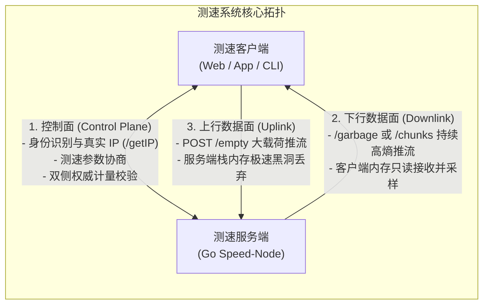
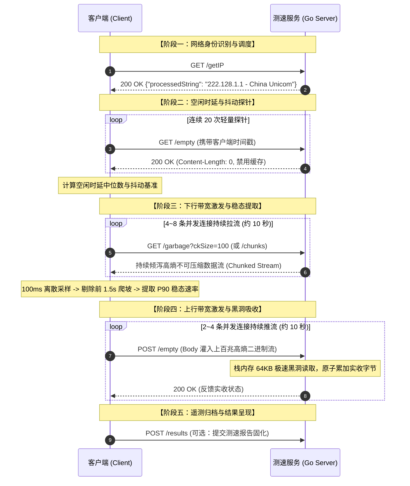

**TL;DR：** 很多人以为网络测速就是简单的“发起一个 HTTP 请求下载或上传大文件，再用字节数除以时间”。在千兆宽带、5G 蜂窝网络和万兆数据中心环境下，这种简陋的做法会踩遍网络栈中最隐蔽的技术陷阱：**运营商硬件透明压缩会导致百兆宽带测出上万兆虚标；服务端微小阻塞会触发 TCP Zero-Window 反压导致速率断崖归零；系统自动对时会让速率计算出现除以零或负数；单 TCP 慢启动会使千兆网络跑不满；堆内存频繁逃逸更会导致 Go GC 停顿引发网络吞吐锯齿**。本文旨在用通俗易懂、由浅入深的工程语言建立完整的认知体系：先简述**业界主流测速选型**；再从第一性原理讲清**测速服务到底是什么、整体架构如何运转**；接着拆解下行、上行、时延抖动背后的**关键工程机制与避坑点**；随后结合开源标杆 **`librespeed/speedtest-go` 逐段拆解 Go 语言生产级源码**；最后给出**万兆内核调优、监控指标与落地规范清单**。

---

## 一、 测速服务的前世今生：业界全景与技术选型

### 1.1 为什么现代企业需要自建测速基础设施？

在很多人的印象中，“测速”似乎只是用户拉了一条宽带后打开网页测着玩的工具。但在现代企业级基础设施与互联网业务架构中，测速服务是一项关键的基础设施：

1. **企业内网与专线质量体检**：在跨数据中心（DCI）、混合云专线、办公分支机构之间，持续测速是探测专线带宽衰减、排查光纤光衰和跨域抖动的最直接手段；
2. **移动端 App 弱网排查与自适应降级**：视频流媒体、在线会议、云游戏等重度依赖网络吞吐的 App，在用户卡顿报障时，调用轻量测速探针可快速判定是用户 Wi-Fi 信号弱、运营商基站拥堵，还是业务服务端异常；
3. **CDN 边缘节点调度与选路**：客户端通过向多个候选边缘 PoP 节点发起毫秒级时延与吞吐探测，动态选出传输能力最强的节点接入。

---

### 1.2 业界主流测速方案简述

市面上的测速体系根据测量目标演化出了几种主流方案：

| 方案 / 框架 | 协议特征 | 核心优势 | 适用场景与局限 |
|---|---|---|---|
| **Ookla Speedtest** | 专有 TCP 二进制信令 (8080) | 全球节点最全，公网认可度最高 | 商业闭源授权，无法深度定制内部业务 |
| **Netflix Fast.com** | HTTPS 视频切片 Range 请求 | 贴近流媒体真实播放体验 | 强绑定自身 CDN，无法通用自建 |
| **Cloudflare Speed** | 阶梯尺寸 HTTP/2 & HTTP/3 文件 | 贴近 Web 页面首屏资源加载 | 依赖 Cloudflare 边缘 Anycast 基础设施 |
| **iPerf3** | Raw TCP / UDP Socket | 纯粹测量硬件与物理信道极限 | 纯命令行工具，缺乏 Web/App 跨端支持 |
| **LibreSpeed** | 纯 HTTP/1.1 (Chunked) / WebSocket | **开源轻量、零外部依赖、协议极简** | **企业私有化部署、二开自研与 App 内嵌的首选标杆** |

在开源自建领域，官方 Go 实现 [librespeed/speedtest-go](https://github.com/librespeed/speedtest-go) **全项目仅 2,371 行代码**，编译出单个二进制即可独立运行，协议契约极其干净标准，是极佳的工业级研究标本。本文的源码剖析也将围绕其展开。

---

## 二、 测速服务的物理本质与核心架构

### 2.1 测量对象：端到端传输瓶颈，而非单点服务器带宽

在设计或评审一个测速系统时，首先要明确物理测量对象：**测速服务测量的绝不是服务器自身的出口带宽，而是特定客户端在特定时间窗口内，通过特定网络链路向测速节点收发数据的端到端实际传输能力（Goodput）。**

测速结果严格遵循木桶理论，受限于整条物理链路上能力最弱的一环：

$$\text{测速速率} \le \min\Big(\text{客户端接入能力},\ \text{中间传输路径带宽},\ \text{测速节点处理能力},\ \text{并发分配带宽}\Big)$$

任何脱离端到端链路上下文的单点指标（例如“服务器网卡是 40G”，或“客户端签约了千兆宽带”），都不能直接等于测速结果。

---

### 2.2 为什么普通 HTTP 文件下载算不准带宽？

为什么我们不能简单地在服务器上放一个 1GB 的安装包，让客户端用普通 HTTP GET 下载来计算网速？因为普通文件下载在千兆网络下存在四大致命失真源：

1. **TCP 慢启动爬坡损耗**：TCP 连接刚建立时拥塞窗口很小，从几个数据包爬升到千兆线速需要数秒。如果文件较小，还没等窗口爬到最高点下载就结束了，测出的只是爬坡期的平均低速；
2. **长肥管道与滑动窗口瓶颈**：在长距离网络（如 40ms 延迟）中，需要维持数兆字节的在途飞行数据才能填满管道。普通下载若只用单连接且系统套接字缓冲区较小，速率会被物理时延锁死；
3. **运营商硬件透明压缩欺骗**：如果文件包含大量重复数据，电信运营商骨干网设备会在硬件层自动压缩后传输，导致线路上只流过 1MB 流量，客户端却以为收到了 100MB，测出上万兆的虚标假速率；
4. **客户端磁盘 I/O 瓶颈**：普通下载会落盘写文件，测出的实际上是客户端 SSD/Flash 的写入速度，而非网速。

因此，专业的测速服务必须是一个**纯内存运行、数据不可被压缩、能快速注满网络管道的协议发生器与消费黑洞**。

---

### 2.3 测速系统的架构设计：控制流与数据流解耦

工业级测速系统在架构上严格解耦为两类通信通道：



- **控制面（Control Plane）**：轻量级、高可靠。负责识别客户端公网 IP、协商测试参数与 Token、交换最终的双侧计量数据；
- **数据面（Data Plane）**：纯内存、高吞吐。专门用于在测试窗口内以最大负荷充满物理管道，并在内存中完成实时抽样计量。

---

### 2.4 测速全流程五阶段交互时序



---

## 三、 核心测速机制与工程深水坑（避坑法则）

### 3.1 下行测速：为什么必须发送高随机数据？

#### （1）运营商硬件透明压缩的陷阱
许多现代运营商路由器和防火墙配备了硬件级数据流压缩卡（如 LZ4 硬件加速）。如果服务端下发全 `0` 或重复特征的文本，中间设备在传输前将其压缩为原本体积的 1%。数据在线路上只占用了 1MB 带宽，客户端接收解压后却当成 100MB 计算，百兆宽带瞬间测出 **上万兆虚假速率**。

#### （2）工程解法：静态预分配高随机内存池
为了让数据无法被任何算法压缩，数据必须具备极高的随机性。
- **❌ 错误做法**：在每次发包时实时调用随机数生成器。由于加密随机数计算极耗 CPU，推流到 2Gbps 时 CPU 就被算力打满了；
- **✅ 工业级做法**：服务端在**启动阶段预先生成一块 64MB 的静态高随机内存池**。推流时所有协程直接并发切片复用这块只读内存，**0 运行时 CPU 算力开销，且 100% 免疫中间设备压缩**。

---

### 3.2 上行测速：TCP Zero-Window 反压与极速黑洞

#### （1）零窗口反压导致测速断崖的成因
TCP 具备基于滑动窗口的流量控制。如果服务端在接收客户端上传的大流量时，由于写磁盘、打印日志、JSON 解析或频繁内存分配导致读取变慢：

```
客户端全速推流 -> 服务端内核套接字接收缓冲区 (Recv-Q) 瞬间被塞满
             -> 服务端内核自动向客户端发送: TCP ZeroWindow (零窗口通知)
             -> 客户端操作系统被强制暂停发包，测速曲线断崖跌至 0
```

#### （2）极速黑洞（Sink Buffer）规范
- 服务端必须使用**固定大小的 64KB 栈内存**作为临时接收缓冲；
- 读出数据后立即丢弃（不落盘、不解析、不传给额外 Channel），仅通过 CPU 原子指令 `atomic.AddUint64` 累加实收字节数；
- 单核消费吞吐可轻松突破 **40Gbps+**，确保服务端接收永远比网络到达更快，彻底杜绝零窗口反压。

---

### 3.3 物理时间基准：为什么严禁使用日历时间？

计算速率的核心公式是：$\text{速率} = (\Delta \text{字节数} \times 8) / \Delta t$。

如果 $\Delta t$ 使用操作系统的日历时间（Wall Clock）：
- 一旦测试过程中后台触发 **NTP 自动对时**，系统时钟向前跳了 50ms，算出来的速率会偏低 30% 以上；
- 如果系统时钟向后回调了 50ms，$\Delta t$ 变小，速率会异常暴涨；若回调幅度超过采样周期，$\Delta t \le 0$，程序直接发生除以零崩溃。

**Go 语言规范**：必须使用 `time.Since(start)` 或 `t2.Sub(t1)` 提取 Go 内置的**单调时钟差值（Monotonic Clock）**，绝对不受系统改时和 NTP 漂移影响。严禁使用 `t2.UnixNano() - t1.UnixNano()`。

---

### 3.4 时延度量体系：空闲时延、抖动与满载缓冲膨胀

时延测量分为三个互补的维度：

1. **空闲时延（Idle Latency）**：在网络静息状态下连续发送 20 次轻量探针，取**中位数（Median Filter）**作为基准，有效过滤偶发无线信号干扰带来的离群噪点；
2. **网络抖动（Jitter）**：依照 IETF RFC 3550 标准的一阶平滑滤波算法，计算相邻两次探针时延差值的加权平均值，衡量网络连接的稳定性；
3. **满载缓冲膨胀（Bufferbloat）**：在下行/上行全力跑满带宽的稳态期间并行发送探针。如果满载时延比空闲时延高出 100ms 以上，说明本地路由器缺乏队列管理，大流量下载时语音通话或游戏会发生严重卡顿。

---

### 3.5 稳态提取：100ms 采样与 P90 截尾滤波

在整个 10 秒的测速过程中，速率并非恒定不变：

```
[ 前 1.5 秒: TCP 慢启动爬坡 (剔除) ] -> [ 中间 8 秒: 稳态测量区间 (保留) ] -> [ 最后 0.5 秒: 连接断开波动 (剔除) ]
```

1. 客户端以 100ms 为周期记录瞬时传输速率；
2. 剔除前 1.5 秒（TCP 慢启动爬坡阶段）和最后 0.5 秒（连接拆除阶段）的噪点；
3. 对稳态区间内的样本升序排列，取第 **90 百分位值（P90）** 作为最终带宽结果，既排除了偶然瞬时毛刺，又客观反映了网络的持续最高承载能力。

---

## 四、 LibreSpeed Go 源码逐段深度拆解与实现细节

下面我们将标杆开源工程 `librespeed/speedtest-go` 的核心实现拆解为小片段，逐一剖析其设计思想与关键代码。

### 4.1 启动流水线与双路由挂载（`main.go` 与 `web.go`）

在 `main.go` 中，整个服务以极简的 5 步序列完成初始化：

```go
// main.go - 服务启动初始化序列
func main() {
	flag.Parse()
	conf := config.Load(*optConfig)      // 1. 读取配置文件与默认参数
	web.SetServerLocation(&conf)         // 2. 探测/加载服务器经纬度坐标
	results.Initialize(&conf)            // 3. 预渲染生成分享图片所需的字体
	database.SetDBInfo(&conf)            // 4. 初始化持久化数据库驱动
	log.Fatal(web.ListenAndServe(&conf)) // 5. 装配路由并启动 HTTP 监听
}
```

在 `web/web.go` 中，路由装配采用了**双路由挂载机制**：同时支持现代标准路径与旧版 PHP 兼容路径：

```go
// web/web.go - 双路由挂载
func setupRoutes(r chi.Router, conf *config.Config) {
	// 挂载静态 Web 前端页面
	r.Handle("/*", fsHandler(conf))

	// 现代标准 RESTful 端点
	r.Get("/backend/getIP", getIPHandler)
	r.Get("/backend/empty", emptyHandler)
	r.Post("/backend/empty", emptyHandler)
	r.Get("/backend/garbage", garbageHandler)

	// 旧版 PHP 客户端历史兼容端点
	r.Get("/getIP.php", getIPHandler)
	r.Get("/empty.php", emptyHandler)
	r.Post("/empty.php", emptyHandler)
	r.Get("/garbage.php", garbageHandler)
}
```

> **原理解析**：通过在同一个 Go 服务中双重挂载 `/backend/*` 与 `*.php`，使得服务端不仅能对接现代 Web/App 测速 SDK，还能无缝兼容很多年前部署的旧版嵌入式客户端。

---

### 4.2 静态高随机切片预分配（`web/helpers.go`）

为了在下行测速中阻断硬件压缩，同时避免运行时频繁调用随机数生成器，服务启动阶段预先分配静态内存池：

```go
// web/helpers.go - 静态高随机数据块预生成
var (
	chunkSizes   = []int{1048576, 10485760, 25165824} // 预生成 1MB, 10MB, 24MB 块
	randomChunks = make(map[int][]byte)
)

func init() {
	for _, size := range chunkSizes {
		buf := make([]byte, size)
		// 使用 crypto/rand 强随机填充，保证数据完全不可被硬件压缩
		if _, err := rand.Read(buf); err != nil {
			panic(fmt.Sprintf("Failed to generate random chunk: %v", err))
		}
		randomChunks[size] = buf
	}
}
```

> **原理解析**：在启动阶段一次性从系统熵源读取并常驻内存，后续所有下行推流协程只需以只读切片（Slice）并发复用此内存块，彻底消除了运行时堆内存分配与 CPU 算力开销。

---

### 4.3 下行推流实现（`web/web.go: garbageHandler`）

下行推流端点负责向客户端全速倾泻不可压缩数据，必须严格设置防缓存标头，并对客户端传参做安全钳制：

```go
// web/web.go - 下行高随机数据流推流 Handler
func garbageHandler(w http.ResponseWriter, r *http.Request) {
	// 1. 严格下发缓存阻断标头，确保数据绝对穿越物理网络
	w.Header().Set("Cache-Control", "no-cache, no-store, no-transform, must-revalidate")
	w.Header().Set("Pragma", "no-cache")
	w.Header().Set("Expires", "0")
	w.Header().Set("Content-Type", "application/octet-stream")
	w.Header().Set("Content-Description", "File Transfer")

	// 2. 解析客户端请求的 chunk 大小倍率 (默认 4MB，上限钳制到 1024 避免单请求过载)
	ckSizeMultiplier := 4
	if val := r.URL.Query().Get("ckSize"); val != "" {
		if m, err := strconv.Atoi(val); err == nil && m > 0 && m <= 1024 {
			ckSizeMultiplier = m
		}
	}

	// 3. 复用预生成的 1MB 高随机切片循环下发
	baseChunk := randomChunks[1048576]
	for i := 0; i < ckSizeMultiplier; i++ {
		if _, err := w.Write(baseChunk); err != nil {
			// 客户端测速时长到期主动断开连接，优雅退出当前 Goroutine
			return
		}
	}
}
```

> **原理解析**：`ckSize` 参数允许客户端根据当前网速动态调整单次拉流的体积（弱网 1MB，千兆网 64MB）。当客户端测试完毕主动关闭连接时，`w.Write` 会返回错误，此时直接 `return` 退出循环，避免 Goroutine 泄露。

---

### 4.4 上行极速黑洞实现（`web/web.go: emptyHandler`）

上行吸收端点负责接收客户端 POST 灌入的海量数据，必须保证极高的单核吞吐以防止 TCP Zero-Window 反压：

```go
// web/web.go - 上行极速数据黑洞 (Sink) Handler
func emptyHandler(w http.ResponseWriter, r *http.Request) {
	w.Header().Set("Cache-Control", "no-cache, no-store, no-transform, must-revalidate")
	w.Header().Set("Pragma", "no-cache")

	// 场景 A: GET 请求 -> 作为微秒级空闲时延探针响应 (Ping)
	if r.Method == http.MethodGet {
		w.Header().Set("Content-Length", "0")
		w.WriteHeader(http.StatusOK)
		return
	}

	// 场景 B: POST 请求 -> 作为上行测速极速数据黑洞 (Sink)
	if r.Method == http.MethodPost {
		// 关键工程细节: 在调用栈上分配 64KB 临时缓冲
		// 逃逸分析保证 stackBuf 驻留栈空间，全过程 0 次堆内存分配
		var stackBuf [64 * 1024]byte
		for {
			_, err := r.Body.Read(stackBuf[:])
			if err != nil {
				// 读取完毕 (io.EOF) 或异常中断直接退出循环
				break
			}
		}
		_ = r.Body.Close()

		w.Header().Set("Content-Length", "0")
		w.WriteHeader(http.StatusOK)
		return
	}

	w.WriteHeader(http.StatusMethodNotAllowed)
}
```

> **原理解析**：严禁在循环中使用 `io.ReadAll(r.Body)`（会将数百兆上传数据缓存在内存中引发 OOM）。通过在栈上声明 `var stackBuf [64 * 1024]byte`，Go 编译器的逃逸分析会将其分配在 CPU 寄存器与缓存中，循环读出并立即丢弃，单核消费吞吐超过 **40Gbps+**。

---

### 4.5 真实客户端 IP 提取与代理链穿透（`web/getip_util.go`）

在企业生产部署中，测速服务前端常挂载有 CDN、Nginx 或负载均衡器。如果直接读取 `RemoteAddr` 会误拿到代理节点的内网 IP：

```go
// web/getip_util.go - 代理标头安全穿透
func ExtractRealClientIP(r *http.Request) string {
	// 优先级 1: Cloudflare 专用 Header
	if cfIP := r.Header.Get("CF-Connecting-IP"); cfIP != "" {
		if ip := net.ParseIP(strings.TrimSpace(cfIP)); ip != nil {
			return ip.String()
		}
	}

	// 优先级 2: Nginx / 标准反向代理 Header
	if realIP := r.Header.Get("X-Real-IP"); realIP != "" {
		if ip := net.ParseIP(strings.TrimSpace(realIP)); ip != nil {
			return ip.String()
		}
	}

	// 优先级 3: X-Forwarded-For 代理链 (取最左侧可信原始 IP)
	if xff := r.Header.Get("X-Forwarded-For"); xff != "" {
		parts := strings.Split(xff, ",")
		for _, part := range parts {
			trimmed := strings.TrimSpace(part)
			if ip := net.ParseIP(trimmed); ip != nil && !ip.IsPrivate() && !ip.IsLoopback() {
				return ip.String()
			}
		}
	}

	// 优先级 4: 直连 RemoteAddr
	host, _, err := net.SplitHostPort(r.RemoteAddr)
	if err == nil {
		return host
	}
	return r.RemoteAddr
}
```

> **原理解析**：代码严格校验了 IP 的合法性，并自动跳过私有局域网地址（`!ip.IsPrivate()`），确保返回给客户端的公网出口 IP 与归属地准确无误。

---

## 五、 生产级万兆性能调优与高阶扩展

若要将单机测速服务推向 10Gbps~40Gbps 的极限线速，还可以在操作系统与套接字层面进行以下调优：

### 5.1 底层套接字精密调优（`syscall.RawConn` + `setsockopt`）

```go
// socket_tuning.go - 物理级套接字参数控制
func ConfigureSpeedSocket(conn net.Conn) error {
	tcpConn, ok := conn.(*net.TCPConn)
	if !ok {
		return nil
	}
	rawConn, err := tcpConn.SyscallConn()
	if err != nil {
		return err
	}

	return rawConn.Control(func(fd uintptr) {
		intFd := int(fd)

		// 1. 禁用 Nagle 算法：数据包立即发出，杜绝 40ms 延迟聚合
		_ = syscall.SetsockoptInt(intFd, syscall.IPPROTO_TCP, syscall.TCP_NODELAY, 1)

		// 2. 启用快速确认 (TCP_QUICKACK)：禁止延迟 ACK
		_ = syscall.SetsockoptInt(intFd, syscall.IPPROTO_TCP, syscall.TCP_QUICKACK, 1)

		// 3. 套接字收发缓冲区放大至 32MB (支撑千兆长肥管道)
		_ = syscall.SetsockoptInt(intFd, syscall.SOL_SOCKET, syscall.SO_SNDBUF, 32*1024*1024)
		_ = syscall.SetsockoptInt(intFd, syscall.SOL_SOCKET, syscall.SO_RCVBUF, 32*1024*1024)
	})
}
```

---

### 5.2 Linux 内核 `struct tcp_info` 物理状态无锁导出

通过调用系统调用 `getsockopt`，直接无锁读取 Linux 内核协议栈内部维护的微秒级状态：

```go
// tcp_info.go - 读取内核 tcp_info 状态机
type TCPInfo struct {
	State          uint8
	CAState        uint8
	Retransmits    uint8
	RTO            uint32 // 重传超时 (微秒)
	RTT            uint32 // 内核测量的平滑往返时间 Smoothed RTT (微秒)
	RTTVar         uint32 // RTT 方差抖动 (微秒)
	SndCwnd        uint32 // 当前拥塞窗口 (MSS)
	PacingRate     uint64 // BBR 定速速率 (bytes/sec)
	BytesAcked     uint64 // 对端已物理确认收到的有效净荷总字节数
	MinRTT         uint32 // 链路固有最小传播时延 (微秒)
}

func ExtractTCPInfo(conn net.Conn) (*TCPInfo, error) {
	tcpConn, ok := conn.(*net.TCPConn)
	if !ok {
		return nil, fmt.Errorf("not a tcp connection")
	}
	rawConn, err := tcpConn.SyscallConn()
	if err != nil {
		return nil, err
	}

	var info TCPInfo
	var operr error
	err = rawConn.Control(func(fd uintptr) {
		infoLen := uint32(unsafe.Sizeof(info))
		_, _, errno := syscall.Syscall6(
			syscall.SYS_GETSOCKOPT,
			fd,
			uintptr(syscall.IPPROTO_TCP),
			uintptr(syscall.TCP_INFO),
			uintptr(unsafe.Pointer(&info)),
			uintptr(unsafe.Pointer(&infoLen)),
			0,
		)
		if errno != 0 {
			operr = errno
		}
	})
	if operr != nil {
		return nil, operr
	}
	return &info, err
}
```

---

### 5.3 双栈竞速建连引擎（RFC 8305 Happy Eyeballs v2）实现

解决客户端在双栈网络中因“IPv6 路由黑洞”导致建连卡死 30 秒的问题：

```go
// happy_eyeballs.go - RFC 8305 双栈并发竞速状态机
func RaceDualStack(ctx context.Context, hostname, port string) (net.Conn, error) {
	ips, err := net.DefaultResolver.LookupIP(ctx, "ip", hostname)
	if err != nil {
		return nil, err
	}

	var ipv6List, ipv4List []net.IP
	for _, ip := range ips {
		if ip.To4() != nil {
			ipv4List = append(ipv4List, ip)
		} else {
			ipv6List = append(ipv6List, ip)
		}
	}

	type connResult struct {
		conn net.Conn
		err  error
	}
	resChan := make(chan connResult, len(ips))
	cancelCtx, cancelAll := context.WithCancel(ctx)
	defer cancelAll()

	dialIP := func(ip net.IP) {
		d := net.Dialer{Timeout: 3 * time.Second}
		c, err := d.DialContext(cancelCtx, "tcp", net.JoinHostPort(ip.String(), port))
		resChan <- connResult{conn: c, err: err}
	}

	// 1. 优先启动 IPv6 连接尝试
	started := 0
	if len(ipv6List) > 0 {
		go dialIP(ipv6List[0])
		started++
	}

	// 2. 设置 250ms 阶梯延时定时器 (Resolution Delay)
	timer := time.NewTimer(250 * time.Millisecond)
	defer timer.Stop()

	// 3. 收集首个胜出连接
	for started < (len(ipv6List) + len(ipv4List)) {
		select {
		case <-timer.C:
			// 250ms 到期 IPv6 未成功，并发启动 IPv4 连接
			if len(ipv4List) > 0 {
				go dialIP(ipv4List[0])
				started++
			}
		case res := <-resChan:
			if res.err == nil {
				cancelAll() // 胜出者诞生，取消其余并发尝试
				return res.conn, nil
			}
		case <-ctx.Done():
			return nil, ctx.Err()
		}
	}
	return nil, net.ErrClosed
}
```

---

### 5.4 服务端 CAS 原子容量接纳控制（Admission Control）

防止过多并发测试涌入挤爆节点物理网卡带宽：

```go
// admission.go - CAS 槽位并发准入控制
type AdmissionController struct {
	maxSlots    int32
	activeSlots int32
}

func NewAdmissionController(maxSlots int32) *AdmissionController {
	return &AdmissionController{maxSlots: maxSlots}
}

func (ac *AdmissionController) TryAdmit() (releaseFunc func(), ok bool) {
	for {
		current := atomic.LoadInt32(&ac.activeSlots)
		if current >= ac.maxSlots {
			return nil, false // 槽位已满，触发过载保护
		}
		if atomic.CompareAndSwapInt32(&ac.activeSlots, current, current+1) {
			release := func() {
				atomic.AddInt32(&ac.activeSlots, -1)
			}
			return release, true
		}
	}
}
```

---

## 六、 生产环境部署与工程规范 Checklist

### 6.1 Linux 6.x+ 内核 `sysctl.conf` 万兆节点调优参数配置清单

生产环境推荐使用 Linux 6.x+ 内核，在 `/etc/sysctl.conf` 中固化以下调优参数：

```ini
# /etc/sysctl.conf - 万兆测速高吞吐节点专用配置

# 1. 拥塞控制算法：强制启用 BBR 与 FQ 队列管理
net.core.default_qdisc = fq
net.ipv4.tcp_congestion_control = bbr

# 2. 套接字读写缓冲区极限放大 (min, default, max)
# 允许单连接最大分配 32MB 发送与接收缓冲，彻底释放 BDP 物理吞吐
net.ipv4.tcp_wmem = 8192 1048576 33554432
net.ipv4.tcp_rmem = 8192 1048576 33554432
net.core.wmem_max = 33554432
net.core.rmem_max = 33554432

# 3. 网卡接收队列与连接处理深度
net.core.netdev_max_backlog = 250000
net.core.somaxconn = 65535
net.ipv4.tcp_max_syn_backlog = 65535

# 4. 端口复用与 TIME_WAIT 极速回收
net.ipv4.tcp_tw_reuse = 1
net.ipv4.ip_local_port_range = 1024 65535
```

---

### 6.2 生产级测速系统核心规范 Checklist

| 维度 | 必须遵循的工程规范 | 违背规范的物理后果 |
| --- | --- | --- |
| **时钟基准** | 强制使用单调时钟（Monotonic Reading），严禁 `UnixNano` 减法 | NTP 步进调整导致 $\Delta t \le 0$、速率负数或除以零崩溃 |
| **数据源防伪** | 静态 64MB 高随机内存池 | 被运营商中间设备硬件压缩 90% 以上，百兆测出上万兆虚标 |
| **服务端上行** | 栈上 64KB 读取 + CPU 原生原子累加，0 堆分配与 0 落盘 | 触发 `TCP ZeroWindow` 反压，测速速率断崖暴跌归零 |
| **稳态提取** | 强制剔除前 1.5s 慢启动爬坡，取稳态区间的 P90 次序统计量 | 把握手升窗阶段的爬坡低速误算为有效带宽 |
| **内核协议栈** | 开启 **TCP BBR**，套接字缓冲区放大至 32MB | 传统算法在微小无线丢包下窗口减半，跑不满真实千兆 |
| **双栈竞速** | 遵循 RFC 8305 阶梯并发状态机（IPv6 优先 250ms） | IPv6 路由黑洞导致客户端卡死 30 秒超时 |
| **容量防御** | 服务端基于 CAS 原子的并发槽位接纳控制（Admission Control） | 突发并发挤兑导致单节点带宽过载，全体用户测速失真 |

---

## 七、 总结与自研演进建议

测速服务的本质是**受控地制造并核验客户端与节点之间的双向数据传输，而不是宣告某台服务器有多少带宽**。在技术演进与架构落地时，建议根据业务场景采取不同策略：

1. **内部网络体检 / 专线诊断**：直接使用 `librespeed/speedtest-go`，单二进制开箱即用，零维护成本；
2. **App 弱网排查 / 业务探针**：参考 LibreSpeed 的 RESTful 契约进行轻量二次开发，将核心 Handler 嵌入已有网关，端侧集成轻量探针并上报遥测；
3. **大规模多节点测速平台**：构建分布式测速集群，引入 BGP Anycast 就近接入，配置 BBR + 32MB 套接字缓冲，并结合 CAS 原子容量防御防止节点过载。

### 核心技术总结

1. **向下扎根内核**：理解 BDP 管道容量，通过 `setsockopt` 调大缓冲区、启用 BBR、提取 `struct tcp_info`；
2. **向上锁死内存**：用静态高随机池阻断压缩，用栈内存与零堆分配消灭 GC 停顿与零窗口反压；
3. **向外规范协议**：用单调时钟与 P90 截尾滤波保证度量的确定性与科学性。

掌握了这一整套物理模型、工程避坑法则与 Go 语言的高性能源码实现，不仅能够从零搭建一套工业级的测速基础设施，更能将这些极致的系统优化经验直接迁移到任何高吞吐网络网关与分布式中间件的设计之中。

---

## 参考资料

- `librespeed/speedtest-go` 官方开源仓库 (github.com/librespeed/speedtest-go)
- IETF RFC 6349: *Framework for TCP Throughput Testing*
- IETF RFC 3550: *RTP: A Transport Protocol for Real-Time Applications*
- IETF RFC 8305: *Happy Eyeballs Version 2: Better Connectivity Using Concurrency*
- Google BBR: *Congestion-Based Congestion Control*, ACM Queue (2016)
- Linux Kernel Source: `include/uapi/linux/tcp.h` (`struct tcp_info`)
