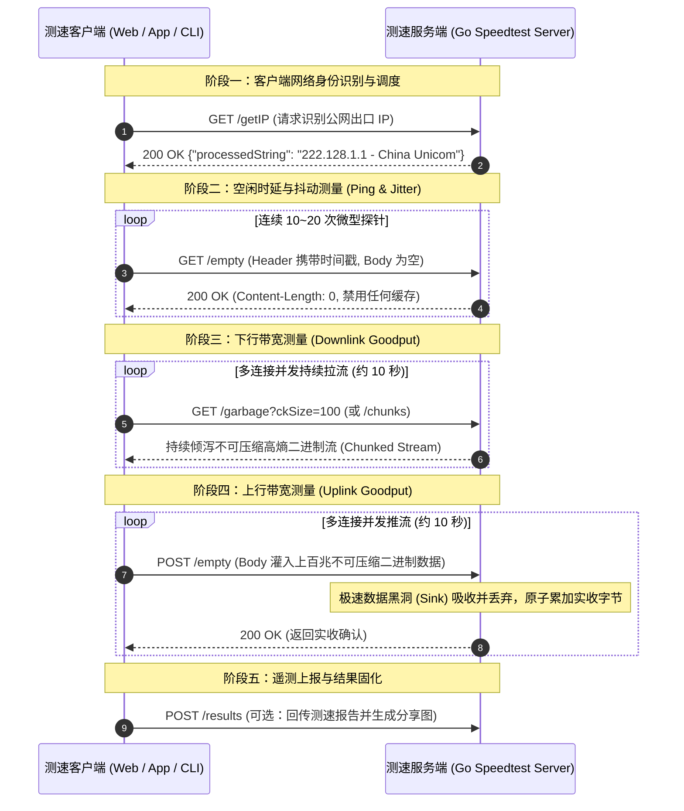
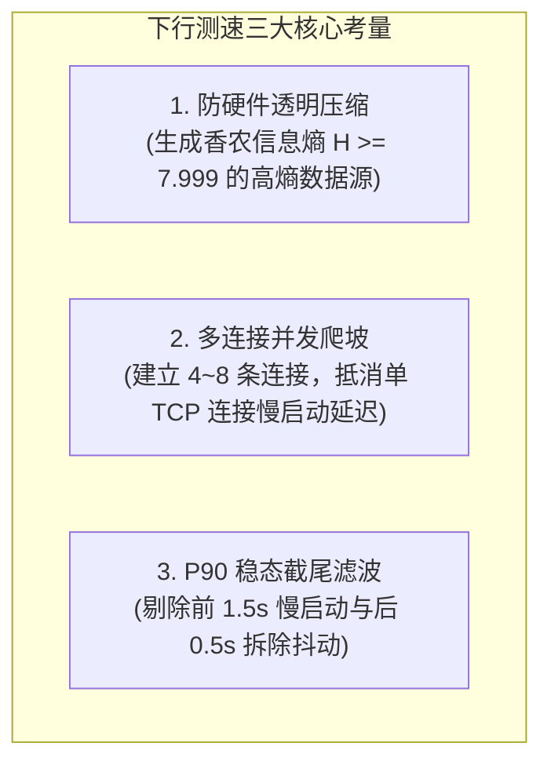

**TL;DR：** 很多人直觉上认为网络测速就是“发起一个 HTTP 请求下载/上传一个大文件，然后用总字节数除以总时间”。在千兆宽带和 5G 普及的今天，这种做法会遇到大量严重的测量失真：**运营商硬件透明压缩会导致测速虚高几千兆、服务端读取迟缓会触发 TCP 零窗口反压让速率暴跌归零、单 TCP 连接慢启动会让千兆宽带测不出来、客户端内存泄漏则会直接导致 App 闪退**。本文旨在用一篇文章把测速服务的全套机制讲透：先解构测速系统的**整体架构与交互时序**；再剖析下行、上行与时延抖动背后的**核心物理机制与工程规范**；最后结合 **Go 语言的高性能源码实现**，拆解每一个关键工程细节。

---

## 一、 测速服务的整体架构与全链路交互

### 1. 测速的本质：注满管道并提取稳态

网络测速测量的不是“文件传输耗时”，而是链路在**稳定工作状态下的有效容量（Goodput）**。在物理网络中，单条连接的最大吞吐受限于**带宽时延积（Bandwidth-Delay Product, BDP）**：

$$\text{BDP} = \text{瓶颈带宽 (Bandwidth)} \times \text{往返时延 (RTT)}$$

```
【千兆光纤链路 BDP 示例】
带宽 = 1000 Mbps, 往返时延 RTT = 30 ms (0.03 s)
BDP = (1000 * 10^6 * 0.03) / 8 = 3,750,000 字节 ≈ 3.57 MB
结论: 传输管道中必须始终保持有 3.57MB 的飞行数据 (In-flight Data)，物理链路才能被真正注满。
```

### 2. 测速五阶段交互时序全景图

一个标准的测速服务（如 LibreSpeed 及其 Go 后端实现）通常由控制面与数据面端点协同完成，分为五个明确的执行阶段：



---

## 二、 核心测速机制与关键工程规范

在构建测速系统时，如果忽略了底层网络栈与操作系统的特性，极易踩入以下几大“深水坑”：

### 1. 下行测速工程规范



#### （1）高熵数据源（防硬件透明压缩）
- **现象与危害**：电信运营商骨干网、移动基站网关及企业防火墙中，普遍内嵌了基于硬件（LZ4/Deflate）的透明数据流压缩模块。如果服务端发送全 `0x00` 或重复字符串，数据在传输过程中会被压缩为原体积的 **1%**。客户端收到并解压后，会按 100MB 计算，从而在百兆宽带上测出 **5000Mbps 甚至上万兆** 的荒谬速率；
- **规范要求**：发送的数据必须具备最大信息不确定性，**香农信息熵（Shannon Entropy）必须满足 $H(X) \ge 7.999$**。服务端应在启动阶段预生成静态高熵内存池，推流时通过内存指针切片复用，实现 **0 运行时 CPU 随机数生成计算 + 100% 阻断压缩**。

#### （2）100ms 离散采样与 P90 稳态截尾滤波
- 测速测量的是稳态能力，必须剔除启动与结束阶段的噪声；
- **标准算法**：以 100ms 为一个时间片采集瞬时速率。在 10 秒测试（共 100 个采样点）中，**强制剔除前 1.5 秒（慢启动爬坡）与后 0.5 秒（连接断开抖动）**。对剩余的 80 个稳态样本升序排序，取 **第 90 百分位数（P90）** 作为最终下行速率。

---

### 2. 上行测速工程规范

#### （1）防范服务端 TCP Zero-Window（零窗口反压）
这是测速服务端最隐蔽的系统级故障：

```
+-------------------------------------------------------------------------------------------+
|                          TCP Zero-Window 零窗口反压导致测速断崖机制                         |
|                                                                                           |
|  [客户端 APP] ──(全速推流)──> [服务端内核套接字接收队列 (Recv-Q)] ──(应用层读取迟缓)──> [应用层] |
|                                       │                                                   |
|                                       ▼ 当 Recv-Q 填满溢出                                |
|                         服务端内核协议栈自动向客户端发送: TCP ZeroWindow 通告报文          |
|                                       │                                                   |
|                                       ▼                                                   |
|                      客户端操作系统的 TCP 发送引擎被强制挂起，上行速率瞬间暴跌至 0         |
+-------------------------------------------------------------------------------------------+
```

- **物理成因**：如果服务端在读取上行数据时做了任何耗时操作（如打印日志、JSON 解析、内存拷贝、锁竞争），单核消费速度会骤降。服务端内核套接字接收队列（`Recv-Q`）在数毫秒内填满，内核自动向客户端通告 `TCP ZeroWindow`，导致客户端发送被挂起，速率曲线出现灾难性的断崖跌零；
- **规范要求**：服务端必须实现**极速数据黑洞（Sink）**，仅在当前调用栈上分配临时缓冲，直接读出并丢弃，配合原子指令计数，使单核消费吞吐达到 **40Gbps+**，永远超越网络到达速度。

#### （2）客户端零堆分配（Zero Heap Allocation）
- 在 1000Mbps 上行测速中，客户端每秒需向外推送 125MB 数据。如果客户端在循环中频繁 `new byte[64KB]`，会触发垃圾回收器频繁 Stop-the-World，导致 UI 卡死掉帧甚至 OOM 闪退；
- **规范要求**：客户端全局仅分配 1 块 2MB 的静态只读切片，推流时以只读视图循环写入套接字，全测试周期堆分配为 0。

---

### 3. 时延与抖动工程规范

#### （1）空闲时延中位数（Idle Latency）
在链路完全空闲时连续发送 20 个轻量探针，采用**中位数（Median Filter）**而非平均数作为物理基准，有效过滤公网偶发离群噪点。

#### （2）RFC 3550 网络抖动滤波（Jitter）
根据 IETF 实时传输协议标准 **RFC 3550**，采用一阶指数加权低通滤波递推计算：
$$D_i = |RTT_i - RTT_{i-1}|$$
$$J_i = J_{i-1} + \frac{D_i - J_{i-1}}{16}$$
滤波增益系数 $\alpha = \frac{1}{16}$ 意味着历史数据权重占 $93.75\%$，具备极强的抗偶然毛刺平滑能力。

#### （3）满载时延与 Bufferbloat（缓冲区膨胀）
在下行/上行稳态推流期间以 200ms 为周期并行注入探针，度量网络在打满状态下路由器队列积压产生的时延增量：
$$\text{Bufferbloat Delta} = \text{Median}(RTT_{\text{loaded}}) - \text{Idle Latency}$$
若增量 $> 100\text{ms}$，说明路由器缺乏现代队列管理（AQM / FQ-CoDel），在大流量下载时会导致在线游戏或语音会议严重卡顿。

---

## 三、 关键工程细节在 Go 中的实现与代码拆解

基于上述工程规范，我们逐一拆解 Go 语言（以 LibreSpeed Go 为基础）的高性能生产级实现。

### 1. 路由注册与 HTTP 基础配置

```go
package main

import (
	"crypto/rand"
	"fmt"
	"io"
	"net/http"
	"strconv"
	"strings"
	"sync/atomic"
	"time"
)

func RegisterSpeedtestRoutes(mux *http.ServeMux) {
	mux.HandleFunc("/empty", EmptyHandler)     // 时延探针 (GET) 与上行黑洞 (POST)
	mux.HandleFunc("/getIP", GetIPHandler)     // 客户端真实出口 IP 识别
	mux.HandleFunc("/garbage", GarbageHandler) // 动态高熵流式下发
	mux.HandleFunc("/chunks", ChunksHandler)   // 静态切片预分配推流
}
```

---

### 2. 高熵数据内存池初始化（防透明压缩）

为了避免每次推流时调用 `rand.Read` 产生巨大的 CPU 算力浪费，我们在服务启动时预先分配静态不可压缩内存切片：

```go
var (
	// 预生成 1MB、10MB、25MB 高熵内存块
	chunkSizes   = []int{1048576, 10485760, 26214400}
	staticChunks = make(map[int][]byte)
)

func init() {
	for _, size := range chunkSizes {
		buf := make([]byte, size)
		// 使用加密安全随机源填充，确保香农信息熵达到接近 8.0 的最大值
		if _, err := rand.Read(buf); err != nil {
			panic(fmt.Sprintf("Failed to initialize high-entropy pool: %v", err))
		}
		staticChunks[size] = buf
	}
}
```

---

### 3. 下行推流实现（`/garbage` 与 `/chunks`）

下行推流的关键是**严格禁用中间各层缓存**，并以 Chunked 流式分块持续下发：

```go
func GarbageHandler(w http.ResponseWriter, r *http.Request) {
	// 1. 严格下发缓存阻断标头，杜绝 CDN 与浏览器缓存
	w.Header().Set("Cache-Control", "no-cache, no-store, no-transform, must-revalidate")
	w.Header().Set("Pragma", "no-cache")
	w.Header().Set("Expires", "0")
	w.Header().Set("Content-Type", "application/octet-stream")

	// 2. 解析客户端请求的 chunk 大小 (默认 4MB，允许乘数扩展)
	ckSizeMultiplier := 4
	if val := r.URL.Query().Get("ckSize"); val != "" {
		if m, err := strconv.Atoi(val); err == nil && m > 0 && m <= 1024 {
			ckSizeMultiplier = m
		}
	}

	// 每次复用 1MB 预分配的高熵内存块，避免任何堆分配
	baseChunk := staticChunks[1048576]
	
	// 3. 循环吐出数据流
	for i := 0; i < ckSizeMultiplier; i++ {
		if _, err := w.Write(baseChunk); err != nil {
			// 客户端主动断开连接，优雅退出
			return
		}
	}
}
```

---

### 4. 上行极速数据黑洞实现（`/empty` POST）

上行吸收的核心是**消除一切堆逃逸，以 CPU 寄存器和栈内存直吞数据**：

```go
var TotalUplinkBytesReceived uint64 // 全局无锁实收字节计数器

func EmptyHandler(w http.ResponseWriter, r *http.Request) {
	// 禁用一切缓存
	w.Header().Set("Cache-Control", "no-cache, no-store, no-transform, must-revalidate")
	w.Header().Set("Pragma", "no-cache")

	// 场景 A: GET 请求 -> 作为微型时延探针响应 (Ping)
	if r.Method == http.MethodGet {
		w.Header().Set("Content-Length", "0")
		w.WriteHeader(http.StatusOK)
		return
	}

	// 场景 B: POST 请求 -> 作为上行测速极速数据黑洞 (Sink)
	if r.Method == http.MethodPost {
		// 关键工程细节: 在调用栈上分配 64KB 临时缓冲
		// 逃逸分析保证 stackBuf 驻留在 CPU 缓存与栈空间，全过程 0 次堆分配
		var stackBuf [64 * 1024]byte
		var sessionReceived uint64

		for {
			n, err := r.Body.Read(stackBuf[:])
			if n > 0 {
				sessionReceived += uint64(n)
			}
			if err != nil {
				if err == io.EOF {
					break
				}
				// 传输异常中断
				break
			}
		}
		_ = r.Body.Close()

		// 使用 CPU 原子指令更新全局计量，全程无锁竞争
		atomic.AddUint64(&TotalUplinkBytesReceived, sessionReceived)

		w.Header().Set("Content-Length", "0")
		w.WriteHeader(http.StatusOK)
		return
	}

	w.WriteHeader(http.StatusMethodNotAllowed)
}
```

---

### 5. 客户端真实出口 IP 提取（穿透代理与 CDN）

```go
func GetIPHandler(w http.ResponseWriter, r *http.Request) {
	w.Header().Set("Cache-Control", "no-cache, no-store, must-revalidate")
	w.Header().Set("Content-Type", "application/json; charset=utf-8")

	clientIP := extractRealClientIP(r)

	// 返回结构化 IP 信息供客户端展示运营商与归属地
	response := fmt.Sprintf(`{"processedString":"%s","rawIspInfo":""}`, clientIP)
	w.Write([]byte(response))
}

func extractRealClientIP(r *http.Request) string {
	// 优先级 1: Cloudflare 标头
	if cfIP := r.Header.Get("CF-Connecting-IP"); cfIP != "" {
		return cfIP
	}
	// 优先级 2: X-Real-IP
	if realIP := r.Header.Get("X-Real-IP"); realIP != "" {
		return realIP
	}
	// 优先级 3: X-Forwarded-For 代理链取最左侧原始客户端 IP
	if xff := r.Header.Get("X-Forwarded-For"); xff != "" {
		parts := strings.Split(xff, ",")
		if len(parts) > 0 && strings.TrimSpace(parts[0]) != "" {
			return strings.TrimSpace(parts[0])
		}
	}
	// 优先级 4: 直连 RemoteAddr
	addr := r.RemoteAddr
	if idx := strings.LastIndex(addr, ":"); idx != -1 {
		return addr[:idx]
	}
	return addr
}
```

---

## 四、 测速服务生产级规范 Checklist

| 维度 | 必须遵循的工程规范 | 违背规范的物理后果 |
| --- | --- | --- |
| **数据源** | 发送数据必须预生成高熵内存块（$H \ge 7.999$） | 被运营商 DPI 硬件压缩 99%，测速虚高数千兆 |
| **下行流** | 严格下发 `Cache-Control: no-store` 标头 | 数据命中 CDN 边缘或本地缓存，无法测试真实接入链路 |
| **上行处理** | 服务端栈内存读取 + CPU 原子累加，杜绝堆分配与耗时 I/O | 触发 `TCP ZeroWindow` 零窗口反压，上行速率断崖跌零 |
| **客户端内存** | 预分配固定只读切片循环推流，严禁循环内 `new byte[]` | 触发移动端 GC 掉帧或 iOS Autoreleasepool OOM 崩溃 |
| **稳态提取** | 强制剔除前 1.5s 慢启动爬坡，取稳态采样区间的 P90 次序统计量 | 把握手和升窗阶段的爬坡低速误算为平均速率 |
| **内核协议栈** | 服务端开启 **TCP BBR** 与扩大 `SO_SNDBUF` / `SO_RCVBUF` | 传统 Cubic 在 0.5% 偶发无线丢包下窗口折半，跑不满千兆 |

---

## 五、 结语

测速服务的核心架构并不复杂，但要把速率“测得准、测得稳、压得满”，必须在**底层协议物理特性**与**服务端代码实现**之间保持高度严谨：
1. **理解物理约束**：BDP 决定了必须维持充足的飞行数据才能打满千兆；
2. **防范硬件干扰**：高熵不可压缩数据源是阻断网络中间透明加速的唯一手段；
3. **守住性能底线**：服务端极速黑洞与客户端零堆分配是保证系统在万兆冲击下不出现反压和崩溃的关键。

掌握了这套端到端的架构模型与 Go 语言实现细节，无论是在公司内部搭建网络诊断与自研监控平台，还是进行生产级高吞吐网络系统设计，都能拥有清晰、可落地的技术依据。

---

## 参考资料

- `librespeed/speedtest-go` 官方开源仓库 (github.com/librespeed/speedtest-go)
- IETF RFC 6349: *Framework for TCP Throughput Testing*
- IETF RFC 3550: *RTP: A Transport Protocol for Real-Time Applications* (Jitter Algorithms)
- Google BBR: *Congestion-Based Congestion Control* (ACM Queue 2016)
